# Rochallor Loyalty Platform — Operator User Guide

**Audience:** Bank Employee Portal (BEP) operators — loyalty program managers, customer-service staff,
fraud-ops, and admins who **configure and run** a loyalty Program day-to-day.

**Scope:** how to *set up and operate* the platform — Programs, tiers, earning rules, rewards,
redemption, campaigns, members, approvals. **Out of scope:** deployment, infrastructure, CI/CD, and
service internals (those live in [`enterprise-architect.md`](enterprise-architect.md), the
[C4 views](../public/docs/c4/), and each service's `DETAILED-DESIGN.md`).

> Everything an operator does goes through **one API**: the Admin BFF, behind AWS API Gateway at
> `https://<host>/api/loyalty/admin/*`. The customer-facing actions (opt-in, redeem) go through the
> Mobile BFF at `/api/loyalty/mobile/*`. This guide uses `curl` against those edges; a BEP UI screen maps
> 1:1 onto each call.
>
> **About the screens.** Each step includes a **low-fidelity wireframe** (layout/interaction, not visual
> design) showing what the operator sees. They are PlantUML `salt` mockups rendered to SVG; the fuller
> screen-by-screen artifact is [`supporting-artifacts/bep-wireframes.md`](supporting-artifacts/bep-wireframes.md).

---

## Table of contents

1. [Core concepts (read this first)](#1-core-concepts-read-this-first)
2. [Access, roles & authentication](#2-access-roles--authentication)
3. [The approval workflow (how economic changes get applied)](#3-the-approval-workflow-how-economic-changes-get-applied)
4. [Standing up a new Program (end-to-end)](#4-standing-up-a-new-program-end-to-end)
5. [Configuring the Tier ladder](#5-configuring-the-tier-ladder)
6. [Configuring Earning — Earn Sources & Rules (the DSL)](#6-configuring-earning--earn-sources--rules-the-dsl)
7. [Configuring Rewards](#7-configuring-rewards)
8. [Redemption — how members spend points](#8-redemption--how-members-spend-points)
9. [Configuring Campaigns & Drawings](#9-configuring-campaigns--drawings)
10. [Member servicing — lookup, ledger, manual adjustments](#10-member-servicing--lookup-ledger-manual-adjustments)
11. [Terms & Conditions versioning](#11-terms--conditions-versioning)
12. [Point expiry](#12-point-expiry)
13. [Fraud alerts (Fraud Ops)](#13-fraud-alerts-fraud-ops)
14. [Audit & governance](#14-audit--governance)
15. [Quick reference](#15-quick-reference)

---

## 1. Core concepts (read this first)

Five nouns explain the whole platform. (Full definitions live in [`CONTEXT.md`](../CONTEXT.md).)

| Concept | One-line meaning | You configure it in |
|---|---|---|
| **Program** | A self-contained loyalty scheme — its own earning rules, tier ladder, reward catalogue, member roster. v1 ships **one** seeded Program. | Migration (§4) |
| **Member** | A Customer who opted into a Program. One Member per `{customerId, programId}`. | Mobile app / opt-in (§4.4) |
| **Point** | The integer unit of value. Two balances per member: **Redeemable** (spendable) and **Qualifying** (drives tier). | Earned/spent automatically |
| **Tier** | A ranked level (Bronze/Silver/Gold) reached when Qualifying Balance crosses a threshold. | Tier ladder (§5) |
| **Reward** | A catalogue item a member exchanges points for. | Rewards (§7) |

Two flows move points:

- **Earning** — a real-world event (card spend, bill payment, term deposit…) arrives, the **Rule Engine**
  evaluates the Program's **Earning Rules**, and writes `Earned` ledger entries. You author the rules (§6).
- **Redemption** — a member spends points on a Reward via a **two-phase** reserve → commit flow (§8).

And one time-bounded overlay:

- **Campaign** — a date-bounded promotion *within* a Program (e.g. "Dining Double Points May"), optionally
  with a **Drawing** (sweepstakes) (§9).

**The golden rule of money-equivalent changes:** anything that affects points value or who can earn/spend
— activating a rule or reward, changing a point cost, a manual adjustment, a tier threshold change — is
**approval-gated**. You *raise* it; the bank's approval workflow *approves* it; the platform then *applies*
it. See §3 — it underpins every later section.

**How the concepts fit together:**

<p align="center">
  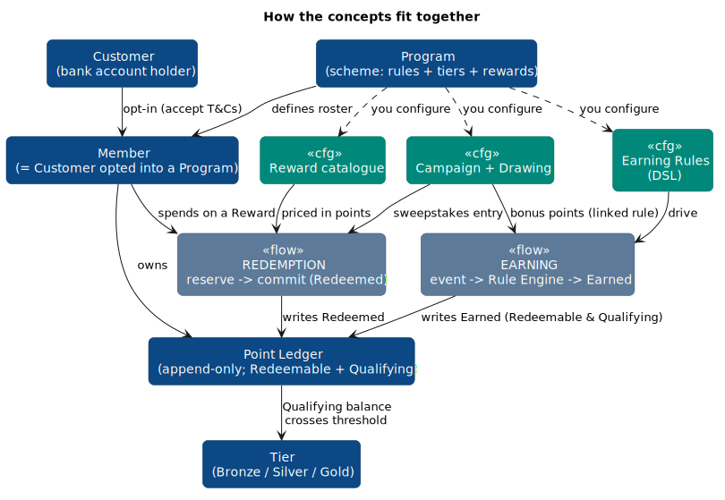
</p>

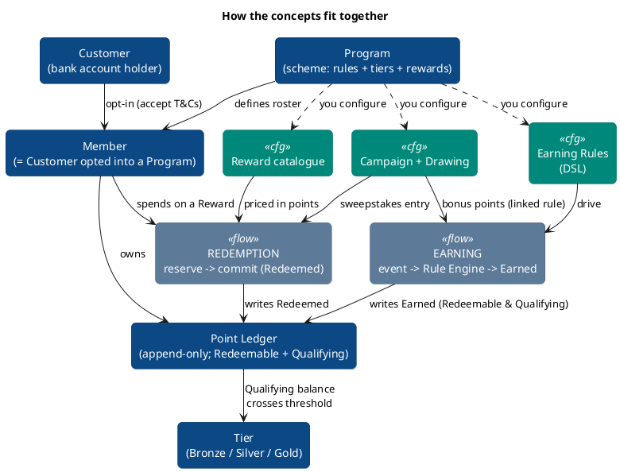

---

## 2. Access, roles & authentication

Every request carries an **employee JWT** issued by the bank's Authentication Service
(`business-employee-portal` realm). AWS API Gateway validates it; the Admin BFF reads your user id and
your **Loyalty roles** from the token and gates each operation.

| Role | Can do |
|---|---|
| `loyalty-readonly` | Read everything (members, ledger, rules, rewards, campaigns) — no writes. |
| `loyalty-cs-maker` | Member lookup/ledger; **raise** adjustments and other approval requests. |
| `loyalty-cs-checker` | Member lookup/ledger; (the *approving* side is owned by the bank's workflow — see §3). |
| `loyalty-campaign-manager` | Author earning rules, rewards, campaigns, drawings (create/dry-run/transition). |
| `loyalty-fraud-ops` | View fraud alerts. |
| `loyalty-admin` | **Wildcard** — passes every role gate. Use sparingly (break-glass / platform admin). |

A missing/invalid token → `401`. Authenticated but lacking the role → `403`.

### Conventions used in every example

The examples in this guide are plain HTTP calls made with **`curl`**. Set these environment variables once
per shell session so the example commands work as-is:

```bash
# Run once per shell session.
export ADMIN="https://api.rdb.example/api/loyalty/admin"    # Admin BFF base URL (BEP operators)
export MOBILE="https://api.rdb.example/api/loyalty/mobile"  # Mobile BFF base URL (customer actions)
export TOKEN="eyJhbGciOi..."                                # your employee JWT (from the bank's SSO)
```

Every call carries your JWT in the `Authorization` header (and `Content-Type: application/json` on writes):

```bash
# Read (GET):
curl -s -H "Authorization: Bearer $TOKEN" "$ADMIN/members?customerId=1001"

# Write (POST/PATCH) — note the JSON content-type and the -d body:
curl -s -X POST "$ADMIN/programs/1/campaigns" \
     -H "Authorization: Bearer $TOKEN" -H "Content-Type: application/json" \
     -d '{ "name": "Dining Double Points May" }'
# → 201 { "campaignId": 10, "status": "DRAFT", ... }
```

| Token | Meaning |
|---|---|
| `$ADMIN` / `$MOBILE` | Admin BFF (`/api/loyalty/admin`) / Mobile BFF (`/api/loyalty/mobile`) base URL |
| `$TOKEN` | your employee JWT |
| `-X POST` / `-d '{...}'` | HTTP method / JSON request body |
| `# → ...` | a **comment** showing the expected response — not part of the command |

> Not a shell user? Every `curl` line maps 1:1 onto the equivalent request in Postman/Insomnia: same
> method, same URL, the headers above, and the `-d` body as the raw JSON payload. And every call maps to a
> BEP UI screen (the wireframes shown at each step) — you rarely run these by hand in production.

**BEP screen — Loyalty Admin shell** (role-gated left nav; the Program selector sits in the top bar of
every screen; greyed items need a role you don't hold):

<p align="center">
  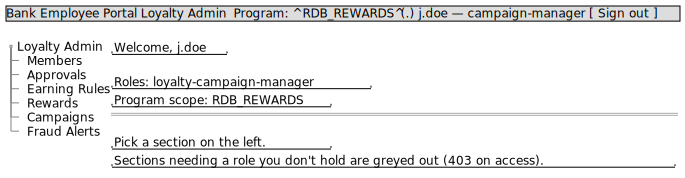
</p>

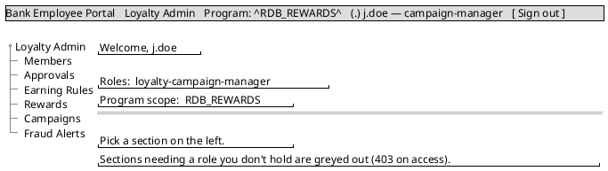

> **Per-Program scope.** In a multi-Program future, your access is also scoped per Program (a maker in
> Program A cannot affect Program B). v1 has one Program, so scope is implicit.

---

## 3. The approval workflow (how economic changes get applied)

**Loyalty does not implement maker-checker itself.** The bank's **BEP Approval Workflow** owns routing,
job roles, 4-eyes, and amount caps. Loyalty's job is to *propose* a change, *store* it as `PENDING`, and
*apply* it once the bank approves — recording only a `bepApprovalRef` as proof.

```
                 ┌─────────────┐   raise    ┌──────────────────┐
   You (maker) ─▶│ POST         │──────────▶│ Approval request │  status = PENDING
                 │ /approval-   │           │  (stored in core)│
                 │  requests    │           └────────┬─────────┘
                 └─────────────┘                     │
                                       bank's BEP Approval Workflow
                                       decides (4-eyes, caps) — out of band
                                                     │
                 ┌──────────────────────┐  confirm   ▼
   BEP workflow ▶│ POST /approval-       │──────────▶ APPLIED  (change takes effect:
                 │  requests/{id}/confirm│            ledger entry written / rule
                 │  {decision,           │            activated / reward activated …)
                 │   bepApprovalRef}     │   or       REJECTED (nothing changes)
                 └──────────────────────┘
```

**What requires approval** (the `type` you raise):

| `type` | Used for | What "apply" does |
|---|---|---|
| `ADJUSTMENT` | Manual goodwill / correction credit or debit | Writes an `Adjusted` ledger entry (§10.3) |
| `RULE_ACTIVATION` | Turning an Earning Rule **ACTIVE** | Activates the rule (§6.5) |
| `REWARD_CHANGE` | Activating a Reward or changing its **point cost** | Activates / re-prices the reward (§7.4) |
| `TIER_CHANGE` | Changing a tier threshold/benefit | Updates the tier ladder (§5) |
| `TCS_VERSION` | Publishing a new T&Cs version | Advances `current_tcs_version` (§11) |

**Raise a request:**

```bash
curl -s -H "Authorization: Bearer $TOKEN" -H "Content-Type: application/json" -X POST "$ADMIN/approval-requests" -d '{
  "type": "ADJUSTMENT",
  "payload": { "memberId": 42, "programId": 1,
               "qualifyingDelta": 0, "redeemableDelta": 1000,
               "reason": "Goodwill — dropped call", "caseReference": "CS-2026-8841" }
}'
# → 201 { "requestId": 900, "status": "PENDING", ... }
```

**List what you've raised** (the bank's workflow is the authoritative inbox; this is Loyalty's copy):

```bash
curl -s -H "Authorization: Bearer $TOKEN" "$ADMIN/approval-requests?status=PENDING"
curl -s -H "Authorization: Bearer $TOKEN" "$ADMIN/approval-requests?status=PENDING&type=REWARD_CHANGE"
```

**Confirm** (normally called by the bank's workflow, authenticated by mTLS + a BEP assertion — shown here
for completeness). It is **idempotent on `requestId`**:

```bash
curl -s -H "Authorization: Bearer $TOKEN" -H "Content-Type: application/json" -X POST "$ADMIN/approval-requests/900/confirm" -d '{
  "decision": "APPROVED",
  "bepApprovalRef": "BEP-APV-7731"
}'
# → 200 { "status": "APPLIED", "appliedRef": 5567, "bepApprovalRef": "BEP-APV-7731", ... }
```

**BEP screen — Approvals** (raise on the left; the list shows requests Loyalty has raised — the bank's
workflow is the authoritative inbox):

<p align="center">
  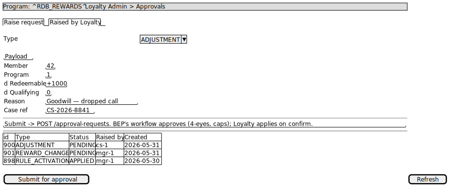
</p>

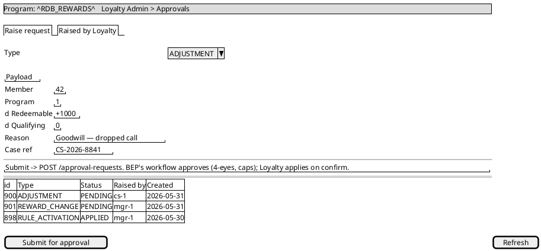

> **Why activation can "fail" without approval.** The owning service enforces the gate too: e.g.
> `PATCH /rewards/{id}` to `ACTIVE` **without** a `bepApprovalRef` returns `409 MISSING_APPROVAL`. The
> correct path is always: raise a `REWARD_CHANGE` → get it approved → the confirm applies it. `ARCHIVED`
> and draft edits are **not** gated and apply directly.

---

## 4. Standing up a new Program (end-to-end)

> **Important:** creating / activating / sunsetting a **Program** is a **migration**, *not* a BEP runtime
> operation (it provisions a member roster, ledger partition, tier ladder, and T&Cs baseline). Everything
> *inside* a Program — rules, rewards, campaigns — is then configured via BEP. v1 ships one seeded Program;
> this section is the checklist for adding another (co-brand card, payroll, partner promo).

**The end-to-end setup sequence** (one migration step, then everything else via BEP):

<p align="center">
  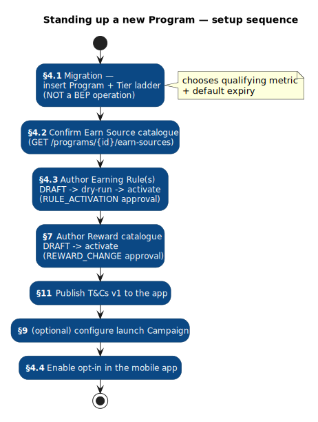
</p>

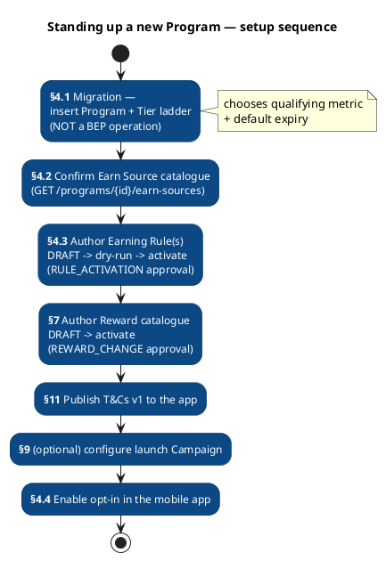

### 4.1 Create the Program + tier ladder (migration)

A Program is one row in `program` plus its tier ladder. This is the v1 seed, shown as the template:

```sql
-- program: code, how qualifying balance is measured, default point expiry, starting T&Cs version
INSERT INTO program (program_id, program_code, qualifying_metric, expiry_months, current_tcs_version)
VALUES (2, 'PAYROLL_PLUS', 'ROLLING_12_MONTHS', 24, 1);

-- tier ladder: ordinal 1 = lowest; member enters a tier when qualifying_balance >= threshold.
-- expiry_months_override: NULL inherits program.expiry_months (Tier Expiry Override).
INSERT INTO tier (program_id, tier_code, ordinal, qualifying_threshold, expiry_months_override) VALUES
    (2, 'BRONZE', 1,      0, NULL),
    (2, 'SILVER', 2,  50000, 36),
    (2, 'GOLD',   3, 200000, 60);
```

**Qualifying Metric** decides how the tier counter is computed over time — pick one:

| Value | Behaviour |
|---|---|
| `LIFETIME` | Cumulative forever — tier is sticky. |
| `ROLLING_12_MONTHS` | Trailing 12-month window — re-evaluated on each member's anniversary. **(v1 default)** |
| `CALENDAR_YEAR` | Annual reset. |

### 4.2 Confirm the Earn Source catalogue

Earn Sources are the categories of activity that *can* award points. The v1 catalogue is seeded and
shared across Programs; confirm what's available before authoring rules:

```bash
curl -s -H "Authorization: Bearer $TOKEN" "$ADMIN/programs/2/earn-sources"
```

Seeded v1 sources: `CARD_SPEND`, `BILL_PAYMENT`, `FUND_TRANSFER`, `TOPUP`, `TERM_DEPOSIT_OPENED`
(plus `MANUAL_ADJUSTMENT`, which is the maker-checker path, not event-driven). Adding a *brand-new* source
is an engineering task (it needs an inbound event channel); activating an existing one is config.

### 4.3 Author → dry-run → activate the earning rules

See §6. At minimum a Program needs one base earn rule (e.g. "1 point per 10,000 spent").

### 4.4 Open the Program for opt-in

A Customer becomes a Member by opting in (from the mobile app), which requires accepting the current
T&Cs version. In v1 **any** bank Customer may opt in (no eligibility gate):

```bash
# Mobile BFF (customer JWT). Member identity comes from the token; clients never pass memberId.
export MOBILE=https://api.rdb.example/api/loyalty/mobile
curl -s -H "Authorization: Bearer $CUSTOMER_TOKEN" -H "Content-Type: application/json" \
  -X POST "$MOBILE/me/programs/2/opt-in" -d '{ "tcsVersion": 1 }'
```

**Mobile screen — Join the Program** (customer-facing; T&Cs acceptance is mandatory to opt in):

<p align="center">
  
</p>

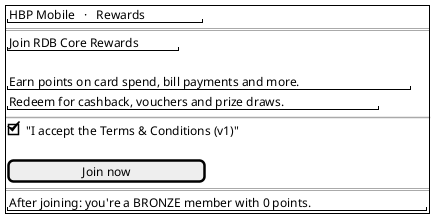

### 4.5 Add rewards and (optionally) campaigns

See §7 and §9.

**New-Program checklist:**

- [ ] `program` row + tier ladder migrated (§4.1)
- [ ] Earn Sources confirmed (§4.2)
- [ ] ≥ 1 base Earning Rule authored, dry-run, and **activated via approval** (§6)
- [ ] Reward catalogue authored and **activated via approval** (§7)
- [ ] T&Cs version 1 content published to the app (§11)
- [ ] (optional) launch Campaign configured (§9)
- [ ] Opt-in enabled in the mobile app (§4.4)

---

## 5. Configuring the Tier ladder

A Program's tier ladder is an ordered, **configurable** list (not a hardcoded enum). The v1 seed:

| Tier | Ordinal | Qualifying threshold | Expiry override |
|---|---|---|---|
| Bronze | 1 | 0 (floor — everyone starts here) | inherits Program default (24 mo) |
| Silver | 2 | 50,000 | 36 months |
| Gold | 3 | 200,000 | 60 months |

A member's tier is recomputed as their **Qualifying Balance** crosses a threshold; redemptions never lower
it (only expiry and earn reversals reduce qualifying balance).

**Changing thresholds or benefits** is an economic change → raise a `TIER_CHANGE` approval (§3):

```bash
curl -s -H "Authorization: Bearer $TOKEN" -H "Content-Type: application/json" -X POST "$ADMIN/approval-requests" -d '{
  "type": "TIER_CHANGE",
  "payload": { "programId": 1, "tierCode": "SILVER", "qualifyingThreshold": 40000 }
}'
```

**BEP screen — Tier ladder** (read the ladder; a threshold/benefit edit submits a `TIER_CHANGE` approval):

<p align="center">
  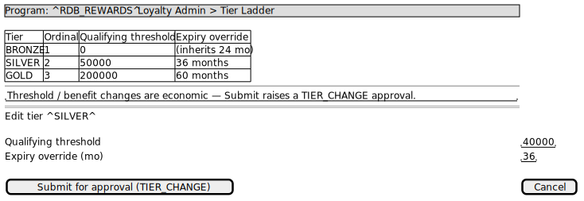
</p>

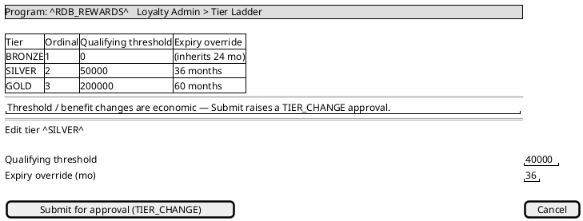

> **Adding a tier** is config (a new ordinal + threshold). **Removing a tier that has active members**
> requires a documented migration plan — members must be re-mapped. **Tier Expiry Override** lets a higher
> tier extend or disable point expiry (e.g. Gold = no expiry) — set per tier.

---

## 6. Configuring Earning — Earn Sources & Rules (the DSL)

This is where most operator effort goes. An **Earning Rule** says: *"for events from this Earn Source
matching these conditions, award points by this formula, capped by these limits."* Rules are written in a
small, safe **JSON DSL** (not a programming language) and authored per Program.

### 6.1 The DSL at a glance

```jsonc
{
  "dslVersion": 1,
  "earnSource": "CARD_SPEND",        // which Earn Source this rule observes
  "inputs": ["mcc", "amount", "currency"],   // payload fields the rule reads (documentation aid)
  "hitPolicy": "FIRST",              // FIRST = first matching row wins; COLLECT = sum every match
  "tierMultiplier": false,           // multiply by the member's tier multiplier before rounding (v1: off)
  "rounding": "FLOOR",               // FLOOR | ROUND | CEIL — applied per row
  "rows": [
    { "when": { "amount": { "gte": 1 } },
      "earn": { "type": "RATE", "perAmount": 10000, "points": 1,
                "balances": ["qualifying", "redeemable"] } }
  ],
  "caps": { "perEventMax": 500, "perMemberPerDay": 1000,
            "perMemberPerMonth": null, "perMemberPerRule": null }
}
```

**Condition operators** (inside `when`, per field, implicit AND):

| Operator | Meaning | Example |
|---|---|---|
| bare value or `eq` | equals | `"currency": "USD"` |
| `ne` | not equals | `"currency": { "ne": "VND" }` |
| `in` / `nin` | in / not in a list | `"mcc": { "in": ["5812","5813"] }` |
| `gt` `gte` `lt` `lte` | numeric comparison | `"amount": { "gte": 100 }` |
| `between [low,high]` | inclusive range | `"amount": { "between": [1000, 4999.99] }` |
| `"*"` | wildcard / catch-all (else row) | `"mcc": "*"` |

**Earn formulas** (inside `earn`):

| `type` | Formula | Fields |
|---|---|---|
| `RATE` | `round(amount / perAmount) × points` | `perAmount`, `points` |
| `FIXED` | flat `points` | `points` |

`balances` routes the award to `["qualifying"]`, `["redeemable"]`, or both (default both). Qualifying drives
tier; redeemable is spendable.

**Caps** (any may be `null` = no cap):

| Cap | Limits |
|---|---|
| `perEventMax` | Max points from a single event |
| `perMemberPerDay` / `perMemberPerMonth` | Per-member rolling windows |
| `perMemberPerRule` | Lifetime per member for this rule (use `1` for one-time bonuses) |

> A **Source-Aggregate Cap** can also be set at the Earn Source level (across *all* rules for that source);
> when both a rule cap and a source cap apply, the more restrictive wins.

### 6.2 Worked examples

**Base rate — 1 point per 10,000 spent:**

```json
{ "dslVersion": 1, "earnSource": "CARD_SPEND", "hitPolicy": "FIRST", "rounding": "FLOOR",
  "rows": [ { "when": { "amount": { "gte": 1 } },
             "earn": { "type": "RATE", "perAmount": 10000, "points": 1 } } ],
  "caps": { "perEventMax": 500, "perMemberPerDay": 1000 } }
```

**Tiered category bonus — 3×/2×/1× by merchant category (FIRST wins, so order matters):**

```json
{ "dslVersion": 1, "earnSource": "CARD_SPEND", "inputs": ["mcc","amount","currency"],
  "hitPolicy": "FIRST", "tierMultiplier": true, "rounding": "FLOOR",
  "rows": [
    { "when": { "currency": "USD", "mcc": { "in": ["5812","5813","5814"] } },
      "earn": { "type": "RATE", "perAmount": 1, "points": 3 } },
    { "when": { "currency": "USD", "mcc": { "in": ["5411","5422","5499"] } },
      "earn": { "type": "RATE", "perAmount": 1, "points": 2 } },
    { "when": { "currency": "USD", "mcc": "*" },
      "earn": { "type": "RATE", "perAmount": 1, "points": 1 } }
  ],
  "caps": { "perEventMax": 500, "perMemberPerDay": 1000 } }
```

**One-time welcome bonus (1,000 points, once per member, redeemable only):**

```json
{ "dslVersion": 1, "earnSource": "CARD_SPEND", "hitPolicy": "FIRST", "rounding": "FLOOR",
  "rows": [ { "when": { "amount": { "gte": 10 } },
             "earn": { "type": "FIXED", "points": 1000, "balances": ["redeemable"] } } ],
  "caps": { "perMemberPerRule": 1 } }
```

**Banded term-deposit bonus (different flat points per deposit size):**

```json
{ "dslVersion": 1, "earnSource": "TERM_DEPOSIT_OPENED", "inputs": ["amount","currency"],
  "hitPolicy": "FIRST", "rounding": "FLOOR",
  "rows": [
    { "when": { "currency": "USD", "amount": { "gte": 5000 } },
      "earn": { "type": "FIXED", "points": 5000 } },
    { "when": { "currency": "USD", "amount": { "between": [1000, 4999.99] } },
      "earn": { "type": "FIXED", "points": 1000 } }
  ] }
```

> **Multiple rules, same source.** Allowed (e.g. base rate + a campaign bonus). Each matching rule fires
> independently and writes its own ledger entry (`Rule Conflict` is resolved by **summing**), so awards
> are individually auditable and reversible.

### 6.3 Create a rule (always starts as DRAFT)

```bash
curl -s -H "Authorization: Bearer $TOKEN" -H "Content-Type: application/json" -X POST "$ADMIN/programs/1/rules" -d '{
  "earnSourceId": 1,
  "dslJson": { "dslVersion": 1, "earnSource": "CARD_SPEND", "hitPolicy": "FIRST", "rounding": "FLOOR",
               "rows": [ { "when": { "amount": { "gte": 1 } },
                          "earn": { "type": "RATE", "perAmount": 10000, "points": 1 } } ],
               "caps": { "perEventMax": 500, "perMemberPerDay": 1000 } },
  "effectiveFrom": "2026-07-01T00:00:00Z"
}'
# → 201 { "ruleId": 31, "status": "DRAFT", "version": 1, ... }
```

The DSL is **schema-validated on save** — a malformed rule returns `400 DSL_INVALID`. (Requires
`loyalty-campaign-manager`.)

### 6.4 Dry-run before you activate

Dry-run replays the rule against **historical events** using the *same interpreter* the live engine uses —
no points are awarded, no side effects. Use it to sanity-check reach and cost:

```bash
curl -s -H "Authorization: Bearer $TOKEN" -H "Content-Type: application/json" -X POST "$ADMIN/programs/1/rules/31/dry-run" -d '{ "eventReplayWindow": "P30D" }'
# → 200 { "matchedEvents": 14213, "totalQualifying": 982140, "totalRedeemable": 982140 }
```

**BEP screen — Earning-Rule decision-table editor** (the decision table maps 1:1 to the DSL rows; the
Raw JSON tab is the power-user escape hatch; Validate runs the same schema check as save; Dry-run replays
history with no side effects):

<p align="center">
  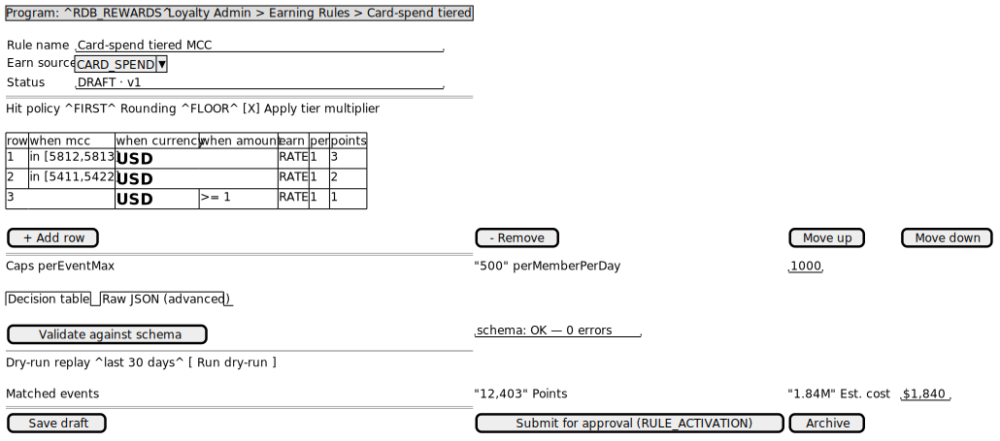
</p>

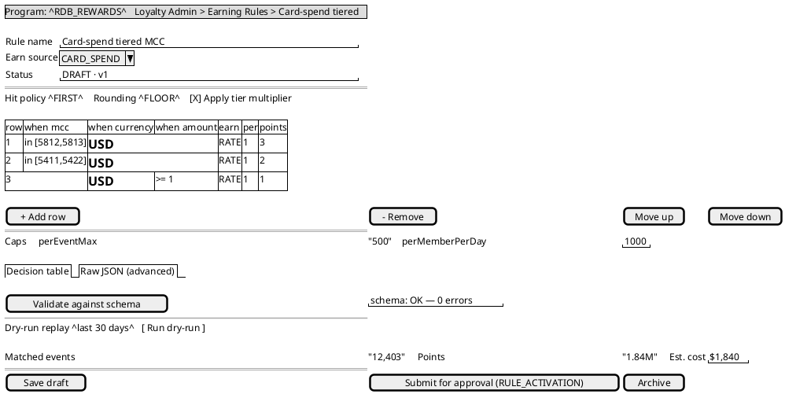

### 6.5 Activate (approval-gated) or archive

Activation is an economic change. Raise a `RULE_ACTIVATION` approval (§3); the confirm flips it to ACTIVE.
Archiving applies directly:

```bash
# Archive directly (not gated):
curl -s -H "Authorization: Bearer $TOKEN" -H "Content-Type: application/json" -X PATCH "$ADMIN/rules/31" -d '{ "status": "ARCHIVED" }'

# Activate → goes through approval (a direct PATCH to ACTIVE without an approved request is rejected):
curl -s -H "Authorization: Bearer $TOKEN" -H "Content-Type: application/json" -X POST "$ADMIN/approval-requests" -d '{
  "type": "RULE_ACTIVATION", "payload": { "ruleId": 31 } }'
```

**Rule lifecycle:** `DRAFT → ACTIVE → ARCHIVED`. You cannot go back to `DRAFT`.

---

## 7. Configuring Rewards

A **Reward** is a catalogue item a member exchanges points for. Each Reward is an instance of a platform
**Reward Type**, which binds it to a fulfillment adapter and declares the parameter shape.

### 7.1 The Reward Type catalogue (platform-seeded)

```bash
curl -s -H "Authorization: Bearer $TOKEN" "$ADMIN/reward-types"
```

v1 seeded types and their `fulfillmentParams` shape:

| `rewardTypeCode` | Delivers | Fulfillment | `fulfillmentParams` example |
|---|---|---|---|
| `CASHBACK` | Credit to the customer's CASA | Synchronous (Payment Hub) | `{ "amount": 50000, "currency": "VND" }` |
| `BILL_PAYMENT_VOUCHER` | Bill-payment voucher artifact | Synchronous | `{ "billerCode": "...", "faceValue": 50000 }` |
| `THIRD_PARTY_VOUCHER` | Partner voucher code (e.g. coffee) | **Async** (partner — returns later) | `{ "sku": "COFFEE-REGULAR" }` |
| `SWEEPSTAKES` | A sweepstakes entry into a Drawing | Synchronous (writes a Drawing Entry) | `{ "drawingId": 7 }` |

> The broader catalogue (`MATERIAL_GOODS`, `CHARITY_DONATION`, `TIER_BOOST`, …) is defined in
> [`CONTEXT.md`](../CONTEXT.md) and enabled per deployment; the four above are wired in v1.

### 7.2 Create a Reward (starts as DRAFT)

```bash
curl -s -H "Authorization: Bearer $TOKEN" -H "Content-Type: application/json" -X POST "$ADMIN/programs/1/rewards" -d '{
  "rewardTypeCode": "CASHBACK",
  "name": "USD 5 Cashback",
  "pointCost": 5000,
  "fulfillmentParams": { "amount": 5, "currency": "USD" },
  "eligibility": { "minTier": "SILVER", "perMemberCap": 2 },
  "inventoryTotal": 1000
}'
# → 201 { "rewardId": 88, "status": "DRAFT", "rewardRevision": 1, ... }
```

- **`eligibility`** (optional) gates who can redeem — tier, segment, tenure, currency, per-member cap.
- **`inventoryTotal`** (optional) caps total redemptions; the platform decrements atomically and restores
  on a failed/expired reservation, so inventory is never leaked.

**BEP screen — Reward catalogue editor** (the Fulfillment-params panel is driven by the selected Reward
Type's parameter schema; Eligibility maps 1:1 to the reward's gates; Limited stock binds to inventory):

<p align="center">
  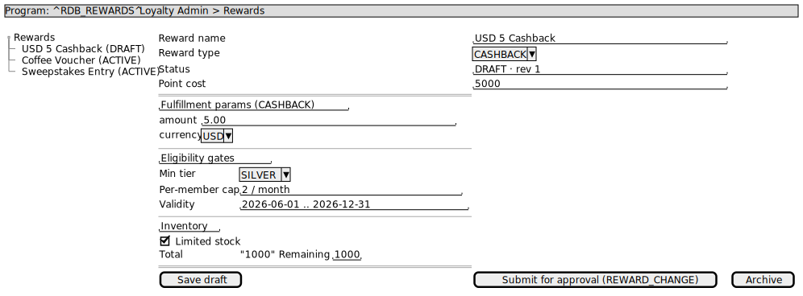
</p>

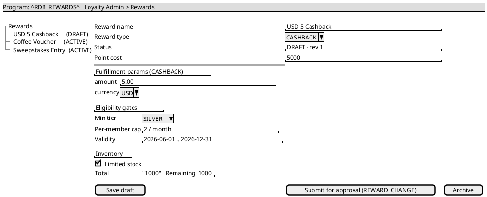

### 7.3 List the catalogue (all statuses)

```bash
curl -s -H "Authorization: Bearer $TOKEN" "$ADMIN/programs/1/rewards"
```

### 7.4 Activate / re-price (approval-gated) or archive

Activating a Reward **or changing its `pointCost`** is economic → raise a `REWARD_CHANGE` (§3). A point-cost
change bumps `rewardRevision` so historical redemptions stay attributable to the price they were made at.
`ARCHIVED` applies directly:

```bash
# Archive directly:
curl -s -H "Authorization: Bearer $TOKEN" -H "Content-Type: application/json" -X PATCH "$ADMIN/rewards/88" -d '{ "status": "ARCHIVED" }'

# Activate via approval:
curl -s -H "Authorization: Bearer $TOKEN" -H "Content-Type: application/json" -X POST "$ADMIN/approval-requests" -d '{
  "type": "REWARD_CHANGE", "payload": { "rewardId": 88, "status": "ACTIVE" } }'
```

**Reward lifecycle:** `DRAFT → ACTIVE → ARCHIVED`.

---

## 8. Redemption — how members spend points

Redemption is **customer-initiated** (mobile app), but operators must understand it to support members.
It is always **two-phase** so points and fulfillment stay consistent:

```
reserve()  → hold points (+ inventory)   ──▶  commit()  → write the Redeemed ledger entry   (success)
                                          └─▶  release() → restore points + inventory          (failure / TTL)
```

A reservation is a short-lived hold (default TTL 15 min; longer for slow partners). The **Effective
Redeemable Balance** a member sees = ledger balance − active reservations.

**Synchronous vs asynchronous:**

- **Sync** (Cashback, Bill-Payment Voucher, Sweepstakes) → completes in the request: `200` with
  `status=COMPLETED`.
- **Async** (Third-Party Voucher) → hands off to a partner: `202` with `status=FULFILLING`. The app polls
  `GET /redemptions/{id}` until it becomes `COMPLETED` (or `FAILED`, which auto-releases the hold).

```bash
# Customer redeems (Mobile BFF). Idempotency-Key prevents duplicate reservations on retry.
curl -s -H "Authorization: Bearer $CUSTOMER_TOKEN" -H "Content-Type: application/json" \
  -H "Idempotency-Key: $(uuidgen)" \
  -X POST "$MOBILE/redemptions" -d '{ "programId": 1, "rewardId": 88 }'
# sync → 200 { "status": "COMPLETED", "externalRef": "PH-TXN-..." }
# async → 202 { "status": "FULFILLING" }   then poll GET /redemptions/{id}
```

**Mobile screen — Redeem a reward** (customer-facing; high-value redemptions prompt for a transaction-PIN
step-up; async rewards show a "provisioning…" state until the poll returns `COMPLETED`):

<p align="center">
  
</p>

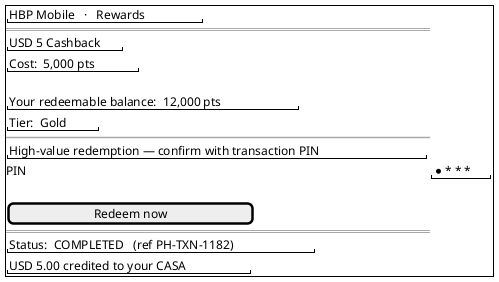

**Step-up (high-value).** Redemptions above a configured threshold (e.g. cashback > USD 50) require a
transaction-PIN **step-up token** in the `X-Step-Up-Token` header; absent/invalid → `403 STEP_UP_REQUIRED`.
The app obtains the token from the bank's auth service and forwards it.

**Common rejections** (surfaced with an RFC-7807 `code`): `INSUFFICIENT_BALANCE`, `INVENTORY_EXHAUSTED`,
`STEP_UP_REQUIRED`, `BALANCE_NEGATIVE`, `TCS_NOT_ACCEPTED`.

> **Negative balance.** If an upstream reversal (e.g. a refunded card transaction) claws back points a
> member already spent, their redeemable balance can go negative. The account stays active but **cannot
> redeem until balance ≥ 0** — restored by future earning or a goodwill `Adjusted` entry (§10.3).

---

## 9. Configuring Campaigns & Drawings

A **Campaign** is a date-bounded promotion within a Program; a **Drawing** is an optional sweepstakes
attached to a campaign. Campaign authoring requires `loyalty-campaign-manager`.

### 9.1 Create a campaign (DRAFT)

```bash
curl -s -H "Authorization: Bearer $TOKEN" -H "Content-Type: application/json" -X POST "$ADMIN/programs/1/campaigns" -d '{
  "name": "Dining Double Points May",
  "startsAt": "2026-05-01T00:00:00Z",
  "endsAt":   "2026-05-31T23:59:59Z",
  "targetSegment": { "tier": ["SILVER","GOLD"] }
}'
# → 201 { "campaignId": 10, "status": "DRAFT", ... }
```

To make the campaign actually *award bonus points*, pair it with an Earning Rule that references it (the
rule's `campaignId`) — e.g. a `COLLECT` dining-bonus rule (see §6.2) so the base rate **and** the bonus both
fire.

**BEP screen — Campaign editor** (tabs for the campaign, its drawing, and the winners audit):

<p align="center">
  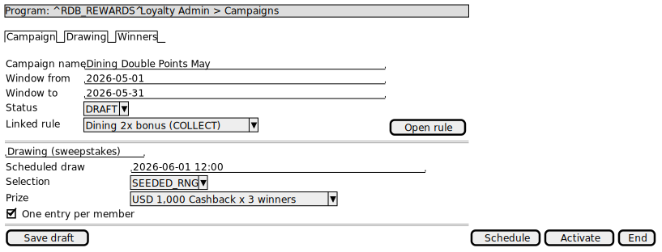
</p>

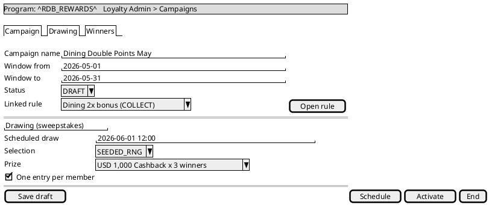

### 9.2 Transition a campaign

`DRAFT → SCHEDULED → LIVE → ENDED → ARCHIVED`:

```bash
curl -s -H "Authorization: Bearer $TOKEN" -H "Content-Type: application/json" -X PATCH "$ADMIN/campaigns/10" -d '{ "status": "SCHEDULED" }'
curl -s -H "Authorization: Bearer $TOKEN" -H "Content-Type: application/json" -X PATCH "$ADMIN/campaigns/10" -d '{ "status": "LIVE" }'
```

### 9.3 Add a Drawing (sweepstakes)

```bash
curl -s -H "Authorization: Bearer $TOKEN" -H "Content-Type: application/json" -X POST "$ADMIN/campaigns/10/drawings" -d '{
  "scheduledAt":      "2026-06-01T12:00:00Z",
  "selectionStrategy": "SEEDED_RNG",
  "prize":            { "prizeRewardId": 1, "label": "USD 1,000 Cashback" },
  "entryWindowStart": "2026-05-01T00:00:00Z",
  "entryWindowEnd":   "2026-05-31T23:59:59Z",
  "allowMultipleEntries": false
}'
# → 201 { "drawingId": 7, "status": "OPEN", ... }
```

Members **enter** a drawing by redeeming a `SWEEPSTAKES` reward (§7) — not via this API. At `scheduledAt`
the platform selects winners with an **auditable seeded RNG** (the seed + winner index are recorded so a
draw is fully replayable).

### 9.4 Review winners

```bash
curl -s -H "Authorization: Bearer $TOKEN" "$ADMIN/drawings/7/winners"
# → [ { "winnerId": 1, "memberId": 42, "seedHex": "…", "winnerIndex": 0, "drawnAt": "…" }, ... ]
```

**BEP screen — Winners (audit, read-only)** — the seed + winner indices are stored so a draw is fully
replayable:

<p align="center">
  
</p>

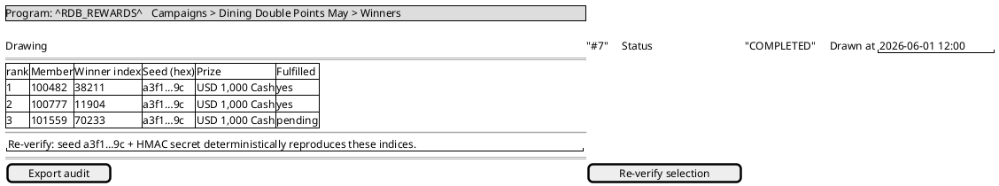

---

## 10. Member servicing — lookup, ledger, manual adjustments

### 10.1 Find a member

```bash
curl -s -H "Authorization: Bearer $TOKEN" "$ADMIN/members?customerId=1001"
# → [ { "memberId": 42, "customerId": 1001, "createdAt": "…" } ]
```

### 10.2 Member detail (enrolled programs, balances, tier)

```bash
curl -s -H "Authorization: Bearer $TOKEN" "$ADMIN/members/42"
# → { "memberId": 42, "customerId": 1001,
#     "programs": [ { "programId": 1, "programCode": "RDB_REWARDS", "status": "ACTIVE",
#                     "redeemableBalance": 12000, "qualifyingBalance": 80000,
#                     "tcsVersionAccepted": 1 } ] }
```

### 10.3 Audit the Point Ledger

The ledger is **append-only** — corrections are new compensating entries, never edits. The audit view shows
every movement with its `entryType`, deltas, source, and (for adjustments) maker/checker:

```bash
curl -s -H "Authorization: Bearer $TOKEN" "$ADMIN/members/42/programs/1/ledger?limit=50"
# → { "items": [ { "entryType": "Earned",   "redeemableDelta": 120, "sourceRef": "evt-…:rule-31", ... },
#                { "entryType": "Redeemed", "redeemableDelta": -5000, "sourceRef": "redemption-…", ... },
#                { "entryType": "Adjusted", "redeemableDelta": 1000, "makerUserId": "cs-1",
#                  "checkerUserId": "cs-sup-3", "reason": "Goodwill", ... } ],
#     "nextCursor": null }
```

Entry-type effects: `Earned`(+qualifying,+redeemable), `Redeemed`(0,−), `Expired`(−,−), `Reversed`(−,−),
`Adjusted`(configurable per entry).

**BEP screen — Member detail** (balances + tier header, the append-only Ledger tab, and an Adjust tab that
raises an `ADJUSTMENT` approval):

<p align="center">
  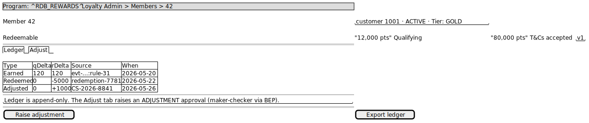
</p>

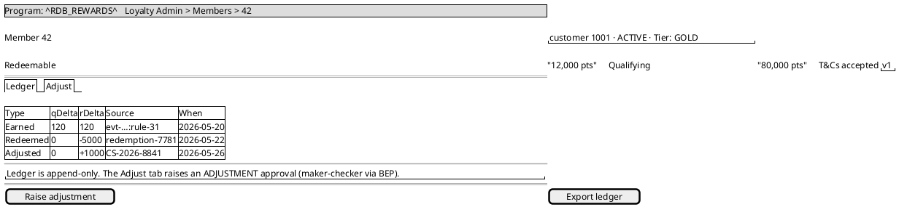

### 10.4 Manual adjustment (goodwill / correction)

A manual point change is **never** a direct write — it goes through the approval workflow as an
`ADJUSTMENT` (this is the platform's maker-checker seam; see §3). The maker raises it with a business
reason and a case reference; on approval an `Adjusted` ledger entry is written with both maker and checker
recorded:

```bash
curl -s -H "Authorization: Bearer $TOKEN" -H "Content-Type: application/json" -X POST "$ADMIN/approval-requests" -d '{
  "type": "ADJUSTMENT",
  "payload": { "memberId": 42, "programId": 1,
               "qualifyingDelta": 0, "redeemableDelta": 1000,
               "reason": "Goodwill credit — service issue", "caseReference": "CS-2026-8841" }
}'
```

Use adjustments for: goodwill credits, clearing small negative balances, regulatory corrections, dispute
resolution. Per-maker amount caps are enforced by the bank's approval workflow.

---

## 11. Terms & Conditions versioning

Each Program has a monotonically increasing `current_tcs_version`. Each member stores the version they
accepted. When you publish a new version (a `TCS_VERSION` approval), members are flagged for re-acceptance:

- A **30-day grace window**: members can still **earn** but **cannot redeem**.
- After grace: all features restricted until they re-accept.

Members re-accept from the app:

```bash
# Mobile BFF — accept the current T&Cs for a program (unlocks redemption again)
curl -s -H "Authorization: Bearer $CUSTOMER_TOKEN" -H "Content-Type: application/json" \
  -X POST "$MOBILE/me/programs/1/tcs-acceptance" -d '{ "tcsVersion": 2 }'
```

Auto-enrolled members created with no accepted version are earning-gated until they first accept.

**BEP screen — Publish a T&Cs version** (operator side; publishing is economic-config → `TCS_VERSION`
approval):

<p align="center">
  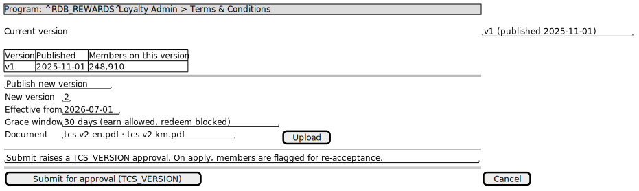
</p>

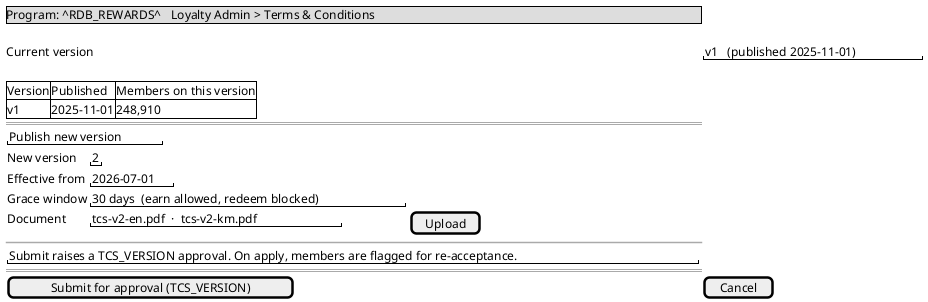

**Mobile screen — Re-accept updated T&Cs** (shown during the grace window; redemption stays blocked until
accepted):

<p align="center">
  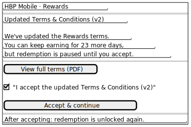
</p>

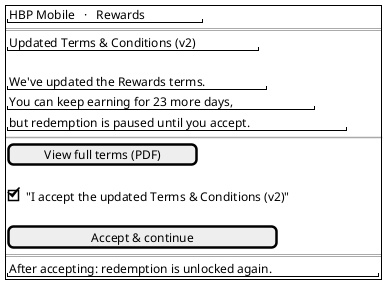

---

## 12. Point expiry

Expiry is **fixed-from-earn-date with FIFO consumption**:

- Each `Earned` entry carries `expires_at = earned_at + programExpiryMonths` (v1 default **24 months**).
- The value is **snapshotted at earn time** — later changes to Program/tier config never retroactively
  re-date already-earned points.
- Redemptions consume the **oldest** cohorts first (FIFO).
- A nightly per-Program job writes `Expired` ledger entries for unconsumed expired cohorts.
- **Tier Expiry Override** (§5) can lengthen or disable expiry for a tier (e.g. Gold = no expiry).

Members see soonest-expiring cohorts in the app via `GET /me/programs/{id}/expiring-points`; there is no
operator action required for normal expiry — it is automatic.

**Mobile screen — Points expiring soon** (customer-facing; soonest cohort first, so members can redeem
before they lose value):

<p align="center">
  
</p>

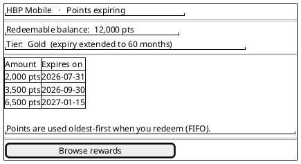

---

## 13. Fraud alerts (Fraud Ops)

Velocity-anomaly fraud detection runs continuously (inside the integration bridge). Fraud-Ops operators
review the alerts it raises. Requires `loyalty-fraud-ops`:

```bash
curl -s -H "Authorization: Bearer $TOKEN" "$ADMIN/fraud/alerts?programId=1&limit=50"
# → { "items": [ { "memberId": 42, "anomalyType": "EARN_VELOCITY_SPIKE",
#                  "observedRate": 12.5, "threshold": 5.0, "detectedAt": "…" } ],
#     "nextCursor": null }
```

**BEP screen — Fraud alerts** (Fraud-Ops only; click through to the member to action):

<p align="center">
  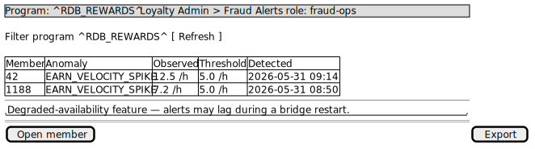
</p>

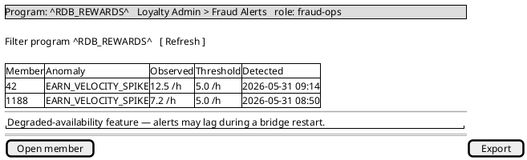

Follow-up (suspend earning, claw back via adjustment, escalate) is handled through member servicing (§10)
and the bank's case-management process. Fraud detection is a *degraded-availability* feature — alerts may
lag during a restart; the earning/ledger hot path is unaffected.

---

## 14. Audit & governance

- **Every administrative write** via BEP is recorded in a per-service audit log
  `{actor, action, entity, before, after, occurred_at}`, **hash-chained and DB-immutable**, retained ≥ 7
  years (or longer if the Central Bank requires). The `X-Actor` (your user id) is propagated on every
  write so the audit attributes the change to you.
- **The Point Ledger is the customer-facing source of truth** and is append-only; the audit log is the
  *operational* record of admin actions — they are distinct.
- **Approvals leave a trail**: each applied change records the `bepApprovalRef`, and (for adjustments) the
  maker and checker user ids.
- **Drawings are replayable**: the seed and winner indices are stored, so any winner selection can be
  independently re-verified.

**BEP screen — Audit log viewer** (read-only; filter by actor/action/entity; each row shows the before/after
and the approval reference — the operational trail, distinct from the customer Point Ledger):

<p align="center">
  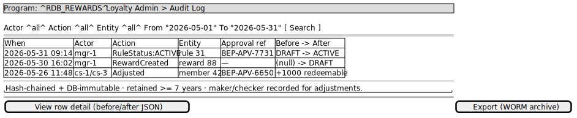
</p>

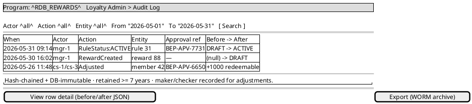

---

## 15. Quick reference

### Admin BFF endpoints (`/api/loyalty/admin`)

| Area | Method & path | Role | Notes |
|---|---|---|---|
| Members | `GET /members?customerId=` | cs / readonly | Lookup |
| | `GET /members/{memberId}` | cs / readonly | Detail + programs |
| | `GET /members/{memberId}/programs/{programId}/ledger` | cs / readonly | Audit view (paged) |
| Approvals | `POST /approval-requests` | cs-maker / campaign-manager | Raise (§3) |
| | `GET /approval-requests?status=&type=` | cs / campaign-manager / readonly | List |
| | `POST /approval-requests/{id}/confirm` | BEP workflow (mTLS) | Apply/reject |
| Earning | `GET /programs/{id}/earn-sources` | campaign-manager / readonly | |
| | `GET /programs/{id}/rules` | campaign-manager / readonly | |
| | `POST /programs/{id}/rules` | campaign-manager | Create DRAFT |
| | `POST /programs/{id}/rules/{ruleId}/dry-run` | campaign-manager / readonly | Side-effect-free |
| | `PATCH /rules/{ruleId}` | campaign-manager | ACTIVE = approval-gated; ARCHIVED direct |
| Rewards | `GET /reward-types` | campaign-manager / readonly | Platform catalogue |
| | `GET /programs/{id}/rewards` | campaign-manager / readonly | All statuses |
| | `POST /programs/{id}/rewards` | campaign-manager | Create DRAFT |
| | `PATCH /rewards/{rewardId}` | campaign-manager | ACTIVE / point-cost = approval-gated |
| Campaigns | `GET /programs/{id}/campaigns` | campaign-manager / readonly | |
| | `POST /programs/{id}/campaigns` | campaign-manager | Create DRAFT |
| | `PATCH /campaigns/{campaignId}` | campaign-manager | Transition |
| | `POST /campaigns/{campaignId}/drawings` | campaign-manager | |
| | `GET /drawings/{drawingId}/winners` | campaign-manager / readonly | |
| Fraud | `GET /fraud/alerts` | fraud-ops | |

### Approval types

`ADJUSTMENT` · `RULE_ACTIVATION` · `REWARD_CHANGE` · `TIER_CHANGE` · `TCS_VERSION`

### Earn Sources (v1)

`CARD_SPEND` · `BILL_PAYMENT` · `FUND_TRANSFER` · `TOPUP` · `TERM_DEPOSIT_OPENED` · (`MANUAL_ADJUSTMENT`)

### Reward Types (v1 wired)

`CASHBACK` · `BILL_PAYMENT_VOUCHER` · `THIRD_PARTY_VOUCHER` (async) · `SWEEPSTAKES`

### Lifecycles

- **Earning Rule / Reward:** `DRAFT → ACTIVE → ARCHIVED`
- **Campaign:** `DRAFT → SCHEDULED → LIVE → ENDED → ARCHIVED`
- **Redemption (Saga):** `RESERVED → FULFILLING → COMMITTED | RELEASED | FAILED`
- **Reservation:** `HELD → COMMITTED | RELEASED`

### Common error codes

`MISSING_APPROVAL` · `DSL_INVALID` · `INSUFFICIENT_BALANCE` · `INVENTORY_EXHAUSTED` · `STEP_UP_REQUIRED` ·
`BALANCE_NEGATIVE` · `TCS_NOT_ACCEPTED` · `CAP_EXCEEDED` · `UNAUTHORIZED` · `FORBIDDEN`

---

### Related documentation

- Domain vocabulary — [`CONTEXT.md`](../CONTEXT.md)
- Architecture — [`enterprise-architect.md`](enterprise-architect.md)
- Edge API contracts — [`openapi/loyalty-admin-bff.yaml`](openapi/loyalty-admin-bff.yaml),
  [`openapi/loyalty-mobile-bff.yaml`](openapi/loyalty-mobile-bff.yaml)
- Component views — [`c4/`](../public/docs/c4/) (incl. the BFF L3s and per-service designs)
- Earning DSL schema — [`dsl/schema/earning-rule.schema.json`](dsl/schema/earning-rule.schema.json) and
  [`dsl/examples/`](../public/docs/dsl/examples/)

*This guide describes the v1 platform behaviour. Deployment-specific values (Program name, currencies,
enabled reward types) live in the deployment's `DEPLOYMENT.md`.*
