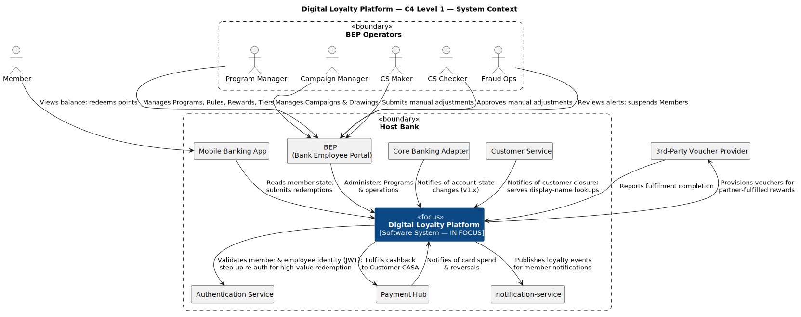
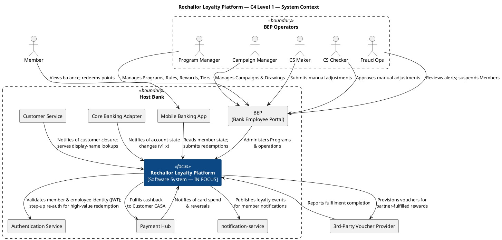

# Rochallor Loyalty Platform — C4 Level 1 — System Context

| Field | Value |
|---|---|
| Version | 0.1 — Initial Draft |
| Status | DRAFT |
| Last updated | 2026-05-26 |
| Author | Nam Vu |
| Companion doc | [`docs/Digital-Loyalty-Arch.md`](../enterprise-architect.md) §11.1 |
| Glossary | [`CONTEXT.md`](../../CONTEXT.md) |

---

## 1. Purpose & Scope

This document is the **C4 Level 1 — System Context** view of the Rochallor Loyalty Platform. Its single job is to answer:

> **Who and what does the Rochallor Loyalty Platform interact with at the system boundary, and to what business end?**

It draws **one** system in focus — the Rochallor Loyalty Platform — and shows every Person and external System it exchanges value with. It is descriptive (what the system context is), not argumentative (why the architecture is shaped that way) — rationale lives in [`docs/Digital-Loyalty-Arch.md`](../enterprise-architect.md).

**In scope:**

- Business actors (humans interacting with the platform via one of the bank's UIs).
- External systems the platform produces data for, consumes data from, or calls.
- Ownership boundaries: which systems the Host Bank owns vs. which sit outside the enterprise.
- Business intent of each relationship.

**Out of scope (deliberately):**

- Internal decomposition of the Rochallor Loyalty Platform into services, BFFs, or data stores — that is [C4 Level 2](level-2-containers.md) (forthcoming).
- Infrastructure: Kafka / shared MSK, AWS API Gateway, Redis, RDS instances. L1 is application-design; mechanism is L2.
- Wire formats, topic names, REST verbs, schema versions — those appear in the OpenAPI / AsyncAPI catalogues (per [`Digital-Loyalty-Arch.md`](../enterprise-architect.md) §11.4).
- Operational personas (SRE, Engineering) — they operate *on* the platform, not *with* it.

---

## 2. Reading the Diagram

The diagram follows standard C4 notation as rendered by the C4-PlantUML library:

| Shape | Meaning |
|---|---|
| `Person` (rounded box, person icon) | A human actor — customer or bank employee. |
| `Person_Boundary` (dashed grouping) | A logical grouping of related personas (shared access path / shared mandate). |
| `System` (filled rectangle, dark) | **The system in focus** — the Rochallor Loyalty Platform. |
| `System_Ext` (filled rectangle, grey) | An external system Loyalty integrates with. |
| `Enterprise_Boundary` (dashed rectangle, "Host Bank") | The institutional boundary. Systems inside are bank-owned; the one outside crosses the bank's wire. (The boundary label is bound to the v1 deployment's institution name — see `deployments/<bank>/DEPLOYMENT.md`.) |
| Solid arrow with label | A directional relationship. The label describes the **business intent** of the interaction, not the transport mechanism. |

**Bidirectional flows** (e.g. Loyalty ↔ 3rd-Party Voucher Provider) are drawn as **two separate directed arrows** with distinct verbs, because direction encodes who initiates the interaction. The platform calling out is a different business event from the partner calling back.

---

## 3. The Diagram

  

---

## 4. Actors

Six persona boxes. The Member sits outside the BEP Operators boundary because their access path is fundamentally different (mobile app → customer-authenticated BFF) than the operators' (BEP → employee-authenticated BFF).

| Persona | Goal | Primary surface | Glossary cross-ref |
|---|---|---|---|
| **Member** | Earn points on bank activity; check balance and tier progress; redeem points for rewards. | Mobile Banking App | [Member](../../CONTEXT.md#language) |
| **Program Manager** | Configure Programs, Earning Rules, Reward catalogue, Tier ladder. | BEP | [Program](../../CONTEXT.md#language), [Earning Rule](../../CONTEXT.md#language) |
| **Campaign Manager** | Author Campaigns and time-bounded Drawings. | BEP | [Drawing](../../CONTEXT.md#language) |
| **CS Maker** | Initiate manual Point adjustments for customer-service cases. | BEP | [Maker-Checker](../../CONTEXT.md#language), [Manual Adjustment](../../CONTEXT.md#language) |
| **CS Checker** | Approve/reject manual adjustments under the 4-eyes workflow. | BEP | [Maker-Checker](../../CONTEXT.md#language) |
| **Fraud Ops** | Monitor velocity anomalies and cap breaches; suspend Members where warranted. | BEP | — |

**Personas deliberately not shown:**

- **"Customer"** as a separate person — per [`CONTEXT.md`](../../CONTEXT.md), a Customer is a prerequisite identity owned by the Host Bank Platform; a human interacts with the Loyalty platform *as a Member*, not as a Customer. Showing both would imply two distinct interaction paths where only one exists.
- **Loyalty SRE / Engineer** — operates the platform; doesn't interact with it as a business actor.
- **3rd-Party Voucher Partner Operator** — the partner's humans don't touch Loyalty; their system does.

---

## 5. External Systems

Eight `System_Ext` boxes — seven inside the Host Bank boundary, one outside.

| System | Owner team | Reuse vs. Owned | Touchpoint(s) |
|---|---|---|---|
| **Mobile Banking App** | Mobile Banking team | Reused | [T-09](../enterprise-architect.md#8-touchpoints-with-banks-ecosystem) |
| **BEP (Bank Employee Portal)** | BEP team | Reused | [T-10](../enterprise-architect.md#8-touchpoints-with-banks-ecosystem) |
| **Payment Hub** | Payment Hub team | Reused | [T-01, T-02, T-03](../enterprise-architect.md#8-touchpoints-with-banks-ecosystem) |
| **Core Banking Adapter** | Core Banking team | Reused | [T-04](../enterprise-architect.md#8-touchpoints-with-banks-ecosystem) (v1.x) |
| **Customer Service** | Customer Service team | Reused | [T-05, T-06](../enterprise-architect.md#8-touchpoints-with-banks-ecosystem) |
| **Authentication Service** | Host Bank Platform team | Reused | [T-07](../enterprise-architect.md#8-touchpoints-with-banks-ecosystem) |
| **`notification-service`** | Notification team | Reused | [T-08](../enterprise-architect.md#8-touchpoints-with-banks-ecosystem) |
| **3rd-Party Voucher Provider** | External partner | External — outside the Host Bank | [T-11](../enterprise-architect.md#8-touchpoints-with-banks-ecosystem) |

**Not drawn at L1** (and why):

- **Shared MSK / Kafka cluster** — transport, not a system; it surfaces at L2 as a Container.
- **AWS API Gateway** — infrastructure boundary; appears at L2 between the Mobile Banking App / BEP and the Loyalty BFFs.
- **T-13 Sweepstakes Prize Fulfilment** — internal to Loyalty (Sweepstakes Adapter → Drawing → reuse of Cashback / Voucher pipeline), not an external system.

---

## 6. Key Relationships

Each paragraph below names a business workflow and points to the arrows in the diagram that participate in it. Together they cover all 16 edges.

### 6.1 Earning loop

When a Member spends on a card, transfers, or otherwise generates a qualifying event, the producing system notifies Loyalty: **Payment Hub → Loyalty** (card spend, payment reversals), and from v1.x onward, **Core Banking Adapter → Loyalty** (account-state events). Loyalty evaluates these against the relevant Program's Earning Rules and writes Point Ledger entries. The Member sees the result when they open the app (**Member → Mobile Banking App → Loyalty**).

### 6.2 Redemption loops

A Member submits a redemption via the app (**Member → Mobile Banking App → Loyalty**). Loyalty's two-phase redemption flow dispatches to the right Fulfillment Adapter based on Reward Type:

- **Cashback** → Loyalty calls Payment Hub's disbursement API (**Loyalty → Payment Hub**), crediting the Member's CASA.
- **3rd-party voucher** → Loyalty calls the partner (**Loyalty → 3rd-Party Voucher Provider**) and the partner reports completion via webhook (**3rd-Party Voucher Provider → Loyalty**). This is the only flow crossing the Host Bank's enterprise boundary.
- High-value redemptions trigger step-up auth: **Loyalty → Authentication Service**.

### 6.3 Administration via BEP

All five BEP personas reach Loyalty through one path: **BEP Operator → BEP → Loyalty**. The portal multiplexes distinct admin surfaces — Program/Rule/Reward authoring (Program Manager), Campaign authoring (Campaign Manager), the approval queue (CS Maker + CS Checker, running on BEP's own Approval Workflow), and the velocity-anomaly console (Fraud Ops).

### 6.4 Customer-facing reads & lifecycle

Member-facing reads (balance, tier, recent ledger) ride the same path as redemptions: **Mobile Banking App → Loyalty**. Display-name resolution and customer-closure events come from **Customer Service → Loyalty** (PII is never persisted in Loyalty per CONTEXT.md).

### 6.5 Identity & auth

**Loyalty → Authentication Service** for JWT validation on every authenticated call from both BFFs, and for transaction-PIN re-auth on high-value redemptions. The direction is request-initiator, not data-flow: the Auth Service is the authority; Loyalty is the verifier. (See [T-07](../enterprise-architect.md#8-touchpoints-with-banks-ecosystem).)

### 6.6 Outbound notifications

Loyalty does not own a notification channel. It publishes its own domain events (`PointsEarned`, `TierChanged`, `RewardRedeemed`, etc.) to the **Host Bank Platform's `notification-service`**, which routes to in-app, push, SMS, or email per Member preference. Loyalty builds no notification service of its own.

---

## 7. Cross-References

- **Roadmap & context:** [`docs/Digital-Loyalty-Arch.md`](../enterprise-architect.md) §11.1 — this file is the §11.1 deliverable.
- **Touchpoint catalogue:** [`docs/Digital-Loyalty-Arch.md`](../enterprise-architect.md) §8 — the full T-01…T-13 register.
- **Glossary:** [`CONTEXT.md`](../../CONTEXT.md) — canonical definitions for *Member*, *Program*, *Point Ledger*, *Reward*, *Maker-Checker*, etc.
- **Next levels (forthcoming):**
  - [`level-2-containers.md`](level-2-containers.md) — C4 Level 2 Container Diagram.
  - `level-3-components-<service>.md` — C4 Level 3 component diagrams per high-complexity service.
