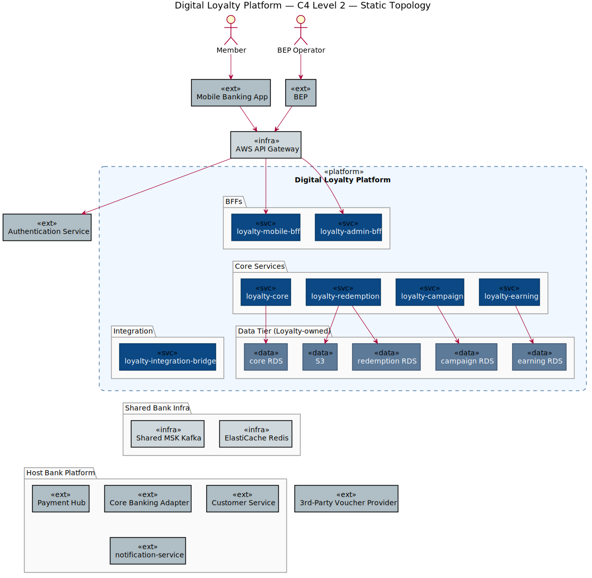
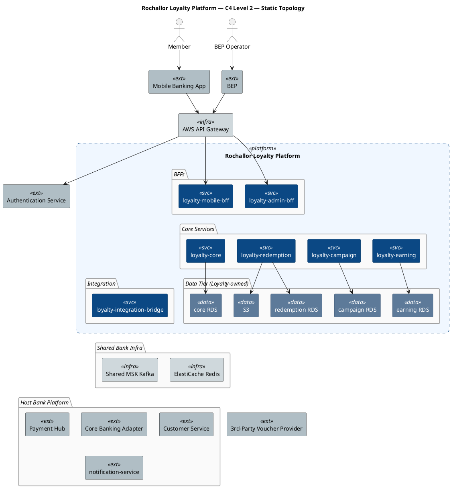
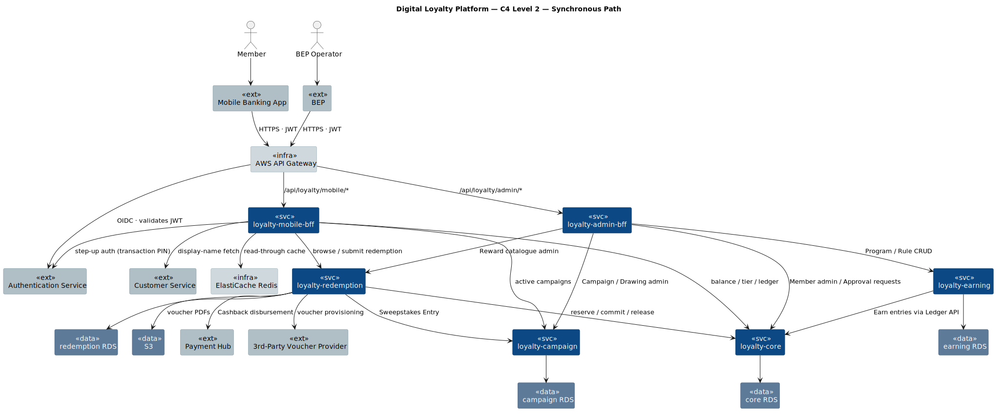
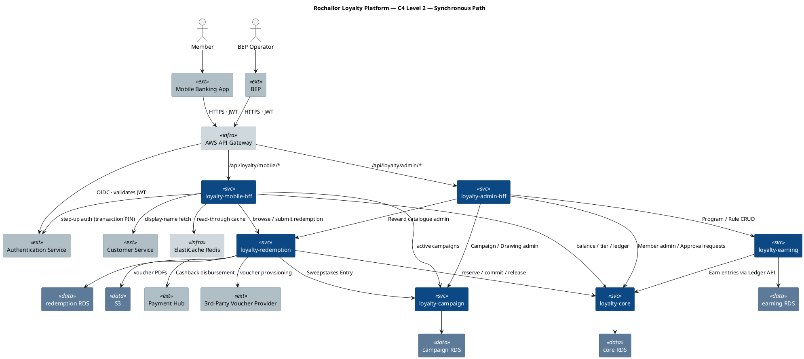
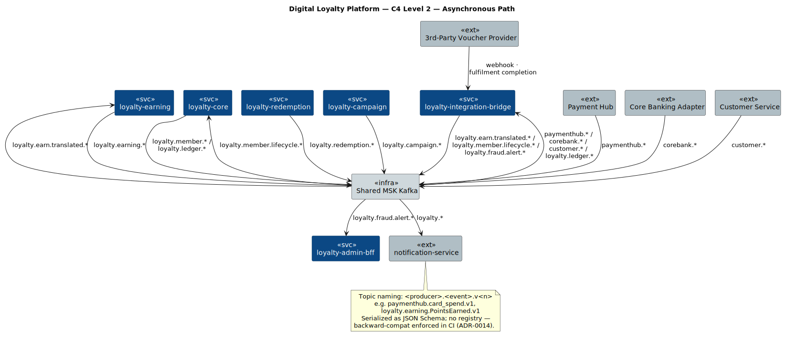
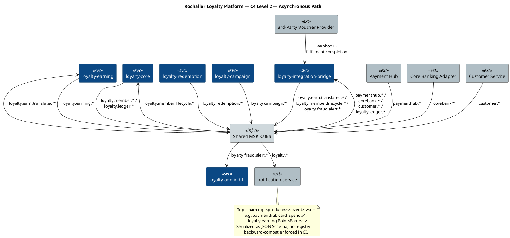

# Rochallor Loyalty Platform — C4 Level 2 — Containers

| Field | Value |
|---|---|
| Version | 0.1 — Initial Draft |
| Status | DRAFT |
| Last updated | 2026-05-26 |
| Author | Nam Vu |
| Companion doc | [`docs/Digital-Loyalty-Arch.md`](../enterprise-architect.md) §11.2 |
| Preceding view | [`level-1-system-context.md`](level-1-system-context.md) |
| Glossary | [`CONTEXT.md`](../../CONTEXT.md) |

---

## 1. Purpose & Scope

This document is the **C4 Level 2 — Container** view of the Rochallor Loyalty Platform. Its single job is to answer:

> **What independently deployable units make up the Rochallor Loyalty Platform, what does each one own, and how do they talk — to each other and to the bank's wider ecosystem?**

It zooms inside the single "Rochallor Loyalty Platform" box drawn at [L1](level-1-system-context.md), decomposes it into the seven application services + the data containers Loyalty owns, and shows the mechanism — transport, topics, sync vs. async — that L1 deliberately omitted.

**In scope:**

- The 7 Loyalty application containers (`loyalty-mobile-bff`, `loyalty-admin-bff`, `loyalty-core`, `loyalty-earning`, `loyalty-redemption`, `loyalty-campaign`, `loyalty-integration-bridge`).
- The data containers Loyalty owns (4 per-service RDS instances, S3).
- The shared bank-infrastructure containers Loyalty depends on (AWS API Gateway, Authentication Service, Shared MSK Kafka, ElastiCache Redis).
- Mechanism: REST/JSON vs. Kafka topic vs. JDBC, including direction and the business intent of each edge.
- The same external systems already named at L1 (Payment Hub, Core Banking Adapter, Customer Service, the Host Bank Platform's `notification-service`, Authentication Service, 3rd-Party Voucher Provider) — now with the transport that L1 hid.

**Out of scope (deliberately):**

- Components *inside* a service — Membership Aggregate, Rule Engine, Reservation Manager, individual Fulfillment Adapters, Velocity Anomaly Consumer, etc. Those belong at [C4 Level 3](../enterprise-architect.md#113-c4-level-3--component-diagrams-phase-15), one diagram per high-complexity service.
- Wire-format specifics: topic names, schema versions, REST URIs, payload field lists — those live in the OpenAPI / AsyncAPI catalogues per [`Digital-Loyalty-Arch.md`](../enterprise-architect.md) §11.4.
- Deployment topology: AZs, node groups, EKS clusters, DR region. See [`Digital-Loyalty-Arch.md`](../enterprise-architect.md) §6.2.
- The five distinct BEP-operator personas — collapsed here to one "BEP Operator" archetype. The operator-level distinction is preserved at L1 [§4](level-1-system-context.md#4-actors).
- The internal-only Sweepstakes Prize Fulfilment path (T-13) — drawn implicitly as `loyalty-redemption` → `loyalty-campaign`, no separate adapter container.

---

## 2. Reading the Diagrams

L2 has too many edges (~35) to fit in one frame without crossing. We use **three sub-views**, matching the "context map + sub-views" pattern already adopted in [`Digital-Loyalty-Arch.md`](../enterprise-architect.md) §4.2:

| Sub-view | Scope | What it answers |
|---|---|---|
| **§3.1 Static Topology** | All containers + boundaries + structural relationships only | *What deployables exist and what owns what?* |
| **§3.2 Synchronous Path** | REST / JDBC / OIDC edges with business-intent labels | *Who calls whom on the request-response path?* |
| **§3.3 Asynchronous Path** | MSK topics + producers / consumers + the Voucher webhook | *Who publishes / consumes which events?* |

**Common legend (applies to all three diagrams):**

| Shape | Meaning |
|---|---|
| Filled dark blue rectangle | **Loyalty application container** — independently deployable Java 21 / Spring Boot 4 service on `eks-loyalty-prod`. |
| Filled slate rectangle | **Loyalty-owned data container** — RDS Postgres or S3 bucket, scoped to a single service. |
| Filled light-grey rectangle | **Shared bank infrastructure** — API Gateway, Authentication Service, Shared MSK, ElastiCache Redis. |
| Filled mid-grey rectangle | **External system** — Host Bank Platform or partner. |
| Dashed rectangle (`Rochallor Loyalty Platform`) | The Loyalty system boundary. |

**Conventions:**

- All inter-service REST calls are mTLS-secured per [§7.1](../enterprise-architect.md#71-security-reference-architecture); mTLS is not redrawn on every edge.
- Topic names appear only on §3.3 async edges. Wire-format / schema-version detail lives in the AsyncAPI catalogue.
- Bidirectional flows (e.g. Loyalty ↔ 3rd-Party Voucher Provider) appear as two directed arrows with distinct verbs, because direction encodes who initiates the call.

---

## 3. The Diagrams

### 3.1 Static Topology

Inventory only — what exists, which cluster each container belongs to, and which service owns which data store. Mechanism is deliberately omitted: no REST, no Kafka, no externals (other than the ingress chain). Use [§3.2](#32-synchronous-path) and [§3.3](#33-asynchronous-path) for the verbs and the partner systems.

  

### 3.2 Synchronous Path

REST / JDBC / OIDC only. No Kafka — see §3.3. Layout is layered top-down: personas → channels → edge → BFFs → core services → data tier; outbound sync targets sit to the side.

  

### 3.3 Asynchronous Path

All Kafka traffic over Shared MSK, plus the 3rd-Party Voucher webhook (which completes an async saga). MSK sits in the centre; producers on the left, consumers on the right.

  

---

## 4. Containers

### 4.1 Application Containers (7)

All services run on `eks-loyalty-prod` (Java 21 + Spring Boot 4, per [§6.1](../enterprise-architect.md#61-technology-stack-by-layer)). Each owns its own RDS (where it has one) — no cross-service DB access.

| Container | Bounded contexts inside | Owns RDS | Sync inbound from | Sync outbound to | Async role |
|---|---|---|---|---|---|
| **`loyalty-mobile-bff`** | (none — BFF aggregation only) | — | `apigw` | `core`, `redm`, `camp`, `redis`, `custsvc`, `kc` | — |
| **`loyalty-admin-bff`** | (none — BFF aggregation only) | — | `apigw` | `core`, `earn`, `redm`, `camp` | — |
| **`loyalty-core`** | Membership + Ledger (Shared Kernel) | ✅ `loyalty-core RDS` | `mbff`, `abff`, `earn`, `redm` | — | Consumes `loyalty.member.lifecycle.*`; publishes `loyalty.member.*` + `loyalty.ledger.*` |
| **`loyalty-earning`** | Earning | ✅ `loyalty-earning RDS` | `abff` | `core` (writes Ledger entries) | Consumes `loyalty.earn.translated.*`; publishes `loyalty.earning.PointsEarned` |
| **`loyalty-redemption`** | Reward + Fulfillment | ✅ `loyalty-redemption RDS` | `mbff`, `abff` | `core` (reserve/commit/release), `camp` (Sweepstakes Entry), `payhub`, `voucher`, `s3` | Publishes `loyalty.redemption.*`; receives partner webhook via Bridge |
| **`loyalty-campaign`** | Campaign | ✅ `loyalty-campaign RDS` | `mbff`, `abff`, `redm` | — | Publishes `loyalty.campaign.*` |
| **`loyalty-integration-bridge`** | Integration Bridge (ACL) — **no business state** | — (stateless except Kafka consumer offsets) | (Voucher partner webhook) | — | Consumes `paymenthub.*` / `corebank.*` / `customer.*` / `loyalty.ledger.*`; publishes `loyalty.earn.translated.*` / `loyalty.member.lifecycle.*` / `loyalty.fraud.alert.*` |

**Notes:**

- **The 8→7 collapse**: Membership and Ledger are 8 bounded contexts but co-deployed as `loyalty-core` because they need same-transaction guarantees (Shared Kernel). Reward + Fulfillment are also co-deployed as `loyalty-redemption` to keep the Saga in-process.
- **No `loyalty-fraud` container** — fraud detection lives as the Velocity-Anomaly consumer inside `loyalty-integration-bridge`. The Fraud-Ops UI is served by `loyalty-admin-bff`. Both write to / read from `loyalty.fraud.alert.v1` on MSK.
- **No `loyalty-notification` container** — Loyalty publishes domain events; the Host Bank Platform's `notification-service` is the consumer that fans out to channels ([§6.6 of L1](level-1-system-context.md#66-outbound-notifications)).

### 4.2 Loyalty-Owned Data Containers

| Container | Type | Owner service | Notes |
|---|---|---|---|
| **`loyalty-core RDS`** | PostgreSQL, Multi-AZ, primary + read-replica | `loyalty-core` | Hot path of the platform: Member, Point Ledger (append-only), Reservation Table, Point Cohort Projection, Tier Projection. |
| **`loyalty-earning RDS`** | PostgreSQL, Multi-AZ | `loyalty-earning` | Earn Source registry, Earning Rules (JSON DSL), Cap counters, Idempotency-key table. |
| **`loyalty-redemption RDS`** | PostgreSQL, Multi-AZ | `loyalty-redemption` | Reward catalogue, Inventory, per-Reward eligibility config, Redemption Saga state (`HELD` / `COMMITTED` / `RELEASED`). |
| **`loyalty-campaign RDS`** | PostgreSQL, Multi-AZ | `loyalty-campaign` | Campaign aggregate, Drawing schedule, Entry list, Winner selection record. |
| **S3** (`loyalty-vouchers-*` + `loyalty-audit-archive-*`) | Object storage | `loyalty-redemption` (vouchers); all services (audit archive) | Voucher PDFs; Service Audit Log **WORM archive** — S3 Object Lock, hash-chained source, 7-year retention. |

### 4.3 Shared Bank-Infrastructure Containers Loyalty Uses

These are **drawn outside** the Loyalty platform boundary because they are not owned by Loyalty, but they are part of the runtime.

| Container | Owner | Used for |
|---|---|---|
| **AWS API Gateway** | Host Bank Platform team | Ingress for both BFFs; rate limiting; JWT presence enforcement |
| **Authentication Service** (retail-banking + business-employee-portal realms) | Host Bank Platform team | JWT validation + step-up transaction-PIN re-auth (T-07) |
| **Shared MSK Kafka** | Host Bank Platform team | All async messaging — inbound producer topics + outbound `loyalty.*` topics. Per-topic ACLs enforce isolation. |
| **ElastiCache Redis** | Host Bank Platform team | Read-through cache for `loyalty-mobile-bff` only (balance / tier / catalogue projections). Never source of truth. |

---

## 5. External Systems Consumed

These are the same seven systems named at [L1 §5](level-1-system-context.md#5-external-systems) — now with the L2 mechanism made explicit. The "Touchpoint" column links back to the canonical register in [`Digital-Loyalty-Arch.md`](../enterprise-architect.md) §8.

| System | Mechanism (L2) | Initiated by | Touchpoint |
|---|---|---|---|
| **Mobile Banking App** | REST/JSON via API Gateway → `loyalty-mobile-bff` | Mobile App | [T-09](../enterprise-architect.md#8-touchpoints-with-banks-ecosystem) |
| **BEP** | REST/JSON via API Gateway → `loyalty-admin-bff` | BEP | [T-10](../enterprise-architect.md#8-touchpoints-with-banks-ecosystem) |
| **Payment Hub** | (a) Kafka `paymenthub.card_spend.v1` + `paymenthub.payment_reversed.v1` → Bridge; (b) REST disbursement called by `loyalty-redemption` Cashback Adapter | (a) Payment Hub; (b) Loyalty | [T-01, T-02, T-03](../enterprise-architect.md#8-touchpoints-with-banks-ecosystem) |
| **Core Banking Adapter** | Kafka `corebank.*` → Bridge | Core Banking Adapter | [T-04](../enterprise-architect.md#8-touchpoints-with-banks-ecosystem) |
| **Customer Service** | (a) Kafka `customer.closed.v1` → Bridge → `loyalty-core`; (b) REST display-name fetch from BFF (T-06, short cache, no PII persisted) | (a) Customer Service; (b) Loyalty | [T-05, T-06](../enterprise-architect.md#8-touchpoints-with-banks-ecosystem) |
| **Authentication Service** | (a) OIDC — JWT validation by API Gateway; (b) REST/JSON from `loyalty-mobile-bff` (transaction-PIN challenge + verify) for step-up re-auth | (a) API Gateway; (b) Loyalty | [T-07](../enterprise-architect.md#8-touchpoints-with-banks-ecosystem) |
| **the Host Bank Platform's `notification-service`** | Kafka — subscribes to `loyalty.*` topics on MSK | notification-service | [T-08](../enterprise-architect.md#8-touchpoints-with-banks-ecosystem) |
| **3rd-Party Voucher Provider** | (a) REST/JSON outbound from `loyalty-redemption` 3P-Voucher Adapter; (b) Webhook inbound to Bridge | (a) Loyalty; (b) Partner | [T-11](../enterprise-architect.md#8-touchpoints-with-banks-ecosystem) |

---

## 6. Key Relationships

Each subsection names one end-to-end flow and walks the containers it traverses. Together they cover every edge on the diagram.

### 6.1 Edge & authentication

Mobile App and BEP both ingress through one **AWS API Gateway**, which calls the **Authentication Service** to validate the bearer JWT against the appropriate realm (`retail-banking` for Members, `business-employee-portal` for BEP operators) and then routes to one of the two BFFs based on path prefix. Per-service authorisation is enforced inside each BFF using JWT claims; service-to-service hops are mTLS (cert-manager rotation, [§6.3 row 10](../enterprise-architect.md#63-technology-decisions-summary)).

### 6.2 Member surface — `loyalty-mobile-bff`

The Mobile BFF is the sole sync entry point for Members. It:

- Reads balance / tier / recent Ledger from **`loyalty-core`**, with **Redis** as a read-through cache for the hot projections.
- Browses Rewards and submits redemptions to **`loyalty-redemption`**.
- Reads active Campaigns and Drawing entries from **`loyalty-campaign`**.
- Fetches display names on demand from **Customer Service** (T-06) — short TTL cache, no PII ever persisted in Loyalty.
- Issues a step-up transaction-PIN challenge to the **Authentication Service** (T-07) for redemptions above the high-value threshold, before calling `loyalty-redemption.commit`.

The Mobile BFF implements the graceful-degradation contract: when any Loyalty container is unhealthy, the Mobile App falls back to a "Loyalty temporarily unavailable" surface and the Member's bank functions continue normally.

### 6.3 Admin surface — `loyalty-admin-bff`

The Admin BFF is the sole sync entry point for BEP. It fans out to all four core services because each admin screen targets a distinct context:

- **Program / Rule authoring** → `loyalty-earning` (CRUD on Earn Sources + Rules; dry-run endpoint).
- **Reward catalogue authoring** → `loyalty-redemption`.
- **Campaign / Drawing authoring** → `loyalty-campaign`.
- **Approval requests (adjustments + config activation) + Fraud-Ops console** → `loyalty-core` (the Ledger is where confirmed adjustments land; the 4-eyes runs in BEP's Approval Workflow with Loyalty storing only `bep_approval_ref`; alerts are read back from MSK via the Admin BFF's internal consumer).

### 6.4 Earning flow (async)

When a Member generates a qualifying event, the producing system (Payment Hub for card spend / reversals, or Core Banking Adapter for account events from v1.x) publishes a Domain Event on its own MSK topic. **`loyalty-integration-bridge`** is the sole consumer for that topic family; it translates the producer's schema to Loyalty's internal `EarnEvent` and republishes on `loyalty.earn.translated.v1`. **`loyalty-earning`** consumes that, evaluates active Rules, and calls **`loyalty-core`**'s Ledger API (sync REST) to write the Ledger entries. `loyalty-earning` then publishes `loyalty.earning.PointsEarned`, which **the Host Bank Platform's `notification-service`** consumes to notify the Member.

### 6.5 Redemption flow (sync saga + outbound fulfilment)

A Member submits a redemption through the Mobile BFF, which calls **`loyalty-redemption`**. The Redemption Saga runs in-process:

1. **`loyalty-redemption`** → **`loyalty-core`**: `reserve` Points (writes a `HELD` row in the Reservation table).
2. The Saga dispatches to the Fulfillment Adapter for the Reward Type:
   - **Cashback** → `loyalty-redemption` → **Payment Hub** disbursement API (T-03), then `commit`.
   - **3rd-Party Voucher** → `loyalty-redemption` → **3rd-Party Voucher Provider** (T-11); the partner's completion **webhook lands on `loyalty-integration-bridge`**, which signals the Saga to `commit`. This is the only flow crossing the Host Bank boundary.
   - **Bill-Payment Voucher** → in-process; voucher PDF is written to **S3** and the code is emitted to the Member via `loyalty.redemption.Completed` → notification-service.
   - **Sweepstakes** → `loyalty-redemption` → `loyalty-campaign` to record the Drawing Entry (T-13).
3. **`loyalty-redemption`** → **`loyalty-core`**: `commit` (turns the `HELD` row into a `Redeemed` Ledger entry) or `release` on failure.
4. **`loyalty-redemption`** publishes `loyalty.redemption.Completed` or `loyalty.redemption.Failed`.

### 6.6 Member lifecycle

`customer.closed.v1` events are consumed by **`loyalty-integration-bridge`** and translated to `loyalty.member.lifecycle.v1`, which **`loyalty-core`** consumes to close the Member (per the Member State Machine, [§3.5](../enterprise-architect.md#35-domain-state-machines)).

### 6.7 Outbound notifications

Every customer-visible Loyalty event (`PointsEarned`, `TierChanged`, `TierAtRisk`, `MemberOptedIn`, `PointsExpiringSoon`, `RedemptionCompleted`, `RedemptionFailed`, `DrawingCompleted`, `WinnerSelected`) is published by the relevant service to a `loyalty.*` topic. **the Host Bank Platform's `notification-service`** is the sole downstream consumer for member-facing channels (in-app / push / SMS / email). Loyalty owns no notification channel itself.

### 6.8 Velocity-anomaly / fraud

**`loyalty-integration-bridge`** runs a second streaming consumer over `loyalty.ledger.v1` (the Ledger event stream published by `loyalty-core`), applies windowed velocity rules, and publishes `loyalty.fraud.alert.v1`. **`loyalty-admin-bff`** subscribes to this topic to surface alerts in the Fraud-Ops console; Fraud Ops then suspends Members through the same Admin BFF → `loyalty-core` path used for Manual Adjustments.

---

## 7. Cross-References

- **L1 view this decomposes:** [`level-1-system-context.md`](level-1-system-context.md)
- **Roadmap entry:** [`docs/Digital-Loyalty-Arch.md`](../enterprise-architect.md) §11.2 — this file is the §11.2 deliverable
- **Component view (next level):** [`docs/Digital-Loyalty-Arch.md`](../enterprise-architect.md) §11.3 — one L3 diagram per high-complexity service (`loyalty-core`, `loyalty-earning`, `loyalty-redemption`, `loyalty-campaign`, `loyalty-integration-bridge`)
- **Touchpoint register:** [`docs/Digital-Loyalty-Arch.md`](../enterprise-architect.md) §8 — T-01…T-13
- **Tech stack & deployment topology:** [`docs/Digital-Loyalty-Arch.md`](../enterprise-architect.md) §6.1 / §6.2
- **Bounded Context Map (DDD):** [`docs/Digital-Loyalty-Arch.md`](../enterprise-architect.md) §4.2.1
