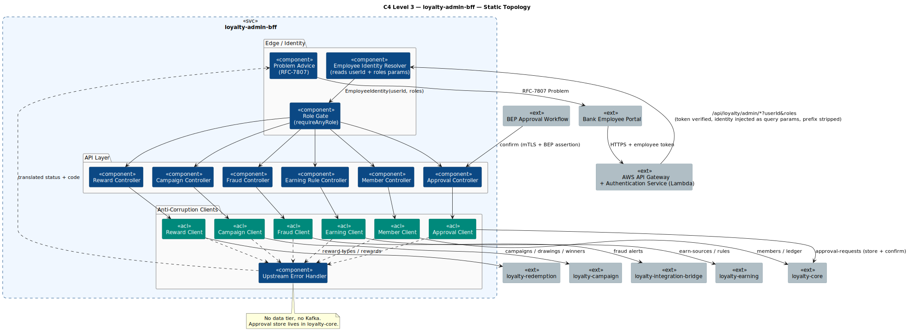
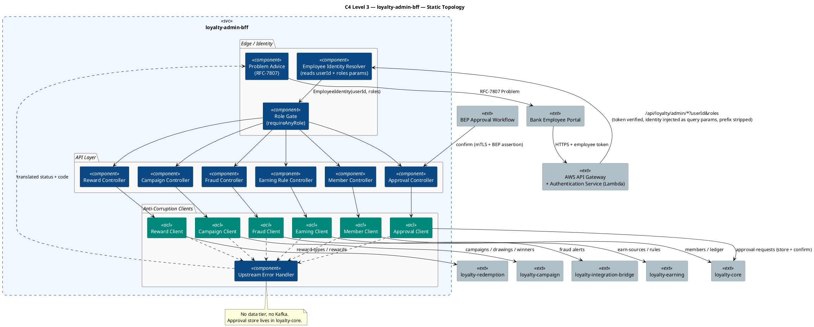
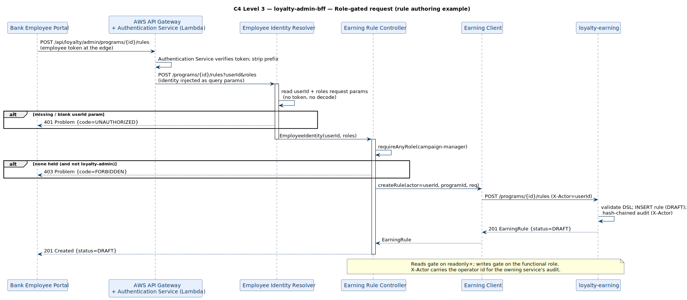
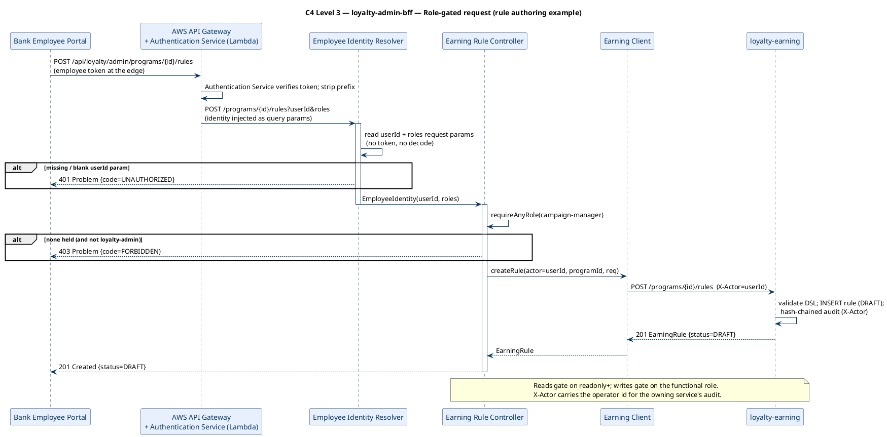
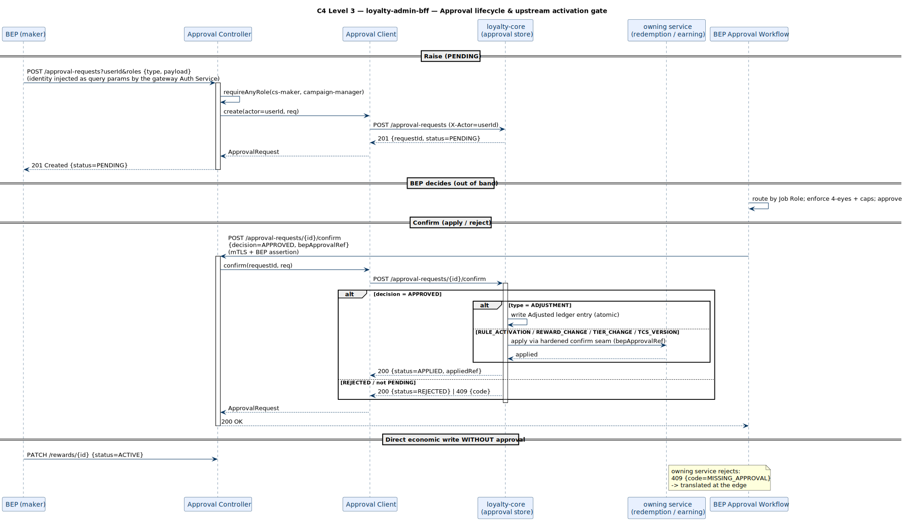
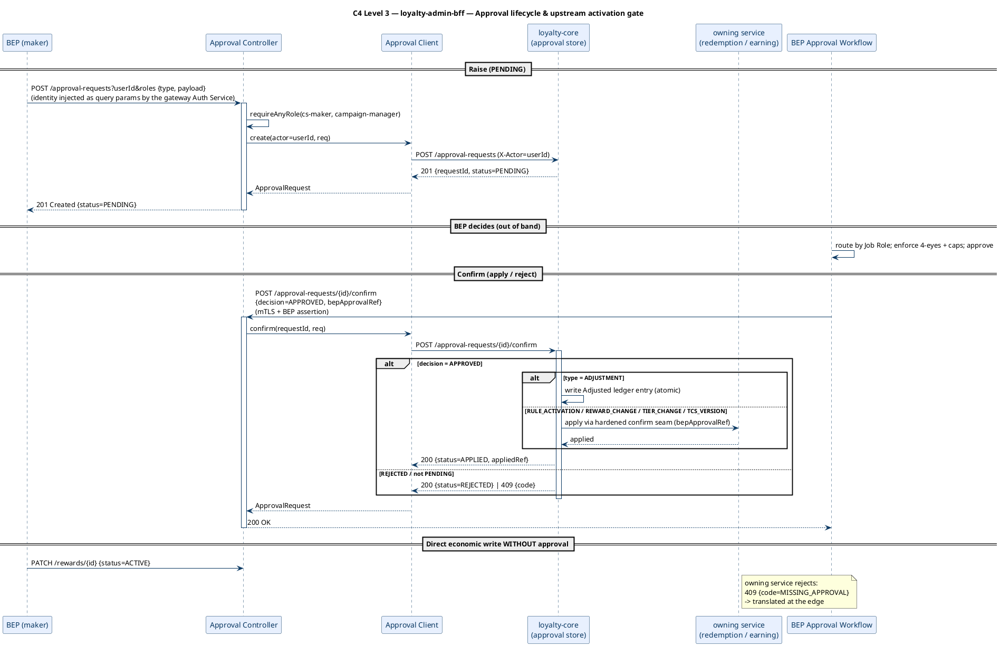

# Rochallor Loyalty Platform — C4 Level 3 — Component — `loyalty-admin-bff`

| Field | Value |
|---|---|
| Version | 0.1 — Initial Draft |
| Status | DRAFT |
| Last updated | 2026-05-31 |
| Author | Nam Vu |
| Companion doc | [`docs/Digital-Loyalty-Arch.md`](../enterprise-architect.md) §10.3 |
| Preceding view | [`level-2-containers.md`](level-2-containers.md) |
| Sibling views | [`level-3-loyalty-mobile-bff.md`](level-3-loyalty-mobile-bff.md), [`level-3-loyalty-integration-bridge.md`](level-3-loyalty-integration-bridge.md) |
| Service guide | [`src/loyalty-admin-bff/DETAILED-DESIGN.md`](../../src/loyalty-admin-bff/DETAILED-DESIGN.md) |
| Glossary | [`CONTEXT.md`](../../CONTEXT.md) |

---

## 1. Purpose & Scope

This document is the **C4 Level 3 — Component** view for the `loyalty-admin-bff` service. Its single job is to answer:

> **What components live inside `loyalty-admin-bff`, how are employee identity and Loyalty roles derived and enforced, and how does the BFF aggregate five backend services into the Bank Employee Portal (BEP) contract?**

It zooms inside the single `loyalty-admin-bff` rectangle drawn at [L2 §3.1](level-2-containers.md#31-static-topology). The service is an **aggregation-only** edge: it owns **no datastore** and produces/consumes **no Kafka**. Beyond the BFF concerns shared with the mobile edge, it adds two things: **per-operation role gating** and **`X-Actor` propagation** so each owning service's hash-chained audit records who acted.

> **Note on the L3 set.** Earlier drafts deliberately omitted an L3 for the BFFs. Now that the admin BFF is implemented with a role-gating identity seam, per-tag controllers, six per-upstream ACL clients, and an upstream-error translator, an L3 component view earns its place.

**In scope:**

- The application-level components inside `loyalty-admin-bff`.
- The gateway-injected `userId` + `roles` query-param identity seam and `requireAnyRole(...)` gating.
- The six Anti-Corruption clients and the five upstreams they front.
- The approval lifecycle (raise → BEP decides → apply-on-confirm in core) and the upstream activation gate.

**Out of scope (deliberately):**

- The internals of the five upstream services — those are their own L3 views.
- The bank's **BEP Approval Workflow** (Job Roles, 4-eyes, caps, routing) — Loyalty stores only a `bepApprovalRef`.
- Employee-token verification and TLS termination — AWS API Gateway + its Authentication Service (L2).

---

## 2. Reading the Diagrams

`loyalty-admin-bff` has exactly one execution mode: **request-driven**. We use **three sub-views**:

| Sub-view | Scope | What it answers |
|---|---|---|
| **§3.1 Static Topology** | All components + six upstream clients + external neighbours | *What lives inside `loyalty-admin-bff` and how is the fan-out wired?* |
| **§3.2 Role-Gated Request** | Gateway → identity + role gate → controller → upstream (with `X-Actor`) | *How is a BEP action authorised and attributed?* |
| **§3.3 Approval Lifecycle** | Raise → BEP decides → confirm applies in core / owning service | *How does Loyalty defer maker-checker to BEP and still apply changes?* |

**Common legend** is identical to [`level-3-loyalty-redemption.md` §2](level-3-loyalty-redemption.md#2-reading-the-diagrams). Conventions specific to this service:

- A **green box** marks an **Anti-Corruption client** — the BFF's only point of contact with one upstream service.
- There is **no data tier**. The approval-request store lives in `loyalty-core`; the BFF forwards.

---

## 3. The Diagrams

### 3.1 Static Topology

  

### 3.2 Role-Gated Request

The shape shared by every operation: the gateway **Authentication Service** verifies the employee token and injects `userId` + `roles` as query parameters; the resolver reads those two params into an `EmployeeIdentity` (no token, no decode), the controller calls `requireAnyRole(...)` (a `403` if none held; `loyalty-admin` is a wildcard), and on a write the employee `userId` is forwarded as `X-Actor` so the owning service's hash-chained audit records who acted.

  

**Why this design:**

- **Gate at the edge, scope upstream** — the BFF enforces the *role* (cheap, read straight from the injected `roles` param); per-Program *scope* (PROGRAM_ADMIN) is enforced by the owning service that holds the data.
- **`loyalty-admin` is a wildcard** — break-glass / platform-admin access without enumerating every functional role.
- **`X-Actor`, not a token, crosses the wire** — the owning service audits the employee `userId`; no token is ever forwarded or parsed downstream.
- **Query params, not body or headers** — the actor must gate `requireAnyRole(...)` on every endpoint including GET reads (no body), and a `HandlerMethodArgumentResolver` cannot read the JSON body without breaking `@RequestBody`; query params apply uniformly across GET and POST/PATCH.

### 3.3 Approval Lifecycle

Loyalty does **not** implement maker-checker. Economic changes are **raised** as `PENDING`, the bank's **BEP Approval Workflow** decides out of band, and `confirm` **applies** the change. Because the BFF is stateless, the approval-request store and the apply-on-confirm orchestration live in `loyalty-core`; the BFF forwards. A direct economic write that bypasses the flow (e.g. activating a reward without an approval ref) is rejected by the owning service and translated at the edge.

  

**Why this design:**

- **BEP owns maker-checker; Loyalty stores a reference** — the bank's workflow already implements Job Roles, 4-eyes, and caps. Re-implementing them in Loyalty would duplicate (and risk diverging from) bank policy.
- **Apply-on-confirm lives in core, not the BFF** — keeps the BFF stateless and puts the atomic ledger write next to the ledger.
- **The activation gate is enforced upstream** — the owning service rejects an un-approved economic change, so the gate can't be bypassed by calling the BFF directly.

---

## 4. Component Inventory

| # | Component | Concern | Writes | Reads | Triggered by |
|---|---|---|---|---|---|
| 1 | **Employee Identity Resolver** | Identity | — | — | Every request; reads gateway-injected `userId` + `roles` query params |
| 2 | **Role Gate** | AuthZ | — | — | Each controller method (`requireAnyRole`) |
| 3 | **Member Controller** | API (Members) | — | — | HTTPS via API Gateway |
| 4 | **Approval Controller** | API (Approvals) | — | — | HTTPS via API Gateway; confirm via BEP Approval Workflow |
| 5 | **Earning Rule Controller** | API (Earning Rules) | — | — | HTTPS via API Gateway |
| 6 | **Reward Controller** | API (Rewards) | — | — | HTTPS via API Gateway |
| 7 | **Campaign Controller** | API (Campaigns) | — | — | HTTPS via API Gateway |
| 8 | **Fraud Controller** | API (Fraud) | — | — | HTTPS via API Gateway |
| 9 | **Member Client** | ACL (→ `loyalty-core`) | — | — | Member Controller |
| 10 | **Approval Client** | ACL (→ `loyalty-core`) | — | — | Approval Controller |
| 11 | **Earning Client** | ACL (→ `loyalty-earning`) | — | — | Earning Rule Controller |
| 12 | **Reward Client** | ACL (→ `loyalty-redemption`) | — | — | Reward Controller |
| 13 | **Campaign Client** | ACL (→ `loyalty-campaign`) | — | — | Campaign Controller |
| 14 | **Fraud Client** | ACL (→ `loyalty-integration-bridge`) | — | — | Fraud Controller |
| 15 | **Upstream Error Handler** | Cross-cutting | — | — | Any `RestClient` 4xx/5xx |
| 16 | **Problem Advice** | Cross-cutting | — | — | Any `BffException` |

All components are **stateless**; none owns a table or a topic.

---

## 5. No Data Tier

`loyalty-admin-bff` owns **no database and no Kafka topic**:

- **The approval-request store lives in `loyalty-core`** — the BFF forwards raise/list/confirm. This keeps the BFF stateless and puts the apply-on-confirm ledger write next to the ledger.
- **Audit trails live in the owning services** — each backend hash-chains its own BEP-originated writes, attributed by the forwarded `X-Actor`.
- **Fraud alerts live in `loyalty-integration-bridge`** — the BFF reads them; it does not consume `loyalty.fraud.alert.v1` itself.

---

## 6. External Edges Re-exposed from L2

| Direction | Counterparty | Mechanism | Triggers which component |
|---|---|---|---|
| Sync inbound | Bank Employee Portal (via AWS API Gateway + Authentication Service) | REST/JSON; token verified at the gateway, identity injected as `userId` + `roles` query params | Employee Identity Resolver → Role Gate → Controllers |
| Sync inbound | BEP Approval Workflow | REST/JSON, mTLS + BEP assertion | Approval Controller (`confirm`) |
| Sync outbound | `loyalty-core` | REST/JSON via mTLS | Member Client, Approval Client |
| Sync outbound | `loyalty-earning` | REST/JSON via mTLS | Earning Client |
| Sync outbound | `loyalty-redemption` | REST/JSON via mTLS | Reward Client |
| Sync outbound | `loyalty-campaign` | REST/JSON via mTLS | Campaign Client |
| Sync outbound | `loyalty-integration-bridge` | REST/JSON via mTLS | Fraud Client |

---

## 7. Invariants & Cross-References

- **Aggregation only — no datastore, no Kafka.** State lives in the upstreams (approvals in core, audit in owning services, fraud in the bridge).
- **Role-gated at the edge, scope enforced upstream.** `requireAnyRole(...)` reads the gateway-injected `roles` param; per-Program PROGRAM_ADMIN scope is the owning service's concern. `loyalty-admin` is a wildcard. The BFF does no token handling.
- **No maker-checker in Loyalty.** Raise → BEP decides → confirm applies; Loyalty stores only `bepApprovalRef`. The activation gate is enforced upstream, so it cannot be bypassed.
- **`X-Actor` carries operator identity for audit** — every write is attributable in the owning service's hash-chained log.
- **Upstream errors are translated, not leaked** — same status + RFC-7807 `code` (e.g. `MISSING_APPROVAL`, `DSL_INVALID`, `CAP_EXCEEDED`).

**Deferred / wired-through:** employee-token verification (the gateway Authentication Service — the BFF trusts the injected `userId` + `roles`); the mTLS + BEP approval assertion on the hardened `confirm` seam (the `bepApprovalRef` is forwarded, not cryptographically verified here); mTLS wiring (cluster infra).

> **Upstream dependency notes.** (a) The **approval store + apply-on-confirm orchestration lives in `loyalty-core`** so the BFF stays aggregation-only. (b) **Fraud alerts are read from `loyalty-integration-bridge`**, which owns the Velocity-Anomaly consumer of `loyalty.fraud.alert.v1` (there is no separate `loyalty-fraud` container) — a deliberate refinement of the L2 async diagram's direct `MSK → admin-bff` arrow.

This is the last of the C4 Level 3 component views. See [`docs/Digital-Loyalty-Arch.md` §10.3](../enterprise-architect.md#103-c4-level-3--component-diagrams--delivered) for the index.

---

*End of document.*
