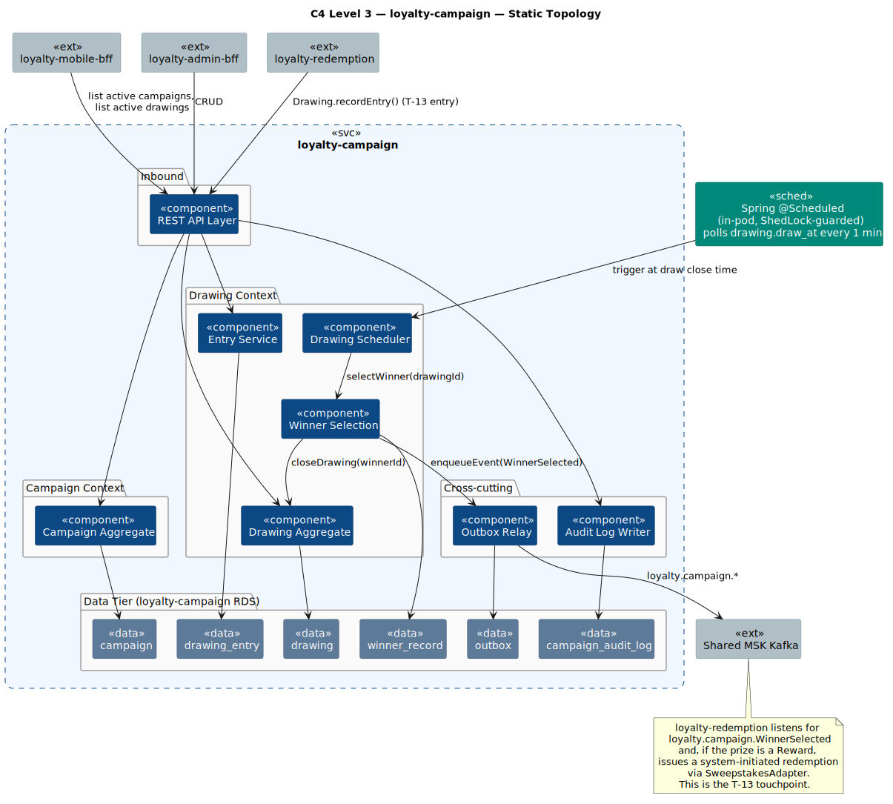
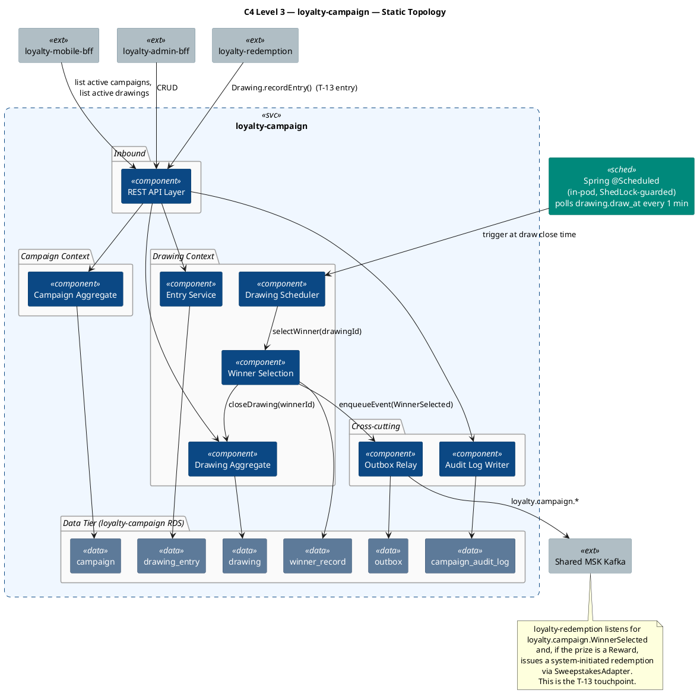
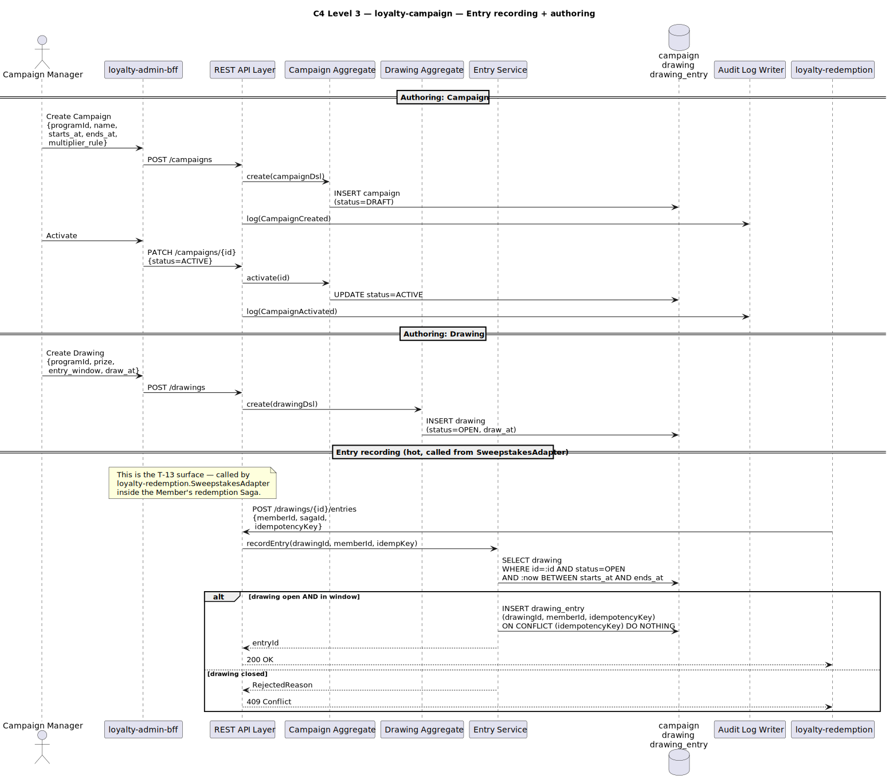
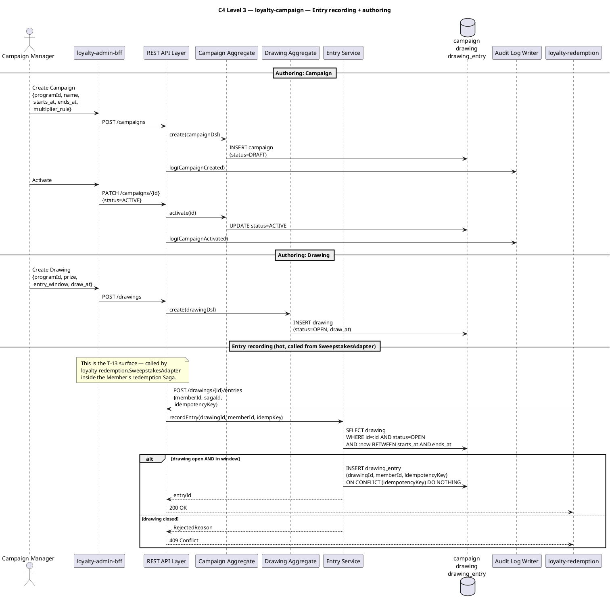
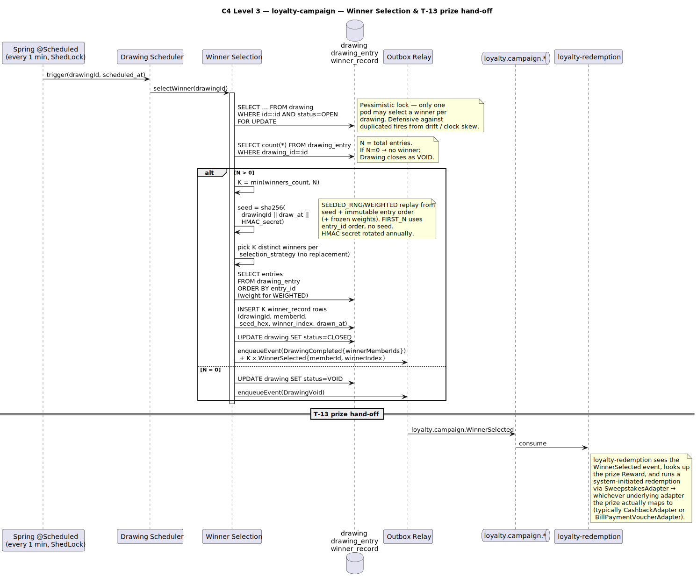
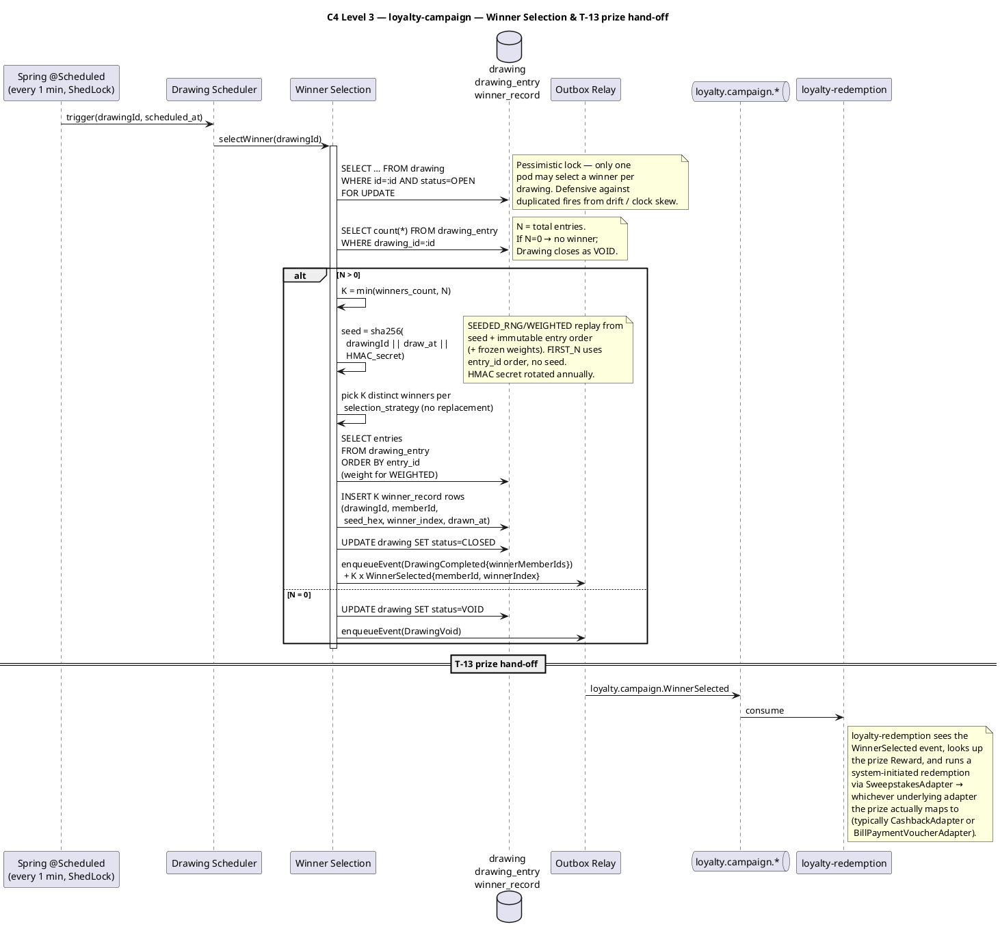

# Rochallor Loyalty Platform — C4 Level 3 — Component — `loyalty-campaign`

| Field | Value |
|---|---|
| Version | 0.1 — Initial Draft |
| Status | DRAFT |
| Last updated | 2026-05-26 |
| Author | Nam Vu |
| Companion doc | [`docs/Digital-Loyalty-Arch.md`](../enterprise-architect.md) §11.3 |
| Preceding view | [`level-2-containers.md`](level-2-containers.md) |
| Sibling views | [`level-3-loyalty-core.md`](level-3-loyalty-core.md), [`level-3-loyalty-redemption.md`](level-3-loyalty-redemption.md) |
| Glossary | [`CONTEXT.md`](../../CONTEXT.md) |

---

## 1. Purpose & Scope

This document is the **C4 Level 3 — Component** view for the `loyalty-campaign` service. Its single job is to answer:

> **What components live inside `loyalty-campaign`, how do they author and schedule Drawings, and how are winners selected fairly and auditably?**

It zooms inside the single `loyalty-campaign` rectangle drawn at [L2 §3.1](level-2-containers.md#31-static-topology). `loyalty-campaign` owns two related concerns: **Campaigns** (marketing-driven, time-bounded earning multipliers / promos) and **Drawings** (sweepstakes — Members enter, a winner is drawn, the prize is fulfilled by reusing the existing Reward pipeline via T-13).

**In scope:**

- The application-level components inside `loyalty-campaign`.
- Campaign + Drawing aggregates, their lifecycle, and the Entry ledger.
- The Winner Selection algorithm and its audit trail.
- The internal touchpoint T-13: how a Drawing prize hands off to `loyalty-redemption` for fulfilment.

**Out of scope (deliberately):**

- How `loyalty-earning` applies a Campaign multiplier — that lives in the DSL Interpreter inside [`loyalty-earning`](level-3-loyalty-earning.md). `loyalty-campaign` only *exposes* active multipliers; it does not evaluate them.
- Reward fulfilment internals — Drawings reuse the same Cashback / Voucher pipeline owned by [`loyalty-redemption`](level-3-loyalty-redemption.md).

---

## 2. Reading the Diagrams

`loyalty-campaign` has three execution modes: **request-driven** (BEP authors Campaigns / Drawings, Mobile BFF lists active ones), **entry-driven** (`loyalty-redemption` records a Sweepstakes entry via the SweepstakesAdapter), and **scheduled** (Drawing Scheduler fires Winner Selection at the configured close time). We use **three sub-views**:

| Sub-view | Scope | What it answers |
|---|---|---|
| **§3.1 Static Topology** | All components + tables + structural relationships | *What lives inside `loyalty-campaign`?* |
| **§3.2 Entry & Authoring Path** | Member entry recording + BEP authoring | *How do entries land and how are Drawings configured?* |
| **§3.3 Winner Selection** | Scheduler fires → seeded RNG → winner Ledger entry → prize hand-off (T-13) | *How is the winner picked fairly, and how does the prize get paid out?* |

**Common legend** is identical to [`level-3-loyalty-core.md` §2](level-3-loyalty-core.md#2-reading-the-diagrams).

---

## 3. The Diagrams

### 3.1 Static Topology

  

### 3.2 Entry & Authoring Path

Two flows on the same surface. The hot flow is **entry recording** — a Member redeems an "Enter Drawing" Reward via Mobile BFF → `loyalty-redemption`'s SweepstakesAdapter → calls back into `loyalty-campaign`'s `Drawing.recordEntry`. The cool flow is BEP authoring.

  

**Notes on entries:**

- **Idempotency on `drawing_entry.idempotency_key`** — the SweepstakesAdapter's idempotency-key (derived from the Saga's idempotency-key) is unique per Drawing per Member per attempt. Replays of the same redemption don't enter a Member twice.
- **`ON CONFLICT DO NOTHING`** — the cheapest way to make entry recording idempotent at the DB level. We don't fail the Saga on a duplicate; we treat it as a successful no-op.
- **Window-gated** — a single conditional INSERT (`SELECT … WHERE status=OPEN AND :now BETWEEN starts_at AND ends_at`) eliminates the SELECT-then-INSERT race. Late entries are atomically rejected.

### 3.3 Winner Selection & Prize Hand-off (T-13)

When a Drawing reaches its `draw_at` time, the in-pod Drawing Scheduler (Spring `@Scheduled`, polling every 1 minute, ShedLock-guarded) fires Winner Selection. It picks **K = min(`winners_count`, N) winners without replacement** via the Drawing's `selection_strategy` — `SEEDED_RNG` (uniform), `WEIGHTED` (frozen per-entry weights), or `FIRST_N` (first K by arrival, no RNG). `SEEDED_RNG`/`WEIGHTED` are deterministic and seed-replayable; `FIRST_N` is arrival-deterministic. The K winners are recorded; one `DrawingCompleted` + K `WinnerSelected` events are published; `loyalty-redemption` picks them up and runs each prize through its standard Saga.

  

**Why this design:**

- **Seeded-RNG, not "live randomness"** — for `SEEDED_RNG`/`WEIGHTED` the seed is derived deterministically from `(drawingId, draw_at, HMAC_secret)`. The HMAC secret is the only non-public input; with it — plus the immutable `entry_id` order and **frozen** per-entry weights — an auditor reproduces the selection. Without it, an attacker watching public state can't predict the winners. `FIRST_N` uses no seed: winners are the first K by `entry_id`, fair by arrival transparency.
- **K winners without replacement** — `K = min(winners_count, N)`; one `DrawingCompleted` summary + K `winner_record` rows / `WinnerSelected` events. `UNIQUE(drawing_id, winner_index)` blocks duplicate selection. `WEIGHTED` weights are frozen in `drawing_entry.weight` at entry time so a later tier change can't break replay.
- **Pessimistic lock on `drawing` during selection** — belt-and-braces against duplicated fires (ShedLock guarantees one Pod per tick at the application level; the `SELECT … FOR UPDATE` + `status=OPEN` predicate adds a second line of defence at the row level).
- **Prize hand-off via event, not direct call** — keeps `loyalty-campaign` decoupled from the Reward catalogue. `loyalty-redemption` is the only service that knows how to *fulfil* anything.
- **VOID outcome** — Drawings with zero entries close as VOID and emit a distinct event, so BEP can review and (if desired) re-run with extended dates.

---

## 4. Component Inventory

| # | Component | Bounded context | Writes | Reads | Triggered by |
|---|---|---|---|---|---|
| 1 | **REST API Layer** | (Cross-cutting) | — | — | HTTPS / mTLS from BFFs and `loyalty-redemption` |
| 2 | **Campaign Aggregate** | Campaign | `campaign` | `campaign` | API: Campaign CRUD + activation |
| 3 | **Drawing Aggregate** | Drawing | `drawing` | `drawing` | API: Drawing CRUD + activation; Winner Selection: close |
| 4 | **Entry Service** | Drawing | `drawing_entry` | `drawing`, `drawing_entry` | API: `Drawing.recordEntry` (T-13 inbound) |
| 5 | **Drawing Scheduler** | Drawing | — | `drawing` | Spring `@Scheduled` in-pod every 1 min, ShedLock-guarded; polls for Drawings with `status=OPEN AND draw_at <= now()` |
| 6 | **Winner Selection** | Drawing | `winner_record`, `drawing` (status close) | `drawing`, `drawing_entry` | Drawing Scheduler |
| 7 | **Audit Log Writer** | (Cross-cutting) | `campaign_audit_log` | — | Every admin write via API (interceptor) |
| 8 | **Outbox Relay** | (Cross-cutting) | `outbox` | `outbox` | Internal scheduler (1s tick) |

---

## 5. Loyalty-Owned Tables in `loyalty-campaign RDS`

| Table | Purpose | Notes |
|---|---|---|
| **`campaign`** | Per-Program Campaign definitions (multiplier rule, validity window). | Authored in BEP; status `DRAFT → ACTIVE → ARCHIVED`. |
| **`drawing`** | Per-Program Drawing (sweepstakes) definitions: prize, entry window, draw time. | Status `OPEN → CLOSED → VOID`. |
| **`drawing_entry`** | One row per Member entry per Drawing. | `idempotency_key` unique; `(drawing_id, member_id)` non-unique if Drawing allows multiple entries. |
| **`winner_record`** | One immutable row **per winner** (K per drawing): `{drawingId, memberId, seed_hex, winnerIndex, drawn_at}`. | Audit-replayable for `SEEDED_RNG`/`WEIGHTED` (row + HMAC secret + frozen entries/weights); `seed_hex` NULL for `FIRST_N`. |
| **`campaign_audit_log`** | Per-service audit trail for every BEP-originated Campaign / Drawing write. | ≥ 7-year retention. **Tamper-evident**: hash-chained + DB-immutable, nightly-sealed to S3 Object Lock WORM. |
| **`outbox`** | Transactional-outbox staging for `loyalty.campaign.*`. | Drained by Outbox Relay. |
| **`shedlock`** | ShedLock distributed-lock table for in-pod `@Scheduled` methods. | Required because `loyalty-campaign` runs multi-Pod. |

---

## 6. External Edges Re-exposed from L2

| Direction | Counterparty | Mechanism | Triggers which component |
|---|---|---|---|
| Sync inbound | `loyalty-mobile-bff` | REST/JSON via mTLS | REST API Layer → Campaign / Drawing list |
| Sync inbound | `loyalty-admin-bff` | REST/JSON via mTLS | REST API Layer → Campaign / Drawing CRUD |
| Sync inbound | `loyalty-redemption` | REST/JSON via mTLS | REST API Layer → Entry Service (T-13) |
| Async outbound | Shared MSK Kafka — `loyalty.campaign.*` | Kafka producer (Outbox Relay) | Outbox Relay |
| JDBC | `loyalty-campaign RDS` | JDBC (HikariCP) | All components owning a table |

---

## 7. Invariants & Cross-References

- **Winner selection** — K winners without replacement via `selection_strategy` (`SEEDED_RNG`/`WEIGHTED` are seed-replayable; `FIRST_N` is arrival-deterministic). HMAC secret rotation is owned by the platform SRE; `winner_record` retains the seed hex (NULL for `FIRST_N`) plus the frozen entry order/weights so any past selection can be verified.
- **`drawing_entry.idempotency_key` is unique** — Saga replays cannot enter a Member twice.
- **Window enforcement at the DB level** — entries are gated by a single conditional INSERT; no SELECT-then-INSERT race.
- **Prize fulfilment is a Reward, not a special path** — Drawings reuse the existing `loyalty-redemption` pipeline (T-13). This means a sweepstakes prize gets the same audit, the same Ledger entries, and the same fraud controls as a Member-initiated redemption.
- **No PII inside `loyalty-campaign`** — entries reference `memberId` only; display-name lookups happen at the BFF, never persisted.

Next L3 view: [`level-3-loyalty-integration-bridge.md`](level-3-loyalty-integration-bridge.md) — per-topic consumers, schema translation, velocity anomaly.

---

*End of document.*
