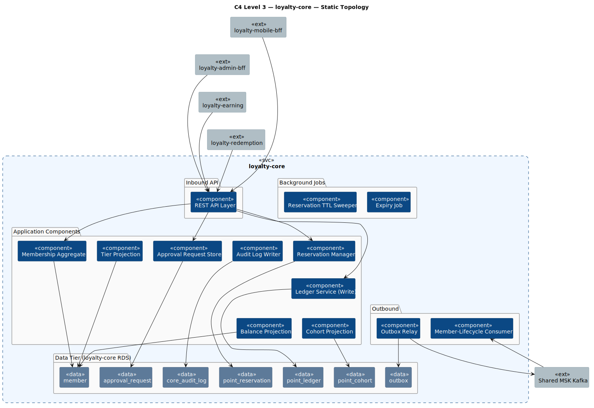
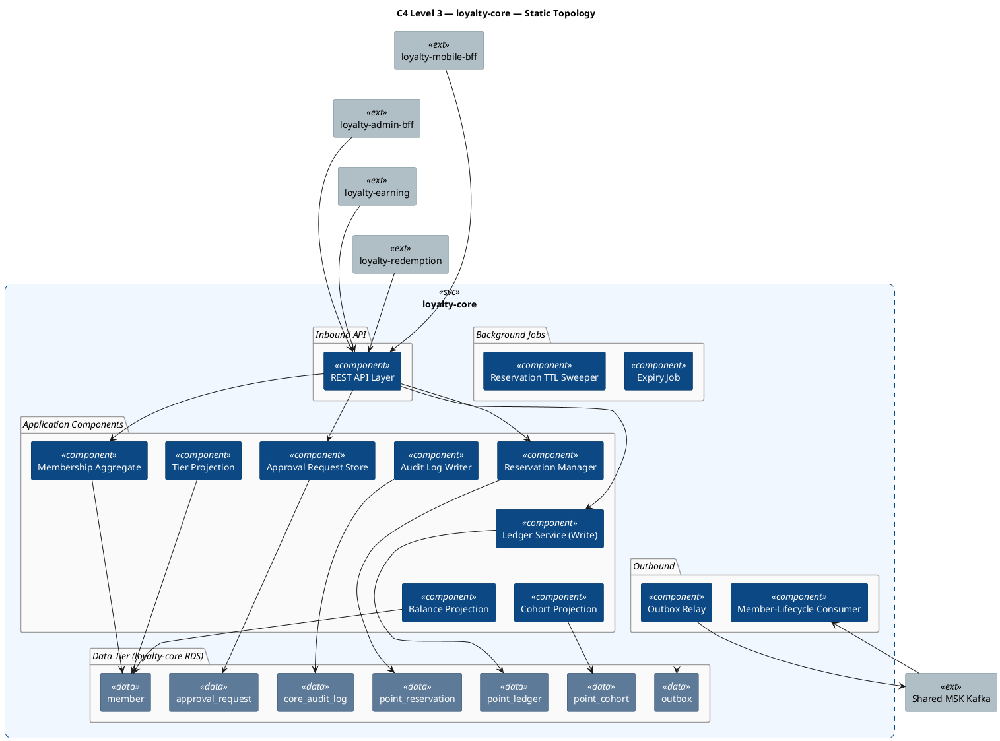
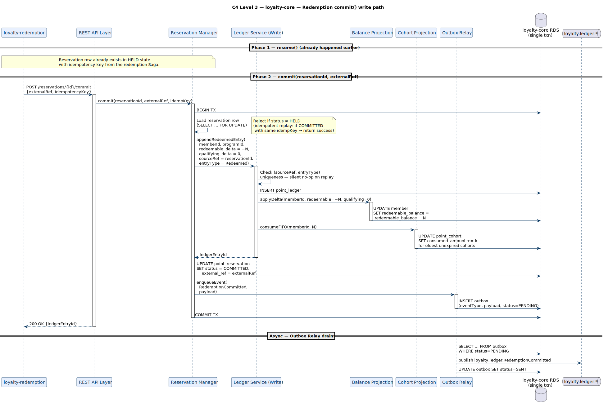
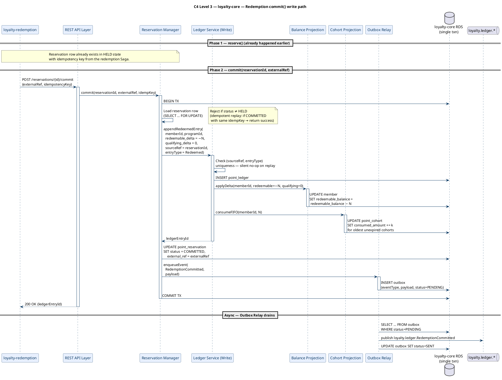
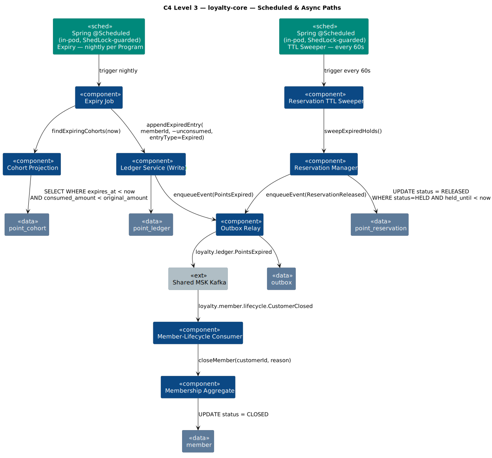
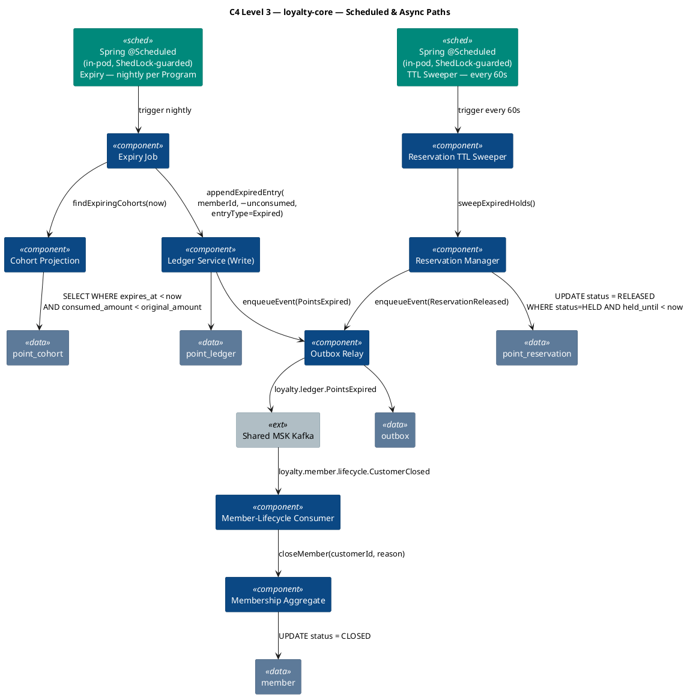

# Rochallor Loyalty Platform — C4 Level 3 — Component — `loyalty-core`

| Field | Value |
|---|---|
| Version | 0.1 — Initial Draft |
| Status | DRAFT |
| Last updated | 2026-05-26 |
| Author | Nam Vu |
| Companion doc | [`docs/Digital-Loyalty-Arch.md`](../enterprise-architect.md) §11.3 |
| Preceding view | [`level-2-containers.md`](level-2-containers.md) |
| Glossary | [`CONTEXT.md`](../../CONTEXT.md) |

---

## 1. Purpose & Scope

This document is the **C4 Level 3 — Component** view for the `loyalty-core` service. Its single job is to answer:

> **What components live inside `loyalty-core`, what does each one own, and how do they collaborate to uphold the Point-Ledger invariants?**

It zooms inside the single `loyalty-core` rectangle drawn at [L2 §3.1](level-2-containers.md#31-static-topology), decomposes the deployable into its internal building blocks, and shows the in-process collaboration that L2 deliberately omitted. `loyalty-core` is the **hot critical path** of the platform — it co-locates the **Membership** and **Ledger** bounded contexts so that Tier evaluation, Reservation atomicity, and balance projection updates can run in a single Postgres transaction.

**In scope:**

- The application-level components inside `loyalty-core` (Java 21 + Spring Boot 4 modules / packages).
- The tables in `loyalty-core RDS` that each component owns or projects.
- Internal sync collaboration on the request-response write path (e.g. `reserve()` → balance check → reservation row insert).
- Background jobs that run inside the same deployable (Expiry Job, Reservation TTL Sweeper).
- The transactional-outbox pattern used to publish `loyalty.member.*` and `loyalty.ledger.*` events.

**Out of scope (deliberately):**

- Inter-service mechanism — REST URIs, payload shapes, Kafka topic schemas. Those live in the OpenAPI / AsyncAPI catalogues per [`Digital-Loyalty-Arch.md`](../enterprise-architect.md) §11.4 and are summarised on the L2 edges.
- Other services' internals — `loyalty-earning`'s Rule Engine, `loyalty-redemption`'s Saga Orchestrator, etc. Each has its own L3 file.
- Detailed DDL — column types, indexes, partitioning strategy. See §11.4 Data Catalogue (planned).
- Deployment topology — node groups, replica counts, HPA policies. See [`Digital-Loyalty-Arch.md`](../enterprise-architect.md) §6.2.
- The `loyalty-core RDS` Multi-AZ standby and cross-region replica — drawn as one logical box; HA detail belongs to deployment view.

---

## 2. Reading the Diagrams

`loyalty-core` has dense internal coupling (Membership ↔ Ledger Shared Kernel) and two distinct execution modes: **request-driven** (called by BFFs / sibling services) and **scheduled** (Expiry / TTL Sweeper). One frame would cross too many edges, so we use **three sub-views** mirroring the L2 pattern:

| Sub-view | Scope | What it answers |
|---|---|---|
| **§3.1 Static Topology** | All components + tables + structural relationships only | *What lives inside `loyalty-core` and which table each component writes?* |
| **§3.2 Request-Driven Write Path** | The synchronous flow that a `commit()` from `loyalty-redemption` traverses end-to-end | *How do the Ledger and Reservation components collaborate to keep balances consistent?* |
| **§3.3 Scheduled & Async Paths** | Expiry Job, Reservation TTL Sweeper, Outbox Relay, Member-Lifecycle Consumer | *What runs without a caller, and how do events leave the service?* |

**Common legend (applies to all three diagrams):**

| Shape | Meaning |
|---|---|
| Filled dark-blue rectangle | **Application component** — a Spring Boot module/package inside the `loyalty-core` deployable. Not independently deployable. |
| Filled slate rectangle | **Database table** in `loyalty-core RDS` (Postgres). Owned by exactly one writer component (P5). |
| Filled mid-grey rectangle | **External actor** (sibling Loyalty service or shared infra) — drawn for boundary clarity; detail is at L2. |
| Dashed rectangle (`loyalty-core`) | The service boundary. |

**Conventions:**

- A solid arrow `A → B` means *A calls B in-process* (Spring bean call) or *A writes B* (component → table).
- A dashed arrow `A ⇢ B` means *A publishes to B via the Outbox Relay* (asynchronous, eventually-consistent).
- Components inside the dashed `loyalty-core` boundary share a **single JVM, single connection pool, and single transactional context**. Cross-component calls do not cross a network — they are method calls.
- Every Ledger write happens **inside the same DB transaction** as the projection update it implies (single-writer invariant, [§7.4 of Arch doc](../enterprise-architect.md#74-fraud--audit)).

---

## 3. The Diagrams

### 3.1 Static Topology

Inventory only — what components exist, which tables each one owns, and which sibling services they expose APIs to. No verbs on the edges yet (those are in §3.2 / §3.3).

  

### 3.2 Request-Driven Write Path

The hottest path in the platform: `loyalty-redemption` calling `loyalty-core` to **reserve** then **commit** a redemption. Every numbered step runs inside a single Postgres transaction unless explicitly noted. This view is layered top-down: caller → API → orchestrating component → ledger write → projection updates → outbox.

  

**Why this matters:** the entire write — Ledger insert, Balance update, Cohort consumption, Reservation transition, and Outbox enqueue — is **one Postgres transaction**. If any step fails, all roll back, which is why Membership and Ledger had to be co-deployed. The Outbox Relay then publishes to MSK in a separate, retryable transaction — this is the standard transactional-outbox pattern that gives us "at-least-once delivery with same-transaction durability."

### 3.3 Scheduled & Async Paths

`loyalty-core` runs two background jobs (Expiry, TTL Sweeper) and consumes one inbound topic (Member-Lifecycle). All three reuse the same Ledger Service / Reservation Manager / Outbox Relay path as request-driven writes — the only difference is who fires the trigger.

  

**Notes on scheduled execution:**

- Both jobs run as **in-process Spring `@Scheduled` methods inside `loyalty-core` Pods**, not as k8s CronJobs: one less deployable lifecycle, one less retry semantic, and the job code lives next to the domain it operates on (Cohort/Ledger/Reservation).
- Because `loyalty-core` runs **multi-Pod**, every `@Scheduled` method is wrapped in **[ShedLock](https://github.com/lukas-krecan/ShedLock)** with the **`JdbcTemplateLockProvider`** against `loyalty-core RDS`. At each tick exactly one Pod acquires the lock and runs; the rest skip silently. The lock row carries `lock_until` so a crashed Pod releases the lock by timeout without operator intervention.
- For the Expiry Job, an additional **Postgres advisory lock keyed by `programId`** (`pg_try_advisory_xact_lock(:programId)`) is taken **inside the per-Program transaction**. This is belt-and-braces with ShedLock: ShedLock guarantees one Pod per tick; the advisory lock guarantees no two transactions on the same Program even if a future refactor parallelises programs across Pods.
- **Graceful shutdown.** Spring Boot's `SIGTERM → terminationGracePeriodSeconds` is configured to exceed the longest job's expected duration plus a safety margin (v1: 5 min). The job listens to `ContextClosedEvent` and finishes the in-flight per-Program transaction before the Pod exits, so k8s never SIGKILLs a half-committed Expiry run.
- The TTL Sweeper batches releases (default `LIMIT 500`) to keep transaction sizes bounded; it runs again 60s later if more work remains.
- Job success / failure surfaces to the standard observability stack (per [§7.2 Observability](../enterprise-architect.md#72-observability)) as: (a) **OTel metrics** — `scheduled_job.duration_seconds`, `scheduled_job.failures_total{job}`; (b) **Structured log line** with `job_name`, `lock_acquired`, `started_at`, `finished_at`, `outcome`. PagerDuty alerts fire off `failures_total > 0` over a 5-minute window. No k8s `Job` resource to watch, but the SLO contract is identical.

---

## 4. Component Inventory

The 13 components inside `loyalty-core`. Each is a Spring Boot `@Component` / `@Service` (or a Spring `@Configuration`-managed bean group), single-purpose, and tested independently. The "Writes" column names the **single** table each component is allowed to mutate — Loyalty's single-writer invariant (P5).

| # | Component | Bounded context | Writes (single-writer) | Reads | Triggered by |
|---|---|---|---|---|---|
| 1 | **REST API Layer** | (Cross-cutting) | — | — (delegates) | HTTPS / mTLS from BFFs and sibling services |
| 2 | **Membership Aggregate** | Membership | `member` (lifecycle columns) | `member` | API: opt-in, opt-out, close. Member-Lifecycle Consumer. |
| 3 | **Tier Projection** | Membership | `member` (tier columns only) | `point_ledger` (qualifying balance window), Program config | Same transaction as any `qualifying_delta ≠ 0` Ledger insert |
| 4 | **Ledger Service (Write)** | Ledger | `point_ledger` | `point_ledger` (idempotency check) | API: `earn()`, `commit()`, `release()`, `adjust()`; Expiry Job |
| 5 | **Balance Projection** | Ledger | `member` (`redeemable_balance`, `qualifying_balance`) | — | Ledger Service (every successful insert, same txn) |
| 6 | **Reservation Manager** | Ledger | `point_reservation` | `point_reservation`, `member.redeemable_balance` | API: `reserve()`, `commit()`, `release()`; TTL Sweeper |
| 7 | **Cohort Projection** | Ledger | `point_cohort` | `point_cohort` (FIFO scan) | Ledger Service on `Earned` and `Redeemed`/`Expired` entries; Expiry Job |
| 8 | **Approval Request Store** | Membership / Ledger | `approval_request` | `approval_request` | API from `loyalty-admin-bff`: `create approval-request` + `confirm` (4-eyes delegated to BEP) |
| 9 | **Audit Log Writer** | (Cross-cutting) | `core_audit_log` | — | Every admin write via API (interceptor) |
| 10 | **Expiry Job** | Ledger | — (calls Ledger Service) | `point_cohort`, Program config | Spring `@Scheduled` in-pod, ShedLock-guarded, per-Program nightly |
| 11 | **Reservation TTL Sweeper** | Ledger | — (calls Reservation Manager) | `point_reservation` | Spring `@Scheduled` in-pod, ShedLock-guarded, every 60s |
| 12 | **Outbox Relay** | (Cross-cutting) | `outbox` (status transitions) | `outbox` | Internal scheduler (1s tick); publishes to MSK |
| 13 | **Member-Lifecycle Consumer** | Membership | — (calls Membership Aggregate) | — | MSK topic `loyalty.member.lifecycle.*` (from `loyalty-integration-bridge`) |

**Notes on the inventory:**

- The **8→7 collapse** shows here as the dotted line between **Membership Aggregate** (Membership context) and **Ledger Service / Balance Projection / Reservation Manager** (Ledger context) — they are *different* contexts but share a JVM and a DB transaction, which is the entire point of co-deploying them. Tier Projection is the bridge bean: it reads Ledger sums and writes Membership columns.
- There is deliberately **no** `Tier Service` — Tier is a *projection*, not an aggregate. It has no independent state machine; it is recomputed any time Qualifying Balance moves. (Glossary entry "Tier" in [`CONTEXT.md`](../../CONTEXT.md).)
- **Why an Outbox Relay and not direct MSK publish?** The transactional-outbox pattern is the cheapest way to give "ledger insert and event publish must succeed together" without a distributed transaction across Postgres and Kafka. It's the operational complement to the single-writer invariant.
- **The Approval Request Store lives here, not in `loyalty-admin-bff`** — the BFF is the UX seam; the request lifecycle (`PENDING → APPLIED | REJECTED`) is a Ledger concern because the only legal outcome of a confirmed request is an `Adjusted` Ledger entry, linked back via `point_ledger.approval_request_id`. The **4-eyes itself is delegated to BEP's Approval Workflow** — Loyalty stores only `bep_approval_ref` and hardens the confirm seam.

---

## 5. Loyalty-Owned Tables in `loyalty-core RDS`

These are the tables `loyalty-core` exclusively owns. No other service has direct JDBC access.

| Table | Purpose | Notes |
|---|---|---|
| **`member`** | Master Member record per `(programId, customerId)`. Carries `redeemable_balance`, `qualifying_balance`, `current_tier`, lifecycle status. | PII-free (CustomerId only, per [`CONTEXT.md`](../../CONTEXT.md) "PII Boundary"). Single-writer columns split between Membership Aggregate (lifecycle), Balance Projection (balances), Tier Projection (tier). |
| **`point_ledger`** | Append-only immutable record of every Point movement. | **Source of truth**. `(sourceRef, entryType)` is unique. No UPDATE or DELETE ever. |
| **`point_reservation`** | Transient `HELD` / `COMMITTED` / `RELEASED` rows for the two-phase redemption flow. | Separate from Ledger (not append-only). `held_until` drives the TTL Sweeper. |
| **`point_cohort`** | Per-`Earned`-entry consumption tracker for FIFO expiry. | Rebuildable projection. Loss does not destroy the Ledger. |
| **`approval_request`** | Generic approval-request rows for adjustments and config activation. | `status PENDING\|APPLIED\|REJECTED`; stores `bep_approval_ref` (the BEP Approval Workflow decision) — **no** maker/checker identity columns. The applied `point_ledger` entry links back via `approval_request_id`. 4-eyes delegated to BEP. |
| **`core_audit_log`** | Per-service audit trail for every BEP-originated write. | `{actor_keycloak_id, action, entity_type, entity_id, before_json, after_json, occurred_at, prev_hash, row_hash}`. ≥ 7-year retention. **Tamper-evident**: hash-chained + DB-immutable in Postgres, nightly-sealed to S3 Object Lock WORM (`loyalty-audit-archive-*`). |
| **`outbox`** | Transactional-outbox staging for `loyalty.member.*` and `loyalty.ledger.*` events. | Inserted in the same txn as the business write; drained by Outbox Relay; rows TTL-purged after `SENT + 7d`. |
| **`shedlock`** | ShedLock distributed-lock table: one row per `@Scheduled` method name with `lock_until`, `locked_at`, `locked_by` columns. | Owned by the ShedLock library; not domain data. Required because `loyalty-core` runs multi-Pod and must serialise scheduled-job execution. |

---

## 6. External Edges Re-exposed from L2

These are the edges `loyalty-core` exposes at the L2 boundary. They are reproduced here only to anchor §3 — full mechanism (REST URI / topic name) is in OpenAPI / AsyncAPI catalogues.

| Direction | Counterparty | Mechanism | Triggers which component |
|---|---|---|---|
| Sync inbound | `loyalty-mobile-bff` | REST/JSON via mTLS | REST API Layer → Membership Aggregate / Tier Projection (read) |
| Sync inbound | `loyalty-admin-bff` | REST/JSON via mTLS | REST API Layer → Approval Request Store, Membership Aggregate, Audit Log Writer |
| Sync inbound | `loyalty-earning` | REST/JSON via mTLS | REST API Layer → Ledger Service (`earn()` writes) |
| Sync inbound | `loyalty-redemption` | REST/JSON via mTLS | REST API Layer → Reservation Manager (`reserve`/`commit`/`release`) |
| Async outbound | Shared MSK Kafka — `loyalty.member.*`, `loyalty.ledger.*` | Kafka producer (Outbox Relay) | Outbox Relay |
| Async inbound | Shared MSK Kafka — `loyalty.member.lifecycle.*` (from `loyalty-integration-bridge`) | Kafka consumer | Member-Lifecycle Consumer → Membership Aggregate |
| JDBC | `loyalty-core RDS` | JDBC (HikariCP) | All components owning a table |

---

## 7. Invariants & Cross-References

The reasons `loyalty-core` exists as one deployable and not several:

- **Same-transaction guarantee for Membership + Ledger.** Tier evaluation, balance projection updates, and Ledger inserts must commit-or-roll-back together. Splitting them into separate services would force a 2PC or a saga over what is conceptually one decision.
- **Single-writer-per-table** — Principle P5 ([Arch §3](../enterprise-architect.md#3-architectural-principles)). The Component Inventory table's "Writes" column is the enforcement contract.
- **Append-only Ledger.** The Ledger Service is the **only** component that may `INSERT` into `point_ledger`, and that component never `UPDATE`s or `DELETE`s rows. Corrections are new compensating entries.
- **Idempotency on every Ledger write** — `(sourceRef, entryType)` uniqueness. Replays of an `EarnEvent`, a `commit()`, or an `Expired` cohort are silent no-ops.
- **Two-phase redemption with separate Reservation table.** Reservation state changes are mutable; Ledger state is not. Mixing them would break the immutability invariant.
- **FIFO consumption from earn date.** Cohort Projection enforces FIFO and is the only legal way to mark Earned points as consumed.
- **Approval-gated adjustments, 4-eyes delegated to BEP.** The Approval Request Store holds the request lifecycle; only a `confirm` carrying a valid `bep_approval_ref` may produce an `Adjusted` Ledger entry. The 4-eyes control runs in BEP's Approval Workflow, not in Loyalty — the trust boundary is the confirm seam (DD-9).
- **Transactional outbox for outbound events** — keeps "ledger insert" and "event publish" in the same Postgres transaction without a distributed transaction across Postgres and Kafka.

Next L3 view: [`level-3-loyalty-earning.md`](level-3-loyalty-earning.md) — Rule Engine, DSL Interpreter, Cap Counter, Earn Source Registry.

---

*End of document.*
