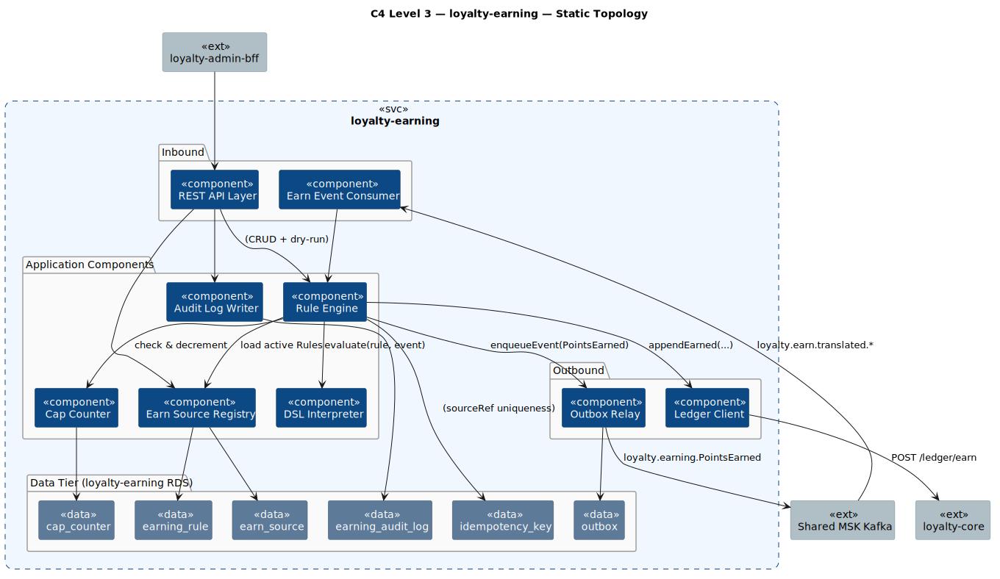
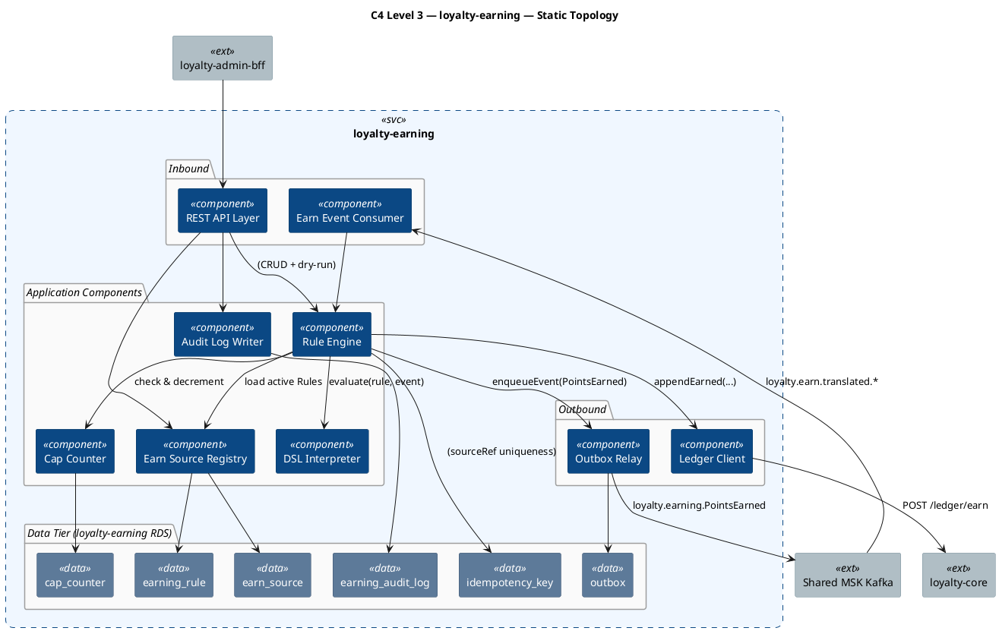
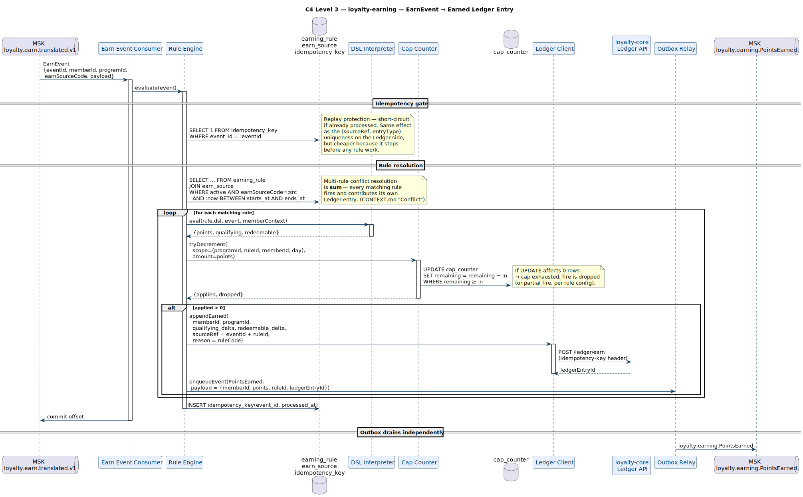
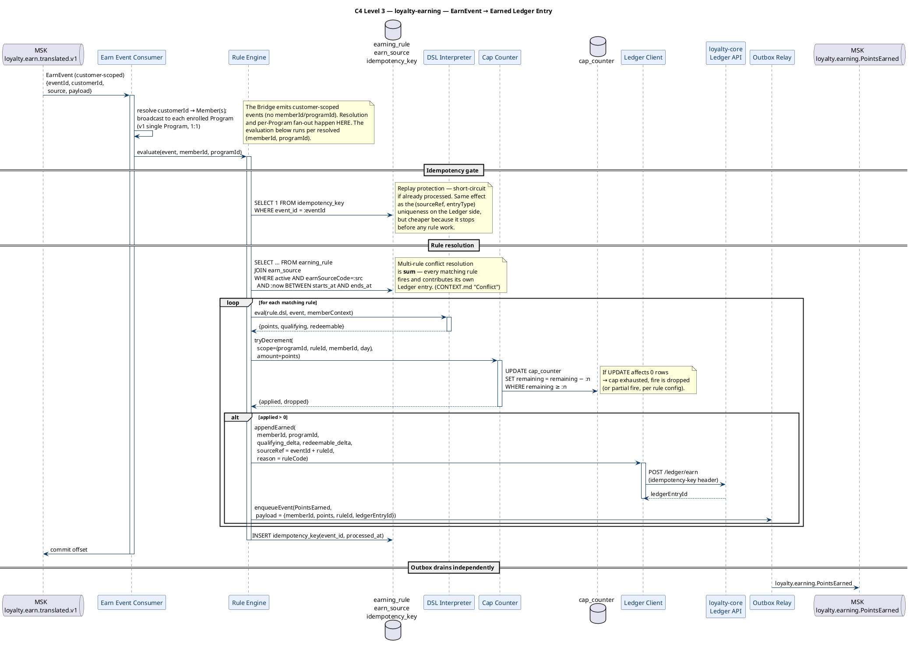
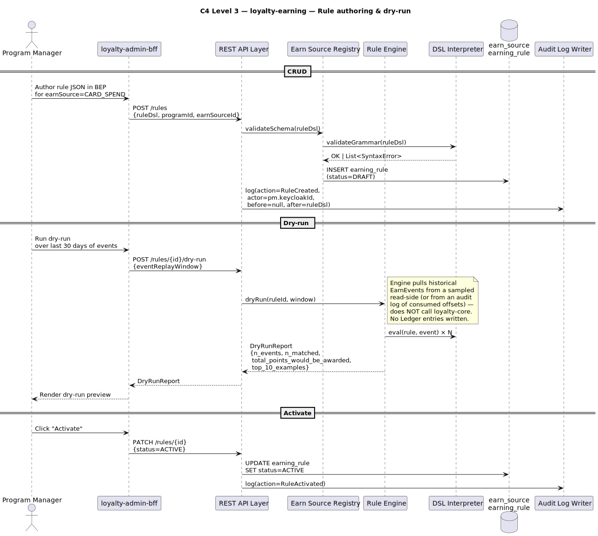
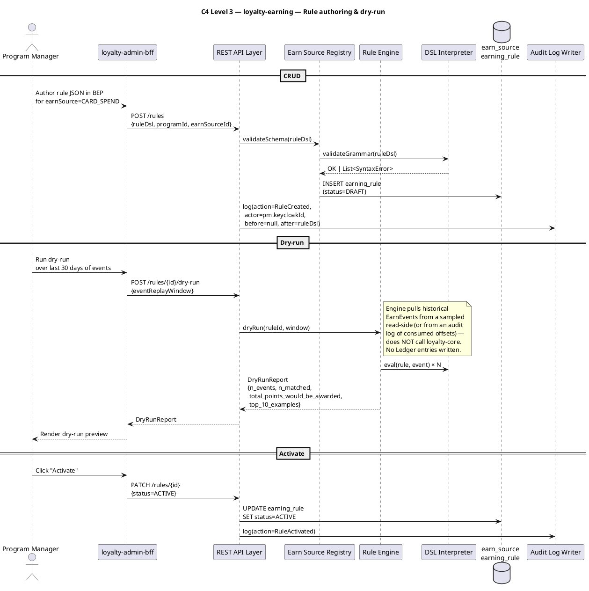

# Rochallor Loyalty Platform — C4 Level 3 — Component — `loyalty-earning`

| Field | Value |
|---|---|
| Version | 0.1 — Initial Draft |
| Status | DRAFT |
| Last updated | 2026-05-26 |
| Author | Nam Vu |
| Companion doc | [`docs/Digital-Loyalty-Arch.md`](../enterprise-architect.md) §11.3 |
| Preceding view | [`level-2-containers.md`](level-2-containers.md) |
| Sibling views | [`level-3-loyalty-core.md`](level-3-loyalty-core.md) |
| Glossary | [`CONTEXT.md`](../../CONTEXT.md) |

---

## 1. Purpose & Scope

This document is the **C4 Level 3 — Component** view for the `loyalty-earning` service. Its single job is to answer:

> **What components live inside `loyalty-earning`, how do they evaluate Earning Rules against translated Earn Events, and how do they decide how many Points to award?**

It zooms inside the single `loyalty-earning` rectangle drawn at [L2 §3.1](level-2-containers.md#31-static-topology). `loyalty-earning` is **event-driven, stateless on the hot path**, and exists as its own deployable because its scaling profile is fundamentally different from the rest of the platform — it scales with **upstream event throughput** (card spends, account-state changes), not with mobile-app traffic.

**In scope:**

- The application-level components inside `loyalty-earning` (Java 21 + Spring Boot 4 modules / packages).
- The tables in `loyalty-earning RDS` that each component owns or projects.
- The Rule Engine pipeline: translated `EarnEvent` → matching Rules → DSL evaluation → Cap check → Ledger write request.
- The transactional-outbox pattern used to publish `loyalty.earning.PointsEarned`.

**Out of scope (deliberately):**

- The JSON DSL grammar / authoring UX. See the planned BEP wireframes ([§11.4](../enterprise-architect.md#114-supporting-artifacts-to-build)).
- Schema translation from producer schemas (Payment Hub, Core Banking Adapter) into the canonical `EarnEvent`. That lives in [`loyalty-integration-bridge`](level-3-loyalty-integration-bridge.md).
- Ledger write internals — `loyalty-earning` calls `loyalty-core`'s Ledger API; everything past that boundary is L3 of `loyalty-core`.
- Detailed DDL — column types, indexes, partitioning strategy.

---

## 2. Reading the Diagrams

`loyalty-earning` has two execution modes: **request-driven** (BEP CRUD via `loyalty-admin-bff`) and **event-driven** (consuming translated EarnEvents from MSK). The event path is the hot one. We use **three sub-views**:

| Sub-view | Scope | What it answers |
|---|---|---|
| **§3.1 Static Topology** | All components + tables + structural relationships only | *What lives inside `loyalty-earning` and which table each component writes?* |
| **§3.2 Event-Driven Earn Path** | The async flow from `loyalty.earn.translated.v1` → Rule match → Ledger write request | *How is an EarnEvent turned into a `Earned` Ledger entry?* |
| **§3.3 Authoring & Dry-Run Paths** | Rule CRUD from `loyalty-admin-bff`, plus the dry-run evaluator | *How do BEP operators author and test Rules before activating them?* |

**Common legend** is identical to [`level-3-loyalty-core.md` §2](level-3-loyalty-core.md#2-reading-the-diagrams). The most important convention here is:

- **`loyalty-earning` is the only component allowed to read active Earning Rules.** Other services may not interpret the DSL — they ask `loyalty-earning`. This is the Anti-Corruption Layer for the rule grammar.

---

## 3. The Diagrams

### 3.1 Static Topology

  

### 3.2 Event-Driven Earn Path

The hot path. Triggered every time the Bridge publishes a translated `EarnEvent`. Every step is deterministic, idempotent, and bounded in time — the only blocking I/O is the JDBC round-trip to `loyalty-earning RDS` and the REST hop to `loyalty-core`. No external API calls in the loop.

  

**Why these design choices:**

- **Idempotency check first**, before any rule work, because Kafka delivers at-least-once. Replays must be silent and cheap.
- **Cap Counter uses a single conditional UPDATE** (`SET … WHERE remaining ≥ :n`) so the cap decision *is* atomic with no SELECT-then-UPDATE race. The "0 rows affected" return value tells us the cap was exhausted.
- **Multi-rule sum** ([`CONTEXT.md`](../../CONTEXT.md) "Conflict") — each rule writes its own Ledger entry with `sourceRef = eventId + ruleId`. This makes every fire individually auditable and individually reversible (e.g. on `PaymentReversed`, the Bridge can target the exact set of entries that came from the original eventId).
- **Ledger Client is a thin REST wrapper**, not a domain component. Its sole responsibility is calling `loyalty-core`'s `POST /ledger/earn` with the right idempotency-key header — the entire Ledger semantics belong to `loyalty-core`.

### 3.3 Authoring & Dry-Run Paths

BEP operators (Program Managers) author Earning Rules in the JSON DSL via `loyalty-admin-bff`. Before publishing a Rule, they can run a **dry-run evaluator** that replays historical EarnEvents against the candidate Rule without writing Ledger entries.

  

**Notes on authoring:**

- **DRAFT → ACTIVE transition is auditable** — every status change writes an `earning_audit_log` entry with the operator's `keycloak_id`, the before/after JSON, and timestamp. ≥ 7-year retention per [§7.4](../enterprise-architect.md#74-fraud--audit).
- **Dry-run is read-only and side-effect-free** — it reuses the same DSL Interpreter as the hot path, so what the operator sees in the preview is exactly what will happen on the next live fire. No cap counters are decremented; no Ledger entries are written.
- **Dry-run event source is the EarnEvent replay log**, not raw producer events. This means dry-run respects whatever translation rules the Bridge applied (e.g. PAN-stripped, currency-normalised) — same input the live engine would see.

---

## 4. Component Inventory

| # | Component | Bounded context | Writes | Reads | Triggered by |
|---|---|---|---|---|---|
| 1 | **REST API Layer** | (Cross-cutting) | — | — | HTTPS / mTLS from `loyalty-admin-bff` |
| 2 | **Earn Event Consumer** | Earning | — | — | MSK topic `loyalty.earn.translated.v1` |
| 3 | **Earn Source Registry** | Earning | `earn_source`, `earning_rule` | `earn_source`, `earning_rule` | API: Earn Source / Rule CRUD; Engine: cache load |
| 4 | **Rule Engine** | Earning | `idempotency_key` | `earning_rule`, `earn_source` | Earn Event Consumer (hot); API (dry-run) |
| 5 | **DSL Interpreter** | Earning | — (pure function) | — | Rule Engine (live + dry-run); Earn Source Registry (validate) |
| 6 | **Cap Counter** | Earning | `cap_counter` | `cap_counter` | Rule Engine (every potential fire) |
| 7 | **Audit Log Writer** | (Cross-cutting) | `earning_audit_log` | — | Every admin write via API (interceptor) |
| 8 | **Ledger Client** | (Anti-corruption) | — | — | Rule Engine (per matching rule fire) |
| 9 | **Outbox Relay** | (Cross-cutting) | `outbox` (status transitions) | `outbox` | Internal scheduler (1s tick); publishes to MSK |

**Notes:**

- **Only Rule Engine writes `idempotency_key`** — it is the gate for the entire pipeline. Other components do not need to know about idempotency; they trust the Engine to short-circuit replays.
- **DSL Interpreter is a pure function** — it takes `(rule, event, memberContext)` and returns `{points, qualifying, redeemable}`. No I/O, no side effects. This is what makes dry-run cheap and what lets us unit-test the rule semantics in isolation.
- **No `Rule Aggregate` per se** — Rules are configuration data, not domain entities with their own lifecycle behaviour. They live in `earning_rule` with a simple `status` column and a `dsl_json` blob. The Engine and Interpreter together provide the behaviour.

---

## 5. Loyalty-Owned Tables in `loyalty-earning RDS`

| Table | Purpose | Notes |
|---|---|---|
| **`earn_source`** | Catalogue of accepted Earn Source codes (e.g. `CARD_SPEND`, `BALANCE_THRESHOLD`). | Tied to upstream producer topics; new Earn Source = new translation in the Bridge. |
| **`earning_rule`** | Per-Program Rules in the JSON DSL. Columns: `dsl_json`, `status`, `earn_source_id`, `program_id`, validity window. | DRAFT → ACTIVE → ARCHIVED. Never deleted (audit). |
| **`cap_counter`** | Per-`(programId, ruleId, memberId, window)` counters for daily / per-Member / per-Source caps. | Window-keyed; nightly job purges expired counters. |
| **`idempotency_key`** | One row per processed `eventId`. | Cheap short-circuit before any rule work. TTL-purged after 90 days (Kafka retention + grace). |
| **`earning_audit_log`** | Per-service audit trail for every BEP-originated Rule write. | `{actor_keycloak_id, action, entity_type, entity_id, before_json, after_json, occurred_at, prev_hash, row_hash}`. ≥ 7-year retention. **Tamper-evident**: hash-chained + DB-immutable, nightly-sealed to S3 Object Lock WORM. |
| **`outbox`** | Transactional-outbox staging for `loyalty.earning.PointsEarned`. | Drained by Outbox Relay; rows TTL-purged after `SENT + 7d`. |

---

## 6. External Edges Re-exposed from L2

| Direction | Counterparty | Mechanism | Triggers which component |
|---|---|---|---|
| Sync inbound | `loyalty-admin-bff` | REST/JSON via mTLS | REST API Layer → Earn Source Registry, Rule Engine (dry-run) |
| Sync outbound | `loyalty-core` | REST/JSON via mTLS | Ledger Client (per matching rule fire) |
| Async inbound | Shared MSK Kafka — `loyalty.earn.translated.v1` (from `loyalty-integration-bridge`) | Kafka consumer | Earn Event Consumer → Rule Engine |
| Async outbound | Shared MSK Kafka — `loyalty.earning.PointsEarned` | Kafka producer (Outbox Relay) | Outbox Relay |
| JDBC | `loyalty-earning RDS` | JDBC (HikariCP) | All components owning a table |

---

## 7. Invariants & Cross-References

- **DSL is constrained, not Turing-complete** — the DSL Interpreter has a small, audited surface; the alternative (full rules engine) was rejected because the trade-off between flexibility and safety/perf is wrong for a financial event path.
- **Conflict resolution = sum** — [`CONTEXT.md`](../../CONTEXT.md) "Conflict". Each matching Rule fires independently and writes its own Ledger entry with a distinct `sourceRef`. This is why a single EarnEvent can produce multiple Ledger entries.
- **Idempotency before work** — Rule Engine short-circuits replays via `idempotency_key` before touching the Rule cache or DSL. The Ledger's own `(sourceRef, entryType)` uniqueness is the second line of defence.
- **No direct Ledger writes** — `loyalty-earning` is a *client* of `loyalty-core`'s Ledger API. It never touches `point_ledger` directly. ([P5](../enterprise-architect.md#3-architectural-principles).)
- **Caps are enforced as conditional UPDATEs**, not as SELECT-then-UPDATE. This eliminates a class of race conditions under high concurrency.

Next L3 view: [`level-3-loyalty-redemption.md`](level-3-loyalty-redemption.md) — Reward Catalogue, Eligibility Engine, Redemption Orchestrator (saga), Fulfillment Adapter framework.

---

*End of document.*
