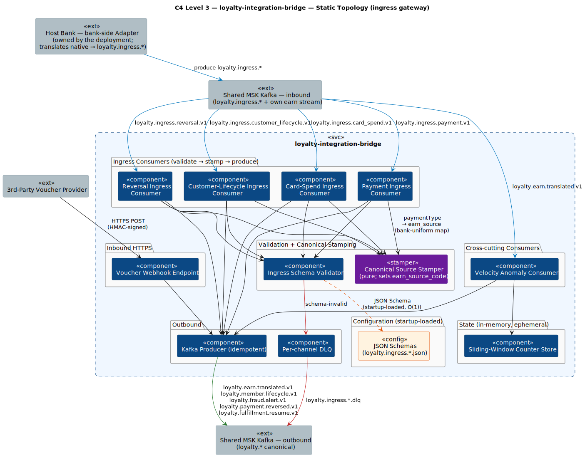
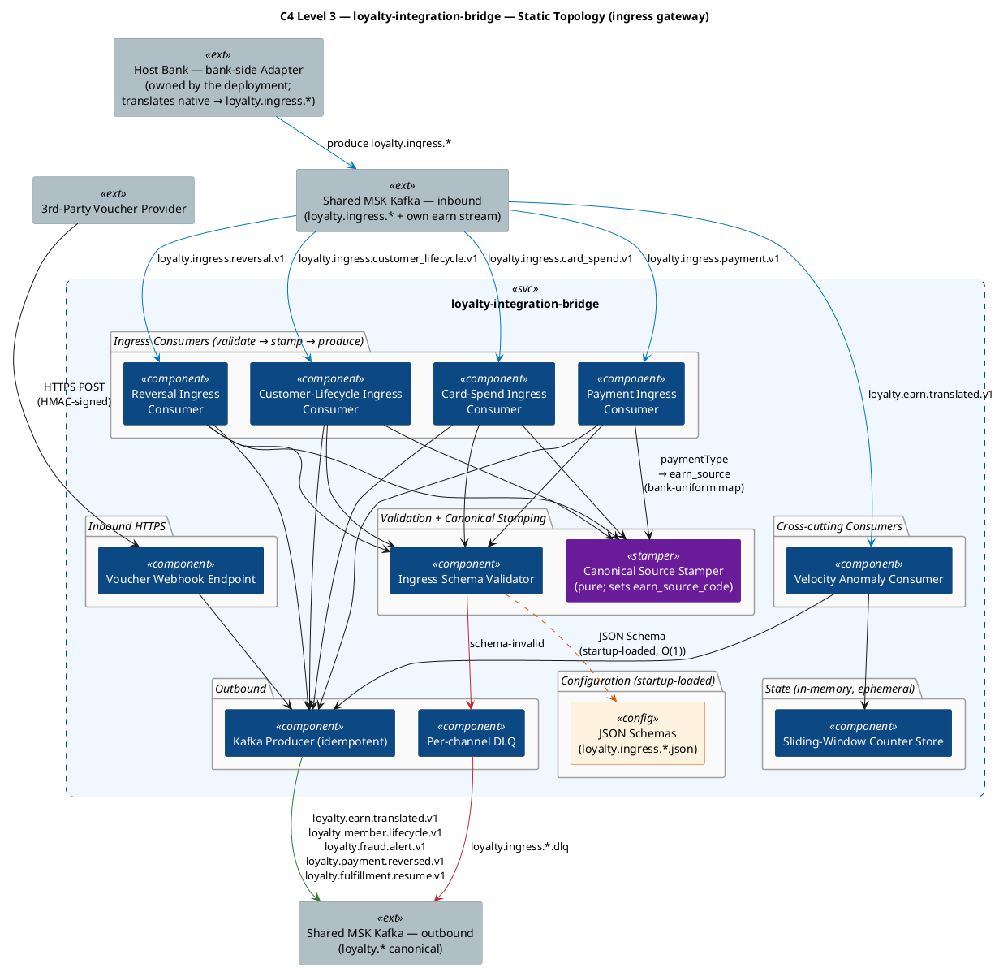
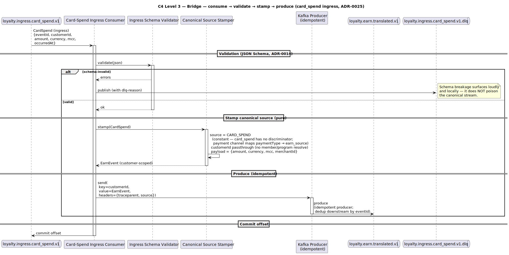
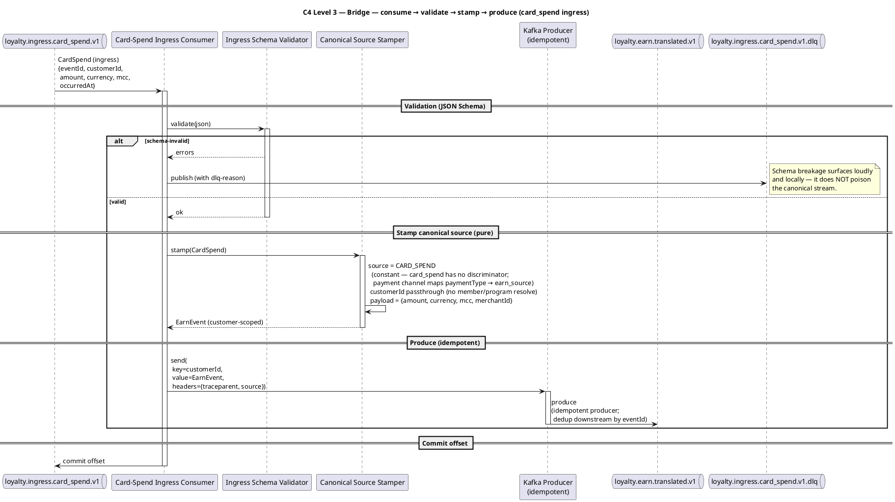

# Rochallor Loyalty Platform — C4 Level 3 — Component — `loyalty-integration-bridge`

| Field | Value |
|---|---|
| Version | 0.2 |
| Status | DRAFT — fully reframed as an ingress gateway: all prose (§1–§7) + both diagrams redrawn. |
| Last updated | 2026-05-29 |
| Author | Nam Vu |
| Companion doc | [`docs/Digital-Loyalty-Arch.md`](../enterprise-architect.md) §11.3 |
| Preceding view | [`level-2-containers.md`](level-2-containers.md) |
| Sibling views | [`level-3-loyalty-core.md`](level-3-loyalty-core.md), [`level-3-loyalty-earning.md`](level-3-loyalty-earning.md), [`level-3-loyalty-redemption.md`](level-3-loyalty-redemption.md) |
| Glossary | [`CONTEXT.md`](../../CONTEXT.md) |

---

> **⚠️ THE INTEGRATION DIRECTION WAS INVERTED.** Loyalty no longer consumes bank-native events and translates them. Instead Loyalty **authors an inbound contract** (`loyalty.ingress.*`, see [`loyalty-ingress.yaml`](../asyncapi/loyalty-ingress.yaml)) and each Host Bank builds a **bank-side adapter** that conforms to it. This Bridge is now an **ingress-validation gateway** — *validate `loyalty.ingress.*` → stamp canonical `source` → produce* — **not** a per-producer Anti-Corruption translator. The whole document (prose + both diagrams) reflects this model; the superseded `EnumTranslator` / `*.mapping.yaml` / `paymenthub.*`-inbound framing has been removed.

## 1. Purpose & Scope

This document is the **C4 Level 3 — Component** view for the `loyalty-integration-bridge` service. Its single job is to answer:

> **How does the Bridge validate the Loyalty-authored inbound contract, stamp the canonical `source`, and run the cross-cutting consumers (velocity anomaly, voucher webhook) that don't belong to any one bounded context?**

It zooms inside the single `loyalty-integration-bridge` rectangle drawn at [L2 §3.1](level-2-containers.md#31-static-topology). The Bridge is the **ingress-validation gateway** for every inbound integration: each Host Bank's own adapter produces the Loyalty-authored `loyalty.ingress.*` contract, and the Bridge validates it, stamps the canonical `source`, and re-emits canonical `loyalty.*` events. Producer-vs-canonical vocabulary translation lives in the **bank-side adapter**, not here; the only mapping the Bridge holds is the Loyalty-owned, bank-uniform `paymentType → earn_source`. It is deliberately **stateless except for Kafka consumer offsets** — no RDS — because everything it does is a function of `(ingress event + startup-loaded config → canonical event)`, and the only state worth keeping is "have we consumed this offset?" which Kafka itself owns.

**In scope:**

- The per-`loyalty.ingress.*`-channel consumers and their validate → stamp → produce logic.
- The **JSON Schemas** loaded at startup (`src/main/resources/schema/loyalty.ingress.*.json`) the ingress is validated against, plus the bank-uniform `paymentType → earn_source` map — see [`loyalty-ingress.yaml`](../asyncapi/loyalty-ingress.yaml) for the contract.
- The Velocity Anomaly Consumer that watches the translated EarnEvent stream.
- The Reversal Ingress consumer (→ `loyalty.payment.reversed.v1`; the clawback itself is core-driven).
- The HTTPS webhook endpoint that 3rd-Party Voucher partners post to, and its translation to `loyalty.fulfillment.resume.v1`.

**Out of scope (deliberately):**

- The **bank-side adapter** and the bank's native schemas (Payment Hub, Core Banking, Customer Service) — those live in the deployment's adapter repo; the Bridge owns the contract, not bank-native translation.
- How `loyalty-earning` evaluates the translated events — see [`level-3-loyalty-earning.md`](level-3-loyalty-earning.md).
- Fraud-Ops UX — that is `loyalty-admin-bff` reading `loyalty.fraud.alert.*` from MSK.

---

## 2. Reading the Diagrams

The Bridge has two execution modes: **Kafka consume-validate-stamp-produce** (the vast majority of work) and **HTTPS webhook ingress** (3rd-party voucher). Both feed back into MSK on `loyalty.*` topics. We use **two sub-views** — the Bridge is simple enough not to need a third:

| Sub-view | Scope | What it answers |
|---|---|---|
| **§3.1 Static Topology** | All ingress consumers + the validate/stamp path + the velocity anomaly path + the webhook endpoint | *What lives inside the Bridge and which `loyalty.ingress.*` channel feeds what?* |
| **§3.2 The Consume → Validate → Stamp → Produce Loop** | Generic shape of one ingress consumer | *How does a `loyalty.ingress.card_spend.v1` event become a `loyalty.earn.translated.v1` event?* |

**Common legend** is identical to [`level-3-loyalty-core.md` §2](level-3-loyalty-core.md#2-reading-the-diagrams). One new convention:

- A **violet box** marks the **Canonical Source Stamper** — a pure function `(ingressEvent) → canonicalEvent` that sets the canonical `earn_source_code` (constant per channel, or via a bank-uniform `paymentType → earn_source` map). No I/O; independently unit-testable.

---

## 3. The Diagrams

### 3.1 Static Topology

  

**Notes on what does and does not have state:**

- **Ingress consumers** are stateless — no in-memory data across events. The flow is `validate(ingressEvent) → stamp source → produce`, pure; the only domain-aware step is the Canonical Source Stamper.
- **Inbound is the Loyalty-authored contract.** Each `loyalty.ingress.*` channel is produced by the Host Bank's own adapter. The Bridge never sees a bank-native schema; it validates against the bundled `loyalty.ingress.*.json` JSON Schemas.
- **Velocity Anomaly Consumer** holds **in-memory sliding-window counters** per `customerId`, sized to ~30 days. On Pod restart the window is rebuilt by replaying the last 30 days of `loyalty.earn.translated.v1` (cold-read once, then tail) — cheap because the topic has long retention.
- **No RDS** — all "state" is either consumer offsets (Kafka-owned) or rebuildable from topic retention. This is why the Bridge can be horizontally scaled freely.
- **Reversal Ingress Consumer** validates a reversal ingress event and emits `loyalty.payment.reversed.v1` carrying the original `sourceRef`. It does **no** stream-join and reads no Ledger topic — `loyalty-core` performs the compensation by reversing its own entries keyed on `source_ref`.

### 3.2 The Consume → Validate → Stamp → Produce Loop

The standard shape of every ingress consumer. The Canonical Source Stamper is the only domain-aware component; everything around it is plumbing. Read the diagram for one consumer (card spend); the same shape applies to every other.

  

**Why these design choices:**

- **Stamper is pure** — `(ingressEvent) → canonicalEvent` with no I/O. For `card_spend` the source is the constant `CARD_SPEND`; for the `payment` channel it is an O(1) lookup in a startup-loaded, **bank-uniform** `paymentType → earn_source` map (Loyalty-owned, not per-bank). Independently unit-testable; a regression is a code-or-config-only fix; preserves the no-RDS / horizontally-scalable Bridge property.
- **Validate first, DLQ on failure** — the Bridge validates the Loyalty-authored ingress contract. A bank-adapter breaking change (non-conforming event) surfaces here, loudly, in the per-channel DLQ — not silently corrupt downstream.
- **Unknown discriminator values are not DLQ'd by default** — when the `payment` channel carries a `paymentType` not in the map, the Bridge emits the canonical event with a configured fallback (Earn Source `PAYMENT_COMPLETED`, inactive), increments `bridge_translation_unmapped_total{field,value}`, logs WARN, and continues — the `EMIT_FALLBACK_AND_ALERT` policy. Schema breakage and unknown-value drift are distinct failure modes; the former blocks the stream, the latter doesn't.
- **Idempotent Kafka producer** — at-most-once duplicate at the broker; downstream consumers (e.g. `loyalty-earning`) dedup by `eventId`. This gives "effectively exactly-once" semantics without 2PC.
- **No outbox table** — the Bridge is consume-validate-stamp-produce; there's no business write to keep in the same transaction as the publish. The producer's idempotency + the consumer's offset commit is enough.
- **Tracing across the seam** — every emitted event carries the inbound `traceparent` header (the bank-side adapter must set it on the ingress event), so a single distributed trace spans bank adapter → Bridge → `loyalty-earning` → `loyalty-core` → MSK → `notification-service`. This is critical for debugging "why didn't this Member earn?".

---

## 4. Component Inventory

All components reflect the ingress-gateway model. v1 ships the **Card-Spend Ingress Consumer**; the Payment / Reversal / Customer-Lifecycle consumers share the identical shape and are listed as the planned channel set.

| # | Component | Role | Writes | Reads | Triggered by |
|---|---|---|---|---|---|
| 1 | **Card-Spend Ingress Consumer** | Ingress consumer (validate → stamp → produce) | (Kafka offsets) | — | MSK `loyalty.ingress.card_spend.v1` |
| 2 | **Payment Ingress Consumer** | Ingress consumer; stamps `earn_source` via the `paymentType` map | (Kafka offsets) | — | MSK `loyalty.ingress.payment.v1` |
| 3 | **Reversal Ingress Consumer** | Ingress consumer → `loyalty.payment.reversed.v1`; clawback executed by `loyalty-core` | (Kafka offsets) | — | MSK `loyalty.ingress.reversal.v1` |
| 4 | **Customer-Lifecycle Ingress Consumer** | Ingress consumer → `loyalty.member.lifecycle.v1` | (Kafka offsets) | — | MSK `loyalty.ingress.customer_lifecycle.v1` |
| 5 | **Velocity Anomaly Consumer** | Cross-cutting fraud detector (per `customerId`) | (Kafka offsets, in-mem state) | — | MSK `loyalty.earn.translated.v1` (tail) |
| 6 | **Voucher Webhook Endpoint** | HTTPS ingress for 3rd-party voucher partners | — | — | HTTPS POST from partner (HMAC-signed) |
| 7 | **Ingress Schema Validator** | Validates each ingress event against its bundled JSON Schema; invalid → per-channel DLQ | — | `loyalty.ingress.*.json` (classpath, startup-loaded) | Every ingress consumer |
| 8 | **Canonical Source Stamper** | Pure function: sets canonical `earn_source_code` (constant per channel, or via the bank-uniform `paymentType → earn_source` map) | — | — | Every ingress consumer |
| 9 | **Sliding-Window Counter Store** | In-memory store of per-`customerId` earn rates over a 30-day window | (in-mem only; rebuildable from topic) | — | Velocity Anomaly Consumer |
| 10 | **Kafka Producer (idempotent)** | Shared idempotent producer | — | — | All consumers / webhook endpoint |
| 11 | **JSON Schemas (config)** | Startup-loaded immutable JSON Schemas for `loyalty.ingress.*`; the Loyalty-authored ingress contract. Replaces the per-bank `*.mapping.yaml` seam (moved bank-side). | — | `src/main/resources/schema/loyalty.ingress.*.json` (loaded once at boot) | Ingress Schema Validator |

**Notes:**

- **One ingress consumer per `loyalty.ingress.*` channel, all the same shape** (validate → stamp → produce). The shape is uniform; what differs is the canonical `source` each stamps. `card_spend` stamps the constant `CARD_SPEND`; `payment` resolves `source` from the canonical `paymentType` via the Loyalty-owned, bank-uniform map. Adding a payment subtype is a map row + a contract enum value — no new consumer.
- **Portability comes from the contract, not from a per-bank mapping file.** Every Host Bank produces the same `loyalty.ingress.*` events; per-bank variation lives in the **bank-side adapter** (outside this repo), which maps the bank's native vocabulary onto the contract. The Bridge holds no per-bank YAML.
- **Velocity Anomaly is in the Bridge, not in `loyalty-earning`.** It sits across `loyalty-earning`'s output, so it would be circular inside the producer. It's a *consumer* of the customer-scoped `loyalty.earn.translated.v1`, like `loyalty-earning` — same topic, different purpose; it detects per `customerId`.
- **Clawback is core-driven.** The Bridge only translates the **reversal ingress event** into `loyalty.payment.reversed.v1` carrying the original event's `sourceRef` — not Ledger entries. `loyalty-core` consumes it and writes the compensating `Reversed` entries against its own `point_ledger`, matched by `source_ref`. This keeps the single-writer invariant on `point_ledger` intact (P5), makes per-Program coverage automatic, and means the Bridge needs no Ledger lookup.

---

## 5. Storage

`loyalty-integration-bridge` deliberately has **no RDS**. The Bridge's state is:

- **Kafka consumer offsets** — owned by MSK, one consumer group per consumer.
- **In-memory sliding-window counters** in the Velocity Anomaly Consumer — rebuildable on Pod restart by replaying the last 30 days of `loyalty.earn.translated.v1` (cold-read once, then tail). This rebuild takes ~minutes for the v1 traffic profile; during rebuild the Bridge does not emit fraud alerts (alerts are degraded-availability features, not hot-path features).
- **Immutable startup-loaded config** — the `loyalty.ingress.*` JSON Schemas (`src/main/resources/schema/`) and the bank-uniform `paymentType → earn_source` map, read once at Spring Boot startup, then frozen. Not runtime state in the mutable sense; changing them requires a Pod restart — the deliberate trade-off for not running a config-watcher.
- **DLQ topics** for messages that fail schema validation, one per ingress channel. Operationally owned, not domain state.

"One service, one DB" doesn't apply when there is no DB.

---

## 6. External Edges Re-exposed from L2

All inbound `loyalty.ingress.*` channels are the **Loyalty-authored contract** ([`loyalty-ingress.yaml`](../asyncapi/loyalty-ingress.yaml)), produced by each Host Bank's own adapter.

| Direction | Counterparty / Topic | Mechanism | Triggers which component |
|---|---|---|---|
| Async inbound | MSK `loyalty.ingress.card_spend.v1` | Kafka consumer | Card-Spend Ingress Consumer |
| Async inbound | MSK `loyalty.ingress.payment.v1` | Kafka consumer | Payment Ingress Consumer |
| Async inbound | MSK `loyalty.ingress.reversal.v1` | Kafka consumer | Reversal Ingress Consumer |
| Async inbound | MSK `loyalty.ingress.customer_lifecycle.v1` | Kafka consumer | Customer-Lifecycle Ingress Consumer |
| Async inbound | MSK `loyalty.earn.translated.v1` (own output, re-consumed) | Kafka consumer | Velocity Anomaly Consumer |
| HTTPS inbound | 3rd-Party Voucher Provider webhook (T-11) | HTTPS POST, HMAC-signed | Voucher Webhook Endpoint |
| Async outbound | MSK `loyalty.earn.translated.v1` | Kafka producer | Card-Spend + Payment Ingress Consumers |
| Async outbound | MSK `loyalty.member.lifecycle.v1` | Kafka producer | Customer-Lifecycle Ingress Consumer |
| Async outbound | MSK `loyalty.fraud.alert.v1` | Kafka producer | Velocity Anomaly Consumer |
| Async outbound | MSK `loyalty.payment.reversed.v1` | Kafka producer | Reversal Ingress Consumer |
| Async outbound | MSK `loyalty.fulfillment.resume.v1` | Kafka producer | Voucher Webhook Endpoint |

---

## 7. Invariants & Cross-References

- **No vendor schema exists anywhere in Loyalty — not even in the Bridge.** The Bridge consumes the Loyalty-authored `loyalty.ingress.*` contract; absorbing each bank's native schema is the **bank-side adapter's** job (outside this repo). This is the Anti-Corruption Layer (P7) realised at the *contract* boundary rather than by Loyalty-side translation.
- **The canonical vocabulary is Loyalty-owned and bank-uniform.** The only producer-vs-canonical mapping the Bridge holds is the `paymentType → earn_source` map (Loyalty-owned config, identical across banks). Bank-native enum values appear only in the adapter. Porting to a different bank changes the adapter, not Loyalty.
- **Stateless except for Kafka offsets** — enables horizontal scaling without sticky-session concerns and lets us add Pods to absorb a traffic spike without coordinating state migration. The startup-loaded JSON Schemas + `paymentType → earn_source` map count as immutable boot configuration, not runtime state.
- **Per-ingress-channel DLQ topics** — a non-conforming ingress event surfaces loudly, locally, and doesn't poison the canonical event stream.
- **Idempotent producer + downstream eventId dedup** — gives "effectively exactly-once" semantics without 2PC.
- **The Bridge never writes to the Ledger and owns no clawback logic** — it publishes `loyalty.payment.reversed.v1` and lets `loyalty-core` write the compensating entries against its own `point_ledger`. Preserves the single-writer invariant on `point_ledger`.
- **Velocity Anomaly is a degraded-availability feature** — fraud alerts may be late during a Bridge restart's rebuild window. The Ledger / Earning hot path is unaffected.

Next L3 view: [`level-3-loyalty-mobile-bff.md`](level-3-loyalty-mobile-bff.md) — the customer edge: identity resolution + aggregation. See [`docs/Digital-Loyalty-Arch.md` §10.3](../enterprise-architect.md#103-c4-level-3--component-diagrams--delivered) for the full index.

---

*End of document.*
