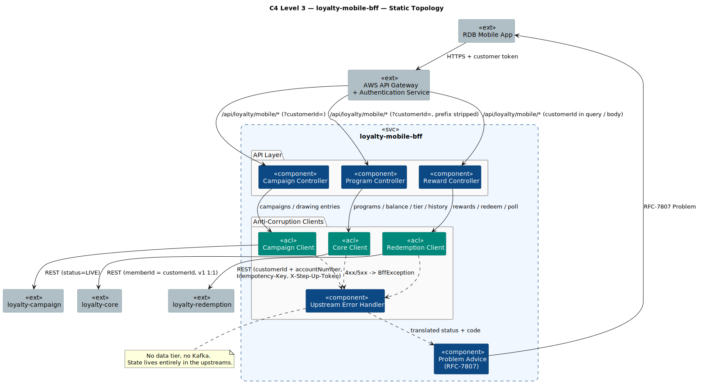
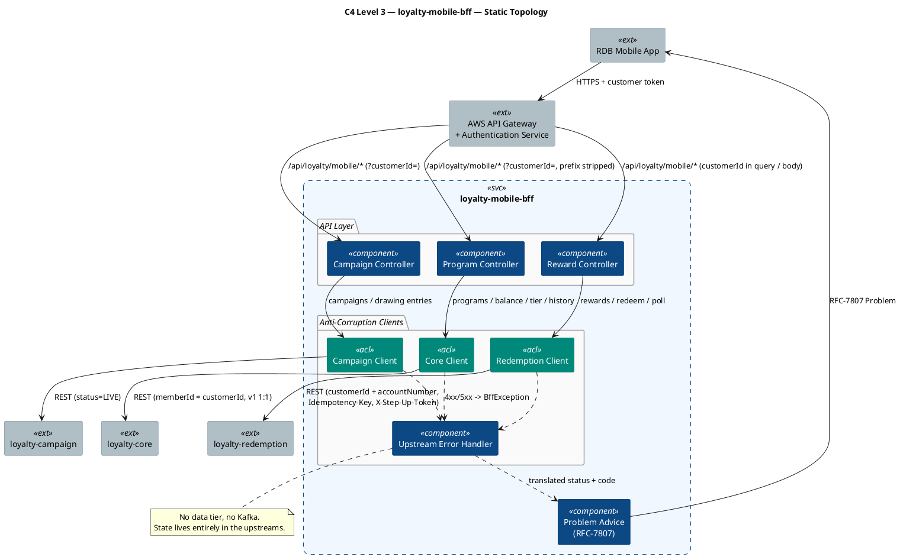
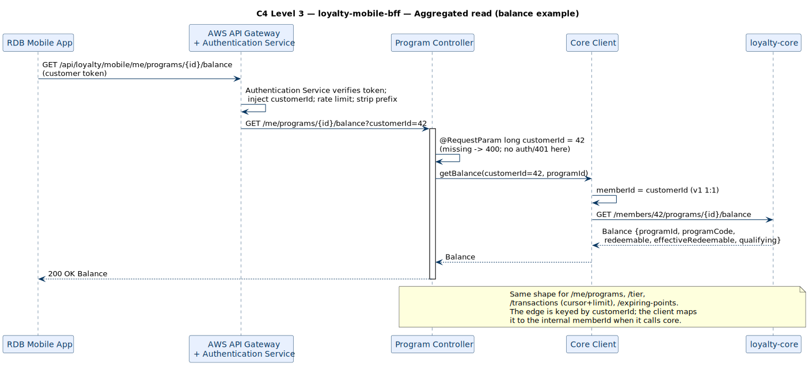
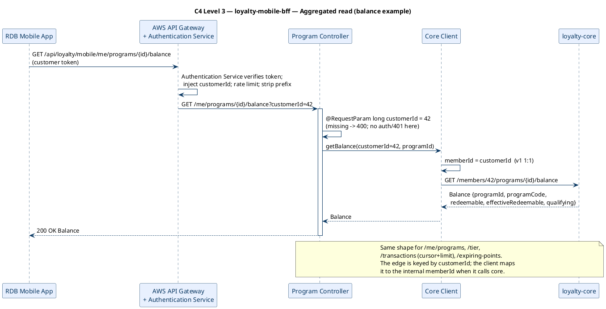
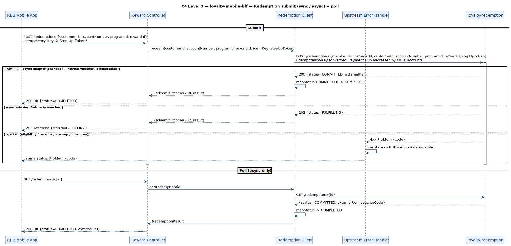
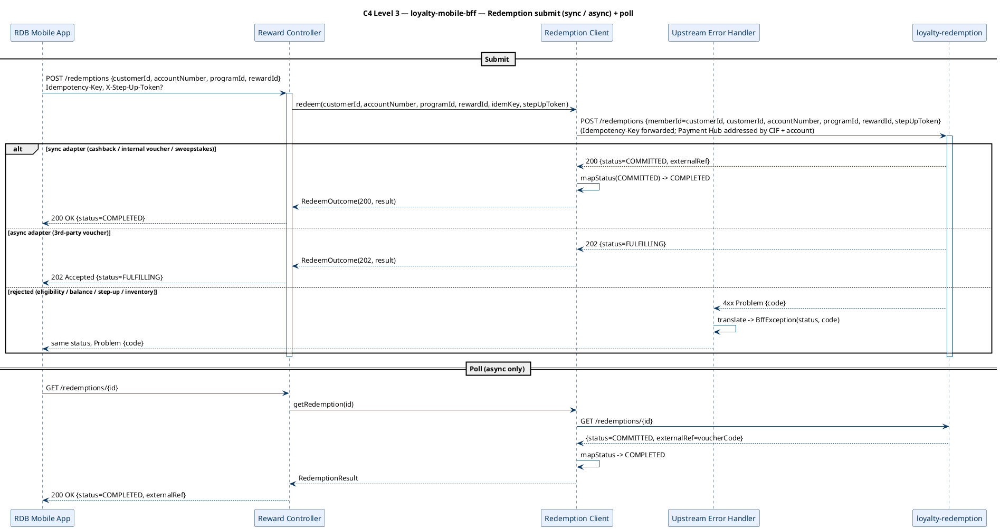

# Rochallor Loyalty Platform — C4 Level 3 — Component — `loyalty-mobile-bff`

| Field | Value |
|---|---|
| Version | 0.1 — Initial Draft |
| Status | DRAFT |
| Last updated | 2026-05-31 |
| Author | Nam Vu |
| Companion doc | [`docs/Digital-Loyalty-Arch.md`](../enterprise-architect.md) §10.3 |
| Preceding view | [`level-2-containers.md`](level-2-containers.md) |
| Sibling views | [`level-3-loyalty-admin-bff.md`](level-3-loyalty-admin-bff.md), [`level-3-loyalty-redemption.md`](level-3-loyalty-redemption.md) |
| Service guide | [`src/loyalty-mobile-bff/DETAILED-DESIGN.md`](../../src/loyalty-mobile-bff/DETAILED-DESIGN.md) |
| Glossary | [`CONTEXT.md`](../../CONTEXT.md) |

---

## 1. Purpose & Scope

This document is the **C4 Level 3 — Component** view for the `loyalty-mobile-bff` service. Its single job is to answer:

> **What components live inside `loyalty-mobile-bff`, how does the `customerId` on the request reach the controllers, and how does the BFF aggregate `loyalty-core` / `loyalty-redemption` / `loyalty-campaign` into the customer contract?**

It zooms inside the single `loyalty-mobile-bff` rectangle drawn at [L2 §3.1](level-2-containers.md#31-static-topology). The service is an **aggregation-only** edge: it owns **no datastore** and produces/consumes **no Kafka**. Every component is either an API controller, an Anti-Corruption client to one upstream, or a cross-cutting concern (error translation, problem rendering). It does **no token handling** — the gateway Authentication Service has already verified the token and injected the `customerId` before the request arrives.

> **Note on the L3 set.** Earlier drafts deliberately omitted an L3 for the BFFs (pure aggregation, no internal bounded context). Now that the BFF is implemented as a Spring service with per-tag controllers, per-upstream ACL clients, and an upstream-error translator, an L3 component view earns its place — it is the smallest accurate picture of *how a request becomes a fan-out*.

**In scope:**

- The application-level components inside `loyalty-mobile-bff`.
- How the `customerId` (the Host Bank CIF) on the request — injected by the gateway Authentication Service — reaches the controllers (query param / body), and the internal `customerId → memberId` map (v1 1:1).
- The three Anti-Corruption clients and the upstreams they front.
- The sync/async redemption status mirror and the upstream-error → RFC-7807 translation.

**Out of scope (deliberately):**

- The internals of `loyalty-core` / `loyalty-redemption` / `loyalty-campaign` — those are their own L3 views.
- Customer-token verification, `customerId` injection, rate limiting, and TLS termination — those live in AWS API Gateway / the Authentication Service (L2).
- The ElastiCache Redis read-through cache, Customer-Service display-name fetch, and Keycloak step-up challenge — wired-through / deferred (see §7).

---

## 2. Reading the Diagrams

`loyalty-mobile-bff` has exactly one execution mode: **request-driven**. There is no scheduled or async path (no datastore, no Kafka). We use **three sub-views**:

| Sub-view | Scope | What it answers |
|---|---|---|
| **§3.1 Static Topology** | All components + the three upstream clients + external neighbours | *What lives inside `loyalty-mobile-bff` and how is the fan-out wired?* |
| **§3.2 Aggregated Read Path** | Gateway / Auth Service → controller (`?customerId=`) → core client | *How does a `customerId` on the request become an aggregated read?* |
| **§3.3 Redemption Path** | `POST /redemptions` → redemption client → sync 200 / async 202 + poll | *How does the BFF mirror the two-phase Saga to the app?* |

**Common legend** is identical to [`level-3-loyalty-redemption.md` §2](level-3-loyalty-redemption.md#2-reading-the-diagrams). Conventions specific to this service:

- A **green box** marks an **Anti-Corruption client** — a thin `RestClient` wrapper that is the BFF's only point of contact with one upstream service. The BFF is a *client* of these services, never a sharer of their data.
- There is **no data tier**. State lives entirely in the upstreams; the BFF can be rebuilt or rescaled with zero data migration.

---

## 3. The Diagrams

### 3.1 Static Topology

  

### 3.2 Aggregated Read Path

The shape shared by every `/me/*` read: the gateway Authentication Service has already verified the customer token and injected `?customerId=`, the controller binds it with `@RequestParam long customerId`, and the Core Client calls `loyalty-core` after mapping `customerId → memberId` (v1 1:1). Balance, tier, transaction history, enrolled programs, and expiring cohorts all follow this path.

  

**Why this design:**

- **The BFF does no token handling** — the gateway Authentication Service verifies the customer token and injects the `customerId`, so re-verifying at the BFF would duplicate the JWKS dependency for no gain. The edge is keyed by `customerId` (the CIF); a missing required `customerId` is a normal Spring `400`, not a BFF `401`.
- **`customerId → memberId` is an internal mapping** — the edge speaks `customerId` only; the Anti-Corruption clients map it to the internal `memberId` (1:1 in v1) when they call core/redemption/campaign, which keep their internal names.
- **Pure pass-through** — read controllers add no logic beyond binding `customerId`; the upstream owns the projection shape.

### 3.3 Redemption Path

The only customer write. Its body is `RedeemRequest{customerId, accountNumber, programId, rewardId}`. The BFF forwards `customerId` (CIF) + `accountNumber` (the CASA for a cashback credit) + the `Idempotency-Key` + optional `X-Step-Up-Token` verbatim, sets the internal `memberId = customerId` (v1 1:1), and **mirrors the upstream status code** — `200` for a synchronous commit, `202` for an async partner hand-off the app then polls. The Host Bank Payment Hub is addressed by CIF + account, never by `memberId`. The internal Saga status is mapped to the narrower customer enum (`COMMITTED → COMPLETED`, `RELEASED → FAILED`).

  

**Why this design:**

- **The BFF mirrors, it does not orchestrate** — the two-phase Saga lives entirely in `loyalty-redemption`. The BFF's only domain logic is the status enum mapping, which is unit-tested independent of HTTP.
- **Idempotency-Key and step-up token are forwarded, not interpreted** — the BFF re-tries safely and lets redemption own reservation idempotency and step-up enforcement.
- **Errors keep their meaning** — a `409 INSUFFICIENT_BALANCE` from redemption surfaces unchanged at the edge, never a blanket `500`.

---

## 4. Component Inventory

| # | Component | Concern | Writes | Reads | Triggered by |
|---|---|---|---|---|---|
| 1 | **Program Controller** | API (Programs, Balance & History) | — | — | HTTPS via API Gateway; binds `customerId` (query param / body) |
| 2 | **Reward Controller** | API (Rewards & Redemption) | — | — | HTTPS via API Gateway; reads `customerId` from query / `RedeemRequest` body |
| 3 | **Campaign Controller** | API (Campaigns) | — | — | HTTPS via API Gateway; binds `customerId` (query param) |
| 4 | **Core Client** | Anti-corruption (→ `loyalty-core`); maps `customerId → memberId` (v1 1:1) | — | — | Program Controller |
| 5 | **Redemption Client** | Anti-corruption (→ `loyalty-redemption`); maps `customerId → memberId` (v1 1:1) | — | — | Reward Controller |
| 6 | **Campaign Client** | Anti-corruption (→ `loyalty-campaign`); maps `customerId → memberId` (v1 1:1) | — | — | Campaign Controller |
| 7 | **Upstream Error Handler** | Cross-cutting | — | — | Any `RestClient` 4xx/5xx (`defaultStatusHandler`) |
| 8 | **Problem Advice** | Cross-cutting | — | — | Any `BffException` thrown in a controller |

All components are **stateless**; none owns a table or a topic.

---

## 5. No Data Tier

`loyalty-mobile-bff` owns **no database and no Kafka topic**. This is the defining property of the container:

- **Balance / tier / catalogue** are read live from `loyalty-core` / `loyalty-redemption`. The L2 design allows an ElastiCache Redis read-through cache in front of these projections; v1 reads straight through (see §7).
- **No outbox, no audit table** — admin writes (and their hash-chained audit) live in the owning backend services, reached via `loyalty-admin-bff`, not here.
- **Redeploy/rescale is free** — there is no schema, no migration, no consumer offset to manage.

---

## 6. External Edges Re-exposed from L2

| Direction | Counterparty | Mechanism | Triggers which component |
|---|---|---|---|
| Sync inbound | RDB Mobile App (via AWS API Gateway + Authentication Service) | REST/JSON; token verified upstream, `customerId` injected | Controllers (bind `customerId` from query / body) |
| Sync outbound | `loyalty-core` | REST/JSON via mTLS | Core Client (programs / balance / tier / history) |
| Sync outbound | `loyalty-redemption` | REST/JSON via mTLS | Redemption Client (catalogue / redeem / poll) |
| Sync outbound | `loyalty-campaign` | REST/JSON via mTLS | Campaign Client (live campaigns / drawing entries) |

---

## 7. Invariants & Cross-References

- **Aggregation only — no datastore, no Kafka.** Every piece of state lives in an upstream; the BFF is a stateless composer.
- **The edge is keyed by `customerId`; the BFF does no token handling.** The gateway Authentication Service verifies the customer token and injects the `customerId` (the CIF) into the request (query param for reads + `opt-out`, body for `opt-in` / `tcs-acceptance` / `redeem`); the BFF never sees or decodes a JWT. A missing required `customerId` is a normal `400`, not a BFF `401`.
- **`customerId → memberId` is internal-only.** The Anti-Corruption clients map the edge `customerId` to the internal `memberId` (1:1 in v1) when they call core/redemption/campaign; the edge never uses `memberId`.
- **The BFF mirrors upstream, it does not orchestrate.** Redemption's 200/202 and its Saga status are reflected, with only the status-enum mapping as local logic.
- **Upstream errors are translated, not leaked** — same status + RFC-7807 `code`, never a blanket 500.

**Deferred / wired-through (matches platform deferrals):** all customer-token handling lives upstream in the gateway Authentication Service (token verify + `customerId` injection) — the BFF does none of it; the OpenAPI `customerJwt` bearer scheme is kept as edge-level documentation (a token is still required at the gateway) but the BFF itself does not process it. Also: the ElastiCache Redis read-through cache (reads pass straight to core in v1); the Customer-Service display-name fetch (T-06); the Keycloak step-up challenge/verify (the token is forwarded to redemption, not minted here); mTLS wiring (cluster infra).

> **Upstream dependency note.** Several customer reads (`/members/{id}/programs`, …/`balance`, …/`transactions`, …/`tier`, …/`expiring-points`, …/`opt-in|opt-out|tcs-acceptance`) are the member-scoped projections this BFF needs from `loyalty-core`; they **extend core's v1 internal API** (which today publishes the Reservation API + a slim projection). The BFF defines what it needs from its upstreams.

Next L3 view: [`level-3-loyalty-admin-bff.md`](level-3-loyalty-admin-bff.md) — employee identity + role gating, the approval lifecycle, authoring fan-out.

---

*End of document.*
