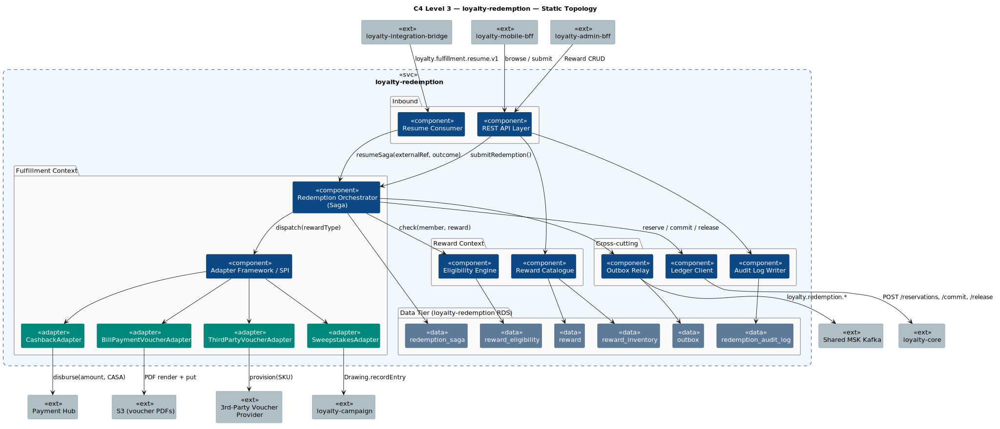
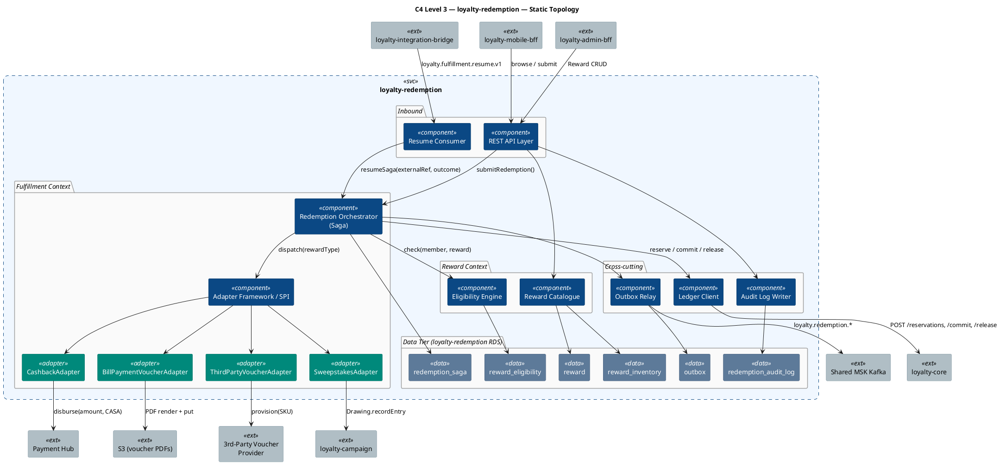
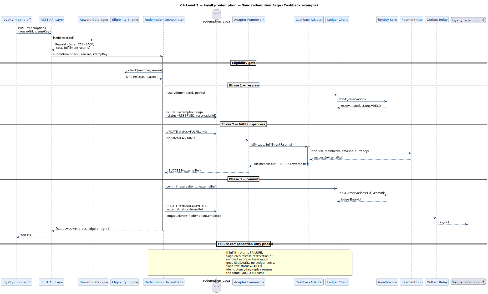
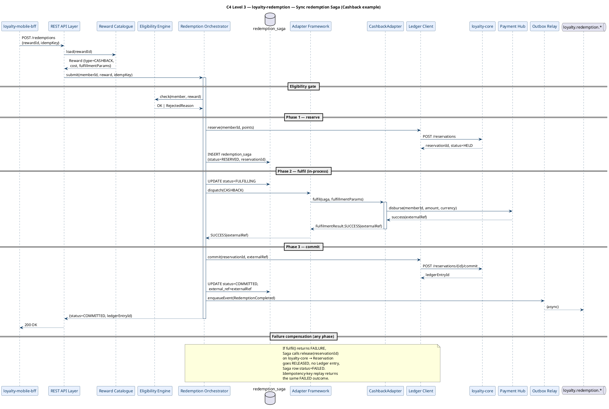
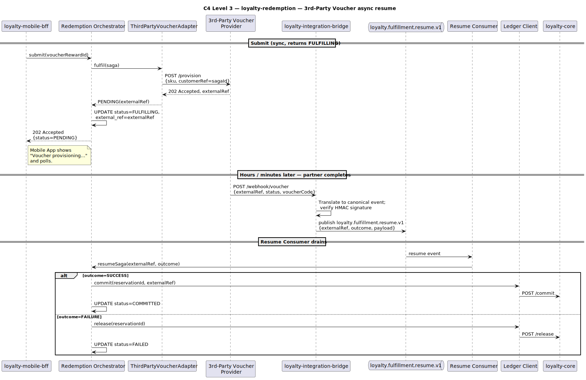
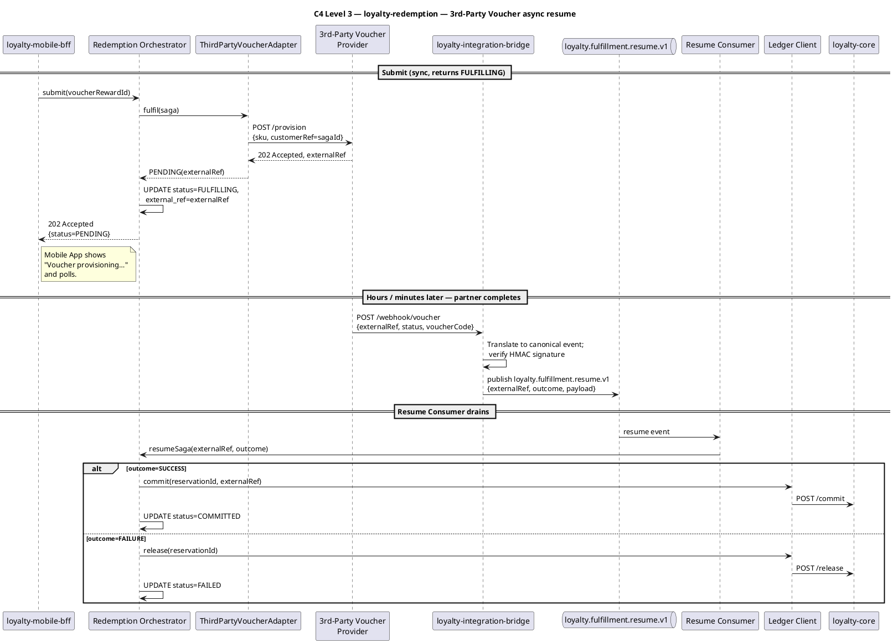

# Rochallor Loyalty Platform — C4 Level 3 — Component — `loyalty-redemption`

| Field | Value |
|---|---|
| Version | 0.1 — Initial Draft |
| Status | DRAFT |
| Last updated | 2026-05-26 |
| Author | Nam Vu |
| Companion doc | [`docs/Digital-Loyalty-Arch.md`](../enterprise-architect.md) §11.3 |
| Preceding view | [`level-2-containers.md`](level-2-containers.md) |
| Sibling views | [`level-3-loyalty-core.md`](level-3-loyalty-core.md), [`level-3-loyalty-earning.md`](level-3-loyalty-earning.md) |
| Glossary | [`CONTEXT.md`](../../CONTEXT.md) |

---

## 1. Purpose & Scope

This document is the **C4 Level 3 — Component** view for the `loyalty-redemption` service. Its single job is to answer:

> **What components live inside `loyalty-redemption`, how does the two-phase redemption Saga coordinate Reservation + Fulfillment + Commit, and what is the contract every Fulfillment Adapter must satisfy?**

It zooms inside the single `loyalty-redemption` rectangle drawn at [L2 §3.1](level-2-containers.md#31-static-topology). `loyalty-redemption` co-locates two bounded contexts — **Reward** and **Fulfillment** — in one deployable so that the Redemption Saga can call Adapters **in-process** for the sub-second paths (Cashback, Internal Voucher, Sweepstakes) and *only* hand off async for the partner-dependent path (3rd-Party Voucher).

**In scope:**

- The application-level components inside `loyalty-redemption`.
- The four shipped Fulfillment Adapters: **Cashback**, **Bill-Payment Voucher**, **3rd-Party Voucher**, **Sweepstakes**.
- The Adapter framework / SPI that makes adding a fifth adapter a non-event.
- Saga state machine: `RESERVED` → `FULFILLING` → `COMMITTED` | `RELEASED` | `FAILED`.
- The 3rd-Party Voucher async completion path (partner webhook → Bridge → resume Saga).

**Out of scope (deliberately):**

- Ledger semantics inside `reserve()` / `commit()` / `release()` — those are L3 of `loyalty-core`.
- The Bridge's translation of the partner webhook into the canonical resume event — that is L3 of `loyalty-integration-bridge`.
- Wire-format detail of partner / Payment Hub APIs.

---

## 2. Reading the Diagrams

`loyalty-redemption` has three execution modes: **request-driven** (Member submits a redemption via Mobile BFF), **async-resume** (3rd-party voucher partner reports completion), and **scheduled** (Reservation TTL Sweeper — but that one lives inside `loyalty-core`, see [`level-3-loyalty-core.md`](level-3-loyalty-core.md#33-scheduled--async-paths)). We use **three sub-views**:

| Sub-view | Scope | What it answers |
|---|---|---|
| **§3.1 Static Topology** | All components + tables + structural relationships + the four Adapters | *What lives inside `loyalty-redemption` and how is the Adapter framework wired?* |
| **§3.2 Sync Redemption Path** | The Saga from `submitRedemption()` → `reserve()` → adapter → `commit()` | *How does the in-process Saga keep Points and Fulfillment consistent?* |
| **§3.3 3rd-Party Voucher Async Path** | The break in the Saga: partner asynchronously confirms; Saga resumes | *How does the Saga survive a slow / unreliable partner?* |

**Common legend** is identical to [`level-3-loyalty-core.md` §2](level-3-loyalty-core.md#2-reading-the-diagrams). Conventions specific to this service:

- A **green box** marks a **Fulfillment Adapter** — pluggable component implementing the `FulfillmentAdapter` SPI. The Saga Orchestrator dispatches to one by Reward Type.
- The Saga is **in-process for 3 of 4 adapters**; the 3rd-Party Voucher adapter releases the request thread after submitting to the partner and the Saga resumes when the webhook lands.

---

## 3. The Diagrams

### 3.1 Static Topology

<p align="center">
  
</p>



### 3.2 Sync Redemption Path

The standard happy-path: Member taps "Redeem" → Mobile BFF calls Redemption → Saga runs reserve / fulfil / commit in one thread. Applies to **Cashback**, **Bill-Payment Voucher**, and **Sweepstakes**. Most of the platform's redemption volume flows through here.

<p align="center">
  
</p>



**Why this design:**

- **Eligibility before reserve** — cheap rejects (wrong tier, segment, validity, per-Member cap) shouldn't tie up balance. Eligibility is read-only against `reward_eligibility` and the Member's projection in `loyalty-core`.
- **Saga state in `redemption_saga`** — explicit state machine, not implicit. Lets us audit "where did this redemption stop?" and lets the Resume Consumer (§3.3) pick up async outcomes by `externalRef`.
- **Adapter framework is an SPI** — `FulfillmentAdapter` is a Java interface with two methods: `FulfilmentResult fulfil(SagaContext)` and `Optional<FulfilmentResult> resume(String externalRef, PartnerOutcome)`. Adding a fifth adapter (e.g. Airtime) means implementing the interface + registering the bean — no Saga code changes.
- **Sweepstakes uses the same Saga** — the only difference is that the SweepstakesAdapter calls `loyalty-campaign`'s `Drawing.recordEntry` instead of Payment Hub. Same `reserve` → fulfil → `commit` shape. (T-13 internal touchpoint.)

### 3.3 3rd-Party Voucher Async Path

The one path that breaks the in-process Saga. Partner provisioning can take seconds to minutes. The Saga `submitVoucher()` returns immediately with `status=FULFILLING`; the Member's Reservation stays HELD; the partner pushes a webhook to `loyalty-integration-bridge`; Bridge republishes onto `loyalty.fulfillment.resume.v1`; the **Resume Consumer** picks it up and finishes the Saga.

<p align="center">
  
</p>



**Notes on resume:**

- **Saga survives Pod restarts** — state is in `redemption_saga`, keyed by `externalRef` and `sagaId`. Resume Consumer is a stateless Kafka consumer; partition assignment is the only thing that ties a resume to a specific pod.
- **Webhook idempotency** — the Bridge dedupes by `externalRef` before publishing the resume event. The Resume Consumer additionally checks `redemption_saga.status` — a second-time resume on a `COMMITTED` saga is a silent no-op.
- **TTL on the partner** — if no webhook lands within the configured per-Reward timeout (default 24h), the Reservation TTL Sweeper inside `loyalty-core` ([level-3-loyalty-core.md §3.3](level-3-loyalty-core.md#33-scheduled--async-paths)) auto-releases the Reservation. The Saga is then marked FAILED on the next resume attempt; the partner's late success is treated as a billing dispute, not as a points event.

---

## 4. Component Inventory

| # | Component | Bounded context | Writes | Reads | Triggered by |
|---|---|---|---|---|---|
| 1 | **REST API Layer** | (Cross-cutting) | — | — | HTTPS / mTLS from `loyalty-mobile-bff`, `loyalty-admin-bff` |
| 2 | **Resume Consumer** | Fulfillment | — | — | MSK topic `loyalty.fulfillment.resume.v1` |
| 3 | **Reward Catalogue** | Reward | `reward`, `reward_inventory` | `reward`, `reward_inventory` | API: catalogue browse + admin CRUD |
| 4 | **Eligibility Engine** | Reward | — | `reward_eligibility`, Member projection (via Ledger Client) | Saga (before reserve) |
| 5 | **Redemption Orchestrator (Saga)** | Fulfillment | `redemption_saga` | `redemption_saga` | API: `submit()`; Resume Consumer: `resume()` |
| 6 | **Adapter Framework / SPI** | Fulfillment | — | — | Saga: `dispatch(rewardType)` |
| 7 | **CashbackAdapter** | Fulfillment | — | — | SPI |
| 8 | **BillPaymentVoucherAdapter** | Fulfillment | — | — | SPI |
| 9 | **ThirdPartyVoucherAdapter** | Fulfillment | — | — | SPI |
| 10 | **SweepstakesAdapter** | Fulfillment | — | — | SPI |
| 11 | **Ledger Client** | (Anti-corruption) | — | — | Saga (`reserve`/`commit`/`release`) |
| 12 | **Audit Log Writer** | (Cross-cutting) | `redemption_audit_log` | — | Every admin write via API (interceptor) |
| 13 | **Outbox Relay** | (Cross-cutting) | `outbox` | `outbox` | Internal scheduler (1s tick) |

**Notes on the Adapter framework:**

```text
interface FulfillmentAdapter {
  RewardType supportedType();
  FulfilmentResult fulfil(SagaContext ctx);
  Optional<FulfilmentResult> resume(String externalRef, PartnerOutcome o);
}
```

- Synchronous adapters (Cashback, Bill-Payment, Sweepstakes) return `SUCCESS` / `FAILURE` from `fulfil()` and never implement `resume()`.
- Asynchronous adapters (3rd-Party Voucher) return `PENDING(externalRef)` from `fulfil()` and implement `resume()`.
- The Saga is **the only consumer of the SPI** — adapters are not directly callable from the API layer.

---

## 5. Loyalty-Owned Tables in `loyalty-redemption RDS`

| Table | Purpose | Notes |
|---|---|---|
| **`reward`** | Per-Program Reward catalogue: type, cost, fulfillment params, validity window. | Authored in BEP; immutable once a Member has redeemed against it (versioned via `reward_revision`). |
| **`reward_inventory`** | Optional per-Reward inventory caps (e.g. limited-edition voucher run). | Atomic decrement on reserve; restored on release. |
| **`reward_eligibility`** | Per-Reward gates: Tier, segment, tenure, currency, per-Member cap. | Read-only on the hot path; authored in BEP. |
| **`redemption_saga`** | Saga state machine rows: `(sagaId, memberId, rewardId, reservationId, status, externalRef, idempotencyKey)`. | Single-writer = Orchestrator. Status transitions are explicit. |
| **`redemption_audit_log`** | Per-service audit trail for every BEP-originated Reward write. | ≥ 7-year retention. **Tamper-evident**: hash-chained + DB-immutable, nightly-sealed to S3 Object Lock WORM. |
| **`outbox`** | Transactional-outbox staging for `loyalty.redemption.*`. | Drained by Outbox Relay. |

S3 buckets used (not owned at the table level but owned by this service):

- **`loyalty-vouchers-*`** — Bill-Payment voucher PDFs, written by BillPaymentVoucherAdapter, returned to Mobile App as pre-signed URLs.

---

## 6. External Edges Re-exposed from L2

| Direction | Counterparty | Mechanism | Triggers which component |
|---|---|---|---|
| Sync inbound | `loyalty-mobile-bff` | REST/JSON via mTLS | REST API Layer → Reward Catalogue, Saga |
| Sync inbound | `loyalty-admin-bff` | REST/JSON via mTLS | REST API Layer → Reward Catalogue (admin) |
| Sync outbound | `loyalty-core` | REST/JSON via mTLS | Ledger Client (`reserve`/`commit`/`release`) |
| Sync outbound | `loyalty-campaign` | REST/JSON via mTLS | SweepstakesAdapter (`Drawing.recordEntry`) |
| Sync outbound | Payment Hub | REST/gRPC | CashbackAdapter (disbursement) |
| Sync outbound | 3rd-Party Voucher Provider | REST/JSON | ThirdPartyVoucherAdapter (provision) |
| Storage | S3 (`loyalty-vouchers-*`) | AWS SDK | BillPaymentVoucherAdapter (PDF put + pre-signed URL) |
| Async inbound | Shared MSK Kafka — `loyalty.fulfillment.resume.v1` (from Bridge) | Kafka consumer | Resume Consumer → Saga |
| Async outbound | Shared MSK Kafka — `loyalty.redemption.*` | Kafka producer (Outbox Relay) | Outbox Relay |
| JDBC | `loyalty-redemption RDS` | JDBC (HikariCP) | All components owning a table |

---

## 7. Invariants & Cross-References

- **Two-phase redemption with a separate Reservation table.** The Saga state in `redemption_saga` mirrors but does not replace the Reservation row in `loyalty-core`.
- **In-process Saga for sub-second paths, async only for the partner-dependent path.** This is why Reward + Fulfillment are co-deployed.
- **Adapters are an SPI, not a kitchen-sink interface** — adding an adapter is bounded: implement one Java interface, register one bean, add one `RewardType` enum value, add one row of test coverage. Saga code does not change.
- **The Saga is the only writer to `redemption_saga`** — Adapters return outcomes; the Saga records them. This keeps the state machine auditable.
- **Compensation by `release()`, not by deleting** — failed fulfilments release the Reservation; they never UPDATE or DELETE Ledger rows (P5).
- **Voucher PDF storage is in S3, not in Postgres** — keeps the RDS small and offloads CDN-able artefacts to the right tier.

Next L3 view: [`level-3-loyalty-campaign.md`](level-3-loyalty-campaign.md) — Campaign Aggregate, Drawing Scheduler, Winner Selection.

---

*End of document.*
