# Rochallor Loyalty Platform Architecture

**Document Type**: Retail Digital Loyalty Architecture (Business / Application / Data / Technology)

**Contributor**: Nam Vu

**Status**: Draft v0.1

---

## Table of Contents

1. [Context & Objectives](#1-context--objectives)
2. [Architectural Principles](#2-architectural-principles)
3. [Business Architecture](#3-business-architecture)
4. [Application Architecture](#4-application-architecture)
5. [Data Architecture](#5-data-architecture)
6. [Technology Architecture](#6-technology-architecture)
7. [Cross-cutting Concerns](#7-cross-cutting-concerns)
8. [Touchpoints with Bank's Ecosystem](#8-touchpoints-with-banks-ecosystem)
9. [Risks & Cross-Team Dependencies](#9-risks--cross-team-dependencies)
10. [Next Steps — C4 Roadmap & Supporting Artifacts](#10-next-steps--c4-roadmap--supporting-artifacts)

---

## 1. Context & Objectives

### 1.1 Business Context

The **Rochallor Loyalty Platform** is a satellite domain that deploys on top of a **Host Bank Platform (HBP)** — the host bank's existing digital banking stack: core banking system, Payment Hub, Mobile Banking App, Authentication Service, Customer Service, notification service, and supporting cloud infrastructure. Loyalty reuses HBP capabilities and never duplicates them. The platform is built once and deployed per host bank — see `/deployments/<bank>/DEPLOYMENT.md` for per-deployment identity. The **v1 reference deployment** is HBP (Cambodia, dual-currency USD/VND, zero-fee positioning); deployment-specific framing in this document is anchored to that reference unless otherwise noted.

The platform converts banking activity (card spend, transfers, bill payments, account state, opt-in) into **Points** under one or more configurable **Programs**, and lets Members exchange Points for **Rewards** (cashback to bank account, bill-payment vouchers, third-party digital vouchers, sweepstakes entries).

The platform must:

- **Integrate cleanly** with the existing Host Bank Platform (Payment Hub, core banking system via the Core Banking Adapter, Authentication Service, `notification-service`, managed Kubernetes, Apache Kafka, managed Postgres) — *not* reinvent any of these capabilities. (v1 HBP deployment binds these to AWS EKS / MSK / RDS Postgres.)
- **Be operationally extensible**: business teams must be able to add new Earn Sources, Earning Rules, Reward Types, Rewards, Tiers, and Campaigns through BEP (Bank Employee Portal) without engineering deployment cycles for typical changes.
- **Be auditable end-to-end**: every Point movement is an immutable Ledger Entry; every admin action is recorded in a service audit log; every Manual Adjustment passes through a Maker-Checker workflow.
- **Be cost-disciplined**: the unit economics of points are funded by the host bank's revenue model (in the v1 HBP deployment: interchange/float income, given the zero-fee positioning) — cost-per-active-Member and outstanding-point-liability are first-class KPIs.

### 1.2 Scope

**In-Scope (v1)**:

- Single seeded Program (name set per deployment in `deployments/<bank>/DEPLOYMENT.md`) — with the architecture treating `Program` as a first-class aggregate (multi-program ready).
- **Member lifecycle**: self-service opt-in via the Mobile Banking App, T&Cs acceptance, opt-out, reactivation.
- **Earning Framework** with configurable Earn Source registry; v1 launch consumes **`CardSpendPosted`** (Payment Hub) and **`MemberOptedIn`** (internal welcome bonus). Additional sources (transfers, bill payments, balance-held, referrals, etc.) are *modelled* and admin-activatable as their producer-side events become available.
- **Earning Rule** authoring (constrained JSON DSL + decision-table BEP UI) per Earn Source per Program, with rule conflict resolution by summing and per-rule + per-source caps.
- **Point Ledger** (append-only, dual-balance: Qualifying + Redeemable) with FIFO expiry (default 24 months from earn date, Tier-overridable).
- **Tier framework**: Program-configurable Tier Ladder + Qualifying Metric (LIFETIME / ROLLING_12_MONTHS / CALENDAR_YEAR — v1 default ROLLING_12).
- **Reward Catalogue** with 4 Reward Types live at v1: `CASHBACK_TO_CASA`, `BILL_PAYMENT_VOUCHER`, `THIRD_PARTY_VOUCHER`, `SWEEPSTAKES_ENTRY`. Reward Type framework supports also `MATERIAL_GOODS`, `CHARITY_DONATION`, `TIER_BOOST` (not activated in v1).
- **Two-phase redemption**: `reserve()` → `commit()` / `release()`, with a separate `point_reservation` table; configurable per-Reward-Type TTL; idempotent `POST /redeem`; atomic point + inventory reservation.
- **Campaign & Drawing** subsystem to support sweepstakes and time-bounded promotional Earning Rules.
- **Maker-Checker** workflow for all BEP-initiated manual point adjustments.
- **BEP admin surfaces** for Program / Tier / Earning Rule / Reward / Campaign / Member management.
- **Mobile UX integration** with the existing Mobile Banking App via a dedicated `loyalty-mobile-bff`.
- **Notification** of Points-Earned, Tier-Upgraded, Points-Expiring-Soon, Redemption-Confirmed, Sweepstakes-Won via the existing Host Bank Platform `notification-service`.
- **Fraud controls**: per-source caps, per-Member daily caps, velocity anomaly detection, refund clawback, transaction-PIN re-auth for high-value redemptions.

**Out-of-Scope (v1, deferred to v1.x / v2)**:

- **`PAY_WITH_POINTS`** reward type (real-time saga with Payment Hub at POS authorization) — deferred until Payment Hub commits to the synchronous co-spend pattern.
- **`FEE_WAIVER`** reward type — **deferred from v1** — requires a Fee Engine integration on the Host Bank side; will be added when a deployment requires it. (The v1 HBP deployment does not enable it: HBP is zero-fee, no fees to waive.)
- **BI-driven eligibility evaluation** — opt-in is universal in v1. Data model leaves an `eligibility_status` field defaulting to `ELIGIBLE` as an extension point.
- **`MATERIAL_GOODS`** and **`CHARITY_DONATION`** Reward Types (physical fulfillment, charity-partner integration).
- **Multi-region active-active** deployment (cross-region warm standby is in-scope).
- **Multi-program activation** (the model supports it; v1 ships exactly one Program seeded). The API contract is forward-compatible — every Points-bearing payload carries `program_id` from v1 even though clients ignore it until v2. The activation framework covers Program lifecycle authority, earn-event routing, cross-Program conversion (deferred), enrollment models, and primary-as-UX-construct.
- **CS-rep-initiated opt-in** and **auto-opt-in** (legally risky in the v1 deployment's jurisdiction — Cambodia — without explicit consent; deployment-specific posture).
- **Advanced fraud ML scoring** (v1 uses rule-based velocity + caps; ML-based scoring is v2).

This document establishes the **four-layer Enterprise Architecture** (Business / Application / Data / Technology) and **does not** prescribe low-level design. Detailed C4 Level 2 / Level 3 container and component diagrams, OpenAPI / AsyncAPI contracts, and full DDL are out of scope for v0.1 and are listed in §10.

---

## 2. Architectural Principles

The following principles govern all design decisions. Each is **opinionated and binding** — exceptions require explicit approval.

| # | Principle | Implication |
|---|---|---|
| **P1** | **Loyalty as a Satellite Domain** | Loyalty consumes producer-emitted domain events from the Host Bank Platform (Payment Hub, Core Banking Adapter, Customer Service). It never sits on the critical payment path and never owns customer PII. The HBP is the System of Record for Customer identity; the core banking system for bank balance; Payment Hub for payments. Loyalty owns Points, Tiers, Rewards. |
| **P2** | **Config-Driven Extensibility** | Earn Sources, Earning Rules, Reward Types, Rewards, Tiers, Campaigns are all **first-class registry/catalog entities managed by admins through BEP** — never hardcoded enums in code. Adding a new rule or reward to react to business needs must be a config push, not an engineering cycle. New Earn Sources whose underlying Domain Event already exists are config-only; ones that need new producer events still require cross-team work. |
| **P3** | **Bounded Contexts with No Shared Models** | Loyalty's 8 bounded contexts (Membership, Ledger, Earning, Reward, Fulfillment, Campaign, Integration Bridge, BFF) own their own data. No cross-service Postgres joins. Cross-context interaction is via Kafka events or domain APIs only. Managed-Postgres-per-service is enforced infrastructurally to make this physical. |
| **P4** | **Domain Events over CDC for Cross-Team Integration** | Earn integration with Payment Hub and Core Banking Adapter uses **explicit, producer-owned, versioned domain events** on Kafka — not database CDC tailing. The event contract is the boundary; the producer's DB schema is not Loyalty's concern. |
| **P5** | **Append-Only Ledger as Source of Truth for Points** | The Point Ledger is the immutable source of truth for every Point movement. Corrections are *new compensating entries*, never UPDATE/DELETE. Balance columns on `Member` are projections — single-writer (the Ledger Service), maintained atomically with each insert. Idempotency-key is mandatory on every entry. |
| **P6** | **Two-Phase Redemption** | Every Redemption is `reserve()` → `commit()` / `release()`. Reservations live in a separate `point_reservation` table (transient state — *not* immutable Ledger entries). Only `commit()` writes a permanent `Redeemed` Ledger Entry. Fulfillment Adapters implement a uniform three-method interface regardless of sync/async fulfillment latency. |
| **P7** | **Anti-Corruption Layer for All External Systems** | Payment Hub, the Core Banking Adapter, Customer Service, the Authentication Service, `notification-service`, and partner systems (3rd-party voucher provider) are all reached only via internally-owned adapters that translate external schemas into Loyalty's domain language. No internal service imports a vendor SDK directly. |
| **P8** | **Approval (4-eyes) for All BEP Money-Equivalent Actions, via BEP's Workflow** | Every BEP-initiated money-equivalent action (manual adjustment; economic config activation) requires approval. Loyalty does **not** implement maker-checker — it delegates routing, Job Roles, 4-eyes, and caps to the bank's existing **BEP Approval Workflow**, exposing a generic *create approval-request → confirm* integration and storing a `bep_approval_ref`. |
| **P9** | **Loyalty is Tier-2: Mobile App Must Degrade Gracefully** | Loyalty's uptime target is **99.95%**, deliberately one tier below the Host Bank Platform's 99.99%. The Mobile Banking App must show cached loyalty balance with a "last updated" timestamp, suppress the Redeem CTA, and never block any critical-path flow on a Loyalty BFF call when Loyalty is unavailable. This is a contract, not a slide-deck NFR. |
| **P10** | **Cloud-Native, Container-First, GitOps-Deployed** | Loyalty runs on a dedicated managed-Kubernetes cluster (sister to the Host Bank Platform's, not shared), GitOps-deployed via a GitOps controller from the platform's source-control system. All services are containerized, all infrastructure is declared as code. Observability is instrumented from day one with the same stack the Host Bank Platform uses (Loki, Prometheus, Grafana). (v1 HBP deployment: AWS EKS + ArgoCD + GitLab + Terraform — see `deployments/hbp/DEPLOYMENT.md`.) |

---

## 3. Business Architecture

### 3.1 Business Capability Map

The Digital Loyalty business capability tree consists of seven Level-1 capabilities, each decomposed into Level-2 sub-capabilities:

| Level-1 Capability | Level-2 Sub-Capabilities | Build Priority |
|---|---|---|
| **Program Management** | Program Setup; Tier Ladder Configuration; Qualifying Metric Selection; Program T&Cs Management; Program Lifecycle (draft / live / closed) | **v1 — Build (single program seeded)** |
| **Member Management** | Opt-In / Opt-Out; T&Cs Acceptance & Versioning; Member Profile & Preferences; Tier State; Eligibility Status (extension point); Member Search & Detail (BEP) | **v1 — Build** |
| **Points & Ledger** | Earning Calculation; Ledger Posting; Balance Projection (Redeemable + Qualifying); Reservation Lifecycle; Expiry Processing (FIFO); Idempotency & Replay; Refund Clawback | **v1 — Build (core)** |
| **Earning Framework** | Earn Source Registry; Earning Rule Authoring (DSL + Decision Table); Rule Engine; Rule Conflict Resolution; Caps (per-Rule, per-Source, per-Member); Rule Sandbox / Dry-Run | **v1 — Build** |
| **Rewards & Redemption** | Reward Catalogue; Reward Eligibility Evaluation; Two-Phase Redemption Orchestration; Fulfillment Adapter Framework (Cashback, Bill-Payment Voucher, 3rd-Party Voucher, Sweepstakes Entry); Inventory Management | **v1 — Build (4 Reward Types live)** |
| **Campaign & Engagement** | Campaign Aggregate; Scheduled Rule / Reward Activation; Drawing (Sweepstakes); Winner Selection; Member Targeting | **v1 — Build (Sweepstakes required for v1 Reward Type 7)** |
| **Fraud & Audit** | Velocity Anomaly Detection; Refund Clawback Handling; Maker-Checker for Manual Adjustments; Service Audit Logs | **v1 — Build (foundations)** |

### 3.2 Value Stream Map

End-to-end value stream for the Loyalty Member journey:

  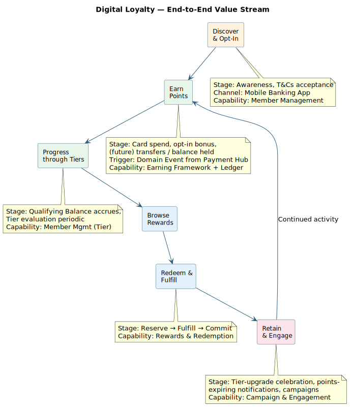

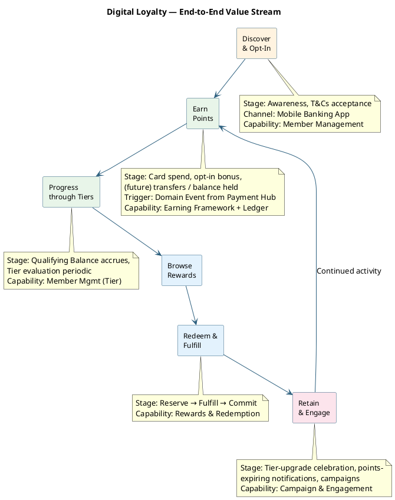
```plantuml
@startuml LoyaltyValueStream
title Digital Loyalty — End-to-End Value Stream

skinparam rectangle {
  BackgroundColor #E8F4F8
  BorderColor #2C5F7E
  FontSize 12
}
skinparam ArrowColor #2C5F7E

rectangle "Discover\n& Opt-In" as VS1 #FFF3E0
rectangle "Earn\nPoints" as VS2 #E8F5E9
rectangle "Progress\nthrough Tiers" as VS3 #E8F5E9
rectangle "Browse\nRewards" as VS4 #E3F2FD
rectangle "Redeem &\nFulfill" as VS5 #E3F2FD
rectangle "Retain\n& Engage" as VS6 #FCE4EC

VS1 --> VS2
VS2 --> VS3
VS3 --> VS4
VS4 --> VS5
VS5 --> VS6
VS6 --> VS2 : Continued activity

note bottom of VS1
  Stage: Awareness, T&Cs acceptance
  Channel: Mobile Banking App
  Capability: Member Management
end note

note bottom of VS2
  Stage: Card spend, opt-in bonus,
  (future) transfers / balance held
  Trigger: Domain Event from Payment Hub
  Capability: Earning Framework + Ledger
end note

note bottom of VS3
  Stage: Qualifying Balance accrues,
  Tier evaluation periodic
  Capability: Member Mgmt (Tier)
end note

note bottom of VS5
  Stage: Reserve → Fulfill → Commit
  Capability: Rewards & Redemption
end note

note bottom of VS6
  Stage: Tier-upgrade celebration, points-
  expiring notifications, campaigns
  Capability: Campaign & Engagement
end note

@enduml
```

**Cross-cutting value streams** that run continuously alongside the primary stream:

- **Program & Catalog Management** — BEP-authored Earning Rules, Rewards, Campaigns
- **Fraud Monitoring** — velocity anomaly detection, clawback handling
- **Audit** — point ledger immutability, per-service audit logs for BEP admin actions

### 3.3 Customer Journey Map (Persona: Retail Loyalty Member)

| Journey Stage | Customer Objective | Customer Action | Channel | System Process | Outcome |
|---|---|---|---|---|---|
| **Discover** | Learn loyalty exists | View loyalty entry in app | Mobile Banking App home | Mobile-BFF reads Program info | Aware of program |
| **Opt-In** | Become a Member | Tap "Join", accept T&Cs | Mobile Banking App | Membership Service creates Member; `MemberOptedIn` event fires welcome bonus | Active Member with welcome points |
| **Earn (Card Spend)** | Get rewarded for normal banking | Make a card purchase | Card payment | Payment Hub → `CardSpendPosted` → Earning Service → Ledger Entry | Points credited (p95 < 10s) |
| **Track Progress** | See points / tier progress | Open loyalty screen | Mobile Banking App | Mobile-BFF reads Member + Ledger projections | Balance + tier progress bar displayed |
| **Tier Up** | Reach next tier | Continue activity over qualifying window | (Background) | Qualifying Balance crosses threshold → Tier-Upgraded event → notification | Tier upgrade notification + new benefits unlocked |
| **Browse Rewards** | Find something to redeem | View Reward Catalogue | Mobile Banking App | Mobile-BFF reads Reward Service catalogue filtered by Tier/eligibility | List of redeemable Rewards |
| **Redeem** | Exchange points for value | Tap "Redeem" on a Reward | Mobile Banking App | Reservation → Fulfillment Adapter → Commit → Ledger `Redeemed` entry | Reward issued (cashback in CASA, voucher code, sweepstakes entry, etc.) |
| **Sweepstakes Outcome** | Win a prize | (passive) | Push notification | Drawing executes at scheduled time, Winners published, notifications fanned out | Prize awarded (or no result) |
| **Points Expiring** | Avoid losing points | Receive 30-day / 60-day warning | Push / Email | Expiry job emits `PointsExpiringSoon`; `notification-service` delivers | Re-engagement triggered |

### 3.4 Stakeholder Map

  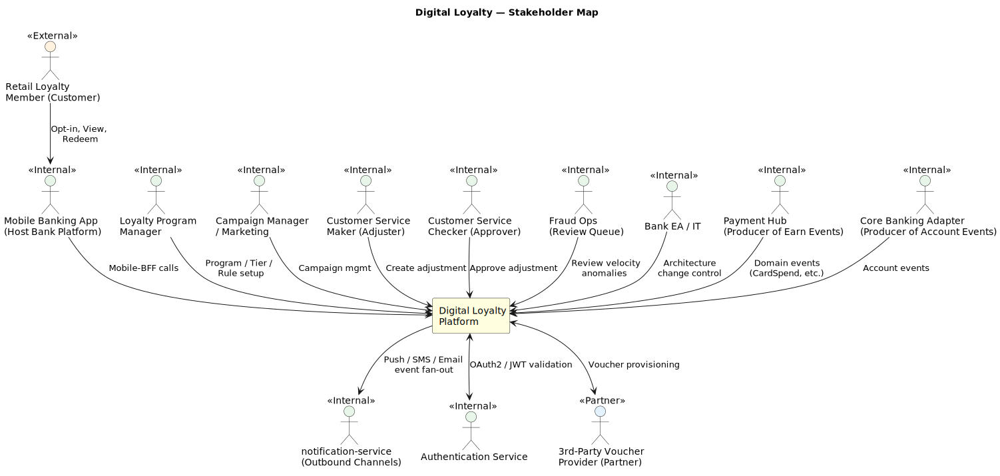

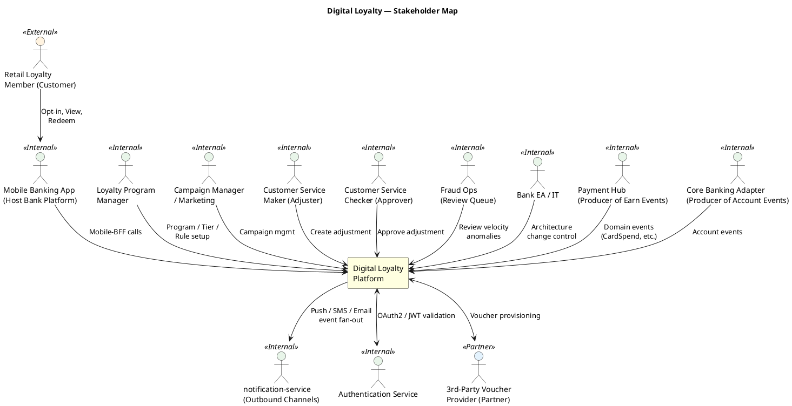
```plantuml
@startuml LoyaltyStakeholderMap
title Digital Loyalty — Stakeholder Map

skinparam actor {
  BackgroundColor<<Internal>> #E8F5E9
  BackgroundColor<<External>> #FFF3E0
  BackgroundColor<<Partner>> #E3F2FD
}

actor "Retail Loyalty\nMember (Customer)" as Member <<External>>
actor "Loyalty Program\nManager" as ProgMgr <<Internal>>
actor "Campaign Manager\n/ Marketing" as Campaign <<Internal>>
actor "Customer Service\nMaker (Adjuster)" as CSMaker <<Internal>>
actor "Customer Service\nChecker (Approver)" as CSChecker <<Internal>>
actor "Fraud Ops\n(Review Queue)" as Fraud <<Internal>>
actor "Bank EA / IT" as EA <<Internal>>

actor "Mobile Banking App\n(Host Bank Platform)" as RDB <<Internal>>
actor "Payment Hub\n(Producer of Earn Events)" as PH <<Internal>>
actor "Core Banking Adapter\n(Producer of Account Events)" as T24A <<Internal>>
actor "notification-service\n(Outbound Channels)" as NSvc <<Internal>>
actor "Authentication Service" as KC <<Internal>>

actor "3rd-Party Voucher\nProvider (Partner)" as Voucher <<Partner>>

rectangle "Digital Loyalty\nPlatform" as DLP #FFFFE0

Member --> RDB : Opt-in, View,\nRedeem
ProgMgr --> DLP : Program / Tier /\nRule setup
Campaign --> DLP : Campaign mgmt
CSMaker --> DLP : Create adjustment
CSChecker --> DLP : Approve adjustment
Fraud --> DLP : Review velocity\nanomalies
EA --> DLP : Architecture\nchange control

RDB --> DLP : Mobile-BFF calls
PH --> DLP : Domain events\n(CardSpend, etc.)
T24A --> DLP : Account events
DLP --> NSvc : Push / SMS / Email\nevent fan-out
DLP <--> KC : OAuth2 / JWT validation

DLP <--> Voucher : Voucher provisioning

@enduml
```

### 3.5 Domain State Machines

The platform manages three primary stateful entities — **Member**, **Redemption**, and **Reservation**.

#### 3.5.1 Member — Lifecycle State Machine

  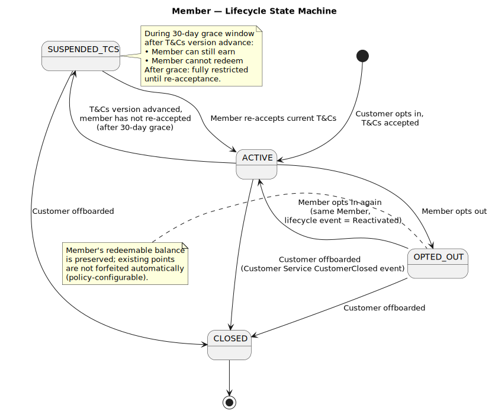

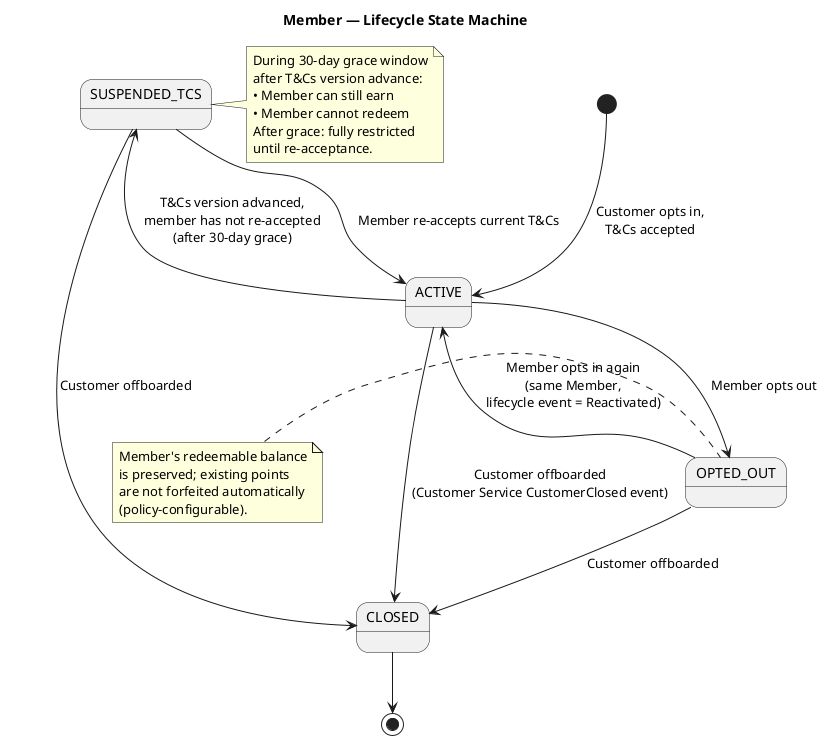
```plantuml
@startuml MemberStateMachine
title Member — Lifecycle State Machine

[*] --> ACTIVE : Customer opts in,\nT&Cs accepted

ACTIVE --> SUSPENDED_TCS : T&Cs version advanced,\nmember has not re-accepted\n(after 30-day grace)
SUSPENDED_TCS --> ACTIVE : Member re-accepts current T&Cs

ACTIVE --> OPTED_OUT : Member opts out
OPTED_OUT --> ACTIVE : Member opts in again\n(same Member,\nlifecycle event = Reactivated)

ACTIVE --> CLOSED : Customer offboarded\n(Customer Service CustomerClosed event)
SUSPENDED_TCS --> CLOSED : Customer offboarded
OPTED_OUT --> CLOSED : Customer offboarded

CLOSED --> [*]

note right of SUSPENDED_TCS
  During 30-day grace window
  after T&Cs version advance:
  • Member can still earn
  • Member cannot redeem
  After grace: fully restricted
  until re-acceptance.
end note

note left of OPTED_OUT
  Member's redeemable balance
  is preserved; existing points
  are not forfeited automatically
  (policy-configurable).
end note
@enduml
```

#### 3.5.2 Redemption — Lifecycle State Machine

  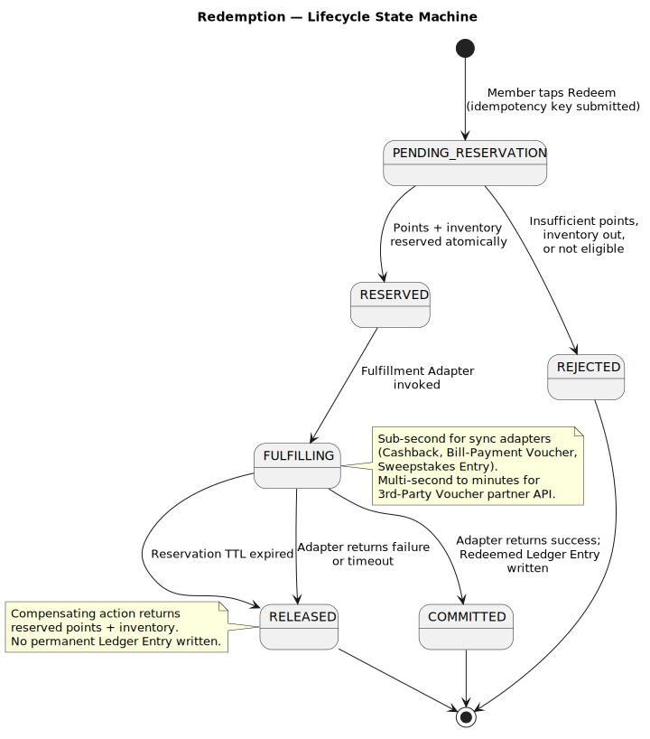

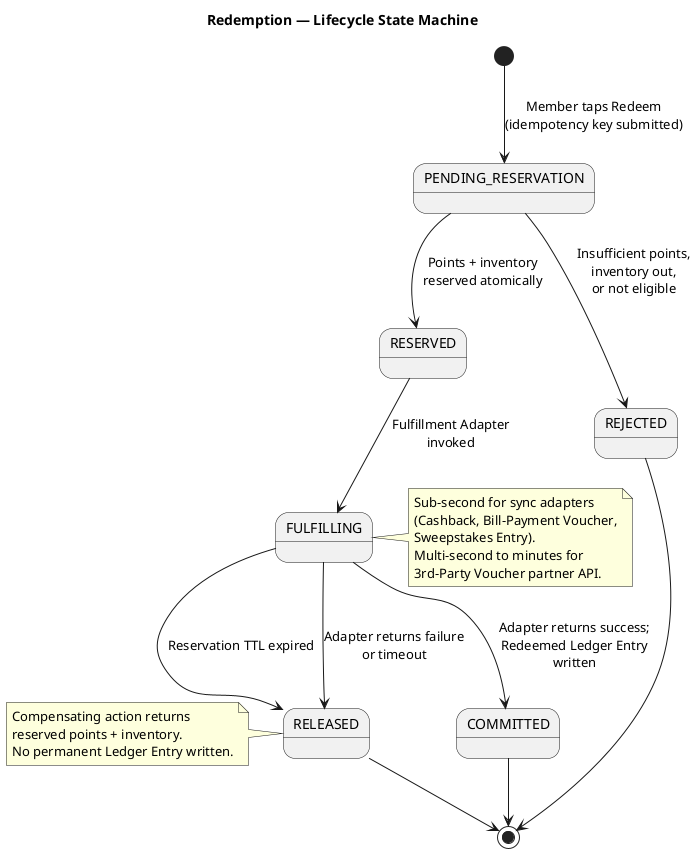
```plantuml
@startuml RedemptionStateMachine
title Redemption — Lifecycle State Machine

[*] --> PENDING_RESERVATION : Member taps Redeem\n(idempotency key submitted)

PENDING_RESERVATION --> RESERVED : Points + inventory\nreserved atomically
PENDING_RESERVATION --> REJECTED : Insufficient points,\ninventory out,\nor not eligible

RESERVED --> FULFILLING : Fulfillment Adapter\ninvoked

FULFILLING --> COMMITTED : Adapter returns success;\nRedeemed Ledger Entry\nwritten
FULFILLING --> RELEASED : Adapter returns failure\nor timeout
FULFILLING --> RELEASED : Reservation TTL expired

COMMITTED --> [*]
REJECTED --> [*]
RELEASED --> [*]

note right of FULFILLING
  Sub-second for sync adapters
  (Cashback, Bill-Payment Voucher,
  Sweepstakes Entry).
  Multi-second to minutes for
  3rd-Party Voucher partner API.
end note

note left of RELEASED
  Compensating action returns
  reserved points + inventory.
  No permanent Ledger Entry written.
end note
@enduml
```

#### 3.5.3 Reservation — Lifecycle State Machine

  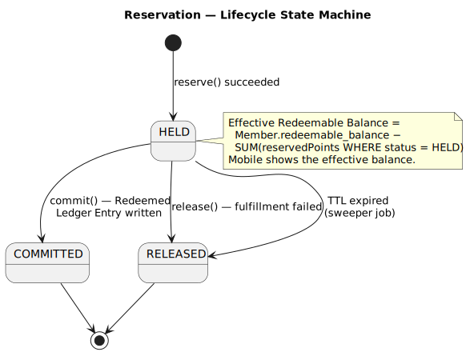

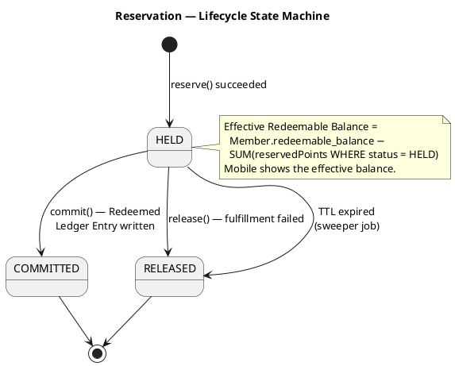
```plantuml
@startuml ReservationStateMachine
title Reservation — Lifecycle State Machine

[*] --> HELD : reserve() succeeded

HELD --> COMMITTED : commit() — Redeemed\nLedger Entry written
HELD --> RELEASED : release() — fulfillment failed
HELD --> RELEASED : TTL expired\n(sweeper job)

COMMITTED --> [*]
RELEASED --> [*]

note right of HELD
  Effective Redeemable Balance =
    Member.redeemable_balance −
    SUM(reservedPoints WHERE status = HELD)
  Mobile shows the effective balance.
end note
@enduml
```

---

## 4. Application Architecture

### 4.1 Application Portfolio (Level 0)

The Level-0 view maps each business capability to one or more application components, organized into architectural layers:

1. **Engagement Layer** — Mobile Banking App (existing, hosts the loyalty UI), BEP (existing, hosts loyalty admin screens)
2. **Security Layer** — Authentication Service — existing, reused (both retail-banking realm and bank-business-employee-portal realm); also provides transaction-PIN step-up auth for high-value redemptions
3. **BFF Layer** — `loyalty-mobile-bff` (customer-facing), `loyalty-admin-bff` (BEP-facing)
4. **Core Loyalty Services** — `loyalty-core` (Membership + Ledger), `loyalty-earning` (Earn Source registry + Rule Engine), `loyalty-redemption` (Reward Catalogue + Fulfillment Adapters), `loyalty-campaign` (Campaign + Drawing)
5. **Integration Layer** — `loyalty-integration-bridge` (Kafka consumers/producers translating Payment Hub / Core Banking Adapter / Host Bank Platform events into Loyalty-internal schema)
6. **Shared / Bank Services** — `notification-service` (existing, reused)
7. **Cross-System / External** — Payment Hub, Core Banking Adapter (event producers), 3rd-party voucher partner (consumer)

### 4.2 Application Domain Interaction (Logical View)

The full interaction model is too dense for a single diagram. We use a **context map** for the big picture and five **sub-views**, each scoped to one concern.

| View | Scope | Section |
|---|---|---|
| Context Map | High-level boundaries between zones | 4.2 |
| Bounded Context Map (DDD) | Internal context relationships and coupling types | 4.2.1 |
| Request Flow (Sync) | Channels → Edge → BFF → Core, synchronous path | 4.2.2 |
| ACL Adapters & External Integrations | Producers, consumers, partner systems | 4.2.3 |
| Event Backbone (Async) | Domain events between Payment Hub / Core Banking Adapter / Loyalty / notification | 4.2.4 |

#### Context Map

  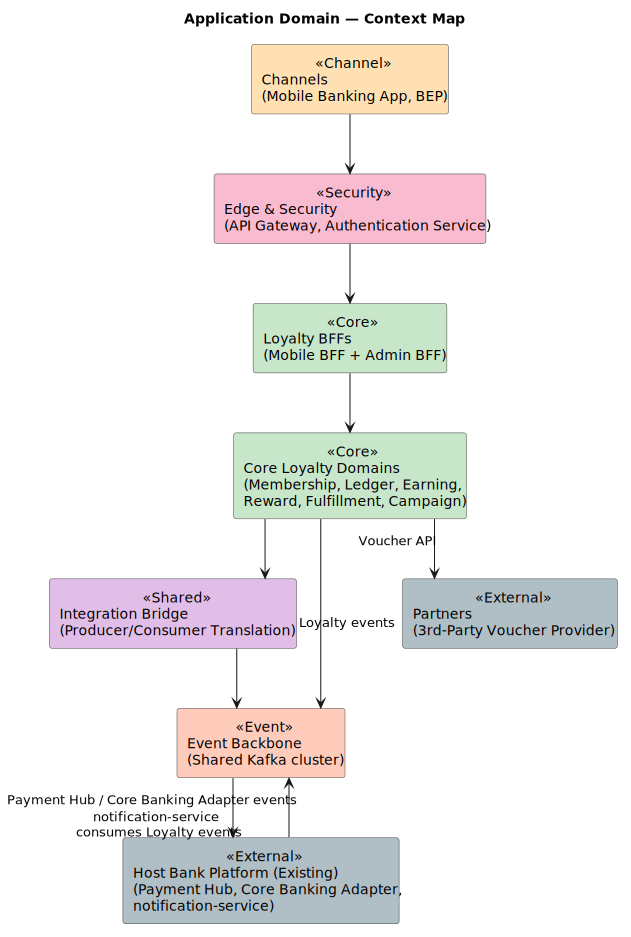

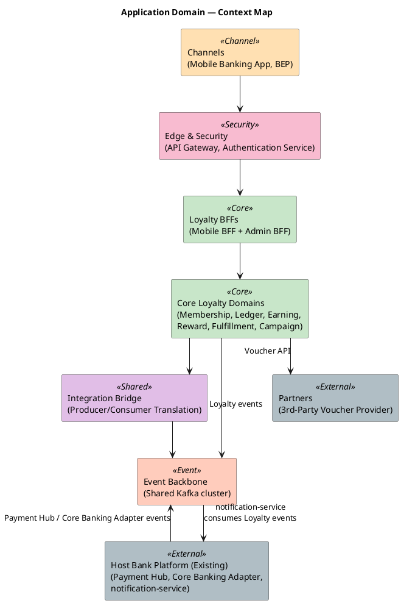
```plantuml
@startuml LoyaltyAppDomainContextMap
title Application Domain — Context Map

skinparam linetype ortho

skinparam rectangle {
  BackgroundColor<<Channel>> #FFE0B2
  BackgroundColor<<Core>> #C8E6C9
  BackgroundColor<<Shared>> #E1BEE7
  BackgroundColor<<External>> #B0BEC5
  BackgroundColor<<Data>> #FFF9C4
  BackgroundColor<<Event>> #FFCCBC
  BackgroundColor<<Security>> #F8BBD0
  BorderColor #424242
}

rectangle "Channels\n(Mobile Banking App, BEP)" <<Channel>> as Channels
rectangle "Edge & Security\n(API Gateway, Authentication Service)" <<Security>> as Edge
rectangle "Loyalty BFFs\n(Mobile BFF + Admin BFF)" <<Core>> as BFF
rectangle "Core Loyalty Domains\n(Membership, Ledger, Earning,\nReward, Fulfillment, Campaign)" <<Core>> as Core
rectangle "Integration Bridge\n(Producer/Consumer Translation)" <<Shared>> as Bridge
rectangle "Event Backbone\n(Shared Kafka cluster)" <<Event>> as Events
rectangle "Host Bank Platform (Existing)\n(Payment Hub, Core Banking Adapter,\nnotification-service)" <<External>> as RDB
rectangle "Partners\n(3rd-Party Voucher Provider)" <<External>> as Partners

Channels --> Edge
Edge --> BFF
BFF --> Core
Core --> Bridge
Bridge --> Events
Events <-- RDB : Payment Hub / Core Banking Adapter events
Core --> Events : Loyalty events
Events --> RDB : notification-service\nconsumes Loyalty events
Core --> Partners : Voucher API

@enduml
```

### 4.2.1 Bounded Context Map (DDD)

Principle **P3** mandates DDD bounded contexts with no shared models. This view documents context relationships using DDD notation.

**Relationship types used**:
- **U/S — Upstream/Supplier → Downstream/Customer**: producer's model is authoritative; consumer adapts
- **OHS/PL — Open Host Service / Published Language**: producer publishes a versioned, public contract
- **SK — Shared Kernel**: two contexts share part of the model and a transactional boundary. Highest coupling
- **CF — Conformist**: downstream adopts upstream's model wholesale
- **ACL — Anti-Corruption Layer**: downstream translates upstream model into its own

  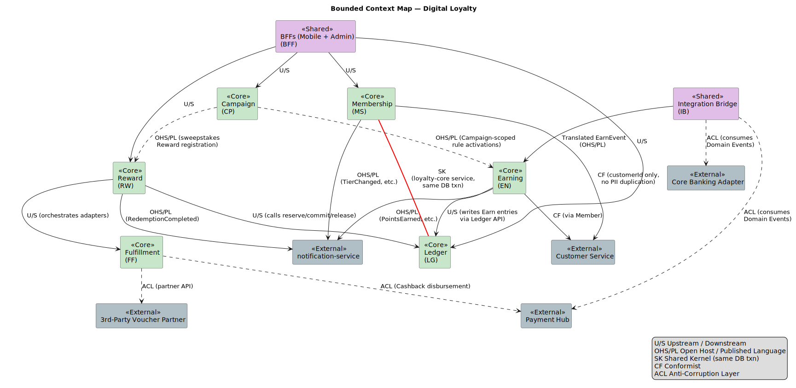

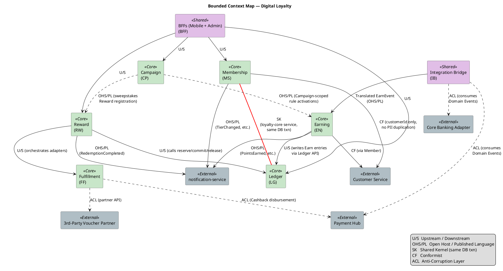
```plantuml
@startuml LoyaltyBoundedContextMap
title Bounded Context Map — Digital Loyalty

skinparam rectangle {
  BackgroundColor<<Core>> #C8E6C9
  BackgroundColor<<Shared>> #E1BEE7
  BackgroundColor<<External>> #B0BEC5
  BorderColor #424242
}

rectangle "Membership\n(MS)" <<Core>> as MS
rectangle "Ledger\n(LG)" <<Core>> as LG
rectangle "Earning\n(EN)" <<Core>> as EN
rectangle "Reward\n(RW)" <<Core>> as RW
rectangle "Fulfillment\n(FF)" <<Core>> as FF
rectangle "Campaign\n(CP)" <<Core>> as CP
rectangle "Integration Bridge\n(IB)" <<Shared>> as IB
rectangle "BFFs (Mobile + Admin)\n(BFF)" <<Shared>> as BFF

rectangle "Customer Service" <<External>> as Cust
rectangle "Payment Hub" <<External>> as PH
rectangle "Core Banking Adapter" <<External>> as T24A
rectangle "notification-service" <<External>> as NSvc
rectangle "3rd-Party Voucher Partner" <<External>> as Voucher

' Shared Kernel (same-txn coupling) — MS + LG inside loyalty-core
MS -[#red,thickness=2]- LG : SK\n(loyalty-core service,\nsame DB txn)

' Upstream/Supplier — internal
EN --> LG : U/S (writes Earn entries\nvia Ledger API)
RW --> LG : U/S (calls reserve/commit/release)
RW --> FF : U/S (orchestrates adapters)
CP ..> EN : OHS/PL (Campaign-scoped\nrule activations)
CP ..> RW : OHS/PL (sweepstakes\nReward registration)

' Conformist — Customer identity
MS --> Cust : CF (customerId only,\nno PII duplication)
EN --> Cust : CF (via Member)

' Integration Bridge as ACL boundary
IB ..> PH : ACL (consumes\nDomain Events)
IB ..> T24A : ACL (consumes\nDomain Events)
IB --> EN : Translated EarnEvent\n(OHS/PL)

' BFF aggregates
BFF --> MS : U/S
BFF --> LG : U/S
BFF --> RW : U/S
BFF --> CP : U/S

' Fulfillment Adapters as ACLs
FF ..> Voucher : ACL (partner API)
FF ..> PH : ACL (Cashback disbursement)

' Outbound Loyalty events
EN --> NSvc : OHS/PL\n(PointsEarned, etc.)
MS --> NSvc : OHS/PL\n(TierChanged, etc.)
RW --> NSvc : OHS/PL\n(RedemptionCompleted)

legend right
  U/S  Upstream / Downstream
  OHS/PL  Open Host / Published Language
  SK   Shared Kernel (same DB txn)
  CF   Conformist
  ACL  Anti-Corruption Layer
endlegend
@enduml
```

#### 4.2.2 Request Flow (Synchronous Path)

Covers ingress from channels, AuthN/AuthZ, and the synchronous call chain through BFFs and Core services. External adapters and events are intentionally omitted — see 4.2.3 and 4.2.4.

  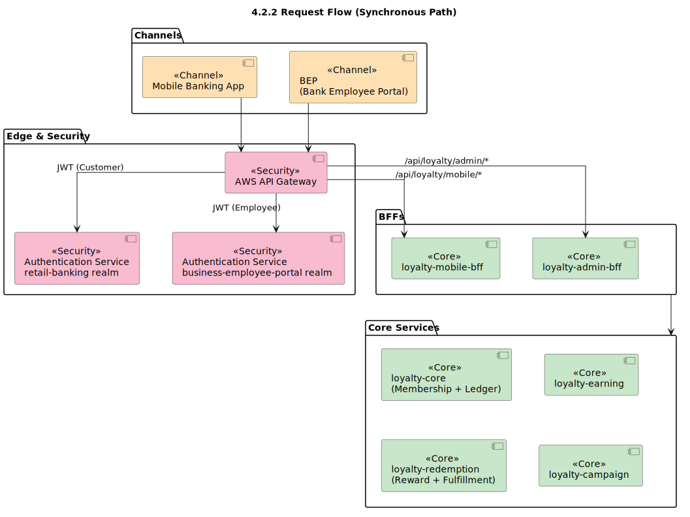

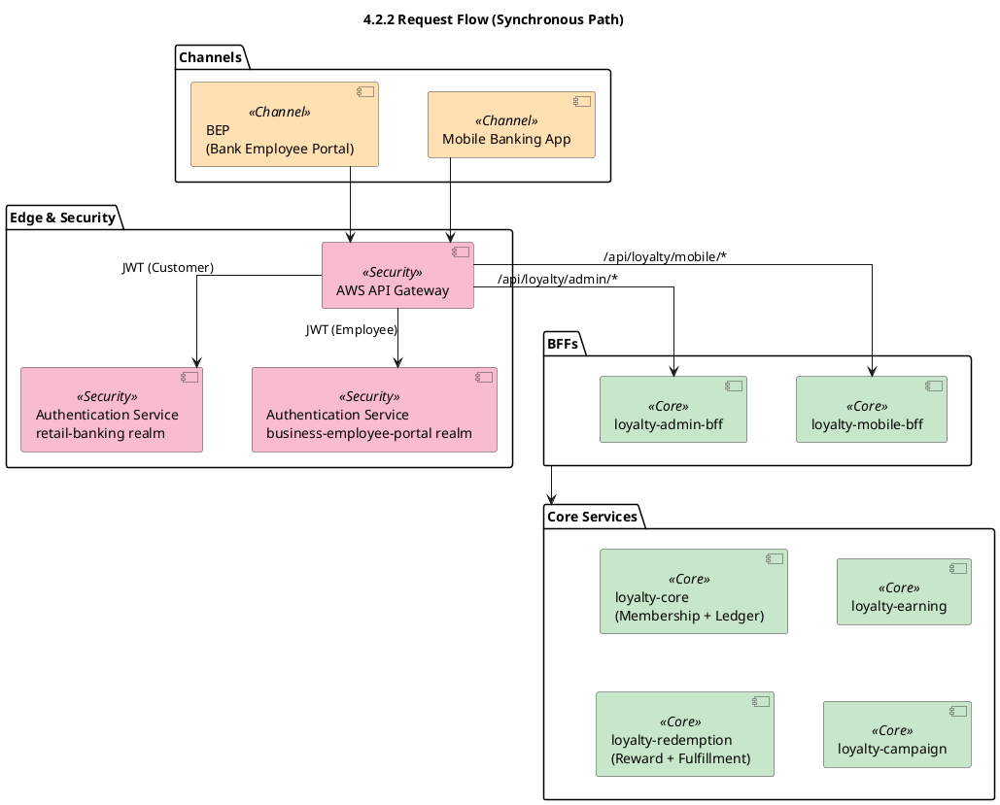
```plantuml
@startuml LoyaltyRequestFlow
title 4.2.2 Request Flow (Synchronous Path)

' Top-to-bottom layered flow: Channels → Edge → BFFs → Core Services
skinparam linetype ortho
skinparam nodesep 50
skinparam ranksep 60
skinparam shadowing false

skinparam component {
  BackgroundColor<<Channel>> #FFE0B2
  BackgroundColor<<Core>> #C8E6C9
  BackgroundColor<<Shared>> #E1BEE7
  BackgroundColor<<Security>> #F8BBD0
  BorderColor #424242
}

package "Channels" {
  [Mobile Banking App] <<Channel>> as Mobile
  [BEP\n(Bank Employee Portal)] <<Channel>> as BEP
}

package "Edge & Security" {
  [AWS API Gateway] <<Security>> as APIGW
  [Authentication Service\nretail-banking realm] <<Security>> as KC1
  [Authentication Service\nbusiness-employee-portal realm] <<Security>> as KC2
}

package "BFFs" as BFFsPkg {
  [loyalty-mobile-bff] <<Core>> as MBFF
  [loyalty-admin-bff] <<Core>> as ABFF
}

package "Core Services" as CorePkg {
  [loyalty-core\n(Membership + Ledger)] <<Core>> as Core
  [loyalty-earning] <<Core>> as Earn
  [loyalty-redemption\n(Reward + Fulfillment)] <<Core>> as Redm
  [loyalty-campaign] <<Core>> as Camp
}

' --- Ingress (Channels → API Gateway) ---
Mobile --> APIGW
BEP --> APIGW

' --- AuthN/Z (API Gateway validates JWT against realm) ---
APIGW --> KC1 : JWT (Customer)
APIGW --> KC2 : JWT (Employee)

' --- Edge → BFF (post-auth routing) ---
APIGW --> MBFF : /api/loyalty/mobile/*
APIGW --> ABFF : /api/loyalty/admin/*

' --- BFFs → Core Services (single representative edge at package level;
'     per-BFF routing documented in §4.2.1 Component Inventory) ---
BFFsPkg --> CorePkg

@enduml
```

> **Note**: the single arrow between **BFFs** and **Core Services** is a package-level abstraction. Each BFF calls a documented subset of Core Services (see §4.2.1 Component Inventory): `loyalty-mobile-bff` → `{loyalty-core, loyalty-redemption, loyalty-campaign}`; `loyalty-admin-bff` → `{loyalty-core, loyalty-earning, loyalty-redemption, loyalty-campaign}`. Detailed per-call semantics are out of scope for the synchronous-path topology view.

#### 4.2.3 ACL Adapters & External Integrations

All outbound and inbound traffic with external systems flows through dedicated adapters. Internal core services never call external APIs directly.

  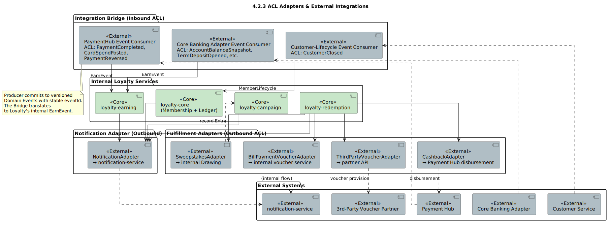

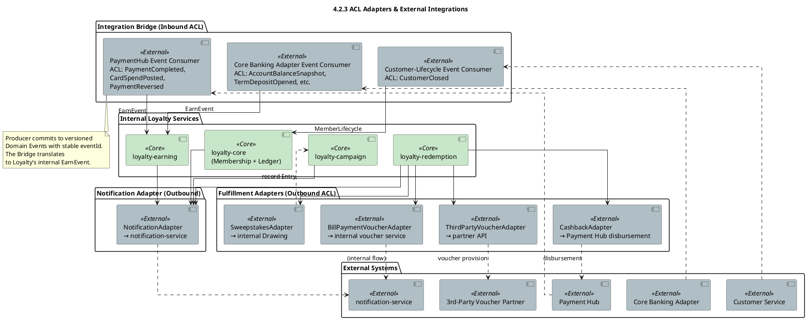
```plantuml
@startuml LoyaltyACL
title 4.2.3 ACL Adapters & External Integrations

skinparam linetype ortho

skinparam component {
  BackgroundColor<<Core>> #C8E6C9
  BackgroundColor<<Shared>> #E1BEE7
  BackgroundColor<<External>> #B0BEC5
  BackgroundColor<<Security>> #F8BBD0
  BorderColor #424242
}

package "Internal Loyalty Services" {
  [loyalty-earning] <<Core>> as Earn
  [loyalty-core\n(Membership + Ledger)] <<Core>> as Core
  [loyalty-redemption] <<Core>> as Redm
  [loyalty-campaign] <<Core>> as Camp
}

package "Integration Bridge (Inbound ACL)" {
  [PaymentHub Event Consumer\nACL: PaymentCompleted,\nCardSpendPosted,\nPaymentReversed] <<External>> as PHIn
  [Core Banking Adapter Event Consumer\nACL: AccountBalanceSnapshot,\nTermDepositOpened, etc.] <<External>> as T24In
  [Customer-Lifecycle Event Consumer\nACL: CustomerClosed] <<External>> as RDBIn
}

package "Fulfillment Adapters (Outbound ACL)" {
  [CashbackAdapter\n→ Payment Hub disbursement] <<External>> as CashAdp
  [BillPaymentVoucherAdapter\n→ internal voucher service] <<External>> as BillAdp
  [ThirdPartyVoucherAdapter\n→ partner API] <<External>> as TPAdp
  [SweepstakesAdapter\n→ internal Drawing] <<External>> as SwpAdp
}

package "Notification Adapter (Outbound)" {
  [NotificationAdapter\n→ notification-service] <<External>> as NotifAdp
}

package "External Systems" {
  [Payment Hub] <<External>> as PH
  [Core Banking Adapter] <<External>> as T24A
  [Customer Service] <<External>> as RDBSvc
  [3rd-Party Voucher Partner] <<External>> as VPartner
  [notification-service] <<External>> as NSvc
}

' Inbound: External → Bridge → Internal
PH ..> PHIn
T24A ..> T24In
RDBSvc ..> RDBIn
PHIn --> Earn : EarnEvent
T24In --> Earn : EarnEvent
RDBIn --> Core : MemberLifecycle

' Outbound: Internal → Adapters → External
Redm --> CashAdp
Redm --> BillAdp
Redm --> TPAdp
Redm --> SwpAdp
CashAdp ..> PH : disbursement
BillAdp ..> NSvc : (internal flow)
TPAdp ..> VPartner : voucher provision
SwpAdp ..> Camp : record Entry

' Notification
Core --> NotifAdp
Earn --> NotifAdp
Redm --> NotifAdp
Camp --> NotifAdp
NotifAdp ..> NSvc

note bottom of PHIn
  Producer commits to versioned
  Domain Events with stable eventId.
  The Bridge translates
  to Loyalty's internal EarnEvent.
end note

@enduml
```

#### 4.2.4 Event Backbone (Async)

Loyalty consumes producer-emitted Domain Events from the Host Bank Platform and publishes its own Loyalty Domain Events for downstream consumers.

  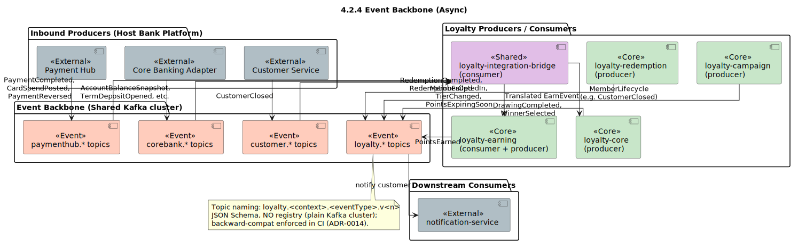

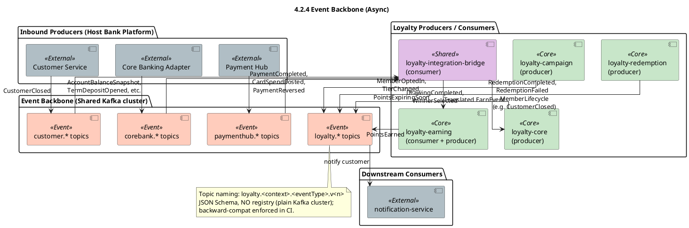
```plantuml
@startuml LoyaltyEventBackbone
title 4.2.4 Event Backbone (Async)

skinparam linetype ortho

skinparam component {
  BackgroundColor<<Core>> #C8E6C9
  BackgroundColor<<Shared>> #E1BEE7
  BackgroundColor<<Event>> #FFCCBC
  BackgroundColor<<External>> #B0BEC5
  BorderColor #424242
}

package "Inbound Producers (Host Bank Platform)" {
  [Payment Hub] <<External>> as PH
  [Core Banking Adapter] <<External>> as T24A
  [Customer Service] <<External>> as RDBSvc
}

package "Event Backbone (Shared Kafka cluster)" {
  [paymenthub.* topics] <<Event>> as PHTopic
  [corebank.* topics] <<Event>> as T24Topic
  [customer.* topics] <<Event>> as RDBTopic
  [loyalty.* topics] <<Event>> as LoyTopic
}

package "Loyalty Producers / Consumers" {
  [loyalty-integration-bridge\n(consumer)] <<Shared>> as Bridge
  [loyalty-earning\n(consumer + producer)] <<Core>> as Earn
  [loyalty-core\n(producer)] <<Core>> as Core
  [loyalty-redemption\n(producer)] <<Core>> as Redm
  [loyalty-campaign\n(producer)] <<Core>> as Camp
}

package "Downstream Consumers" {
  [notification-service] <<External>> as NSvc
}

' Inbound flow
PH --> PHTopic : PaymentCompleted,\nCardSpendPosted,\nPaymentReversed
T24A --> T24Topic : AccountBalanceSnapshot,\nTermDepositOpened, etc.
RDBSvc --> RDBTopic : CustomerClosed

PHTopic --> Bridge
T24Topic --> Bridge
RDBTopic --> Bridge

Bridge --> Earn : Translated EarnEvent
Bridge --> Core : MemberLifecycle\n(e.g. CustomerClosed)

' Outbound Loyalty events
Earn --> LoyTopic : PointsEarned
Core --> LoyTopic : MemberOptedIn,\nTierChanged,\nPointsExpiringSoon
Redm --> LoyTopic : RedemptionCompleted,\nRedemptionFailed
Camp --> LoyTopic : DrawingCompleted,\nWinnerSelected

' Downstream
LoyTopic --> NSvc : notify customer

note bottom of LoyTopic
  Topic naming: loyalty.<context>.<eventType>.v<n>
  JSON Schema, NO registry (plain Kafka cluster);
  backward-compat enforced in CI.
end note

@enduml
```

### 4.3 Application Component Catalogue (Selected Highlights)

Only components requiring **special architectural attention** are detailed here. Full component-to-capability mapping is captured in the Level-0 view above.

| Component | Service | Purpose | Architectural Notes |
|---|---|---|---|
| **Membership Aggregate** | `loyalty-core` | Owns Program, Member, opt-in lifecycle, T&Cs versioning, Tier projection. | Single writer to `Member`. Tier is a projection of the Ledger + Program config, not a separate service. |
| **Point Ledger** | `loyalty-core` | Append-only ledger of all Point movements (Qualifying + Redeemable deltas). | **Source of truth for Points.** Immutable. `(sourceRef, entryType)` uniqueness enforces idempotency. |
| **Point Reservation Table** | `loyalty-core` | Transient holds on Redeemable Balance during the two-phase redemption flow. | Separate table — not part of the immutable Ledger. TTL sweeper auto-releases stale `HELD` rows. |
| **Point Cohort Projection** | `loyalty-core` | Tracks per-`Earned` cohort consumption to support FIFO expiry. | Rebuildable from Ledger. Used only by Expiry Job and FIFO redemption matcher. |
| **Earn Source Registry** | `loyalty-earning` | Catalogue of supported Earn Sources. **v1 catalogue is fixed at five active sources**: `CARD_SPEND`, `BILL_PAYMENT`, `FUND_TRANSFER` (also routes `P2P_TRANSFER` + `QR_PAYMENT` via canonical-`paymentType` DSL discrimination), `TOPUP`, `TERM_DEPOSIT_OPENED` — plus `PAYMENT_COMPLETED` as inactive fallback for unmapped producer `paymentType` values, and `MANUAL_ADJUSTMENT` for Maker-Checker adjustments. Engagement (`OPT_IN_BONUS`, `PROFILE_COMPLETED`, etc.), state-derived (`MIN_BALANCE_HELD`, `BALANCE_THRESHOLD`), and `REFERRAL_COMPLETED` are **deferred**. | First-class entity; adding a new source whose Domain Event already exists is config-only; deferred families need their own decision before activation. |
| **Rule Engine** | `loyalty-earning` | Interprets the constrained JSON DSL; evaluates active Earning Rules against incoming Earn Events; computes deltas; calls Ledger API. | **No Drools / no scripted runtime**. Stateless except for rule cache and rate-limit counters. |
| **Decision-Table BEP UI** | `loyalty-admin-bff` (frontend served from BEP) | Visual editor for Earning Rules backed by the same canonical JSON DSL. | Plus a raw-JSON power-user mode with schema validation. |
| **Reward Catalogue** | `loyalty-redemption` | Configurable Rewards with type, eligibility, inventory, validity window. | Catalogue-driven. Adding a new Reward of an existing Type is config; a new Reward Type is engineering (new Fulfillment Adapter). |
| **Fulfillment Adapter Framework** | `loyalty-redemption` | Plug-in style: each Reward Type has a Fulfillment Adapter implementing `reserve() / commit() / release()`. | v1 adapters: `CashbackAdapter`, `BillPaymentVoucherAdapter`, `ThirdPartyVoucherAdapter`, `SweepstakesAdapter`. |
| **Campaign Aggregate** | `loyalty-campaign` | Bundles time-bounded Earning Rules + Rewards + targeting; manages Drawing for sweepstakes. | Coordinates with Earning and Reward services to activate/deactivate Campaign content. |
| **Integration Bridge** | `loyalty-integration-bridge` | **Ingress gateway**: consumes the **Loyalty-authored** inbound contract `loyalty.ingress.*` (which each Host Bank's own adapter produces — the adapter, not the Bridge, absorbs bank-native schemas), validates it against the bundled JSON Schema (invalid → per-channel DLQ), stamps the canonical `source`, and re-emits Canonical Loyalty Events. Portability now comes from every bank conforming to the contract; the per-bank YAML mapping seam moved bank-side. Also hosts the cross-cutting consumers (Velocity Anomaly, voucher webhook). | **Stateless, no database.** Customer-scoped output (no member/program resolution — that is `loyalty-earning`'s job). Idempotent producer; downstream dedups by `eventId`. Unmapped discriminator values use `EMIT_FALLBACK_AND_ALERT`. |
| **Maker-Checker Workflow** | `loyalty-admin-bff` + `loyalty-core` | All Manual Adjustments require disjoint maker + checker. Both identities populated on the `Adjusted` Ledger Entry. | Per-role caps. |
| **Velocity Anomaly Consumer** | `loyalty-integration-bridge` | Streaming consumer of Ledger events flagging unusual earn rates per Member. | Non-blocking; emits alerts to fraud ops queue. |

### 4.4 Anti-Corruption Layer Pattern

Every external interaction goes through a dedicated adapter exposing a Loyalty-internal contract.

  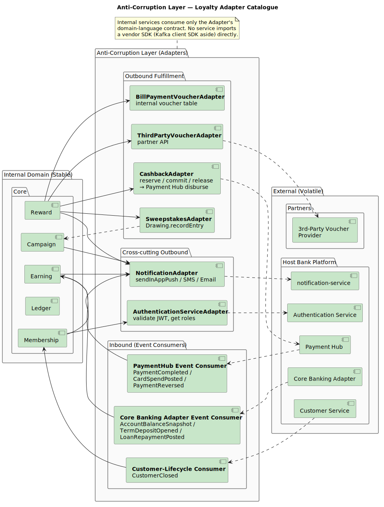

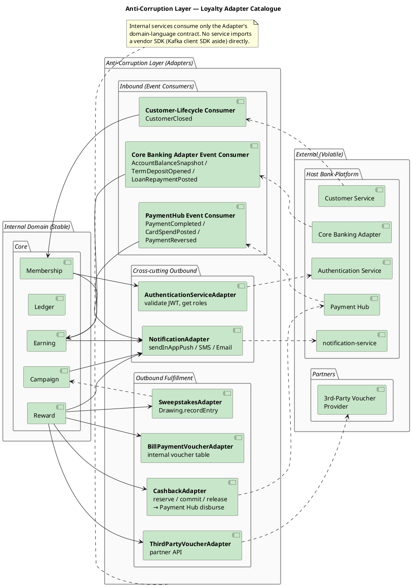
```plantuml
@startuml LoyaltyACLPattern
title Anti-Corruption Layer — Loyalty Adapter Catalogue

left to right direction

skinparam component {
  BackgroundColor #C8E6C9
  BorderColor #424242
}
skinparam package {
  BackgroundColor #FAFAFA
  BorderColor #757575
  FontStyle italic
}

package "Internal Domain (Stable)" as INT {
  package "Core" as INT1 {
    [Membership] as MS
    [Ledger] as LG
    [Earning] as EN
    [Reward] as RW
    [Campaign] as CP
  }
}

package "Anti-Corruption Layer (Adapters)" as ACL {
  package "Inbound (Event Consumers)" as ACLI {
    [**PaymentHub Event Consumer**\nPaymentCompleted /\nCardSpendPosted /\nPaymentReversed] as PHC
    [**Core Banking Adapter Event Consumer**\nAccountBalanceSnapshot /\nTermDepositOpened /\nLoanRepaymentPosted] as T24C
    [**Customer-Lifecycle Consumer**\nCustomerClosed] as RDBC
  }
  package "Outbound Fulfillment" as ACLO {
    [**CashbackAdapter**\nreserve / commit / release\n→ Payment Hub disburse] as CashAdp
    [**BillPaymentVoucherAdapter**\ninternal voucher table] as BillAdp
    [**ThirdPartyVoucherAdapter**\npartner API] as TPAdp
    [**SweepstakesAdapter**\nDrawing.recordEntry] as SwpAdp
  }
  package "Cross-cutting Outbound" as ACLX {
    [**NotificationAdapter**\nsendInAppPush / SMS / Email] as NotAdp
    [**AuthenticationServiceAdapter**\nvalidate JWT, get roles] as KCAdp
  }
}

package "External (Volatile)" as EXT {
  package "Host Bank Platform" as EXT1 {
    [Payment Hub] as PH
    [Core Banking Adapter] as T24A
    [Customer Service] as RDBSvc
    [notification-service] as NSvc
    [Authentication Service] as KC
  }
  package "Partners" as EXT2 {
    [3rd-Party Voucher\nProvider] as VPartner
  }
}

' Inbound
PH ..> PHC
T24A ..> T24C
RDBSvc ..> RDBC
PHC --> EN
T24C --> EN
RDBC --> MS

' Outbound Fulfillment
RW --> CashAdp
RW --> BillAdp
RW --> TPAdp
RW --> SwpAdp
CashAdp ..> PH
TPAdp ..> VPartner
SwpAdp ..> CP

' Cross-cutting
MS --> NotAdp
EN --> NotAdp
RW --> NotAdp
CP --> NotAdp
NotAdp ..> NSvc
MS --> KCAdp
KCAdp ..> KC

note bottom of ACL
  Internal services consume only the Adapter's
  domain-language contract. No service imports
  a vendor SDK (Kafka client SDK aside) directly.
end note

@enduml
```

### 4.5 Two-Phase Redemption Pattern

The unified redemption flow used by every Reward Type, regardless of fulfillment latency.

  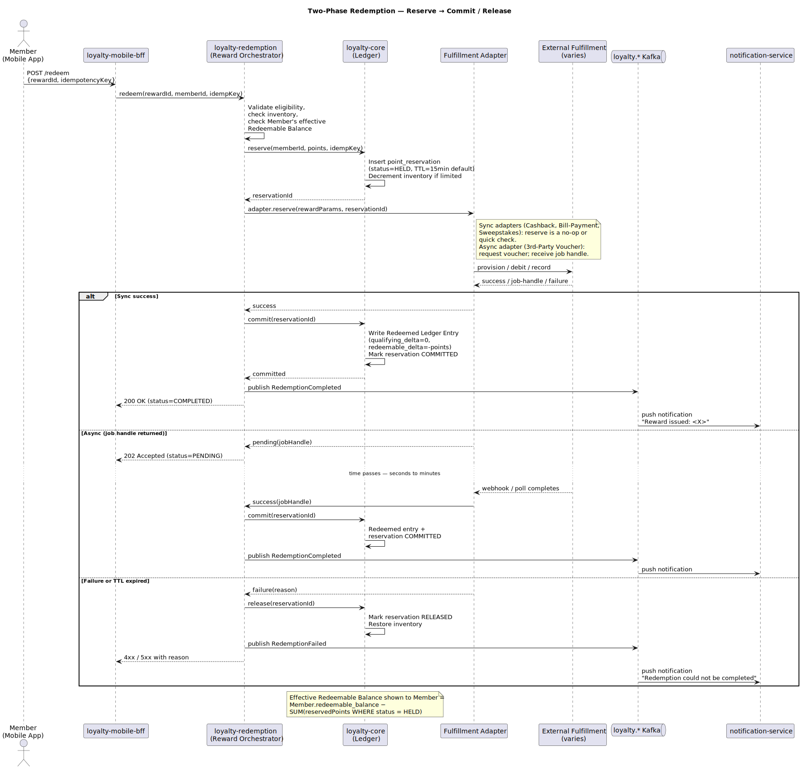

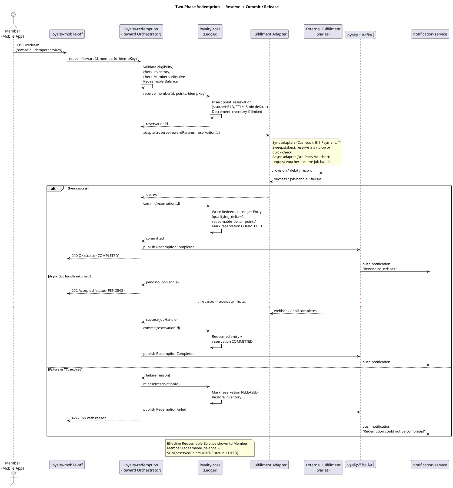
```plantuml
@startuml TwoPhaseRedemption
title Two-Phase Redemption — Reserve → Commit / Release

actor "Member\n(Mobile App)" as Member
participant "loyalty-mobile-bff" as BFF
participant "loyalty-redemption\n(Reward Orchestrator)" as Reward
participant "loyalty-core\n(Ledger)" as Ledger
participant "Fulfillment Adapter" as Adapter
participant "External Fulfillment\n(varies)" as Ext
queue "loyalty.* Kafka" as K
participant "notification-service" as Notif

Member -> BFF : POST /redeem\n{rewardId, idempotencyKey}
BFF -> Reward : redeem(rewardId, memberId, idempKey)
Reward -> Reward : Validate eligibility,\ncheck inventory,\ncheck Member's effective\nRedeemable Balance

Reward -> Ledger : reserve(memberId, points, idempKey)
Ledger -> Ledger : Insert point_reservation\n(status=HELD, TTL=15min default)\nDecrement inventory if limited
Ledger --> Reward : reservationId

Reward -> Adapter : adapter.reserve(rewardParams, reservationId)
note right of Adapter
  Sync adapters (Cashback, Bill-Payment,
  Sweepstakes): reserve is a no-op or
  quick check.
  Async adapter (3rd-Party Voucher):
  request voucher; receive job handle.
end note

Adapter -> Ext : provision / debit / record
Ext --> Adapter : success / job-handle / failure

alt Sync success
  Adapter --> Reward : success
  Reward -> Ledger : commit(reservationId)
  Ledger -> Ledger : Write Redeemed Ledger Entry\n(qualifying_delta=0,\nredeemable_delta=-points)\nMark reservation COMMITTED
  Ledger --> Reward : committed
  Reward -> K : publish RedemptionCompleted
  Reward --> BFF : 200 OK (status=COMPLETED)
  K -> Notif : push notification\n"Reward issued: <X>"

else Async (job handle returned)
  Adapter --> Reward : pending(jobHandle)
  Reward --> BFF : 202 Accepted (status=PENDING)
  ... time passes — seconds to minutes ...
  Ext --> Adapter : webhook / poll completes
  Adapter -> Reward : success(jobHandle)
  Reward -> Ledger : commit(reservationId)
  Ledger -> Ledger : Redeemed entry +\nreservation COMMITTED
  Reward -> K : publish RedemptionCompleted
  K -> Notif : push notification

else Failure or TTL expired
  Adapter --> Reward : failure(reason)
  Reward -> Ledger : release(reservationId)
  Ledger -> Ledger : Mark reservation RELEASED\nRestore inventory
  Reward -> K : publish RedemptionFailed
  Reward --> BFF : 4xx / 5xx with reason
  K -> Notif : push notification\n"Redemption could not be completed"
end

note over Ledger
  Effective Redeemable Balance shown to Member =
  Member.redeemable_balance −
  SUM(reservedPoints WHERE status = HELD)
end note

@enduml
```

### 4.6 Critical Sequence Flows

The five customer-critical flows. These are the canonical references for service implementations, SLA targets, and integration testing scenarios.

#### 4.6.1 Earning — Happy Path (Card Spend)

End-to-end target: **95% of Earn Events credit Points within 10 seconds of the originating Domain Event being published.**

  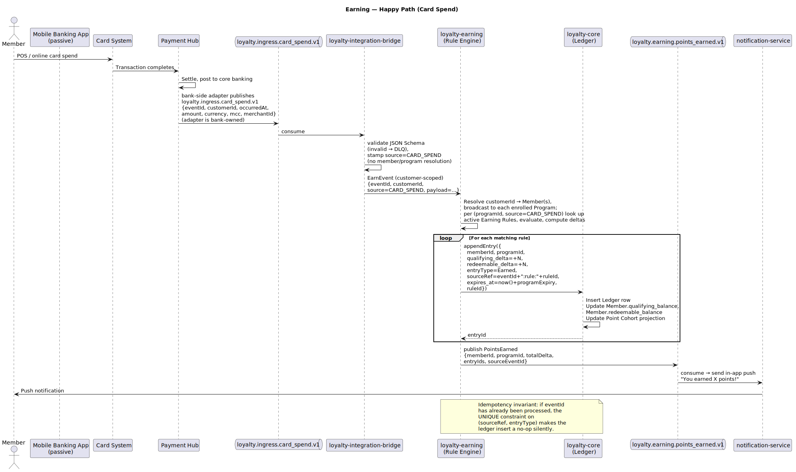

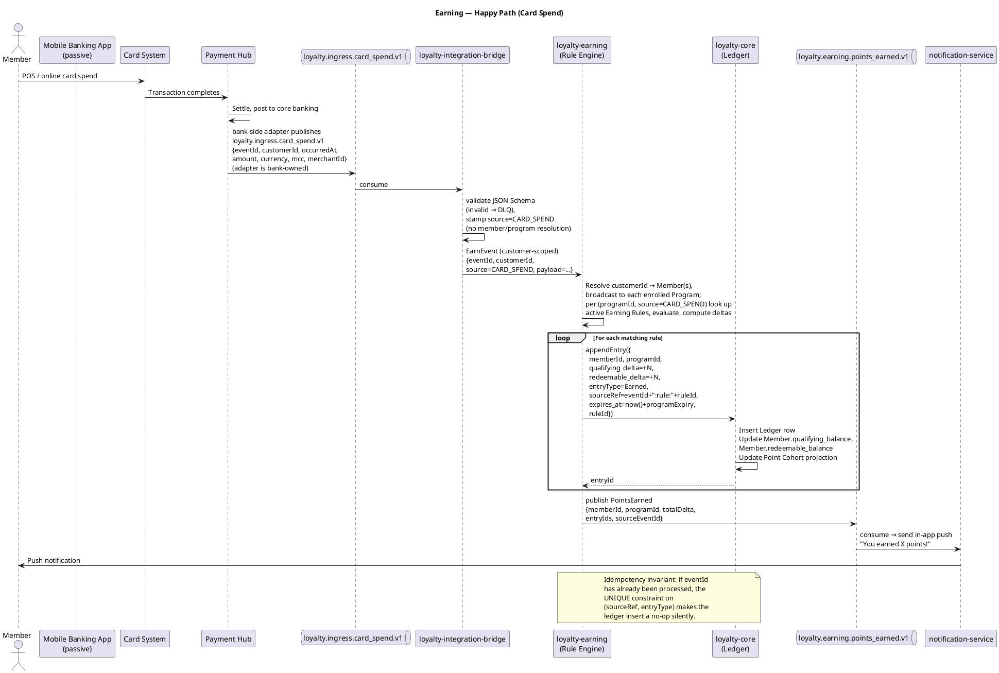
```plantuml
@startuml EarningHappyPath
title Earning — Happy Path (Card Spend)

actor Member
participant "Mobile Banking App\n(passive)" as App
participant "Card System" as Card
participant "Payment Hub" as PH
queue "loyalty.ingress.card_spend.v1" as K1
participant "loyalty-integration-bridge" as Bridge
participant "loyalty-earning\n(Rule Engine)" as Earn
participant "loyalty-core\n(Ledger)" as Ledger
queue "loyalty.earning.points_earned.v1" as K2
participant "notification-service" as Notif

Member -> Card : POS / online card spend
Card -> PH : Transaction completes
PH -> PH : Settle, post to core banking
PH -> K1 : bank-side adapter publishes\nloyalty.ingress.card_spend.v1\n{eventId, customerId, occurredAt,\namount, currency, mcc, merchantId}\n(adapter is bank-owned)

K1 -> Bridge : consume
Bridge -> Bridge : validate JSON Schema\n(invalid → DLQ),\nstamp source=CARD_SPEND\n(no member/program resolution)
Bridge -> Earn : EarnEvent (customer-scoped)\n{eventId, customerId,\nsource=CARD_SPEND, payload=...}

Earn -> Earn : Resolve customerId → Member(s),\nbroadcast to each enrolled Program;\nper (programId, source=CARD_SPEND) look up\nactive Earning Rules, evaluate, compute deltas

loop For each matching rule
  Earn -> Ledger : appendEntry({\n  memberId, programId,\n  qualifying_delta=+N,\n  redeemable_delta=+N,\n  entryType=Earned,\n  sourceRef=eventId+":rule:"+ruleId,\n  expires_at=now()+programExpiry,\n  ruleId})
  Ledger -> Ledger : Insert Ledger row\nUpdate Member.qualifying_balance,\nMember.redeemable_balance\nUpdate Point Cohort projection
  Ledger --> Earn : entryId
end

Earn -> K2 : publish PointsEarned\n{memberId, programId, totalDelta,\nentryIds, sourceEventId}

K2 -> Notif : consume → send in-app push\n"You earned X points!"
Notif -> Member : Push notification

note over Earn, Ledger
  Idempotency invariant: if eventId
  has already been processed, the
  UNIQUE constraint on
  (sourceRef, entryType) makes the
  ledger insert a no-op silently.
end note

@enduml
```

**SLA targets**:
- `CardSpendPosted` published → `PointsEarned` Ledger entries written: **p95 < 10s, p99 < 30s**
- Customer push notification arrival: **< 10s** after `PointsEarned`

#### 4.6.2 Redemption — Cashback to CASA (Sync)

End-to-end target: **`reserve()` + `commit()` complete within 1.5 s p95 for sync adapters.**

  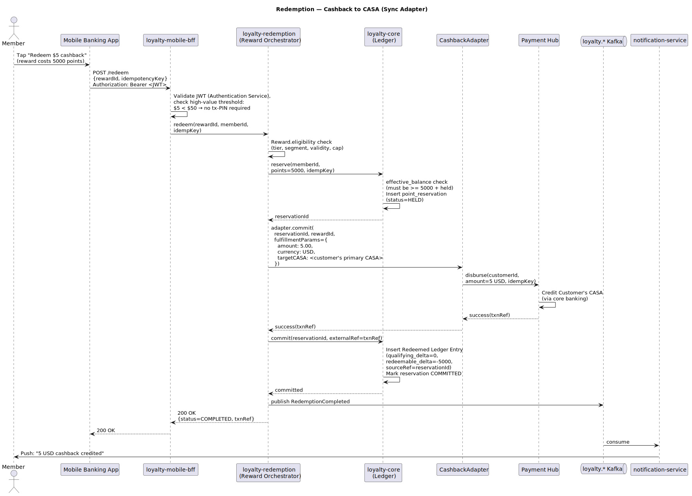

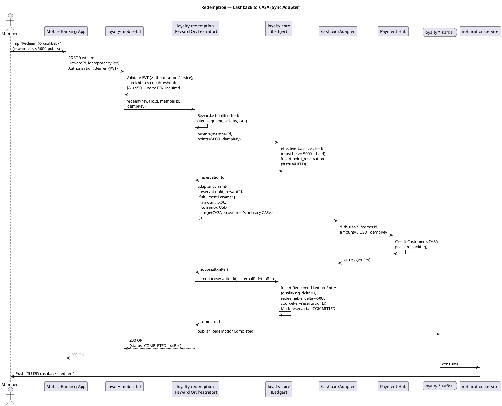
```plantuml
@startuml RedemptionCashback
title Redemption — Cashback to CASA (Sync Adapter)

actor Member
participant "Mobile Banking App" as App
participant "loyalty-mobile-bff" as BFF
participant "loyalty-redemption\n(Reward Orchestrator)" as Reward
participant "loyalty-core\n(Ledger)" as Ledger
participant "CashbackAdapter" as Adp
participant "Payment Hub" as PH
queue "loyalty.* Kafka" as K
participant "notification-service" as Notif

Member -> App : Tap "Redeem $5 cashback"\n(reward costs 5000 points)
App -> BFF : POST /redeem\n{rewardId, idempotencyKey}\nAuthorization: Bearer <JWT>
BFF -> BFF : Validate JWT (Authentication Service),\ncheck high-value threshold:\n$5 < $50 → no tx-PIN required

BFF -> Reward : redeem(rewardId, memberId,\nidempKey)
Reward -> Reward : Reward.eligibility check\n(tier, segment, validity, cap)
Reward -> Ledger : reserve(memberId,\npoints=5000, idempKey)
Ledger -> Ledger : effective_balance check\n(must be >= 5000 + held)\nInsert point_reservation\n(status=HELD)
Ledger --> Reward : reservationId

Reward -> Adp : adapter.commit(\n  reservationId, rewardId,\n  fulfillmentParams={\n    amount: 5.00,\n    currency: USD,\n    targetCASA: <customer's primary CASA>\n  })
Adp -> PH : disburse(customerId,\namount=5 USD, idempKey)
PH -> PH : Credit Customer's CASA\n(via core banking)
PH --> Adp : success(txnRef)
Adp --> Reward : success(txnRef)

Reward -> Ledger : commit(reservationId, externalRef=txnRef)
Ledger -> Ledger : Insert Redeemed Ledger Entry\n(qualifying_delta=0,\nredeemable_delta=-5000,\nsourceRef=reservationId)\nMark reservation COMMITTED
Ledger --> Reward : committed

Reward -> K : publish RedemptionCompleted
Reward --> BFF : 200 OK\n{status=COMPLETED, txnRef}
BFF --> App : 200 OK

K -> Notif : consume
Notif -> Member : Push: "5 USD cashback credited"

@enduml
```

#### 4.6.3 Redemption — 3rd-Party Voucher (Async)

The 3rd-party voucher case where fulfillment is asynchronous (partner API may return seconds-to-minutes later).

  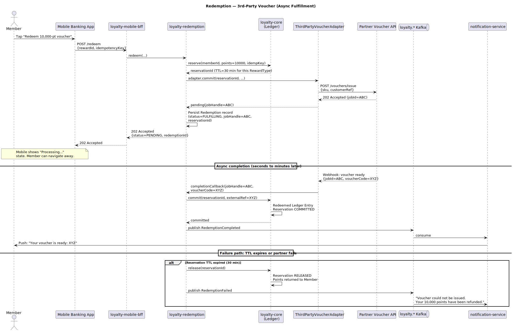

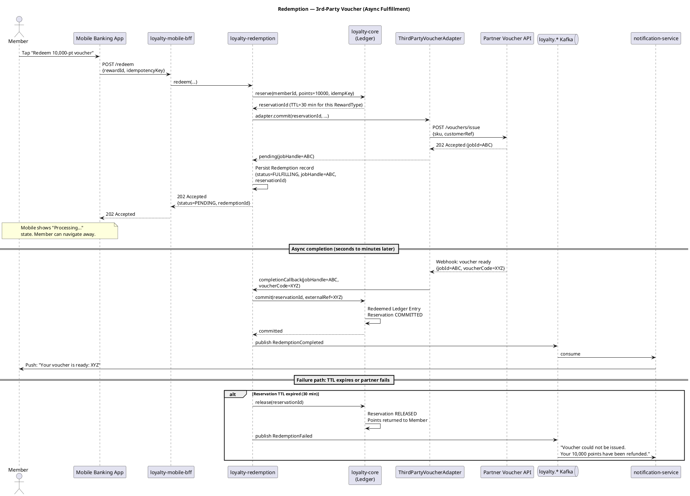
```plantuml
@startuml Redemption3rdPartyVoucher
title Redemption — 3rd-Party Voucher (Async Fulfillment)

actor Member
participant "Mobile Banking App" as App
participant "loyalty-mobile-bff" as BFF
participant "loyalty-redemption" as Reward
participant "loyalty-core\n(Ledger)" as Ledger
participant "ThirdPartyVoucherAdapter" as Adp
participant "Partner Voucher API" as Partner
queue "loyalty.* Kafka" as K
participant "notification-service" as Notif

Member -> App : Tap "Redeem 10,000-pt voucher"
App -> BFF : POST /redeem\n{rewardId, idempotencyKey}
BFF -> Reward : redeem(...)
Reward -> Ledger : reserve(memberId, points=10000, idempKey)
Ledger --> Reward : reservationId (TTL=30 min for this RewardType)

Reward -> Adp : adapter.commit(reservationId, ...)
Adp -> Partner : POST /vouchers/issue\n{sku, customerRef}
Partner --> Adp : 202 Accepted (jobId=ABC)
Adp --> Reward : pending(jobHandle=ABC)

Reward -> Reward : Persist Redemption record\n(status=FULFILLING, jobHandle=ABC,\nreservationId)
Reward --> BFF : 202 Accepted\n{status=PENDING, redemptionId}
BFF --> App : 202 Accepted

note over Member, App
  Mobile shows "Processing..."
  state. Member can navigate away.
end note

== Async completion (seconds to minutes later) ==

Partner --> Adp : Webhook: voucher ready\n{jobId=ABC, voucherCode=XYZ}
Adp -> Reward : completionCallback(jobHandle=ABC,\nvoucherCode=XYZ)

Reward -> Ledger : commit(reservationId, externalRef=XYZ)
Ledger -> Ledger : Redeemed Ledger Entry\nReservation COMMITTED
Ledger --> Reward : committed

Reward -> K : publish RedemptionCompleted

K -> Notif : consume
Notif -> Member : Push: "Your voucher is ready: XYZ"

== Failure path: TTL expires or partner fails ==

alt Reservation TTL expired (30 min)
  Reward -> Ledger : release(reservationId)
  Ledger -> Ledger : Reservation RELEASED\nPoints returned to Member
  Reward -> K : publish RedemptionFailed
  K -> Notif : "Voucher could not be issued.\nYour 10,000 points have been refunded."
end

@enduml
```

#### 4.6.4 Refund Clawback (PaymentReversed)

When Payment Hub emits a `PaymentReversed` event for a payment that previously earned Points, Loyalty claws back the originally-earned Points — even if the Member has already spent them (Redeemable Balance may go negative).

  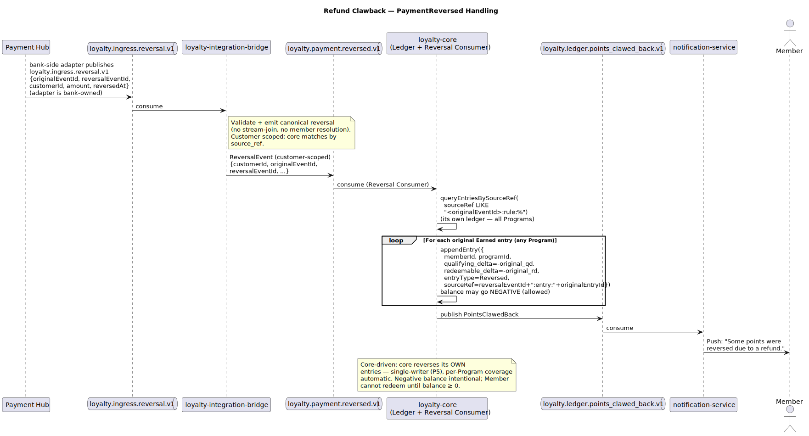

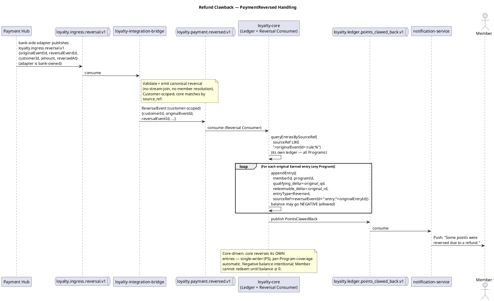
```plantuml
@startuml RefundClawback
title Refund Clawback — PaymentReversed Handling

participant "Payment Hub" as PH
queue "loyalty.ingress.reversal.v1" as K1
participant "loyalty-integration-bridge" as Bridge
queue "loyalty.payment.reversed.v1" as K2
participant "loyalty-core\n(Ledger + Reversal Consumer)" as Ledger
queue "loyalty.ledger.points_clawed_back.v1" as K3
participant "notification-service" as Notif
actor Member

PH -> K1 : bank-side adapter publishes\nloyalty.ingress.reversal.v1\n{originalEventId, reversalEventId,\ncustomerId, amount, reversedAt}\n(adapter is bank-owned)

K1 -> Bridge : consume
note right of Bridge
  Validate + emit canonical reversal
  (no stream-join, no member resolution).
  Customer-scoped; core matches by
  source_ref.
end note
Bridge -> K2 : ReversalEvent (customer-scoped)\n{customerId, originalEventId,\nreversalEventId, ...}

K2 -> Ledger : consume (Reversal Consumer)
Ledger -> Ledger : queryEntriesBySourceRef(\n  sourceRef LIKE\n  "<originalEventId>:rule:%")\n(its own ledger — all Programs)

loop For each original Earned entry (any Program)
  Ledger -> Ledger : appendEntry({\n  memberId, programId,\n  qualifying_delta=-original_qd,\n  redeemable_delta=-original_rd,\n  entryType=Reversed,\n  sourceRef=reversalEventId+":entry:"+originalEntryId})\nbalance may go NEGATIVE (allowed)
end

Ledger -> K3 : publish PointsClawedBack
K3 -> Notif : consume
Notif -> Member : Push: "Some points were\nreversed due to a refund."

note over Ledger
  Core-driven: core reverses its OWN
  entries — single-writer (P5), per-Program coverage
  automatic. Negative balance intentional; Member
  cannot redeem until balance ≥ 0.
end note

@enduml
```

#### 4.6.5 Sweepstakes — Entry + Drawing

  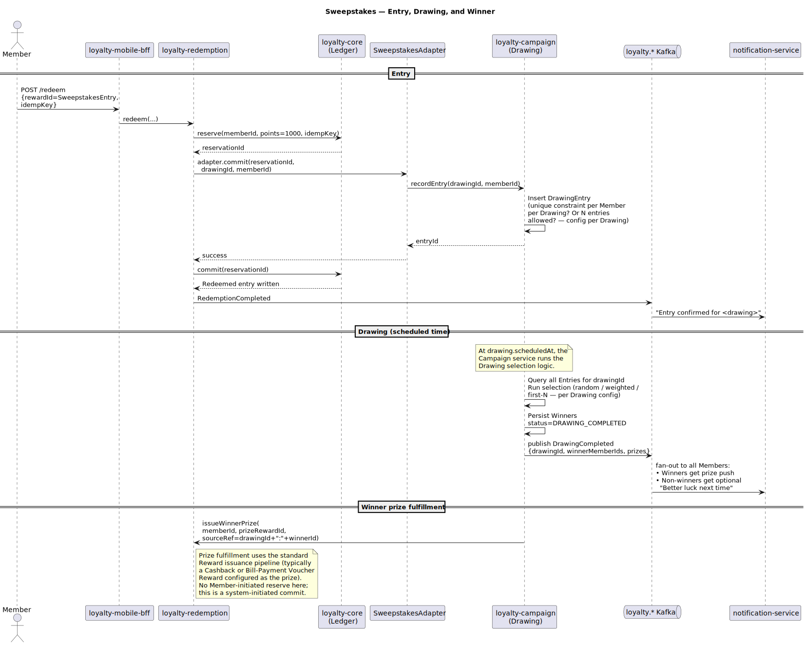

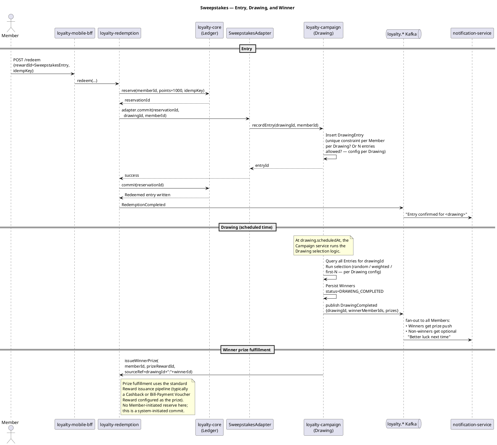
```plantuml
@startuml SweepstakesFlow
title Sweepstakes — Entry, Drawing, and Winner

actor Member
participant "loyalty-mobile-bff" as BFF
participant "loyalty-redemption" as Reward
participant "loyalty-core\n(Ledger)" as Ledger
participant "SweepstakesAdapter" as Adp
participant "loyalty-campaign\n(Drawing)" as Camp
queue "loyalty.* Kafka" as K
participant "notification-service" as Notif

== Entry ==

Member -> BFF : POST /redeem\n{rewardId=SweepstakesEntry,\nidempKey}
BFF -> Reward : redeem(...)
Reward -> Ledger : reserve(memberId, points=1000, idempKey)
Ledger --> Reward : reservationId
Reward -> Adp : adapter.commit(reservationId,\n  drawingId, memberId)
Adp -> Camp : recordEntry(drawingId, memberId)
Camp -> Camp : Insert DrawingEntry\n(unique constraint per Member\nper Drawing? Or N entries\nallowed? — config per Drawing)
Camp --> Adp : entryId
Adp --> Reward : success
Reward -> Ledger : commit(reservationId)
Ledger --> Reward : Redeemed entry written
Reward -> K : RedemptionCompleted
K -> Notif : "Entry confirmed for <drawing>"

== Drawing (scheduled time) ==

note over Camp
  At drawing.scheduledAt, the
  Campaign service runs the
  Drawing selection logic.
end note

Camp -> Camp : Query all Entries for drawingId\nRun selection (random / weighted /\nfirst-N — per Drawing config)
Camp -> Camp : Persist Winners\nstatus=DRAWING_COMPLETED

Camp -> K : publish DrawingCompleted\n{drawingId, winnerMemberIds, prizes}

K -> Notif : fan-out to all Members:\n• Winners get prize push\n• Non-winners get optional\n  "Better luck next time"

== Winner prize fulfillment ==

Camp -> Reward : issueWinnerPrize(\nmemberId, prizeRewardId,\nsourceRef=drawingId+":"+winnerId)
note right of Reward
  Prize fulfillment uses the standard
  Reward issuance pipeline (typically
  a Cashback or Bill-Payment Voucher
  Reward configured as the prize).
  No Member-initiated reserve here;
  this is a system-initiated commit.
end note

@enduml
```

#### 4.6.6 Manual Point Adjustment — BEP-delegated approval

  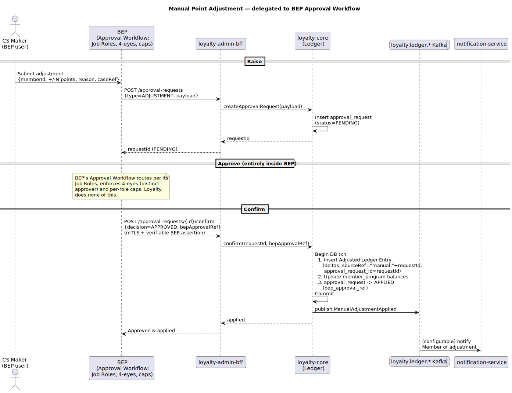

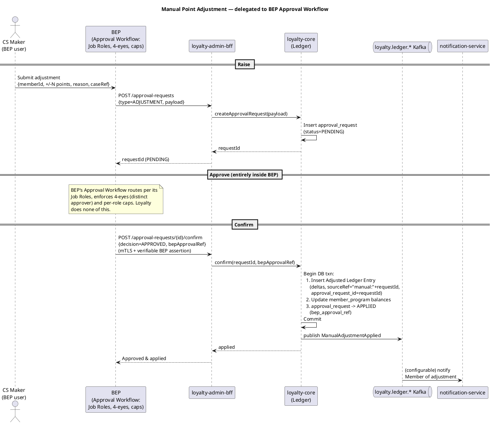
```plantuml
@startuml MakerCheckerFlow
title Manual Point Adjustment — delegated to BEP Approval Workflow

actor "CS Maker\n(BEP user)" as Maker
participant "BEP\n(Approval Workflow:\nJob Roles, 4-eyes, caps)" as BEP
participant "loyalty-admin-bff" as ABFF
participant "loyalty-core\n(Ledger)" as Core
queue "loyalty.ledger.* Kafka" as K
participant "notification-service" as Notif

== Raise ==
Maker -> BEP : Submit adjustment\n{memberId, +/-N points, reason, caseRef}
BEP -> ABFF : POST /approval-requests\n{type=ADJUSTMENT, payload}
ABFF -> Core : createApprovalRequest(payload)
Core -> Core : Insert approval_request\n(status=PENDING)
Core --> ABFF : requestId
ABFF --> BEP : requestId (PENDING)

== Approve (entirely inside BEP) ==
note over BEP
  BEP's Approval Workflow routes per its
  Job Roles, enforces 4-eyes (distinct
  approver) and per-role caps. Loyalty
  does none of this.
end note

== Confirm ==
BEP -> ABFF : POST /approval-requests/{id}/confirm\n{decision=APPROVED, bepApprovalRef}\n(mTLS + verifiable BEP assertion)
ABFF -> Core : confirm(requestId, bepApprovalRef)
Core -> Core : Begin DB txn:\n  1. Insert Adjusted Ledger Entry\n     (deltas, sourceRef="manual:"+requestId,\n      approval_request_id=requestId)\n  2. Update member_program balances\n  3. approval_request -> APPLIED\n     (bep_approval_ref)\nCommit
Core -> K : publish ManualAdjustmentApplied
Core --> ABFF : applied
ABFF --> BEP : Approved & applied

K -> Notif : (configurable) notify\nMember of adjustment

@enduml
```

---

## 5. Data Architecture

### 5.1 Data Domain Model

The platform owns the following data domains. Each has a single source of truth.

| Data Domain | System of Record | Source | Refresh Pattern | Sensitivity |
|---|---|---|---|---|
| **Member Master** | `loyalty-core` DB | Self-service opt-in via Mobile App | Real-time write | Low (no PII — `customerId` only) |
| **Customer PII** | Customer Service | Existing | Not duplicated in Loyalty | **High** (managed by the HBP) |
| **Point Ledger (append-only)** | `loyalty-core` DB | Earning Service writes, Redemption commits, Expiry job, Manual Adjustments | Real-time, transactional | **Financial — High** |
| **Point Reservation** | `loyalty-core` DB | Reward Orchestrator | Real-time, transactional, transient | Low |
| **Point Cohort Projection** | `loyalty-core` DB | Maintained by Ledger writes + Expiry job | Real-time | Low |
| **Earn Source Registry** | `loyalty-earning` DB | Platform seed + BEP edits | Config-driven | Low |
| **Earning Rule** | `loyalty-earning` DB | BEP authoring | Config-driven, versioned | Medium (business logic IP) |
| **Reward Catalogue** | `loyalty-redemption` DB | BEP authoring | Config-driven | Low |
| **Redemption Record** | `loyalty-redemption` DB | Mobile redeem flow | Real-time | Medium |
| **Campaign + Drawing + Entry** | `loyalty-campaign` DB | BEP authoring + Member redemptions | Real-time | Low |
| **Service Audit Logs** | Per-service DB | BEP admin writes | Real-time append | High |

### 5.2 Conceptual Data Model

  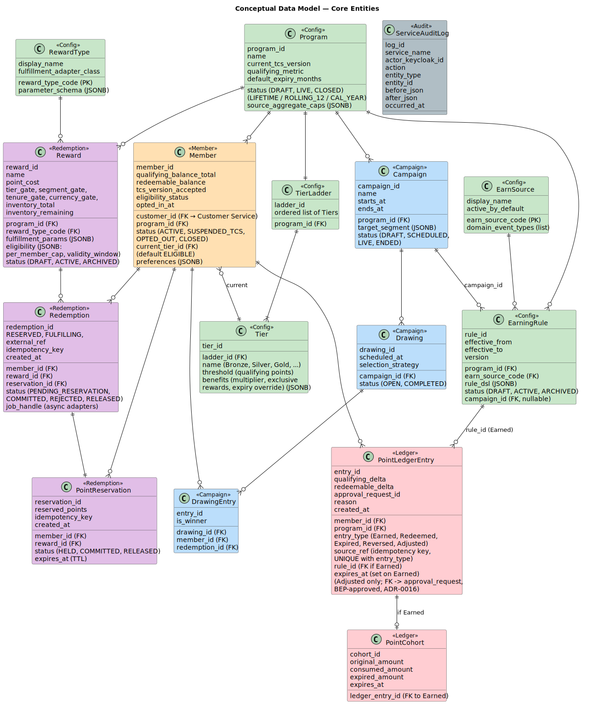

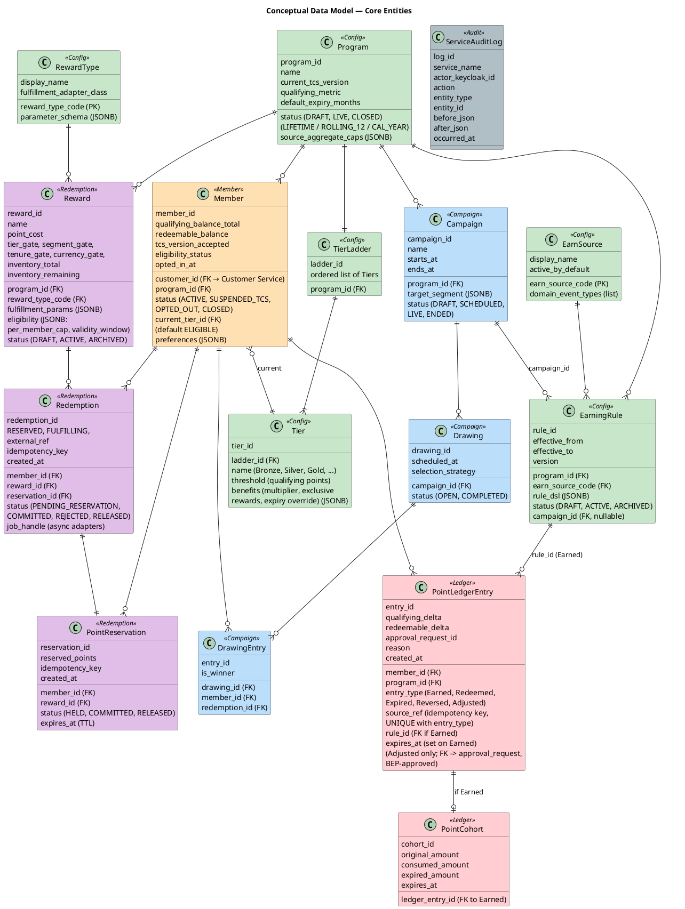
```plantuml
@startuml LoyaltyConceptualDataModel
title Conceptual Data Model — Core Entities

skinparam class {
  BackgroundColor<<Config>> #C8E6C9
  BackgroundColor<<Member>> #FFE0B2
  BackgroundColor<<Ledger>> #FFCDD2
  BackgroundColor<<Redemption>> #E1BEE7
  BackgroundColor<<Campaign>> #BBDEFB
  BackgroundColor<<Audit>> #B0BEC5
  BorderColor #424242
}

class Program <<Config>> {
  program_id
  name
  status (DRAFT, LIVE, CLOSED)
  current_tcs_version
  qualifying_metric
    (LIFETIME / ROLLING_12 / CAL_YEAR)
  default_expiry_months
  source_aggregate_caps (JSONB)
}

class TierLadder <<Config>> {
  ladder_id
  program_id (FK)
  ordered list of Tiers
}

class Tier <<Config>> {
  tier_id
  ladder_id (FK)
  name (Bronze, Silver, Gold, ...)
  threshold (qualifying points)
  benefits (multiplier, exclusive
    rewards, expiry override) (JSONB)
}

class Member <<Member>> {
  member_id
  customer_id (FK → Customer Service)
  program_id (FK)
  status (ACTIVE, SUSPENDED_TCS,
    OPTED_OUT, CLOSED)
  current_tier_id (FK)
  qualifying_balance_total
  redeemable_balance
  tcs_version_accepted
  eligibility_status
    (default ELIGIBLE)
  opted_in_at
  preferences (JSONB)
}

class PointLedgerEntry <<Ledger>> {
  entry_id
  member_id (FK)
  program_id (FK)
  qualifying_delta
  redeemable_delta
  entry_type (Earned, Redeemed,
    Expired, Reversed, Adjusted)
  source_ref (idempotency key,
    UNIQUE with entry_type)
  rule_id (FK if Earned)
  expires_at (set on Earned)
  approval_request_id
    (Adjusted only; FK -> approval_request,
     BEP-approved)
  reason
  created_at
}

class PointCohort <<Ledger>> {
  cohort_id
  ledger_entry_id (FK to Earned)
  original_amount
  consumed_amount
  expired_amount
  expires_at
}

class PointReservation <<Redemption>> {
  reservation_id
  member_id (FK)
  reward_id (FK)
  reserved_points
  status (HELD, COMMITTED, RELEASED)
  expires_at (TTL)
  idempotency_key
  created_at
}

class EarnSource <<Config>> {
  earn_source_code (PK)
  display_name
  domain_event_types (list)
  active_by_default
}

class EarningRule <<Config>> {
  rule_id
  program_id (FK)
  earn_source_code (FK)
  rule_dsl (JSONB)
  effective_from
  effective_to
  status (DRAFT, ACTIVE, ARCHIVED)
  version
  campaign_id (FK, nullable)
}

class Reward <<Redemption>> {
  reward_id
  program_id (FK)
  reward_type_code (FK)
  name
  point_cost
  fulfillment_params (JSONB)
  eligibility (JSONB:
    tier_gate, segment_gate,
    tenure_gate, currency_gate,
    per_member_cap, validity_window)
  inventory_total
  inventory_remaining
  status (DRAFT, ACTIVE, ARCHIVED)
}

class RewardType <<Config>> {
  reward_type_code (PK)
  display_name
  fulfillment_adapter_class
  parameter_schema (JSONB)
}

class Redemption <<Redemption>> {
  redemption_id
  member_id (FK)
  reward_id (FK)
  reservation_id (FK)
  status (PENDING_RESERVATION,
    RESERVED, FULFILLING,
    COMMITTED, REJECTED, RELEASED)
  external_ref
  job_handle (async adapters)
  idempotency_key
  created_at
}

class Campaign <<Campaign>> {
  campaign_id
  program_id (FK)
  name
  starts_at
  ends_at
  target_segment (JSONB)
  status (DRAFT, SCHEDULED,
    LIVE, ENDED)
}

class Drawing <<Campaign>> {
  drawing_id
  campaign_id (FK)
  scheduled_at
  selection_strategy
  status (OPEN, COMPLETED)
}

class DrawingEntry <<Campaign>> {
  entry_id
  drawing_id (FK)
  member_id (FK)
  redemption_id (FK)
  is_winner
}

class ServiceAuditLog <<Audit>> {
  log_id
  service_name
  actor_keycloak_id
  action
  entity_type
  entity_id
  before_json
  after_json
  occurred_at
}

' Relationships
Program ||--|| TierLadder
TierLadder ||--|{ Tier
Program ||--o{ Member
Member }o--|| Tier : current
Member ||--o{ PointLedgerEntry
Member ||--o{ PointReservation
PointLedgerEntry ||--o| PointCohort : "if Earned"
Program ||--o{ EarningRule
EarnSource ||--o{ EarningRule
EarningRule ||--o{ PointLedgerEntry : "rule_id (Earned)"
Program ||--o{ Reward
RewardType ||--o{ Reward
Reward ||--o{ Redemption
Redemption ||--|| PointReservation
Member ||--o{ Redemption
Program ||--o{ Campaign
Campaign ||--o{ Drawing
Campaign ||--o{ EarningRule : "campaign_id"
Drawing ||--o{ DrawingEntry
Member ||--o{ DrawingEntry

@enduml
```

### 5.3 PII & Data Protection

| Data Class | Examples | At-Rest Protection | In-Transit Protection | Access Control |
|---|---|---|---|---|
| **Customer PII (NOT stored)** | Name, DOB, NRC, phone, address | Owned by Customer Service. Loyalty references by `customerId` only. | TLS 1.3 | Loyalty BFFs may fetch display-name from Customer Service at request time (cached short TTL); never persisted. |
| **Loyalty operational** | Member balances, ledger entries, redemption history | Managed-Postgres encryption at rest (KMS) | TLS 1.3 only | Service-to-service mTLS; BEP role-based access (Authentication Service roles) |
| **Earning Rules + Reward configs** | Business logic, rule DSL | DB encryption at rest | TLS 1.3 only | BEP role-restricted; modifications audited |
| **Service audit logs** | BEP admin actions | DB encryption at rest, append-only | TLS 1.3 | Audit role only, indefinite retention (≥ 7 years) |

**PII masking in logs:** any log line in any Loyalty service that includes `customerId` is acceptable; one that includes name, phone, NRC, or email is a defect — Loki ingestion has masking rules to scrub these patterns regardless.

---

## 6. Technology Architecture

### 6.1 Technology Stack by Layer

Matches the Host Bank Platform with no significant deviations (Principle P10).

> **Deployment binding.** The concrete vendor choices throughout §6 (AWS EKS, MSK, RDS Postgres, ElastiCache, S3, KMS, ArgoCD, GitLab) reflect the **v1 HBP deployment**. The platform is portable to any managed-Kubernetes / Kafka / managed-Postgres combination; subsequent deployments substitute their own bindings via `deployments/<bank>/DEPLOYMENT.md`.

  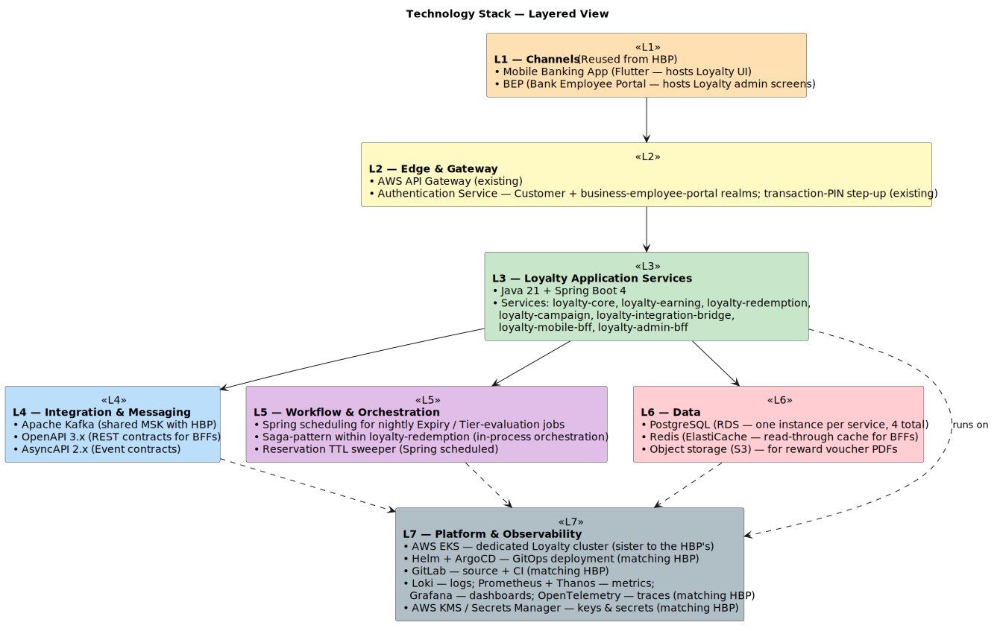

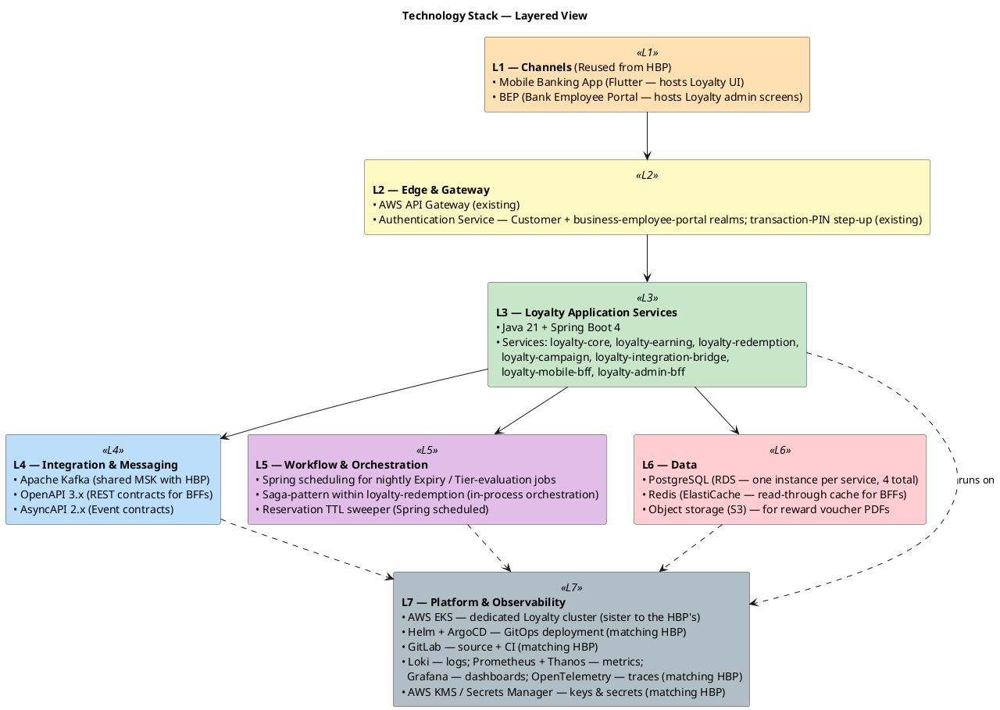
```plantuml
@startuml LoyaltyTechStack
title Technology Stack — Layered View

skinparam rectangle {
  BackgroundColor<<L1>> #FFE0B2
  BackgroundColor<<L2>> #FFF9C4
  BackgroundColor<<L3>> #C8E6C9
  BackgroundColor<<L4>> #BBDEFB
  BackgroundColor<<L5>> #E1BEE7
  BackgroundColor<<L6>> #FFCDD2
  BackgroundColor<<L7>> #B0BEC5
  BorderColor #424242
}

rectangle "**L1 — Channels** (Reused from HBP)\n• Mobile Banking App (Flutter — hosts Loyalty UI)\n• BEP (Bank Employee Portal — hosts Loyalty admin screens)" <<L1>> as L1

rectangle "**L2 — Edge & Gateway**\n• AWS API Gateway (existing)\n• Authentication Service — Customer + business-employee-portal realms; transaction-PIN step-up (existing)" <<L2>> as L2

rectangle "**L3 — Loyalty Application Services**\n• Java 21 + Spring Boot 4\n• Services: loyalty-core, loyalty-earning, loyalty-redemption,\n  loyalty-campaign, loyalty-integration-bridge,\n  loyalty-mobile-bff, loyalty-admin-bff" <<L3>> as L3

rectangle "**L4 — Integration & Messaging**\n• Apache Kafka (shared MSK with HBP)\n• OpenAPI 3.x (REST contracts for BFFs)\n• AsyncAPI 2.x (Event contracts)" <<L4>> as L4

rectangle "**L5 — Workflow & Orchestration**\n• Spring scheduling for nightly Expiry / Tier-evaluation jobs\n• Saga-pattern within loyalty-redemption (in-process orchestration)\n• Reservation TTL sweeper (Spring scheduled)" <<L5>> as L5

rectangle "**L6 — Data**\n• PostgreSQL (RDS — one instance per service, 4 total)\n• Redis (ElastiCache — read-through cache for BFFs)\n• Object storage (S3) — for reward voucher PDFs" <<L6>> as L6

rectangle "**L7 — Platform & Observability**\n• AWS EKS — dedicated Loyalty cluster (sister to the HBP's)\n• Helm + ArgoCD — GitOps deployment (matching HBP)\n• GitLab — source + CI (matching HBP)\n• Loki — logs; Prometheus + Thanos — metrics;\n  Grafana — dashboards; OpenTelemetry — traces (matching HBP)\n• AWS KMS / Secrets Manager — keys & secrets (matching HBP)" <<L7>> as L7

L1 --> L2
L2 --> L3
L3 --> L4
L3 --> L5
L3 --> L6
L3 ..> L7 : runs on
L4 ..> L7
L5 ..> L7
L6 ..> L7

@enduml
```

### 6.2 Deployment Topology (Logical)

  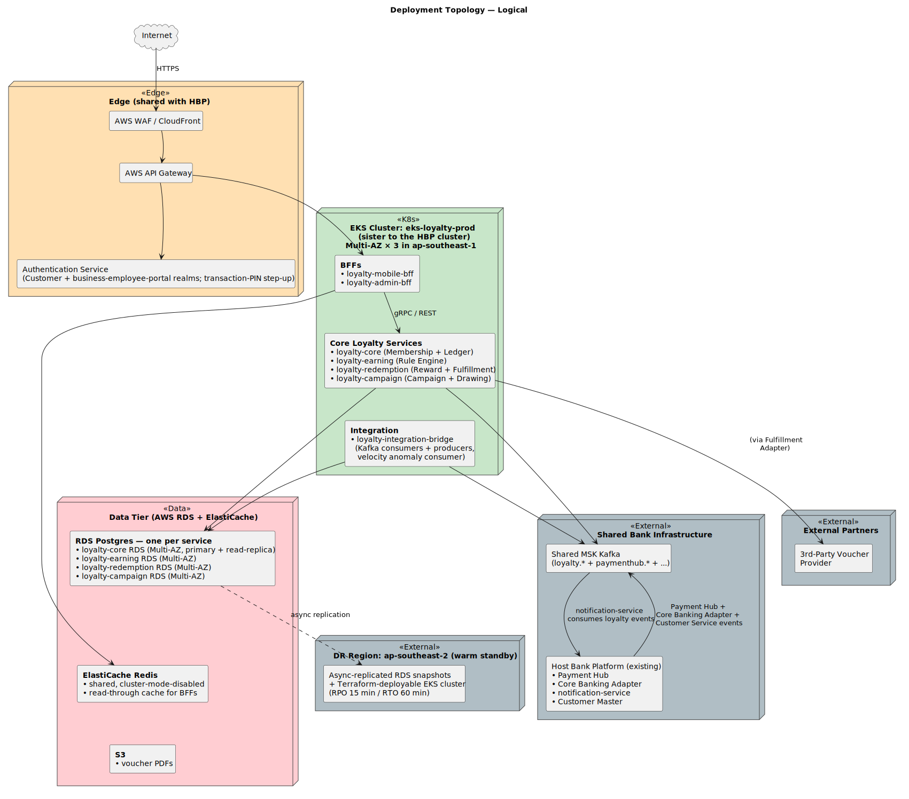

```plantuml
@startuml LoyaltyDeploymentTopology
title Deployment Topology — Logical

skinparam node {
  BackgroundColor<<Edge>> #FFE0B2
  BackgroundColor<<K8s>> #C8E6C9
  BackgroundColor<<Data>> #FFCDD2
  BackgroundColor<<External>> #B0BEC5
  BorderColor #424242
}

cloud "Internet" as Internet

node "Edge (shared with HBP)" <<Edge>> as DMZ {
  rectangle "AWS WAF / CloudFront" as WAF
  rectangle "AWS API Gateway" as APIGW
  rectangle "Authentication Service\n(Customer + business-employee-portal realms; transaction-PIN step-up)" as KC
  WAF -[hidden]- APIGW
  APIGW -[hidden]- KC
}

node "EKS Cluster: eks-loyalty-prod\n(sister to the HBP cluster)\nMulti-AZ × 3 in ap-southeast-1" <<K8s>> as K8s {
  rectangle "**BFFs**\n• loyalty-mobile-bff\n• loyalty-admin-bff" as BFFs

  rectangle "**Core Loyalty Services**\n• loyalty-core (Membership + Ledger)\n• loyalty-earning (Rule Engine)\n• loyalty-redemption (Reward + Fulfillment)\n• loyalty-campaign (Campaign + Drawing)" as Core

  rectangle "**Integration**\n• loyalty-integration-bridge\n  (Kafka consumers + producers,\n   velocity anomaly consumer)" as Integ

  BFFs -[hidden]- Core
  Core -[hidden]- Integ
}

node "Data Tier (AWS RDS + ElastiCache)" <<Data>> as Data {
  rectangle "**RDS Postgres — one per service**\n• loyalty-core RDS (Multi-AZ, primary + read-replica)\n• loyalty-earning RDS (Multi-AZ)\n• loyalty-redemption RDS (Multi-AZ)\n• loyalty-campaign RDS (Multi-AZ)" as RDS

  rectangle "**ElastiCache Redis**\n• shared, cluster-mode-disabled\n• read-through cache for BFFs" as Redis

  rectangle "**S3**\n• voucher PDFs" as S3

  RDS -[hidden]- Redis
  Redis -[hidden]- S3
}

node "Shared Bank Infrastructure" <<External>> as Shared {
  rectangle "Shared MSK Kafka\n(loyalty.* + paymenthub.* + ...)" as MSK
  rectangle "Host Bank Platform (existing)\n• Payment Hub\n• Core Banking Adapter\n• notification-service\n• Customer Master" as RDBStack
  MSK -[hidden]- RDBStack
}

node "DR Region: ap-southeast-2 (warm standby)" <<External>> as DR {
  rectangle "Async-replicated RDS snapshots\n+ Terraform-deployable EKS cluster\n(RPO 15 min / RTO 60 min)" as DRTopology
}

node "External Partners" <<External>> as Ext {
  rectangle "3rd-Party Voucher\nProvider" as Voucher
}

' Ingress
Internet --> WAF : HTTPS
WAF --> APIGW
APIGW --> KC
APIGW --> BFFs

' Services use the data tier
BFFs --> Core : gRPC / REST
BFFs --> Redis
Core --> RDS
Integ --> RDS

' Async via MSK
Core --> MSK
Integ --> MSK
MSK --> RDBStack : notification-service\nconsumes loyalty events
RDBStack --> MSK : Payment Hub +\nCore Banking Adapter +\nCustomer Service events

' Fulfillment to external partners (force Ext node to render on the right)
Data -[hidden]right- Ext
Core -right-> Voucher : (via Fulfillment\nAdapter)

' DR replication
RDS ..> DRTopology : async replication

@enduml
```

### 6.3 Technology Decisions Summary

| # | Decision | Choice | Rationale |
|---|---|---|---|
| 1 | Application Runtime | **Java 21 + Spring Boot 4** | Matches HBP; no reason to diverge |
| 2 | Primary Database | **PostgreSQL on AWS RDS, one instance per service** | Bounded-context isolation enforced infrastructurally; RDS Multi-AZ for HA; ~$400/month total cost is negligible |
| 3 | Cache | **AWS ElastiCache Redis** (shared with HBP) | Matches HBP; only used as BFF read-through cache, never source of truth |
| 4 | Event Bus | **Apache Kafka — shared MSK cluster with HBP** | Topic-level ACLs enforce isolation without two MSK control planes; aligned with bank ops |
| 5 | Event Schema | **JSON Schema on plain MSK — no schema registry** (the HBP has none); AsyncAPI specs are the source of truth | Backward-compat enforced by a CI schema-diff gate + tolerant readers |
| 6 | Container Orchestration | **AWS EKS — dedicated `eks-loyalty-prod` cluster** | Blast-radius isolation from the HBP |
| 7 | Autoscaling | **Karpenter** | Matches HBP |
| 8 | GitOps Deployment | **ArgoCD + Helm**, source in GitLab | Matches HBP |
| 9 | IAM | **Authentication Service** — existing realms (customer + employee) + transaction-PIN step-up | Reused; no new realm |
| 10 | Service-to-service auth | **mTLS + cert-manager rotation** | Matches HBP |
| 11 | Observability | **Loki (logs), Prometheus + Thanos (metrics), Grafana, OpenTelemetry (traces)** | Matches HBP |
| 12 | Earning Integration | **Domain events on Kafka — NOT CDC from Payment Hub tables** | Producer-owned versioned contract; resists schema drift |
| 13 | Earning Rule Authoring | **Constrained JSON DSL + decision-table BEP UI** | Safe (not Turing-complete); auditable; dry-runnable |
| 14 | Point Ledger | **Append-only ledger with dual `qualifying_delta` / `redeemable_delta`** + balance projection | Audit, retention, idempotency by design |
| 15 | Redemption Pattern | **Two-phase reserve/commit/release with separate reservation table** | Absorbs mixed sync/async fulfillment latency; preserves Ledger immutability |
| 16 | Point Expiry | **Fixed expiry from earn date with FIFO consumption + Tier-level overrides** | Industry standard; auditable; bounded liability |
| 17 | Service Decomposition | **8 bounded contexts deployed as 7 services (hybrid)** | Membership + Ledger share txn boundary; Earning, Reward+Fulfillment, Campaign, Bridge isolated; 2 BFFs |
| 18 | Availability Tier | **Tier-2: 99.95% with mobile graceful-degradation contract** | Loyalty is not on critical payment path; mobile must degrade cleanly |
| 19 | Manual Adjustments | **Approval delegated to BEP's Approval Workflow (4-eyes/roles/caps); negative balances allowed on clawback** | Reuse the bank's existing approval engine; clean balance invariant on reversal |
| 20 | DR Posture | **Cross-region warm standby (Sydney); RPO 15 min / RTO 60 min** | Loyalty is tier-2; tighter targets would 3× infra cost for marginal value |

---

## 7. Cross-cutting Concerns

### 7.1 Security Reference Architecture

  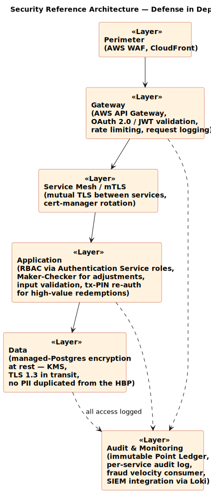

```plantuml
@startuml LoyaltySecurityArch
title Security Reference Architecture — Defense in Depth

skinparam rectangle {
  BackgroundColor<<Layer>> #FFF3E0
  BorderColor #BF360C
  FontStyle bold
}

rectangle "Perimeter\n(AWS WAF, CloudFront)" <<Layer>> as Perimeter
rectangle "Gateway\n(AWS API Gateway,\nOAuth 2.0 / JWT validation,\nrate limiting, request logging)" <<Layer>> as Gateway
rectangle "Service Mesh / mTLS\n(mutual TLS between services,\ncert-manager rotation)" <<Layer>> as Mesh
rectangle "Application\n(RBAC via Authentication Service roles,\nMaker-Checker for adjustments,\ninput validation, tx-PIN re-auth\nfor high-value redemptions)" <<Layer>> as App
rectangle "Data\n(managed-Postgres encryption\nat rest — KMS,\nTLS 1.3 in transit,\nno PII duplicated from the HBP)" <<Layer>> as Data
rectangle "Audit & Monitoring\n(immutable Point Ledger,\nper-service audit log,\nfraud velocity consumer,\nSIEM integration via Loki)" <<Layer>> as Audit

Perimeter --> Gateway
Gateway --> Mesh
Mesh --> App
App --> Data
Data ..> Audit : all access logged
App ..> Audit
Gateway ..> Audit

@enduml
```

**Authentication & Authorization:**
- **Customer:** Reuse the Authentication Service `retail-banking` realm. Loyalty BFFs validate the JWT issued by the HBP's OAuth flow. No separate login for loyalty.
- **Bank employee (BEP):** Authentication Service, `business-employee-portal` realm. Loyalty-specific roles: `loyalty-admin`, `loyalty-cs-maker`, `loyalty-cs-checker`, `loyalty-campaign-manager`, `loyalty-fraud-ops`, `loyalty-readonly`.
- **Service-to-service:** mTLS within the managed-Kubernetes cluster.
- **High-value redemption:** transaction-PIN re-auth via the Authentication Service for cashback > USD 50 (configurable per Program).
- **Manual adjustments:** Maker-Checker workflow with per-role caps.

**PCI scope:** Loyalty is **out of PCI scope**. It never touches PAN; card-spend events arrive de-tokenized of PAN from Payment Hub.

### 7.2 Observability

| Concern | Mechanism | Retention |
|---|---|---|
| **Metrics** | OpenTelemetry → Prometheus → Thanos → Grafana | 90 days |
| **Application Logs** | Structured JSON → Loki | 90 days hot, 1 year cold |
| **Distributed Traces** | OpenTelemetry → Tempo (or as Host Bank Platforms) | 30 days |
| **Service Audit Logs** (BEP admin actions) | Hash-chained + DB-immutable in Postgres, nightly-sealed to S3 Object Lock WORM | Hot in DB; ≥ 7 years in WORM |
| **Point Ledger** (customer-facing audit) | DB append-only in `loyalty-core` | Indefinite (operational) |
| **Alerts** | Grafana Alerting → PagerDuty / Slack | n/a |

**Mandatory alerts** (page on-call immediately):
- Earning consumer lag > 60s for any `paymenthub.*` topic
- Reservation TTL sweeper fails or skips a run
- Fulfillment Adapter error rate > 1% over a 5-minute window
- 3rd-party voucher partner availability below threshold
- Member balance projection drift detected (Ledger sum vs `Member.redeemable_balance`)
- Audit-log hash-chain divergence (verifier vs last WORM-sealed segment) — tamper-evidence
- Manual Adjustment without `checker_user_id` populated (data-integrity check)

**Mandatory dashboards (per service, plus global):**
- Golden-four (RPS, latency p50/p95/p99, error rate, saturation)
- Business KPIs: active Members, earn rate, redemption rate

### 7.3 Resilience, Backup & DR

> Mechanisms below cite v1 HBP deployment vendor bindings per the §6.1 [Deployment binding](#61-technology-stack-by-layer) note. Other deployments substitute equivalent managed-Kubernetes / managed-Postgres / cache primitives.

| Aspect | Target | Mechanism |
|---|---|---|
| **Availability** | 99.95% (tier-2) | EKS multi-AZ, RDS Multi-AZ, ElastiCache cluster-mode |
| **RPO** | ≤ 15 min | RDS continuous WAL streaming + cross-region async replica |
| **RTO** | ≤ 60 min | Cross-region warm standby (Sydney): RDS restore + Terraform-deployable EKS |
| **Daily backups** | 30-day retention | RDS automated snapshots, off-region copy |
| **Weekly backups** | 90-day retention | RDS snapshot lifecycle, off-region |
| **PITR** | Mandatory; 30-day minimum | RDS WAL archive |
| **DR drill** | Quarterly | Restore-and-verify in `ap-southeast-2`; document time-to-recover |

### 7.4 Fraud & Audit

**Three independent audit surfaces:**
1. **Point Ledger** — immutable, customer-facing, ties every Point movement back to its originating event/action.
2. **Per-service audit log** — every BEP admin write logged with actor, action, before/after JSON; **tamper-evident — hash-chained + DB-immutable, nightly-sealed to S3 Object Lock WORM with a chain-divergence verifier**.
3. **Maker-Checker queue** — every Manual Adjustment carries disjoint maker + checker identities.

**Fraud-control mechanisms:**
- **Source-Aggregate Caps** per Earn Source per Program (e.g. 1,000 points/day/Member from `CARD_SPEND`).
- **Per-Rule Caps** authored by BEP within the DSL.
- **Per-Member Daily Cap** at the Program level (configurable hard ceiling).
- **Velocity Anomaly Consumer** in `loyalty-integration-bridge` flags unusual earn rates per Member (1-hour vs 30-day average); writes to a fraud-ops review queue.
- **Refund Clawback** triggered by `PaymentReversed` Domain Events; written as compensating Ledger Entries.
- **Negative Balance Policy** — allowed. Member cannot redeem until balance ≥ 0; CS may issue a goodwill Adjusted entry via Maker-Checker.
- **Transaction-PIN re-auth** via the Authentication Service for high-value redemptions (default threshold: cashback > USD 50; configurable per Program).

---

## 8. Touchpoints with Bank's Ecosystem

The full catalogue of integration touchpoints. Each must have a documented adapter (P7).

| # | Touchpoint | Direction | Mechanism | Producer / Consumer Responsibility | Status |
|---|---|---|---|---|---|
| **T-01** | Payment Hub — `CardSpendPosted` events | Inbound (Loyalty consumes) | Kafka topic `paymenthub.card_spend.v1` | Payment Hub team produces; Loyalty Integration Bridge consumes | **Required for v1** — R1 |
| **T-02** | Payment Hub — `PaymentReversed` events | Inbound | Kafka topic `paymenthub.payment_reversed.v1` | Payment Hub produces; Loyalty consumes for clawback | **Required for v1** — R1 |
| **T-03** | Payment Hub — disbursement API (Cashback fulfillment) | Outbound (Loyalty calls) | REST/gRPC | Loyalty CashbackAdapter calls Payment Hub disburse endpoint | Required for v1 |
| **T-04** | Core Banking Adapter — account-state events | Inbound | Kafka topics `corebank.*` (e.g. `corebank.balance_snapshot.v1`) | Core Banking Adapter produces; Loyalty consumes (v1.x earn sources) | v1.x |
| **T-05** | Customer Service — `CustomerClosed` events | Inbound | Kafka topic `customer.closed.v1` | Customer Service produces; Loyalty consumes to close Members | v1 (light) |
| **T-06** | Customer Service — display-name fetch | Outbound | REST | Loyalty BFFs fetch on-demand (short cache); never persist PII | v1 |
| **T-07** | Authentication Service — JWT validation + step-up transaction-PIN re-auth | Outbound | (a) OAuth 2.0 / OIDC for JWT validation; (b) REST for transaction-PIN challenge + verify on high-value redemptions | Loyalty BFFs validate customer + employee JWTs; `loyalty-mobile-bff` issues transaction-PIN challenge for redemptions above the high-value threshold | v1 (reused) |
| **T-08** | `notification-service` (HBP) — outbound notifications | Outbound | Kafka topic the notification-service subscribes to, or REST | Loyalty publishes Loyalty Domain Events; notification-service consumes and routes to in-app / push / SMS / email | v1 |
| **T-09** | Mobile Banking App — Mobile BFF API | Inbound (Mobile App calls) | REST via AWS API Gateway → `loyalty-mobile-bff` | The Mobile Banking team integrates the Loyalty BFF; must implement graceful-degradation (P9) | **Required for v1** — R4 |
| **T-10** | BEP — Admin BFF API | Inbound | REST via AWS API Gateway → `loyalty-admin-bff` | BEP team integrates Loyalty admin screens | Required for v1 |
| **T-11** | 3rd-Party Voucher Provider | Outbound | REST/Webhook | Loyalty ThirdPartyVoucherAdapter calls partner API; partner pushes webhooks on async completion | **Required for v1** — R2 |
| **T-13** | Sweepstakes Prize Fulfillment | Internal | In-process — Sweepstakes Adapter → Drawing record; system-initiated commit using same Reward pipeline (typically Cashback or Bill-Payment Voucher prizes) | All within Loyalty | v1 |

---

## 9. Risks & Cross-Team Dependencies

Cross-team and external dependencies that affect v1 delivery:

| ID | Risk / Dependency | Owning Team | Severity | Mitigation |
|---|---|---|---|---|
| **R1** | Payment Hub team must emit versioned domain events (`CardSpendPosted`, `PaymentReversed`) with stable `eventId`s and backward-compat schemas | Payment Hub team | **Critical** | Cross-team contract signed before architecture freeze; named producer-team owner; sample event payloads agreed; backward-compat policy in writing. If not committed, fallback is deliberate CDC debt — but only as documented compromise. |
| **R2** | At least one 3rd-Party Voucher Provider must be signed, integrated, and live for v1 launch (Reward Type 5: `THIRD_PARTY_VOUCHER`) | Partnerships team + Loyalty | **High** | Identify candidate partners early; build the ThirdPartyVoucherAdapter against a mock partner first; have a backup partner in pipeline. If not ready, drop `THIRD_PARTY_VOUCHER` from v1 launch list (the other 3 Reward Types still ship). |
| **R3** | Sweepstakes in v1 requires the Drawing / Campaign subsystem to be in v1 (not v1.x) | Loyalty team | Medium | In-scope; raised explicitly to delivery leadership. If Drawing complexity slips, drop `SWEEPSTAKES_ENTRY` reward from v1 launch list (does not affect other 3 Reward Types). |
| **R4** | Mobile Banking App team must commit to graceful-degradation pattern (P9) — cached balance + suppress Redeem CTA + no critical-path coupling | Mobile Banking team | **Critical** | Signed contract on UX behaviour before integration; code-review enforcement; integration test scenarios for "Loyalty unavailable" scenarios. |
| **R5** | Cost-per-point unit economics — the bank funds points from its revenue model (in the v1 HBP deployment: interchange/float income, given its zero-fee positioning and lack of a fee pool) | Finance / Product | **High** | Cost-per-point caps in NFRs; daily/monthly per-member earn caps as a hard ceiling; Finance has approval rights on Earning Rule changes that affect cost-per-point > threshold. |
| **R6** | Shared Kafka cluster ACLs misconfigured — Loyalty produces to / consumes from topics it shouldn't | Host Bank Platform team | Medium | Topic-ACL configuration is a security review gate; reviewed at each Loyalty topic addition; automated test verifies cross-tenant isolation in non-prod. |
| **R7** | Bank Notification Service capacity — Loyalty adds high-volume notification load (PointsEarned per card swipe) | Notification team | Medium | Capacity plan + load test pre-launch; Loyalty may choose to batch / throttle high-frequency notification types (e.g. don't notify on every card swipe — daily summary instead). |

---

## 10. Next Steps — C4 Roadmap & Supporting Artifacts

This document establishes the **macro-architecture** (Business / Application / Data / Technology) and the **touchpoint catalogue**. The next deliverables in the EA roadmap:

### 10.1 C4 Level 1 — System Context Diagram  ✅ Delivered
A single C4 Level 1 System Context diagram, maintained at [`docs/c4/level-1-system-context.md`](c4/level-1-system-context.md). Shows:
- The **Rochallor Loyalty Platform** as a single system in focus
- All external actors (Member, Program Manager, Campaign Manager, CS Maker, CS Checker, Fraud Ops)
- All external systems derived from the touchpoint catalogue (T-01 to T-13), with the Host Bank `Enterprise_Boundary` distinguishing reused-from-HBP systems from the 3rd-Party Voucher Provider
- Business-intent labels on every relationship (mechanism — Kafka, REST, gRPC — is deferred to L2)

### 10.2 C4 Level 2 — Container Diagram  ✅ Delivered
A C4 Level 2 Container diagram, maintained at [`docs/c4/level-2-containers.md`](c4/level-2-containers.md). Decomposes the Rochallor Loyalty Platform into:
- Frontend touchpoints: Mobile Banking App, BEP
- API Gateway and Authentication Service — existing, reused
- 7 Loyalty service containers (`loyalty-core`, `loyalty-earning`, `loyalty-redemption`, `loyalty-campaign`, `loyalty-integration-bridge`, `loyalty-mobile-bff`, `loyalty-admin-bff`)
- Data containers (4 managed-Postgres instances per service, Redis, Shared Kafka cluster, object storage)
- External systems consumed (Payment Hub, Core Banking Adapter, Customer Service, `notification-service`, 3rd-Party Voucher Provider)
- Transport on every edge (REST/JSON, Kafka topic, JDBC, OIDC) — the mechanism deliberately omitted at L1.

### 10.3 C4 Level 3 — Component Diagrams  ✅ Delivered
One C4 Level 3 file per high-complexity service, maintained under [`docs/c4/`](../public/docs/c4/). Each file follows the same shape: Purpose & Scope → Reading the Diagrams → 2–3 PlantUML sub-views (static topology, hot path, scheduled/async) → Component Inventory → Owned Tables → External Edges Re-exposed from L2 → Invariants & Cross-References.

| Service | L3 file | Headline components |
|---|---|---|
| **`loyalty-core`** | [`level-3-loyalty-core.md`](c4/level-3-loyalty-core.md) | Membership Aggregate, Tier Projection, Ledger Service (Write), Balance Projection, Reservation Manager, Cohort Projection, Adjustment Queue, Expiry Job, TTL Sweeper, Outbox Relay, Member-Lifecycle Consumer |
| **`loyalty-earning`** | [`level-3-loyalty-earning.md`](c4/level-3-loyalty-earning.md) | Earn Source Registry, Rule Engine, DSL Interpreter, Cap Counter, Earn Event Consumer, Ledger Client, Outbox Relay |
| **`loyalty-redemption`** | [`level-3-loyalty-redemption.md`](c4/level-3-loyalty-redemption.md) | Reward Catalogue, Eligibility Engine, Redemption Orchestrator (Saga), Adapter Framework / SPI + 4 Adapters (Cashback, Bill-Payment Voucher, 3rd-Party Voucher, Sweepstakes), Resume Consumer |
| **`loyalty-campaign`** | [`level-3-loyalty-campaign.md`](c4/level-3-loyalty-campaign.md) | Campaign Aggregate, Drawing Aggregate, Entry Service, Drawing Scheduler, Winner Selection (seeded-RNG) |
| **`loyalty-integration-bridge`** | [`level-3-loyalty-integration-bridge.md`](c4/level-3-loyalty-integration-bridge.md) | Per-producer Consumers + Translators (Payment Hub, Core Banking, Customer-Lifecycle), Velocity Anomaly Consumer, Refund Clawback Consumer, Voucher Webhook Endpoint, idempotent Kafka Producer |
| **`loyalty-mobile-bff`** | [`level-3-loyalty-mobile-bff.md`](c4/level-3-loyalty-mobile-bff.md) | Caller Identity Resolver (JWT sub→customerId), Program/Reward/Campaign Controllers, three Anti-Corruption clients (Core/Redemption/Campaign), Upstream Error Handler, Problem Advice |
| **`loyalty-admin-bff`** | [`level-3-loyalty-admin-bff.md`](c4/level-3-loyalty-admin-bff.md) | Employee Identity Resolver (sub + realm roles), Role Gate, six controllers (Members/Approvals/Earning Rules/Rewards/Campaigns/Fraud), six Anti-Corruption clients, Upstream Error Handler, Problem Advice |

**BFFs now have L3 files too.** Earlier drafts omitted them — the BFFs are pure aggregation layers with no datastore and no Kafka. Once implemented as Spring services they acquired a distinct set of stateless components worth a component view: an identity-resolution seam (and, for the admin BFF, role gating), per-tag controllers, per-upstream Anti-Corruption clients, and an upstream-error translator. The L3 files document *how a request becomes a fan-out*; they have **no "Owned Tables" section** (neither BFF owns one).

### 10.4 Supporting Artifacts to Build
- **Data Catalogue**  ✅ Delivered — Per-service, per-table logical data model with sensitivity classification, maintained at [`docs/data-catalogue.md`](supporting-artifacts/data-catalogue.md). Reconciles the conceptual model (§5.2) and the per-service L3 "Owned Tables" lists into a single per-table reference, and records the member/`member_program` split, the `shedlock`-everywhere and status-enum reconciliations.
- **Full DDL**  ✅ Delivered — Per-service Flyway migrations embedded in [`data-catalogue.md` §10](supporting-artifacts/data-catalogue.md#10-embedded-ddl-full-sql) (`loyalty-core`, `loyalty-earning`, `loyalty-redemption`, `loyalty-campaign`; the integration bridge has no database). PostgreSQL 16; validated by applying each migration to a throwaway instance with `ON_ERROR_STOP`.
- **Event Catalogue**  ✅ Delivered — Per-channel contract for every Loyalty Domain Event (15 loyalty-owned + 5 consumed external), maintained at [`docs/event-catalogue.md`](supporting-artifacts/event-catalogue.md) with AsyncAPI 2.6.0 specs per application under [`docs/asyncapi/`](../public/docs/asyncapi/). Validated with `asyncapi validate` (0 errors). Records the topic-naming normalization (`loyalty.<context>.<event_type>.v<n>`), the `PointsEarned` three-way name reconciliation, the `customer.*` ACL gap, and the clawback-path TBD.
- **API Catalogue**  ✅ Delivered — OpenAPI 3.0.3 contracts for both tiers, maintained at [`docs/api-catalogue.md`](supporting-artifacts/api-catalogue.md). **Edge tier** at [`docs/openapi/`](../public/docs/openapi/): `loyalty-mobile-bff` (14 ops) + `loyalty-admin-bff` (21 ops), JWT-secured via API Gateway. **Internal tier** at [`docs/openapi/internal/`](../public/docs/openapi/internal/): `loyalty-core` (5), `loyalty-earning` (6), `loyalty-redemption` (8), `loyalty-campaign` (9) — mTLS-only, in-cluster, every op `x-internal: true`. 63 ops, validated with `redocly lint` (0 errors). Covers Authentication Service realm/role auth, tx-PIN step-up, idempotent redemption, the approval-gated change pattern, the Ledger / Reservation contract, and the per-Program scoping. `loyalty-integration-bridge` is AsyncAPI-only.
- **Threat Model**  ✅ Delivered — STRIDE analysis with a points-fraud focus, maintained at [`docs/threat-model.md`](supporting-artifacts/threat-model.md): trust-boundary DFD, attack-surface/entry-point catalogue, a 21-item threat register mapping each threat to its existing control (§) and residual risk, a points-fraud lifecycle deep dive (earn/redeem/adjust/clawback/sweepstakes/insider), and 7 prioritized gaps (audit hash-chaining, producer-identity attestation, config-activation governance, step-up binding, webhook replay/rotation, velocity cold-start, secrets/key management).
- **Test Pyramid Plan**  ✅ Delivered — Verification strategy across unit / contract / integration / E2E / load, maintained at [`docs/test-strategy.md`](supporting-artifacts/test-strategy.md). Consumes the OpenAPI + AsyncAPI contracts (contract tier), the DDL invariants via Testcontainers (integration tier), the five §4.6 flows (E2E), the §4.6/§7.2 SLAs (load), and the threat-model abuse cases (security tests). Includes a per-service coverage matrix, CI/CD gate mapping, and a schema backward-compat gate.
- **Customer Journey Maps**  ✅ Delivered — Detailed maps for Earn, Redeem, Tier Up, Sweepstakes Win, maintained at [`docs/customer-journey-maps.md`](supporting-artifacts/customer-journey-maps.md). Persona-driven (Cambodia retail member + saver/deal-seeker variants), frontstage/backstage lanes with emotion arcs, moments-that-matter, per-journey KPIs, and journey→system traceability. Surfaces the key UX messages: graceful degradation (P9), responsive two-phase redeem + async "we'll notify you" + auto-refund, redeem-doesn't-drop-tier, polite negative-balance copy, and auditable sweepstakes fairness.
- **BEP UX wireframes**  ✅ Delivered — Low-fidelity PlantUML `salt` wireframes for the four BEP admin screens (Earning-Rule decision-table editor, Reward catalogue editor, Campaign editor incl. Drawings/Winners, Maker-Checker queue), maintained at [`docs/bep-wireframes.md`](supporting-artifacts/bep-wireframes.md). Each annotated with its role, backing `loyalty-admin-bff` endpoint, fields/validations, and design notes; the rule editor renders the DSL grammar with dry-run + raw-JSON escape hatch. All salt blocks render clean under `plantuml`.
- **Sample DSL library**  ✅ Delivered — Canonical Earning-Rule examples per Earn Source with documented behaviour, maintained at [`docs/sample-dsl-library.md`](supporting-artifacts/sample-dsl-library.md). Also *defines* the DSL grammar: a decision-table canonical form formalised as a JSON Schema ([`docs/dsl/schema/`](../public/docs/dsl/schema/)) with 7 example rules ([`docs/dsl/examples/`](../public/docs/dsl/examples/)) covering RATE/FIXED, FIRST/COLLECT, tier multiplier, caps (event/day/month/lifetime), exclusion, banding, and campaign stacking. Schema validated; malformed rules (incl. a `SCRIPT` earn type) provably rejected.

---

## Document Control

| Field | Value |
|---|---|
| Version | 0.1 — Initial Draft |
| Status | DRAFT |
| Author | Nam Vu |

---

*End of document.*
