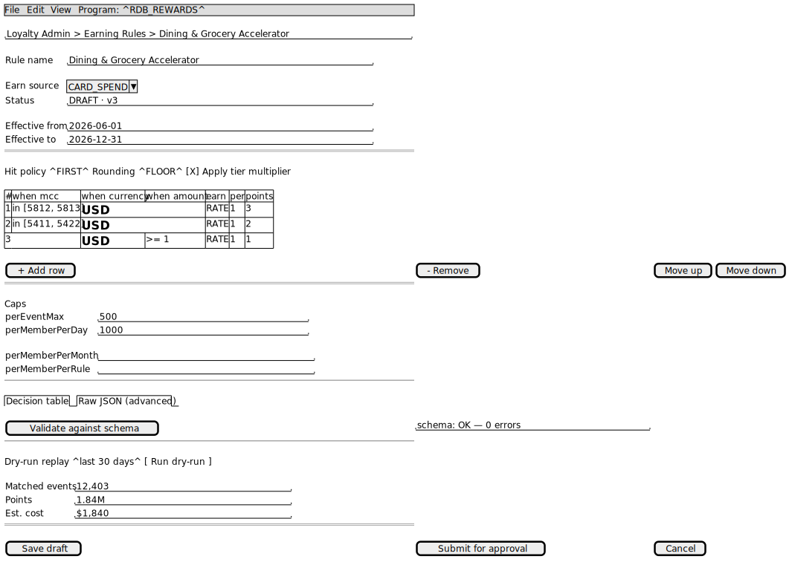
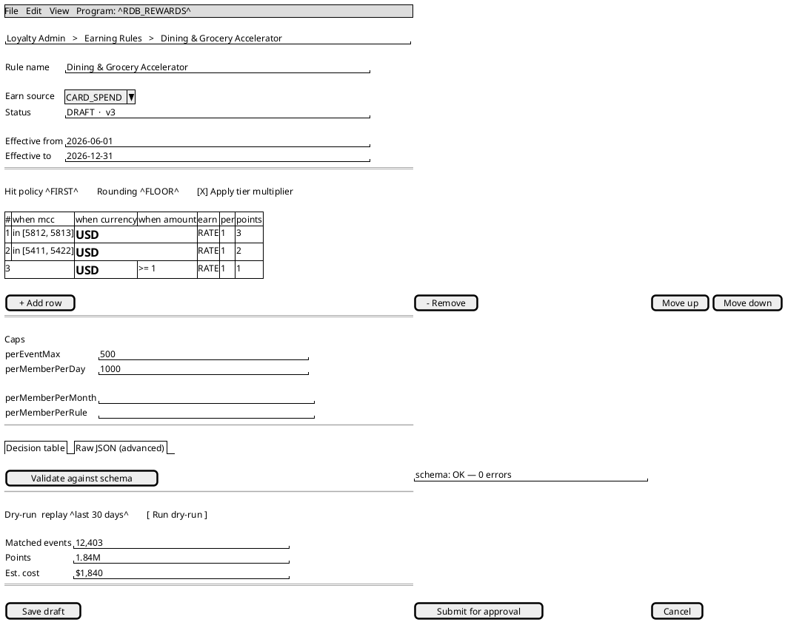
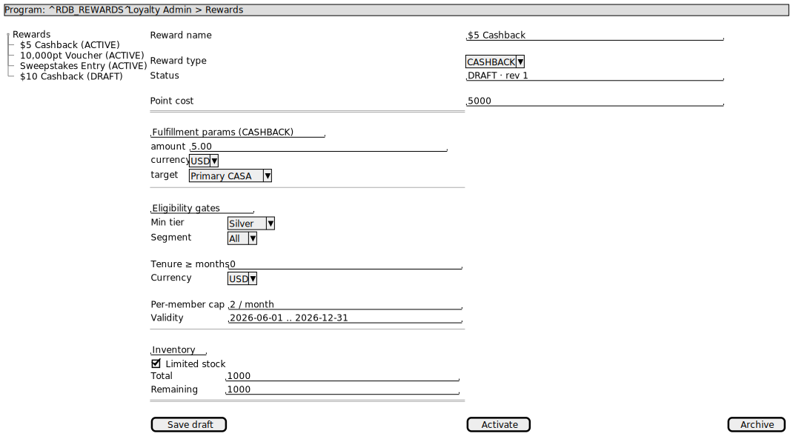
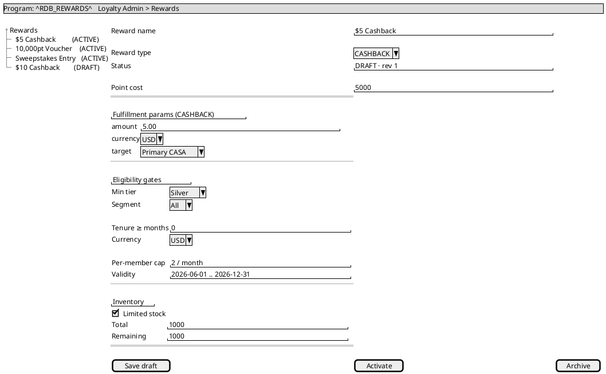
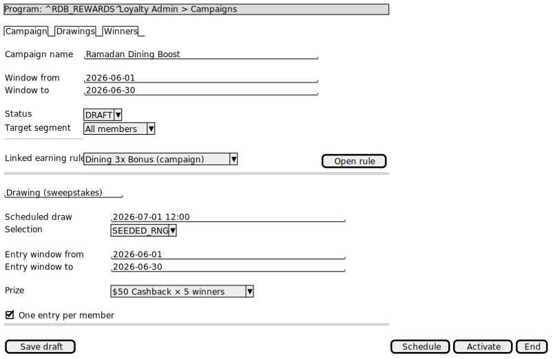
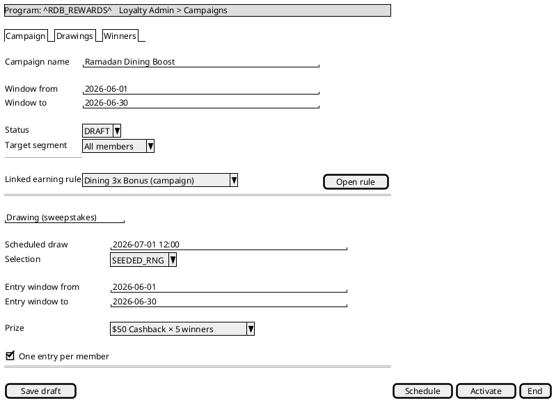
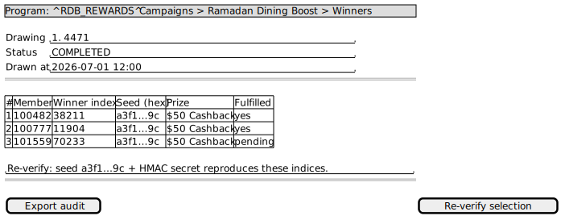
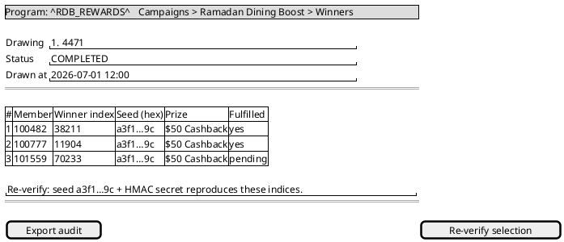
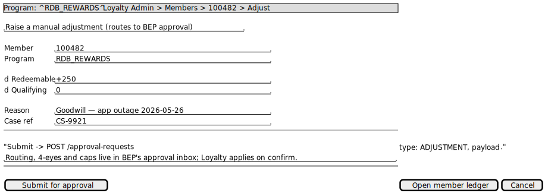
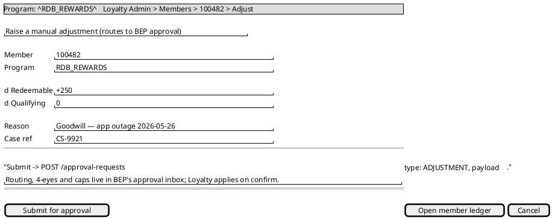

# Rochallor Loyalty Platform — BEP UX Wireframes

> **Artifact §11.4** of [`enterprise-architect.md`](../enterprise-architect.md#114-supporting-artifacts-to-build).
> Low-fidelity wireframes for the Bank Employee Portal (BEP) admin screens, as PlantUML `salt` diagrams-as-code (Earning-Rule decision-table editor, Reward catalogue editor, Campaign editor, and Raise-adjustment). They render the contracts already defined: the **Earning-Rule decision-table editor** maps to the DSL grammar in [`sample-dsl-library.md`](sample-dsl-library.md); all are backed by [`loyalty-admin-bff`](api-catalogue.md). **Maker-checker is delegated to BEP's existing Approval Workflow**, so there is no Loyalty-built approval queue. These are layout/interaction proposals, not visual design.

---

## 0. BEP shell conventions (apply to every screen)

- **Auth/SSO:** employee JWT from the Authentication Service `business-employee-portal` realm; screens are **role-gated** (`loyalty-cs-maker`, `loyalty-cs-checker`, `loyalty-campaign-manager`, `loyalty-fraud-ops`, `loyalty-admin`, `loyalty-readonly`) — §7.1.
- **Program selector** in the top bar on every member-/config-scoped screen; defaults to the deployment's seed Program code (e.g. `RDB_REWARDS` for the HBP deployment) for v1 backward-compatibility. Actions are `program_id`-scoped — a write in Program A can never touch Program B.
- **Every write is audit-logged** (`<svc>_audit_log`: actor, action, before/after JSON, ≥7yr) — §7.4.
- **Program lifecycle (create/activate/sunset/close) is *not* in BEP** — it is a migration. These screens *configure* an existing Program.

---

## 1. Earning-Rule decision-table editor

**Role:** `loyalty-campaign-manager` / `loyalty-admin`. **Backs:** `GET/POST /programs/{id}/rules`, `POST /programs/{id}/rules/{ruleId}/dry-run`, `PATCH /rules/{ruleId}`. **Renders:** the decision-table DSL ([schema](../dsl/schema/earning-rule.schema.json)).

  

**Notes.** Decision-table-first authoring with a **Raw JSON** tab as the power-user escape hatch — both produce the same canonical JSON. **Validate against schema** runs the same JSON-Schema check as save (a bad rule fails here, not in production). **Dry-run** replays historical events with no side effects and surfaces the **cost estimate** (the zero-fee economics gate, R5). Lifecycle `DRAFT → ACTIVE → ARCHIVED`; **Submit for approval** raises a `RULE_ACTIVATION` approval-request to **BEP's Approval Workflow** — economic activation is approval-gated and applies on `confirm`.

---

## 2. Reward catalogue editor

**Role:** `loyalty-admin`. **Backs:** `GET /reward-types`, `GET/POST /programs/{id}/rewards`, `PATCH /rewards/{rewardId}`.

  

**Notes.** Reward types are seeded platform config (`reward_type`); the **Fulfillment params** panel is driven by the selected type's `parameter_schema`. **Eligibility gates** map 1:1 to `reward_eligibility` (tier/segment/tenure/currency/per-member cap/validity). **Limited stock** binds to `reward_inventory` with atomic decrement (no oversell). A reward becomes **immutable once redeemed against** — edits create a new `reward_revision`.

---

## 3. Campaign editor (Campaign · Drawings · Winners)

**Role:** `loyalty-campaign-manager`. **Backs:** `GET/POST /programs/{id}/campaigns`, `PATCH /campaigns/{id}`, `POST /campaigns/{id}/drawings`, `GET /drawings/{id}/winners`.

  

**Winners tab** (read-only, audit) lists the immutable `winner_record`s so a draw can be independently re-verified:

  

**Notes.** Campaign lifecycle `DRAFT → SCHEDULED → LIVE → ENDED → ARCHIVED`; drawing selection defaults to `SEEDED_RNG`. The Winners tab makes the **fairness audit** operable — the seed + HMAC secret deterministically reproduce the winner indices (threat-model T-12). Prize fulfilment reuses the standard reward pipeline (§4.6.5).

---

## 4. Raise adjustment → BEP approval inbox

**Roles:** any `loyalty-cs` / `admin` role may *raise* a request; **routing, 4-eyes, and caps are BEP's**. **Backs:** `POST /approval-requests`, `POST /approval-requests/{id}/confirm` (BEP→Loyalty on decision), `GET /members/{id}/programs/{pid}/ledger`.

Loyalty does **not** build a maker-checker queue. The only Loyalty-owned affordance is *raising* a manual adjustment as an approval request; it then appears in **BEP's native approval inbox**, which routes it per its Job Roles + 4-eyes and calls Loyalty's `confirm` on approval.

  

**Notes.** Maker-checker is delegated to BEP's existing Approval Workflow — so there is **no Loyalty-built queue, no maker/checker columns, and no `ck_ledger_adjusted_4eyes`**. On BEP approval, `confirm` writes the `Adjusted` ledger entry (referencing `approval_request_id` + `bep_approval_ref`) and emits `loyalty.ledger.manual_adjustment_applied.v1`. Negative resulting balance is permitted (redemption then blocked) — member copy is in the Mobile journey ([customer-journey-maps §4](customer-journey-maps.md)). The `confirm` seam is mTLS + BEP-assertion authenticated (threat-model DD-9).

---

## 5. Screen → endpoint / role traceability

| Screen | Role(s) | admin-bff endpoints |
|---|---|---|
| Earning-Rule editor | campaign-manager / admin | `GET·POST /programs/{id}/rules`, `POST …/dry-run`, `PATCH /rules/{id}` |
| Reward catalogue | admin | `GET /reward-types`, `GET·POST /programs/{id}/rewards`, `PATCH /rewards/{id}` |
| Campaign editor | campaign-manager | `GET·POST /programs/{id}/campaigns`, `PATCH /campaigns/{id}`, `POST /campaigns/{id}/drawings`, `GET /drawings/{id}/winners` |
| Raise adjustment → BEP | cs / admin (raise); BEP workflow (approve→confirm) | `POST /approval-requests`, `POST /approval-requests/{id}/confirm` |

---

## 6. Open design items

- **OI-1 — Config maker-checker: RESOLVED.** Maker-checker (for adjustments *and* economic config activation) is delegated to BEP's existing Approval Workflow; the Rule/Reward editors' **Submit for approval** raises an approval-request. Remaining detail: the exact set of approval-gated transitions (v1 default = economic items) and the confirm-seam hardening (threat-model DD-9).
- **OI-2 — Decision-table UX affordances.** Inline per-cell operator pickers (`in / between / >= / *`), drag-reorder for `FIRST` priority, and live dry-run on edit are assumed; detailed interaction spec is for the build phase.
- **OI-3 — Fidelity.** These are layout/interaction wireframes. Visual design (Host Bank design system, i18n for the deployment's languages — Khmer/English for the HBP deployment, accessibility) is out of scope here.
