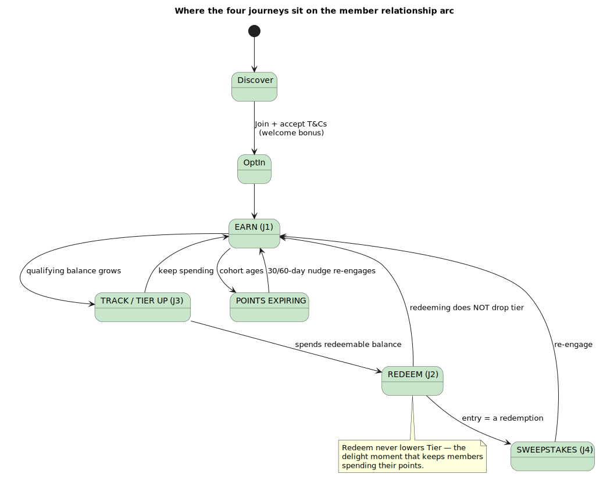
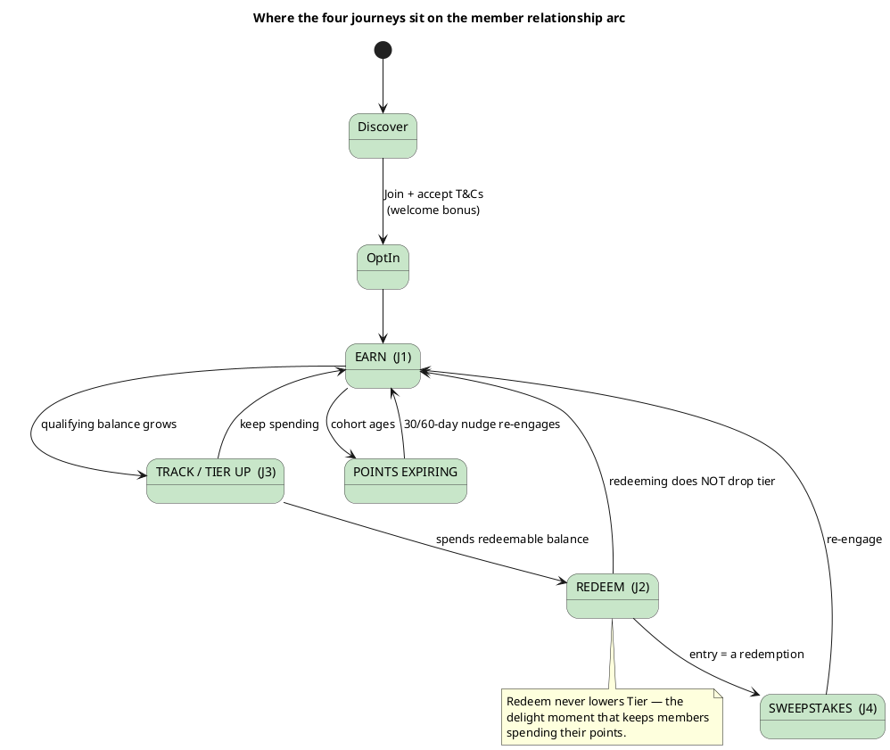

# Rochallor Loyalty Platform — Customer Journey Maps

> **Artifact §11.4** of [`enterprise-architect.md`](../enterprise-architect.md#114-supporting-artifacts-to-build).
> Detailed maps for the four member-critical journeys — **Earn, Redeem, Tier Up, Sweepstakes Win** — expanding the single overview in [§3.3](../enterprise-architect.md#33-customer-journey-map-persona-retail-loyalty-member). Each map ties the *frontstage* (what the member does/feels) to the *backstage* (the §4.6 flows, the events in [`event-catalogue.md`](event-catalogue.md), and the endpoints in [`api-catalogue.md`](api-catalogue.md)).

---

## 1. Personas

**Primary — Sophea, 32, Phnom Penh.** Salaried professional, daily card user, banks entirely on mobile. Values *effortless* rewards on spending she already does; mildly loss-averse about points expiring. Mental model: "points = a small cashback I shouldn't have to think about."

**Secondary personas (same maps, different emphasis):**
- **Dara, 45, saver** — low card spend, high balances; earns mostly via `BALANCE_THRESHOLD` / `TERM_DEPOSIT_OPENED`. Cares about tier status more than cashback.
- **Lin, 26, deal-seeker** — chases campaigns and sweepstakes; high redemption frequency; sensitive to fairness and "did I win?".

Loyalty is a **tier-2** experience (P9): it must *delight when up* and *never block banking when down*. The zero-fee positioning means loyalty is the bank's primary customer-economic differentiator — these journeys are the product, not a side feature.

---

## 2. Legend

Each journey is a table of **stages** (columns) × **lanes** (rows): **Doing** · **Touchpoint** · **Thinking & Feeling** (emotion arc 😀 delighted / 🙂 satisfied / 😐 neutral / 😟 anxious / 😡 frustrated) · **Backstage** (systems & events) · **Pain points** · **Opportunities**. "Moments that matter" call out the make-or-break interactions.

  

---

## 3. Journey 1 — Earn (card spend)

**Goal:** be rewarded for normal spending, with zero effort. **SLA:** points credited p95 < 10s after the card event (§4.6.1).

| Stage | 1. Spend | 2. Settle | 3. Credit | 4. Notice | 5. Check |
|---|---|---|---|---|---|
| **Doing** | Taps card / pays online | (nothing — lives her life) | (nothing) | Sees a push: "You earned 180 points!" | Opens loyalty screen to see balance |
| **Touchpoint** | Merchant POS / online | — | — | Push notification | Mobile App loyalty tab |
| **Thinking & Feeling** | 😐 "just paying" | 😐 | 😐 | 🙂 "oh nice, that was automatic" | 😀 "balance went up, and I can see why" |
| **Backstage** | Card system → Payment Hub | `paymenthub.card_spend.v1` | Bridge → `loyalty.earn.translated.v1` → earning Rule Engine (DSL) → core `POST /ledger/earn` (Earned entry, cohort, balances) | earning emits `loyalty.earning.points_earned.v1` → notification-service | mobile-bff `GET /me/programs/{id}/balance` + `/transactions` |
| **Pain points** | — | latency if consumer lags (>60s alert, §7.2) | silent drop if T&Cs not accepted on an auto-enrolled program | over-notifying (every swipe) is annoying (R7) | balance stale / "—" if Loyalty is down |
| **Opportunities** | — | surface a "pending points" hint | non-dismissable "Accept T&Cs to start earning" banner | **batch low-value earns into a daily summary** (R7) | graceful degradation: cached balance + "as of HH:MM", never an error (P9) |

**Moments that matter:** (1) the **first** earn after opt-in — proves the welcome promise; (2) the push that explains *why* points arrived (transaction-linked). **Anti-pattern:** notifying on every micro-swipe — throttle/batch (R7).

**KPIs:** earn-credit p95/p99 (10s/30s); % earns notified; opt-in→first-earn time; earn-consumer lag.

---

## 4. Journey 2 — Redeem

**Goal:** turn points into real value, confidently. **SLA:** sync reserve+commit p95 < 1.5s (§4.6.2). Two-phase reservation makes the balance feel responsive while keeping the ledger clean.

| Stage | 1. Browse | 2. Choose | 3. Confirm | 4a. Sync fulfil | 4b. Async fulfil | 5. Enjoy |
|---|---|---|---|---|---|---|
| **Doing** | Scrolls reward catalogue | Taps "Redeem $5 cashback" | (high-value) enters transaction-PIN | Sees "Done — $5 in your account" | Sees "Processing…", navigates away | Gets cashback / voucher code |
| **Touchpoint** | Mobile rewards list | Reward detail | tx-PIN step-up dialog | Success screen | Pending screen + later push | CASA / voucher push |
| **Thinking & Feeling** | 🙂 "what can I get?" | 😟 "will it actually work?" | 😐 "extra step, but I get it — it's money" | 😀 "instant!" | 😐 "hope it comes through" | 😀 "it worked" |
| **Backstage** | mobile-bff `GET /rewards` (eligibility-filtered) | — | mobile-bff ↔ Authentication Service tx-PIN (T-07); `403 STEP_UP_REQUIRED` if missing | `POST /redemptions` → reserve→commit (CashbackAdapter→Payment Hub) → `200 COMPLETED`; `loyalty.redemption.completed.v1` | `202 PENDING`; partner webhook → `loyalty.fulfillment.resume.v1` → commit; or TTL release → `redemption.failed.v1` + points returned | notification-service push |
| **Pain points** | ineligible rewards shown then rejected | unclear point cost vs balance | step-up friction / forgotten PIN | — | "stuck processing" anxiety; partner outage | negative balance after a refund clawback feels punitive |
| **Opportunities** | pre-filter by eligibility + effective balance (deduct holds) | show "after this you'll have N" | only challenge above the configured threshold; remember device | reflect the reservation immediately (balance drops on tap) | clear "we'll notify you" + auto-refund messaging on failure | **polite negative-balance copy**: "Points: 0 — pending adjustment of −250" |

**Moments that matter:** (1) the **confirm tap** — two-phase makes the balance drop instantly so it feels real; (2) the **async wait** — explicit "Processing… we'll notify you" plus guaranteed auto-refund on TTL expiry removes the fear; (3) **redeeming does not drop her tier** — the quiet reason she redeems at all.

**Edge cases surfaced to UX:** step-up required (`403 STEP_UP_REQUIRED`); ineligible/negative balance (`403`); idempotent retry on poor connectivity (same `Idempotency-Key` → no double spend).

**KPIs:** redeem success rate; sync commit p95; async completion time + failure/refund rate; step-up abandonment; catalogue→redeem conversion.

---

## 5. Journey 3 — Tier Up

**Goal:** reach a higher tier and feel recognised. The mechanic that makes tier a *retention lever*: the **qualifying** balance drives tier and is **not** spent by redemption — only by expiry/reversal.

| Stage | 1. Aware | 2. Progress | 3. Approach | 4. Cross | 5. Enjoy |
|---|---|---|---|---|---|
| **Doing** | Sees "Silver — 600 pts to Gold" | Keeps spending as normal | Sees progress bar near full | Gets "You're now Gold!" push | Notices a Gold-only reward / higher multiplier |
| **Touchpoint** | Loyalty tab tier card | (background) | Progress bar | Push + in-app celebration | Rewards list + bigger earns |
| **Thinking & Feeling** | 🙂 "I'm close-ish" | 😐 | 😀 "almost there" | 😀 "made it!" | 😀 "this is worth staying for" |
| **Backstage** | mobile-bff `GET /me/programs/{id}/tier` (progress %, never raw qualifying) | each Earned entry updates qualifying projection | — | qualifying crosses `tier.threshold` → core emits `loyalty.member.tier_changed.v1` (`direction: UP`) → notification | tier `benefits.multiplier` now applied on earn (DSL `tierMultiplier`); tier-gated rewards unlocked |
| **Pain points** | opaque "how do I level up?" | confusion: "I redeemed, will I drop?" | unclear what counts toward tier | downgrade anxiety | benefits not obvious post-upgrade |
| **Opportunities** | explain qualifying vs redeemable simply (progress bar, not raw number) | **reassure: spending points won't cost you your tier** | "spend X more on dining for 3× to reach Gold faster" | celebratory moment + concrete new benefits | spotlight newly-unlocked rewards and the higher multiplier |

**Moments that matter:** (1) the **reassurance** that redeeming won't drop tier — the single most important message in the whole product economics; (2) the **upgrade celebration** with *concrete* unlocked value, not just a badge.

**Nuance to message carefully:** under the v1 default `ROLLING_12_MONTHS` qualifying metric, old cohorts ageing out can *lower* qualifying over time even without redemption; under `LIFETIME`, expiry can drop tier — BEP must surface this when choosing `LIFETIME`. Downgrades are now a **designed** state: a metric-derived nightly re-evaluation can lower tier, optionally after a per-Tier **grace window**. During grace, `loyalty.member.tier_at_risk.v1` drives a "spend X by DATE to keep Gold" nudge (and the mobile tier card surfaces `graceEndsAt`/`shortfall`); an actual drop emits `loyalty.member.tier_changed.v1` (`direction: DOWN`). The entry tier never drops.

**KPIs:** tier-up rate; time-in-tier; redemption rate by tier (proves redeeming doesn't suppress engagement); % members who understand qualifying vs redeemable (survey).

---

## 6. Journey 4 — Sweepstakes Win

**Goal:** the thrill of a chance to win; fairness is the trust anchor. Entry is itself a redemption (§4.6.5) — no separate entry API.

| Stage | 1. Discover | 2. Enter | 3. Wait | 4a. Win | 4b. No win |
|---|---|---|---|---|---|
| **Doing** | Sees campaign banner | Taps "Enter (1,000 pts)" | (lives her life) | Gets "🎉 You won!" push | Gets gentle "not this time" (optional) |
| **Touchpoint** | Campaign card | Reward-style confirm | — | Winner push + prize | Optional consolation push |
| **Thinking & Feeling** | 🙂 "ooh, a prize" | 🙂 "worth a shot" | 😐 "did I win?" | 😀 "I won!" | 😟→🙂 "oh well — was it fair?" |
| **Backstage** | mobile-bff `GET /me/programs/{id}/campaigns` | `POST /redemptions` (sweepstakes reward) → reserve→commit → SweepstakesAdapter → campaign `drawing_entry`; `redemption.completed.v1` | entry window open until `drawing.scheduled_at` | scheduled draw: seeded-RNG → `winner_record{seed_hex, winner_index}` → `loyalty.campaign.drawing_completed.v1` + `winner_selected.v1`; prize via standard reward pipeline | fan-out notification to non-winners (configurable) |
| **Pain points** | unclear odds / cost | "did my entry register?" | silence = doubt | prize delivery delay | suspicion of rigging; feeling of wasted points |
| **Opportunities** | clear cost, entry window, prize | immediate "Entry confirmed for <drawing>" | "draw happens on <date>" countdown | fast prize fulfilment (reuses cashback/voucher pipeline) | **publishable fairness proof** — the draw is re-verifiable from `seed_hex` + HMAC secret (auditable RNG) |

**Moments that matter:** (1) **entry confirmation** — removes "did it work?" doubt; (2) the **result** — winners delighted, and non-winners retained by *credible fairness* (the seeded, audit-replayable draw) rather than feeling cheated.

**KPIs:** entries per drawing; unique entrants; repeat-entry rate; post-draw retention of non-winners; prize-fulfilment time; zero fairness disputes (the seeded-RNG audit is the control — threat-model T-12).

---

## 7. Cross-journey pain points & opportunities

| Theme | Pain | Opportunity (and where it's grounded) |
|---|---|---|
| **Loyalty down** | balance/redeem unavailable | cached balance + "as of HH:MM", suppress Redeem CTA, never block banking (P9, R4) |
| **Notification fatigue** | a push per swipe | batch low-value earns to a daily summary; reserve real-time pushes for tier-up, redemption, expiry (R7) |
| **Expiry loss-aversion** | points vanish unnoticed | 30/60-day `PointsExpiringSoon` nudges with a one-tap "redeem now" |
| **Trust** | "is this fair / correct?" | transaction-linked earn explanations; auditable sweepstakes; polite negative-balance copy |
| **Comprehension** | qualifying vs redeemable confusion | one number to spend (redeemable), one bar to grow (tier); never show raw qualifying |

---

## 8. Journey → system traceability

| Journey | Flow (§4.6) | Key events | Key endpoints |
|---|---|---|---|
| Earn | §4.6.1 | `earn.translated`, `earning.points_earned` | `GET /balance`, `/transactions` |
| Redeem | §4.6.2 / §4.6.3 | `redemption.completed/failed`, `fulfillment.resume` | `POST /redemptions`, `GET /redemptions/{id}` |
| Tier Up/Down | (projection) | `member.tier_changed`, `member.tier_at_risk` | `GET /me/programs/{id}/tier` |
| Sweepstakes | §4.6.5 | `campaign.drawing_completed`, `campaign.winner_selected` | `POST /redemptions`, `GET /campaigns`, `/drawing-entries` |

---

*v0.1 — aligned with the v0.1 architecture. Revisit downgrade messaging once a `LIFETIME` Program is configured and once Mobile v2 renders multiple Programs.*
