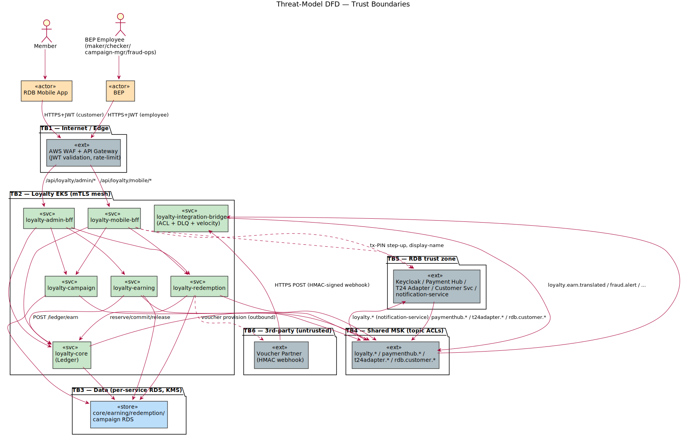
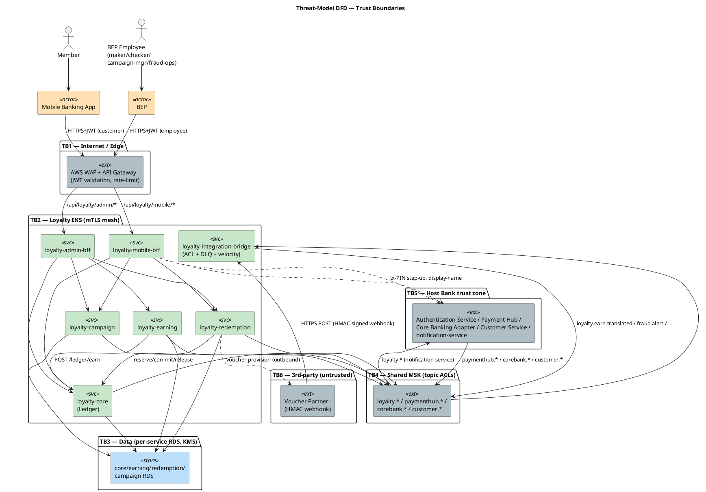

# Rochallor Loyalty Platform — Threat Model (STRIDE)

> **Artifact §11.4** of [`enterprise-architect.md`](../enterprise-architect.md#114-supporting-artifacts-to-build).
> STRIDE analysis of the platform with a deliberate focus on the **points-fraud surface** (Points are money-equivalent value; the bank funds them from interchange/float under a zero-fee model — [R5](../enterprise-architect.md#10-risks--cross-team-dependencies)). Builds on the Security Reference Architecture ([§7.1](../enterprise-architect.md#71-security-reference-architecture)) and Fraud & Audit ([§7.4](../enterprise-architect.md#74-fraud--audit)).

---

## 1. Method, scope & assumptions

**Method.** STRIDE (Spoofing, Tampering, Repudiation, Information disclosure, Denial of service, Elevation of privilege), applied **per trust-boundary-crossing interaction** for the decomposition (§3–§5) and consolidated into a **threat register** (§6). A dedicated **points-fraud deep dive** (§7) covers the abuse cases §11.4 calls out.

**In scope:** the 7 Loyalty services, their 4 RDS instances, the `loyalty.*` MSK topics, the two BFF edge APIs, the partner voucher webhook, and the integration seams to Host Bank Platform systems.

**Out of scope (trusted upstream, but their seams are in scope):** internals of API Gateway, Authentication Service, Payment Hub, Core Banking Adapter, Customer Service, `notification-service`. Their *contracts and ingress points* are analysed; their internal security is owned by the Host Bank Platform.

**Baseline assumptions (from §7.1 / principles P1–P10):**
- TLS 1.3 in transit; service-to-service **mTLS** inside the EKS mesh; RDS **KMS** encryption at rest.
- **No PII stored** (P1); `customerId` is the only external linkage. Loyalty is **out of PCI scope** (no PAN; card events arrive de-tokenised).
- Point Ledger is **append-only source of truth** (P5); balances are projections.
- Every BEP money-equivalent action goes through **BEP's Approval Workflow** (P8; delegated).

**Risk rating** = Likelihood × Impact. Because Points are money-equivalent, integrity/EoP threats on the earn/redeem/adjust paths skew **High/Critical** even at modest likelihood.

---

## 2. Assets (what we protect), ranked

| # | Asset | Why it matters | Primary STRIDE exposure |
|---|---|---|---|
| A1 | **Point Ledger integrity** (`balance = Σ deltas`) | The money. Inflation = direct loss; corruption = unrecoverable liability | Tampering, Elevation of privilege |
| A2 | **Member balances / projections** | Customer-visible value; drift = trust + accounting loss | Tampering, Repudiation |
| A3 | **Earning Rules + Reward configs** | A tampered rule silently double-credits *every* Member | Tampering, EoP |
| A4 | **Approval integrity** | BEP-delegated approval is the control against insider point issuance | EoP, Repudiation |
| A5 | **Audit trails** (ledger, per-service audit log, winner records) | Must be tamper-evident for ≥7yr / indefinite | Tampering, Repudiation |
| A6 | **Earn/redeem availability** | Tier-2 (P9); fraud detection is degraded-availability | Denial of service |
| A7 | **`customerId` linkage** | Not PII, but links loyalty behaviour to a banking customer | Information disclosure |

---

## 3. Trust boundaries & data-flow diagram

  

**Trust boundaries:**

| TB | Boundary | Crossing controls |
|---|---|---|
| **TB1** | Internet → Edge | WAF, API Gateway, OAuth2/JWT validation, rate limiting, request logging |
| **TB2** | Edge → Loyalty services | mTLS mesh; BFF authZ; per-service identity |
| **TB3** | Service → its RDS | KMS at rest; no cross-service DB access (P3); single-writer (P5) |
| **TB4** | Service ↔ MSK | Topic ACLs; idempotent producer; `eventId` dedup |
| **TB5** | Loyalty ↔ Host Bank Platform systems | ACL adapters (P7); OIDC; producer-owned event contracts (P4) |
| **TB6** | Partner webhook → Bridge | **HMAC signature**; schema validation → DLQ |

---

## 4. Entry points (attack surface)

| EP | Entry point | Trust boundary | Authn |
|---|---|---|---|
| EP1 | Mobile BFF `/api/loyalty/mobile/*` | TB1→TB2 | Customer JWT (retail-banking realm) |
| EP2 | Admin BFF `/api/loyalty/admin/*` | TB1→TB2 | Employee JWT + role (business-employee-portal realm) |
| EP3 | `paymenthub.*` topics (earn/reversal) | TB5→TB4→Bridge | Topic ACL; producer-owned, stable `eventId` |
| EP4 | `corebank.*` topics | TB5→TB4→Bridge | Topic ACL |
| EP5 | `customer.closed.v1` | TB5→TB4→Bridge | Topic ACL |
| EP6 | Partner voucher webhook | TB6→Bridge | HMAC signature |
| EP7 | Inter-service REST (`/ledger/earn`, `/reservations/*`) | within TB2 | mTLS + service identity |
| EP8 | Program-lifecycle migration | out-of-band (PR + deploy) | GitLab review + Platform team + Legal sign-off |

---

## 5. STRIDE per element (summary)

| Element | S | T | R | I | D | E |
|---|---|---|---|---|---|---|
| **Mobile BFF** (EP1) | JWT | input validation, idempotency | ledger trail | own-data only | rate-limit, P9 degrade | scope to JWT member |
| **Admin BFF** (EP2) | JWT | BEP approval on writes | audit log + `bep_approval_ref` | role + Program scope | rate-limit | BEP Approval Workflow |
| **Integration Bridge** (EP3–6) | topic ACL / HMAC | schema-validate→DLQ, pure translators | — | — | DLQ, idempotent producer, velocity degraded | ACL: consume-only on external topics |
| **loyalty-core / Ledger** (A1) | mTLS | append-only + immutability trigger, `UNIQUE(source_ref,entry_type)` | immutable ledger | balances not PII | advisory-lock expiry | single-writer (P5) |
| **loyalty-earning** (A3) | mTLS | DSL schema-validation, caps | rule audit log | — | consumer-lag alert | no Drools/Groovy |
| **RDS** (TB3) | mTLS/creds | KMS, ledger immutability | — | encryption at rest, no PII | Multi-AZ, PITR | per-service creds; no cross-join |
| **MSK** (TB4) | topic ACL | schema registry backward-compat | — | TLS | partitioning, retention | per-tenant ACL (R6) |

---

## 6. Threat register

Likelihood/Impact/Risk ∈ {L, M, H, C}. "Control" cites the existing mitigation; "Residual" is risk *after* the control.

| ID | STRIDE | Threat | Element | Existing control | Residual | Recommendation |
|---|---|---|---|---|---|---|
| **T-01** | Spoofing | Forged/replayed customer JWT redeems on another member | EP1 | Authentication Service JWT validation at GW; member derived from `sub` (never path) | L | Enforce short token TTL + audience binding; reject `memberId` in client payloads (already designed) |
| **T-02** | Tampering | Replayed earn event double-credits Points | EP3 / A1 | `eventId` idempotency; `UNIQUE(source_ref, entry_type)` makes re-insert a no-op | L | Monitor duplicate-`eventId` rate as a fraud signal |
| **T-03** | Tampering | Forged `CardSpendPosted` injected to MSK to mint Points | EP3 / A1 | **Network-internal MSK + IAM/mTLS/SASL-SCRAM + topic ACLs**; damage bounded by caps; velocity + async settlement reconciliation | L | Decided posture: detective-first with a documented escalate-to-signing trigger; CI cross-tenant ACL test (R6) |
| **T-04** | Tampering | Malicious/buggy Earning Rule double-credits every Member | A3 | Constrained DSL, schema-validated at save, no code execution; dry-run sandbox | M | Rule activation is **approval-gated via BEP**; Finance approval on cost-per-point-affecting rules (R5) |
| **T-05** | Elevation | Compromised CS account drains/balloons balances | EP2 / A4 | Approval delegated to **BEP's Approval Workflow** — 4-eyes, Job Roles, caps; Loyalty applies only on a hardened `confirm` (mTLS + BEP assertion) | L | Harden the confirm seam (T-22 / DD-9); alert on adjustment volume per actor; periodic access recert |
| **T-06** | Elevation | Approver self-approves via two accounts (collusion) | EP2 / A4 | BEP Job Roles + segregation-of-duties in its Approval Workflow | M | SoD review; anomaly detection on approver pairing frequency (in BEP) |
| **T-07** | Tampering | Direct UPDATE/DELETE of `point_ledger` to rewrite history | A1/A5 | **`trg_point_ledger_immutable`** rejects UPDATE/DELETE (validated); append-only (P5) | L | Restrict RDS write grants; alert on DDL/trigger changes |
| **T-08** | Tampering | Reservation race → oversell limited-stock reward / over-spend | A1 | Atomic point+inventory decrement in one txn; `effective_balance` check; `CHECK(remaining≤total)` | L | Load-test concurrent redeem on a single reward |
| **T-09** | Spoofing | Forged partner webhook commits a redemption never fulfilled | EP6 | HMAC signature verification; schema-validate→DLQ | M | **HMAC key rotation** policy + replay window (nonce/timestamp); reconcile against partner job state |
| **T-10** | Elevation | Step-up bypass on high-value redemption | EP1 | `X-Step-Up-Token` required; `403 STEP_UP_REQUIRED` (§7.1) | M | Server-side enforce threshold (never trust client); bind step-up token to the specific redemption + amount |
| **T-11** | Tampering | "Spend-fast-after-refund" — redeem before clawback lands | A1 | Negative balance allowed; redemption blocked while `<0`; core-driven clawback writes the full original amount | L | Monitor refund→redeem timing; the invariant already removes the economic gain |
| **T-12** | Tampering | Sweepstakes winner selection manipulated | A5 | `SEEDED_RNG`/`WEIGHTED` draws are seed-replayable (`winner_record{seed_hex,winner_index}` + HMAC secret + frozen entry order/weights); `FIRST_N` is arrival-deterministic (no seed); `winner_record` immutable + tamper-evident | M | Protect/rotate the HMAC seed secret (KMS); publish verification procedure; separate seed custody from operators; freeze `WEIGHTED` weights at entry |
| **T-13** | Spoofing | Duplicate sweepstakes entries to inflate win odds | CAMP | `UNIQUE(idempotency_key)`; `(drawing_id, member_id)` uniqueness unless multi-entry configured | L | Default single-entry; cap entries per member per drawing |
| **T-14** | Repudiation | Admin denies making a config/adjustment change | A5 | Per-service audit log `{actor, action, before/after}` ≥7yr, **hash-chained + DB-immutable, nightly-sealed to S3 Object Lock WORM with a chain-divergence verifier**; `approval_request` + `bep_approval_ref` link approved changes; BEP holds the approver identity | L | **Resolved (G1).** Residual: the GOVERNANCE-bypass principal — SCP-restrict + CloudTrail-alert; escalate to COMPLIANCE + KMS-signed checkpoints if insider risk rises |
| **T-15** | DoS | Earn-consumer flooded → lag, delayed credit | A6 | Consumer autoscale; lag alert >60s (§7.2); tier-2 degrade (P9) | M | Per-producer quota; DLQ backpressure; cap fan-out cost |
| **T-16** | DoS | Velocity-anomaly rebuild window misses fraud during Bridge restart | A6 | Documented degraded-availability; rebuild from topic (~minutes) | M | Persist sliding-window snapshots to shorten cold-start; alert on detection gap |
| **T-17** | Info disclosure | PII leaks into logs (name/phone/NRC) | A7 | No PII stored (P1); Loki masking rules; `customerId`-only logging policy (§5.3) | L | CI lint for PII patterns; periodic log audit |
| **T-18** | Info disclosure | Cross-tenant topic read on shared MSK | TB4 | Topic ACLs; consume-only on external prefixes | M | CI cross-tenant ACL test — **now mandated** (R6) |
| **T-19** | Elevation | BEP creates a Program (mint a new currency) without authority | EP8 | **No BEP path** — Program create is a migration; Legal sign-off for `AUTO_ENROLL_*` | L | Keep migration-only; PR template enforces Legal gate |
| **T-20** | Tampering | Poison message wedges a Bridge consumer | EP3–6 | Per-topic DLQ on schema-validation failure (Bridge L3) | L | Alert on DLQ growth; poison-pill quarantine runbook |
| **T-21** | Tampering | Multi-Program broadcast abuse — one swipe earns excessively across N programs | A1/A3 | Per-Program independent caps; Source-Aggregate + Per-Member daily caps (§7.4) | M | Cross-program aggregate cost monitor (R5); cap tuning per program |
| **T-22** | Spoofing / Elevation | Forged/replayed BEP→Loyalty `confirm` applies an *unapproved* change (the new trust boundary created by delegating maker-checker to BEP) | EP2 (`confirm`) | mTLS service identity + a verifiable BEP approval assertion; `confirm` idempotent on `requestId` | M | Specify the assertion + verification in detailed design (DD-9); this seam **replaced** Loyalty-internal 4-eyes, so it carries that weight |

---

## 7. Points-fraud deep dive

The earn → ledger → redeem → clawback lifecycle is the crown-jewel fraud surface. Walking it by phase:

**Earn-side.** The two ways to mint illegitimate Points are (a) **forge/replay an earn event** — countered by topic ACLs (T-03), `eventId` idempotency, and the `UNIQUE(source_ref, entry_type)` ledger constraint (T-02); and (b) **tamper an Earning Rule** so legitimate events over-credit — countered by the constrained DSL with no code execution and save-time schema validation (T-04). The residual earn risks are now **contained**: producer-identity spoofing is bounded by the network-internal MSK + IAM/mTLS/SASL-SCRAM + caps + velocity + async reconciliation posture, and **rule activation is approval-gated via BEP**. Caps (Source-Aggregate, Per-Rule, Per-Member daily) bound the blast radius of any earn exploit and the multi-program broadcast case (T-21).

**Redeem-side.** Two-phase redemption (P6) plus mandatory idempotency keys neutralise duplicate-redeem on retry. The real risks are **reservation races/oversell** (atomic point+inventory decrement, T-08) and **step-up bypass** on high-value redemptions — the threshold must be enforced server-side and the step-up token bound to the specific redemption/amount (T-10). Negative balances are allowed by design; redemption is blocked while `< 0`, which removes the economic gain from the spend-fast-after-refund exploit (T-11).

**Adjust-side.** Manual issuance of Points is the highest-trust insider action. Approval is **delegated to BEP's existing Approval Workflow** (4-eyes, Job Roles, caps); Loyalty applies the change only on a `confirm` callback and stores a `bep_approval_ref`. This trades Loyalty-internal enforcement (the former DB CHECK) for two residuals: **collusion** within BEP's approver pool (T-06, operational SoD), and **the confirm seam** (T-22) — which therefore must be mTLS + BEP-assertion authenticated and idempotent.

**Clawback-side.** Refund clawback writes the full original amount as compensating `Reversed` entries even into negative balance, so a refund cannot be "out-run". It is **core-driven**: the Bridge translates `payment_reversed` → `loyalty.payment.reversed.v1` and `loyalty-core` reverses its own entries by `source_ref`; the Bridge never writes the Ledger (P5), so the single-writer invariant holds.

**Sweepstakes.** Fairness is the asset. Seeded-RNG with an audit-replayable `winner_record` lets any winner be re-verified given the seed + HMAC secret (T-12); the control hinges on **seed-secret custody** (KMS, separated from operators). Entry inflation is bounded by idempotency keys and per-drawing entry caps (T-13).

**Insider / governance.** Minting a *new currency* (a Program) is deliberately outside BEP — it is a code-reviewed migration with a Legal gate for auto-enrollment models (T-19). This is the strongest control in the model: no runtime credential compromise can create a Program.

---

## 8. Gaps & recommendations (not yet covered by an existing control)

| # | Gap | Severity | Recommendation |
|---|---|---|---|
| G1 | **Audit-log tamper-evidence** — **RESOLVED.** Each `*_audit_log` is hash-chained (`prev_hash`/`row_hash`) + DB-tier immutable in Postgres, then nightly-sealed as chained NDJSON segments to S3 Object Lock (GOVERNANCE, ≥7yr WORM); a ShedLock verifier alerts on chain divergence. Detective posture with a documented escalate-to-COMPLIANCE+KMS-signing trigger; `point_ledger` exports route to the same WORM bucket | — | done |
| G2 | **Partner webhook replay/rotation.** HMAC verified but no documented nonce/timestamp window or key-rotation cadence | M | Add replay protection (timestamp + nonce) and a documented HMAC key-rotation policy (T-09) |
| G3 | **Producer identity on MSK** — **RESOLVED.** Posture: network-internal MSK + IAM/mTLS/SASL-SCRAM + topic ACLs (preventive); caps + velocity (limiting); async settlement reconciliation (detective); documented escalate-to-signing trigger. CI cross-tenant ACL test added | — | done |
| G4 | **Config activation governance** — **RESOLVED.** Adjustments *and* economic config activation are approval-gated via BEP's Approval Workflow | — | done |
| G8 | **Confirm-seam hardening.** Delegating maker-checker to BEP moved the trust boundary to the BEP→Loyalty `confirm` call (T-22) | H | mTLS service identity + verifiable BEP approval assertion; idempotent on `requestId` (DD-9) |
| G5 | **Step-up binding.** Token must be bound to redemption id + amount, enforced server-side | M | Specify step-up token scope in detailed design (T-10) |
| G6 | **Velocity detection gap on restart.** Cold-start rebuild window emits no fraud alerts | M | Snapshot sliding-window state; alert on the detection-gap duration (T-16) |
| G7 | **Secrets & key management.** Sweepstakes seed secret, HMAC keys, mTLS certs, DB creds | M | KMS/Secrets Manager with rotation; cert-manager rotation (already in §7.1); seed-secret custody separated from drawing operators (T-12) |

---

## 9. STRIDE → control coverage

| STRIDE | Primary controls in place | Principal gap |
|---|---|---|
| **Spoofing** | Authentication Service JWT; mTLS; topic ACLs; webhook HMAC; BEP-assertion on `confirm` | confirm-seam hardening (T-22/G8) |
| **Tampering** | append-only ledger + immutability trigger; `UNIQUE(source_ref,entry_type)`; **audit-log hash-chain + immutability trigger + WORM seal**; DSL validation; CI schema-diff gate | — (audit tamper-evidence closed) |
| **Repudiation** | immutable ledger; per-service audit log **hash-chained + WORM-sealed + divergence verifier**; `approval_request` + `bep_approval_ref` | — (tamper-evidence closed) |
| **Information disclosure** | no PII stored; KMS; TLS1.3; Loki masking; topic ACLs | cross-tenant ACL test mandated |
| **Denial of service** | autoscale; consumer-lag alerts; tier-2 graceful degradation (P9); DLQ | velocity cold-start gap (G6) |
| **Elevation of privilege** | role + Program scope; BEP Approval Workflow (4-eyes + caps); migration-gated Program creation; single-writer | collusion (operational); confirm-seam hardening (T-22/G8) |

---

*Threat model is v0.1, aligned with the v0.1 architecture and the 2026-05-27 decisions. Re-run STRIDE when the confirm-seam assertion (G8/DD-9) is specified and when the 3rd-party voucher partner contract (R2) is finalised.*
