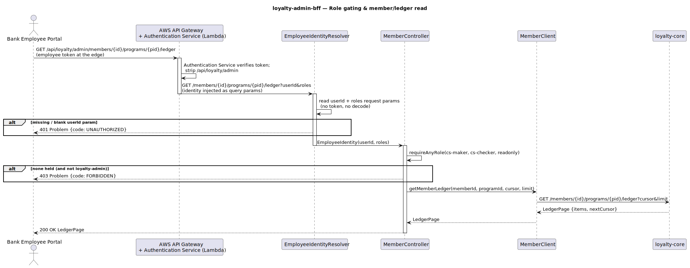
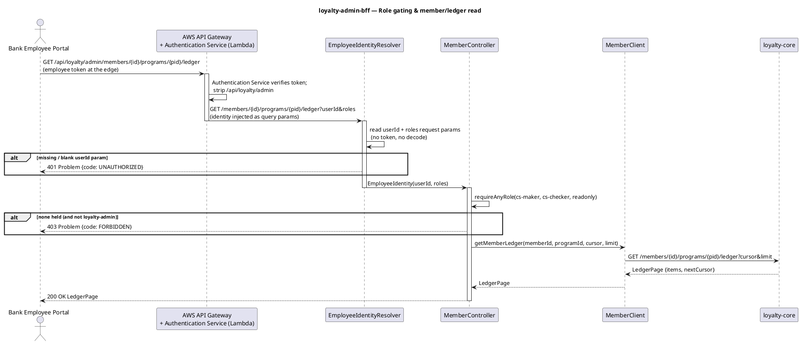
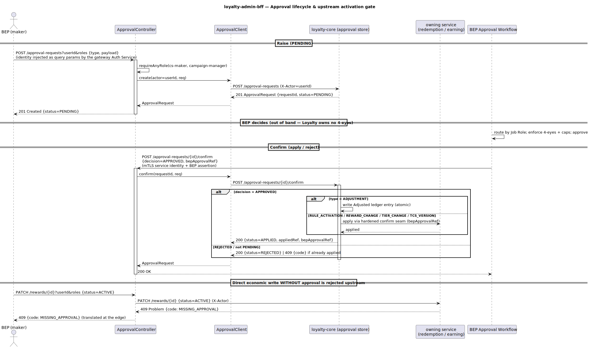
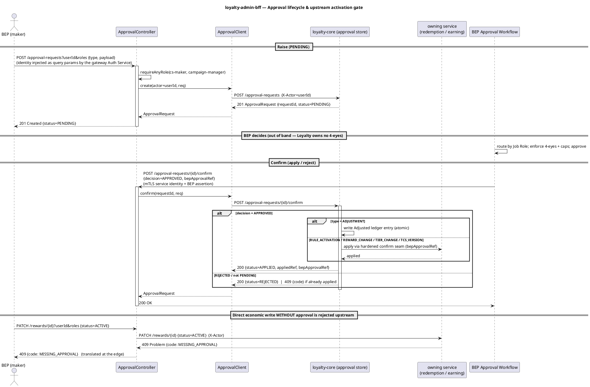
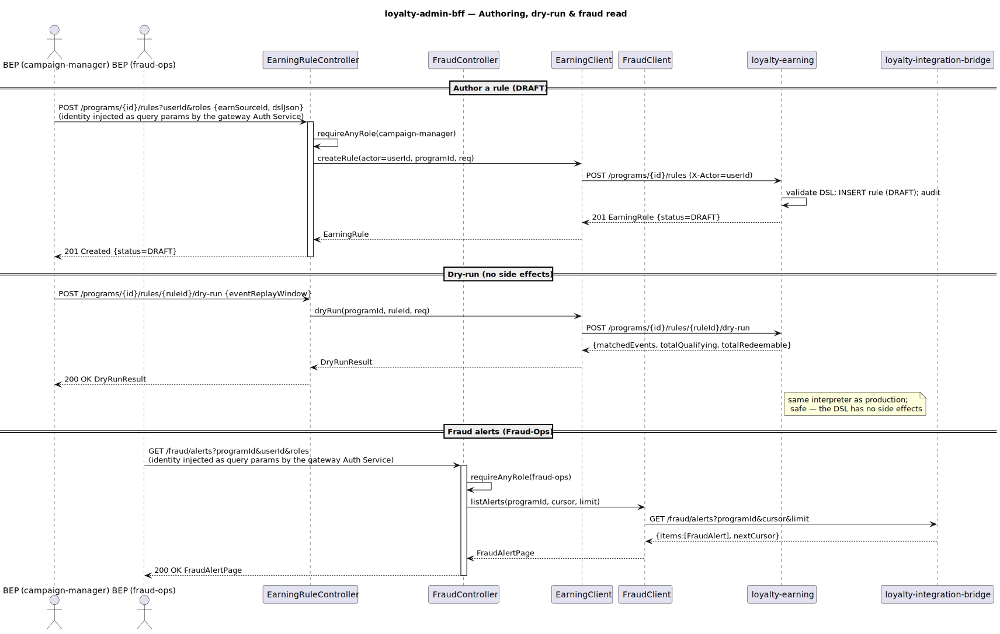
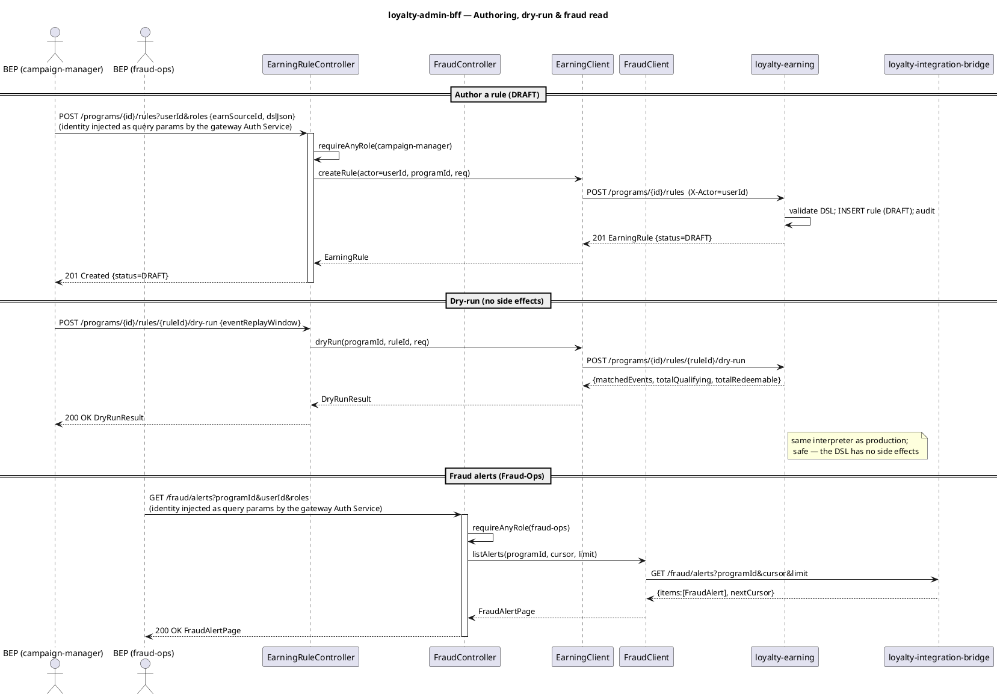

# loyalty-admin-bff — Detailed Design & User Guide

A self-contained companion to [C4 L2 BFFs](../../docs/c4/level-2-containers.md) and the BEP edge
contract ([`loyalty-admin-bff.yaml`](../../docs/openapi/loyalty-admin-bff.yaml)).

---

## 0. What this service is

The **Bank Employee Portal (BEP) edge API**. Behind AWS API Gateway (route `/api/loyalty/admin/*`) it is
an **aggregation-only** service — it owns **no datastore** and produces/consumes **no Kafka**. Each
request is a role-gated fan-out to one of five backend services:

| Upstream | Surface |
|---|---|
| `loyalty-core` | member lookup/detail, ledger audit view, the **approval-request store** |
| `loyalty-earning` | earn-source registry, Earning Rule authoring + dry-run + activation |
| `loyalty-redemption` | Reward Type catalogue, per-Program Reward authoring |
| `loyalty-campaign` | campaign + drawing CRUD, lifecycle transitions, winner records |
| `loyalty-integration-bridge` | velocity-anomaly fraud alerts (Fraud-Ops) |

Its job is **identity + role gating + aggregation + translation**, plus forwarding the operator identity
as `X-Actor` so each owning service's hash-chained audit records *who* acted.

---

## 1. Bounded context & neighbours

- **Inbound:** the Bank Employee Portal, via AWS API Gateway. A gateway **Authentication Service**
  (Lambda) verifies the employee token and injects the employee identity (`userId` + `roles`) as query
  parameters; the gateway also strips the `/api/loyalty/admin` prefix. The BFF does no token handling.
- **Outbound:** the five services above — REST only, each behind an Anti-Corruption `RestClient` pinned
  to HTTP/1.1. mTLS is provided by cluster infra.
- **Owns:** nothing durable. No tables, no topics.

---

## 2. Identity & role gating

**The BFF does no token handling at all.** A gateway **Authentication Service** (a Lambda) verifies the
employee token and **injects the employee identity into the request as query parameters** before it
reaches the BFF — `userId` (the employee user id) and `roles` (a comma-separated list of Loyalty roles,
e.g. `loyalty-cs-maker,loyalty-readonly`). The BFF never sees or decodes a JWT and never reads
`realm_access.roles`.

`EmployeeIdentityResolver` simply **reads those two query parameters** and builds an
`EmployeeIdentity{userId, Set<roles>}`, injected into every controller method. Query parameters (not the
body, not headers) are used because the actor must gate `requireAnyRole(...)` on **every** endpoint
including GET reads (which carry no body), and a `HandlerMethodArgumentResolver` cannot read the JSON body
without breaking `@RequestBody` — so the same uniform mechanism covers GET and POST/PATCH. A missing or
blank `userId` request parameter is a `401` (defence in depth — the request should never reach the BFF
without it).

The employee `userId` is **distinct from `customerId`**: `customerId` (the bank CIF) is the *customer
being acted upon* by member-scoped admin ops (e.g. `GET /members?customerId=...`), while `userId` is the
*employee actor*. The employee `userId` is forwarded downstream as the `X-Actor` header for the
hash-chained audit trail.

Each operation calls `requireAnyRole(...)`; a missing role is a `403`. `loyalty-admin` is a **wildcard**
over the functional roles (`loyalty-cs-maker`, `loyalty-cs-checker`, `loyalty-campaign-manager`,
`loyalty-fraud-ops`, `loyalty-readonly`). Per-Program scope (PROGRAM_ADMIN) is enforced upstream; this
BFF gates by role. The OpenAPI `employeeJwt` bearer security scheme is kept as **edge-level
documentation** (an employee token is still required at the gateway / Authentication Service), but the BFF
itself does not process the token.

<p align="center">
  
</p>



---

## 3. Approvals — Loyalty raises, BEP decides, the owning service applies

Loyalty does **not** implement maker-checker. Money-equivalent and economic-config changes are **raised**
via `POST /approval-requests` (persisted `PENDING`) and **applied** via
`POST /approval-requests/{id}/confirm` once the bank's **BEP Approval Workflow** decides. BEP owns
routing, Job Roles, 4-eyes, and caps; Loyalty stores only a `bepApprovalRef`.

Because the BFF is aggregation-only, the **approval-request store + apply-on-confirm orchestration lives
in `loyalty-core`** (the Shared Kernel). The BFF is a thin forwarder. On `confirm/APPROVED`, core applies
the change atomically — writing the `Adjusted` ledger entry itself, or invoking the owning service's
**hardened confirm seam** with the `bepApprovalRef`. Direct economic writes that bypass the approval flow
(e.g. `PATCH /rewards` → ACTIVE without a ref) are **rejected upstream** and the error is translated at
the edge.

<p align="center">
  
</p>



---

## 4. Authoring & fraud — fan-out with `X-Actor` audit

The authoring surfaces (Earning Rules, Rewards, Campaigns) follow one shape: gate on
`loyalty-campaign-manager`, forward the body to the owning service with the operator id as `X-Actor`
(for the owning service's hash-chained audit), and return its response. **Activation** (→ ACTIVE) is
approval-gated upstream (§3); **drafting**, **dry-run**, **archive**, and **campaign transitions** apply
directly. Fraud alerts are read from the integration-bridge (which owns the velocity-anomaly consumer),
gated on `loyalty-fraud-ops`.

<p align="center">
  
</p>



---

## 5. Error translation

Every outbound `RestClient` registers
[`UpstreamErrorHandler`](src/main/java/com/loyalty/adminbff/client/UpstreamErrorHandler.java) via
`defaultStatusHandler(HttpStatusCode::isError, …)`. An upstream `4xx/5xx` is lifted to a `BffException`
carrying the **same status** + RFC-7807 `code` (e.g. `MISSING_APPROVAL`, `DSL_INVALID`, `CAP_EXCEEDED`),
so the BEP sees the real cause instead of a `500`. A missing `userId` request parameter (`401`) and a
failed `requireAnyRole(...)` (`403`) are raised directly. `ProblemAdvice` renders the final Problem.

---

## 6. Implementation notes

- **Jackson 2/3 split:** open-JSON DTO fields (`payload`, `dslJson`, `fulfillmentParams`,
  `parameterSchema`, `eligibility`, `targetSegment`, `prize`) are typed `Object` (Map/List trees), not
  Jackson tree nodes — Spring Boot 4's web layer is Jackson 3 while the platform pins Jackson 2. (See
  [[spring-boot4-jackson2-3-split]].)
- **RestClients pinned to HTTP/1.1** — avoids flaky HTTP/2 negotiation against the WireMock stubs.
- **No datastore, no Kafka** — the build omits JPA / Flyway / Kafka / ShedLock / Postgres; the only test
  dependency beyond `spring-boot-starter-test` is WireMock.

---

## 7. Upstream dependency notes

Two design seams the BFF defines and stubs in the IT:

- **Approval store + apply-on-confirm lives in `loyalty-core`** (§3) so the BFF stays aggregation-only.
- **Fraud alerts are read from `loyalty-integration-bridge`**, which owns the Velocity-Anomaly consumer
  of `loyalty.fraud.alert.v1` (there is no separate `loyalty-fraud` container). The BFF aggregates that
  read rather than consuming Kafka itself — a deliberate refinement of the L2 async diagram's direct
  `MSK → admin-bff` arrow.

---

## 8. Run & operate

```bash
./gradlew test     # 17 tests: 7 WireMock IT (all five upstreams stubbed) + 10 unit (identity, role gating)
./gradlew bootRun  # needs core / earning / redemption / campaign / bridge base-URLs (see application.yml)
```

Requires a **JDK 25** toolchain. The IT stubs all five upstreams with one WireMock server, so the suite
runs with no sibling service and **no Docker**.
