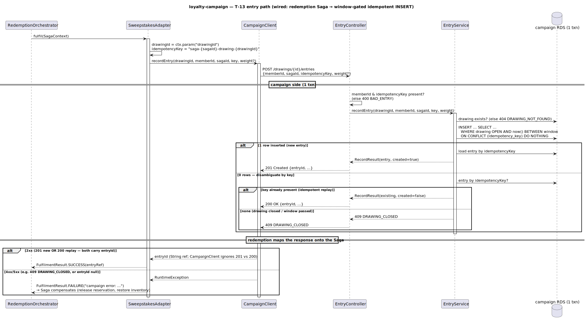
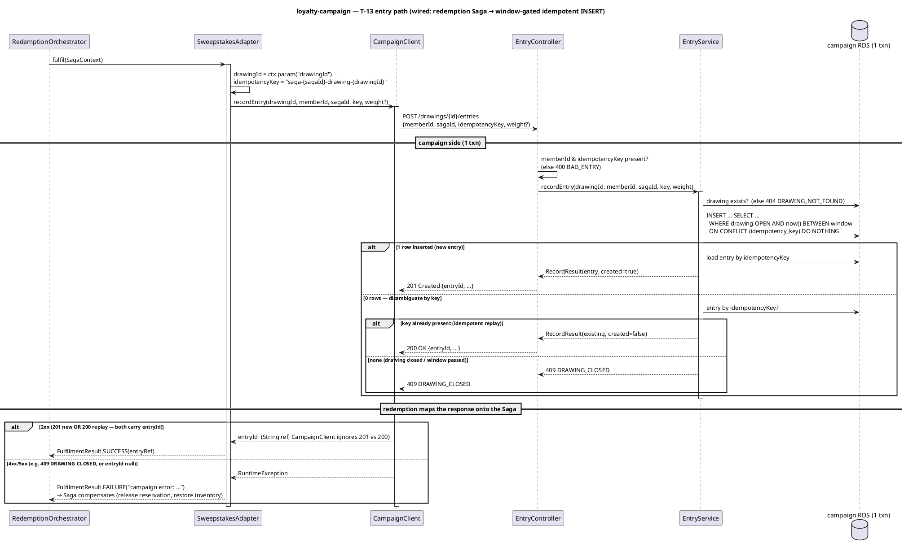
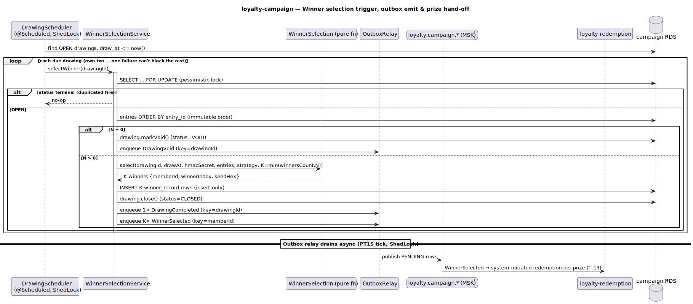
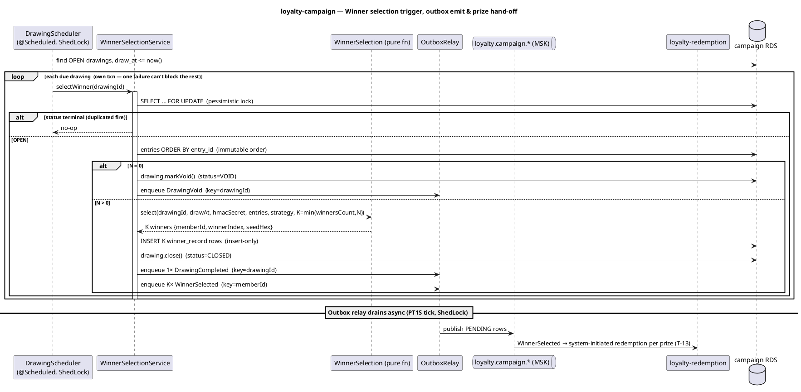
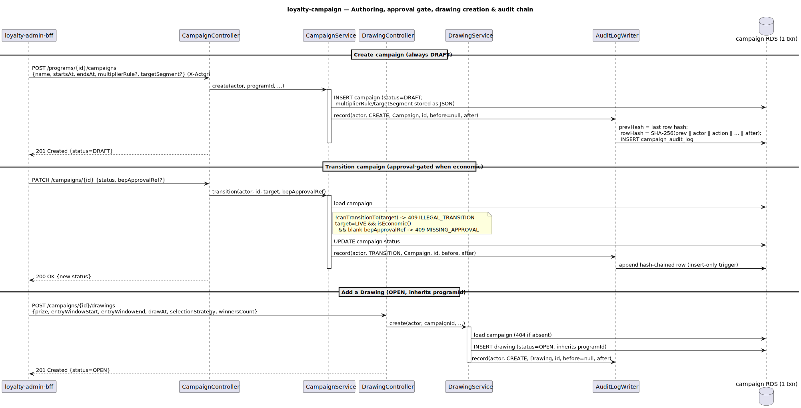
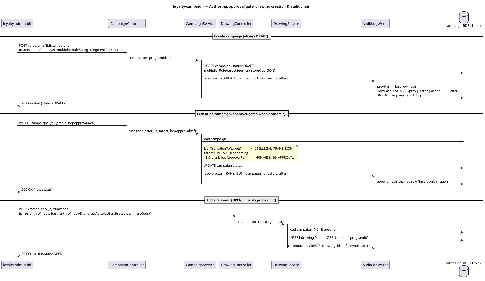

# loyalty-campaign — Detailed Design & User Guide

A self-contained companion to [C4 L3 `loyalty-campaign`](../../docs/c4/level-3-loyalty-campaign.md),
the internal API ([`loyalty-campaign.yaml`](../../docs/openapi/internal/loyalty-campaign.yaml)) and
the domain events ([`asyncapi/loyalty-campaign.yaml`](../../docs/asyncapi/loyalty-campaign.yaml)).

---

## 0. What this service is

Two co-deployed bounded contexts:

- **Campaign** — marketing-driven, time-bounded earning multipliers. `loyalty-campaign` *owns and exposes*
  the multiplier rule; it never evaluates it (that is the DSL Interpreter in `loyalty-earning`).
- **Drawing** — sweepstakes. Members enter, a winner is drawn fairly and auditably, and the prize is
  fulfilled by reusing the existing Reward pipeline in `loyalty-redemption` (the T-13 touchpoint).

---

## 1. Bounded context & neighbours

- **Inbound:** `loyalty-mobile-bff` (list active), `loyalty-admin-bff` (Campaign + Drawing CRUD),
  `loyalty-redemption` (the T-13 entry surface).
- **Outbound:** none synchronous — campaign only *emits* `loyalty.campaign.*` through the transactional
  outbox. Prize fulfilment is delegated to `loyalty-redemption` (the only service that fulfils a Reward).
- **Owns:** `loyalty-campaign RDS` (campaign / drawing / entry / winner) and the `loyalty.campaign.*` topics.

---

## 2. The two state machines

```
Campaign:  DRAFT ──▶ SCHEDULED ──▶ LIVE ──▶ ENDED ──▶ ARCHIVED
              └──────────┴───────────────────────────▶ ARCHIVED   (archive before going live)
              └──▶ LIVE                                            (DRAFT may go live directly)

Drawing:   OPEN ──▶ CLOSED   (K winners selected)
              └───▶ VOID     (zero entries at draw time)
```

`ARCHIVED` (Campaign) and `CLOSED`/`VOID` (Drawing) are terminal — every further transition is rejected.
The LIVE transition is **approval-gated** when the Campaign is economic; the close/void transition is the
only writer of a Drawing's terminal state and is guarded by a pessimistic row lock.

---

## 3. Winner Selection (the auditable heart) — L3 §3.3

Pure function `WinnerSelection.select(drawingId, drawAt, hmacSecret, entries, strategy, winnersCount)`:

1. `K = min(winnersCount, N)`; `N=0` → no winners (Drawing closes VOID).
2. **Seed** (`SEEDED_RNG`/`WEIGHTED`): `seedHex = HMAC-SHA256(secret, "drawingId|drawAt")`. The secret is
   the only non-public input — with it plus the immutable `entry_id` order and frozen per-entry weights, an
   auditor reproduces the exact winners. A `java.util.Random` is seeded from the HMAC's leading 8 bytes;
   the PRNG is deterministic (replay needs that) — unpredictability comes from the secret, not the PRNG.
3. **Draw without replacement:** uniform (partial Fisher–Yates) for `SEEDED_RNG`, cumulative-weight for
   `WEIGHTED`. `FIRST_N` takes the first K by arrival with **no seed** (`seedHex = null`).
4. Each winner carries `winnerIndex` = its position in the `entry_id`-ordered set, so K winners hold K
   distinct indices (`UNIQUE(drawing_id, winner_index)` holds by construction).

`winner_record` rows are insert-only (DB trigger + `@Immutable`); `GET /drawings/{id}/winners` is the audit
view.

---

## 4. The entry path (T-13) — L3 §3.2

<p align="center">
  
</p>



`POST /drawings/{id}/entries {memberId, sagaId, idempotencyKey, weight?}`, called by
`loyalty-redemption`'s SweepstakesAdapter inside a Member's Saga:

```
recordEntry → INSERT … SELECT … WHERE drawing OPEN AND now() BETWEEN window
                       ON CONFLICT (idempotency_key) DO NOTHING
  ├─ 1 row  → 201 (new entry)
  └─ 0 rows → key exists? → 200 (idempotent replay)        : 409 DRAWING_CLOSED (closed / window passed)
```

A single conditional INSERT — no SELECT-then-INSERT race — makes the window check and the idempotency
guarantee atomic. A duplicate is a successful no-op; we never fail the calling Saga on a replay.

---

## 5. Winner Selection trigger + prize hand-off

<p align="center">
  
</p>



```
Drawing Scheduler (@Scheduled, ShedLock)  → finds OPEN drawings with draw_at <= now
  → WinnerSelectionService.selectWinner(id)   (one txn per drawing)
     ├─ SELECT … FOR UPDATE; status != OPEN → no-op (duplicated fire)
     ├─ N entries (entry_id order)
     ├─ N=0 → drawing.markVoid(); outbox DrawingVoid
     └─ N>0 → K winner_record rows; drawing.close();
              outbox 1×DrawingCompleted (key=drawingId) + K×WinnerSelected (key=memberId)

(downstream) loyalty-redemption issues a system-initiated redemption for each prize — T-13.
```

---

## 6. Authoring & the approval gate — L3 §3.2

<p align="center">
  
</p>



- `POST /programs/{id}/campaigns` creates a Campaign as **DRAFT**.
- `PATCH /campaigns/{id}` transitions it. An illegal move is `409 ILLEGAL_TRANSITION`; a **LIVE** transition
  on an **economic** Campaign (one with a `multiplierRule`) without a `bepApprovalRef` is
  `409 MISSING_APPROVAL`, mirroring core/earning/redemption's confirm seam.
- `POST /campaigns/{id}/drawings` adds an OPEN Drawing (inheriting the Campaign's `programId`).
- Every admin write is recorded in `campaign_audit_log` — SHA-256 hash-chained + DB-immutable.

---

## 7. Data & config reference

**Tables** (`loyalty-campaign RDS`): `campaign`, `drawing`, `drawing_entry`, `winner_record` (insert-only),
`campaign_audit_log` (insert-only), `outbox`, `shedlock`. Flyway `V1__baseline.sql` + `V2__seed_sample.sql`.

**Config** (`campaign.*`): `topics.{drawing-completed,winner-selected,drawing-void}`, `default-program-id`,
`default-program-code`, `selection.hmac-secret`, `scheduler.poll-cron`, `outbox.relay-batch-size`.

---

## 8. Implementation notes & divergences

- **Campaign status enum** — follows the OpenAPI contract (`DRAFT/SCHEDULED/LIVE/ENDED/ARCHIVED`), which is
  the authoritative wire interface. The C4 prose still names the older `DRAFT/ACTIVE/ARCHIVED`; the OpenAPI
  supersedes it.
- **`DrawingVoid` event** — the C4 §3.3 designs a distinct event for zero-entry drawings. We emit
  `DrawingVoid` on a distinct configurable topic (`loyalty.campaign.drawing_void.v1`) rather than overload
  `DrawingCompleted` with an empty winner set. Now catalogued in the `asyncapi` (and `event-catalogue.md`),
  partitioned by `drawingId`.
- **T-13 seam — now wired.** campaign's entry contract is `{memberId, sagaId, idempotencyKey, weight?}` →
  `DrawingEntry`. `loyalty-redemption`'s `CampaignClient`/`SweepstakesAdapter` now send the full contract —
  the `idempotencyKey` is derived from the Saga key (`saga-{sagaId}-drawing-{drawingId}`) so a Saga retry
  replays the same entry rather than duplicating — and read back `entryId` as the adapter's external ref.
  Pinned on the redemption side by `CampaignClientTest`.
- **`prizeRewardId` on `WinnerSelected`** — null in v1; the prize lives in the Drawing's open `prize` JSON
  and prize fulfilment is a direct call to `loyalty-redemption` (per the asyncapi note), not driven by the
  event.
- **Jackson 2/3 split** — Spring Boot 4's web layer is Jackson 3; the platform pins Jackson 2. Open-JSON DTO
  fields (`multiplierRule`, `targetSegment`, `prize`) are typed `Object` (Map/List trees), not tree nodes —
  the same approach redemption uses.
- **No outbound HTTP** — campaign serves REST and emits events only; the IT needs just Postgres + Kafka.

---

## 9. Run & operate

```bash
./gradlew test          # 26 unit + 7 Testcontainers IT (Postgres + Kafka)
./gradlew bootRun       # needs Postgres + Kafka
```

Requires a **JDK 25** toolchain. Flyway owns the schema (`ddl-auto: validate`). The Outbox Relay drains on a
1s ShedLock-guarded tick; the Drawing Scheduler polls per `scheduler.poll-cron` (default every minute),
ShedLock-guarded. The HMAC selection secret is rotated annually by platform SRE; `winner_record` retains the
seed hex so any past draw stays re-verifiable.
