# `loyalty-core` — Detailed Design & User Guide

| Field | Value |
|---|---|
| Service | `loyalty-core` |
| Bounded contexts | Membership + Ledger (Shared Kernel) |
| Companion views | [C4 L3 `loyalty-core`](../../docs/c4/level-3-loyalty-core.md) · [C4 L2](../../docs/c4/level-2-containers.md) · [internal OpenAPI](../../docs/openapi/internal/loyalty-core.yaml) |
| Glossary | [`CONTEXT.md`](../../CONTEXT.md) |

---

## 0. How to read this document

Top to bottom is the intended order: what the service *is*, *why* it exists, the *vocabulary*, its
*runtime shape*, then each *flow* with a sequence diagram, then the *data / config* reference and the
*operate* guide. You should not need to read the code to understand the service.

## 1. What this service is, in one paragraph

`loyalty-core` is the system of record for a Member's points. It co-locates the **Membership** and
**Ledger** bounded contexts in one deployable so that a Point Ledger insert and all of its
consequences — the redeemable/qualifying balance update, FIFO cohort consumption, Tier
re-evaluation, any Reservation state change, and the outbound-event enqueue — happen inside a
**single Postgres transaction**. It exposes internal REST APIs (Ledger, Reservations, Projection,
Membership, Approval), consumes `loyalty.member.lifecycle.v1` from the integration bridge, runs two
in-pod scheduled jobs (Expiry, TTL Sweeper), and publishes `loyalty.ledger.*` / `loyalty.member.*`
through a transactional outbox.

## 2. Why it exists — the context

### 2.1 The problem it solves

Points are money-like. The platform's correctness rests on a handful of invariants
([`CONTEXT.md` §Invariants](../../CONTEXT.md)): the Ledger is append-only, every entry is
idempotency-keyed, and the denormalized balance is written by exactly one component in the same
transaction as the entry it reflects. Those guarantees are only cheap if Membership and Ledger share
a transaction boundary — otherwise they would need a distributed transaction or a saga over what is
conceptually one decision. So they are **one service**, not two (the "8 contexts → 7 services"
collapse, [C4 L2 §4.1](../../docs/c4/level-2-containers.md#41-application-containers-7)).

### 2.2 The decision that shaped it

Three patterns do the heavy lifting:

- **Append-only Ledger + idempotency** — corrections are compensating entries, never mutations;
  `(sourceRef, entryType)` uniqueness makes every write a safe replay.
- **Two-phase reservation** — a hold is a *mutable* row in `point_reservation`, deliberately **not**
  a Ledger entry (which would violate immutability for transient state). Only `commit` writes the
  permanent `Redeemed` entry.
- **Transactional outbox** — "the ledger insert and the event publish must both succeed" without a
  Postgres↔Kafka distributed transaction: stage the event in the same DB transaction, relay it later.

### 2.3 Where it sits

```
loyalty-earning ──earn()──▶ ┌───────────────┐ ──loyalty.ledger.*──▶ MSK ──▶ notification-service
loyalty-redemption ─reserve/commit/release─▶ │  loyalty-core │ ──loyalty.member.*─▶ MSK
mobile-bff / admin-bff ──read / admin──▶     └───────────────┘ ◀─loyalty.member.lifecycle.v1── bridge
                                                     │
                                              loyalty-core RDS (Postgres)
```

## 3. Vocabulary you need first

Defined fully in [`CONTEXT.md`](../../CONTEXT.md); the ones you must hold in your head here:

- **Member** — one per `(programId, customerId)`; owns balances, tier, lifecycle status. PII-free.
- **Point Ledger Entry** — one immutable row; carries `qualifying_delta`, `redeemable_delta`,
  `sourceRef`, `entryType` ∈ {`Earned`,`Redeemed`,`Expired`,`Reversed`,`Adjusted`}.
- **Redeemable / Qualifying Balance** — `SUM(redeemable_delta)` / windowed `SUM(qualifying_delta)`;
  denormalized onto `member`.
- **Reservation** — short-lived hold; `Effective Redeemable Balance = redeemable_balance − SUM(active HELD)`.
- **Point Cohort** — per-`Earned`-entry FIFO consumption tracker carrying `expires_at`.
- **Tier** — a *projection*, recomputed when Qualifying Balance moves; never an aggregate.

## 4. The runtime shape

### 4.1 Components (13)

Mirrors [L3 §4](../../docs/c4/level-3-loyalty-core.md#4-component-inventory). Each is one Spring bean
with one job and one table it is allowed to write:

| Component | Package | Writes |
|---|---|---|
| REST API Layer | `api` | — |
| Membership Aggregate | `member` | `member` (status) |
| Balance Projection | `projection` | `member` (balances) |
| Tier Projection | `projection` | `member` (tier) |
| Ledger Service (Write) | `ledger` | `point_ledger` |
| Reservation Manager | `reservation` | `point_reservation` |
| Cohort Projection | `cohort` | `point_cohort` |
| Approval Request Store | `approval` | `approval_request` |
| Audit Log Writer | `audit` | `core_audit_log` |
| Outbox Relay | `outbox` | `outbox` |
| Expiry Job + Processor | `job` | — (calls Ledger) |
| Reservation TTL Sweeper | `job` | — (calls Reservation Mgr) |
| Member-Lifecycle Consumer | `consume` | — (calls Membership) |

### 4.2 The defining property — one transaction

Every balance-affecting write loads the `Member` row `FOR UPDATE`, then within that one transaction:
insert the immutable Ledger entry → apply the balance delta → (if `qualifyingDelta ≠ 0`) recompute
the Tier → open/consume cohorts → enqueue the outbox row. The Outbox Relay drains in a *separate*
transaction. This is the whole reason Membership and Ledger are co-deployed.

## 5. The flows (each with a sequence diagram)

### 5.1 Earn — `POST /ledger/earn`

`loyalty-earning` calls this once per matching rule fire. Idempotent on `(sourceRef, Earned)`.

<p align="center">
  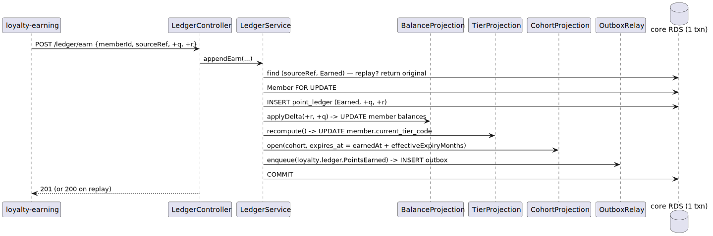
</p>

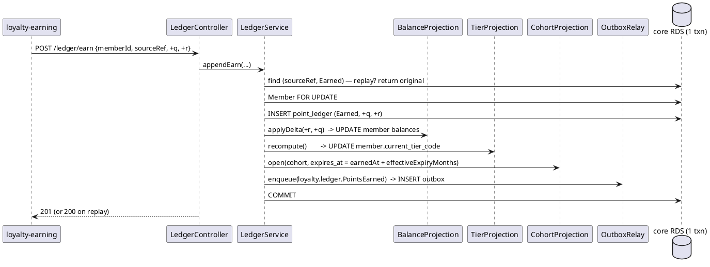

### 5.2 Redemption — reserve → commit / release

`loyalty-redemption`'s Saga. The reserve gate checks the **Effective** balance; the HELD hold does
**not** mutate `redeemable_balance` (per [`CONTEXT.md` "Reservation"](../../CONTEXT.md)). Only
`commit` writes the `Redeemed` entry and consumes cohorts FIFO.

<p align="center">
  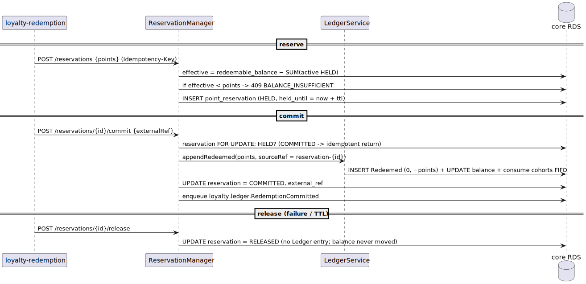
</p>

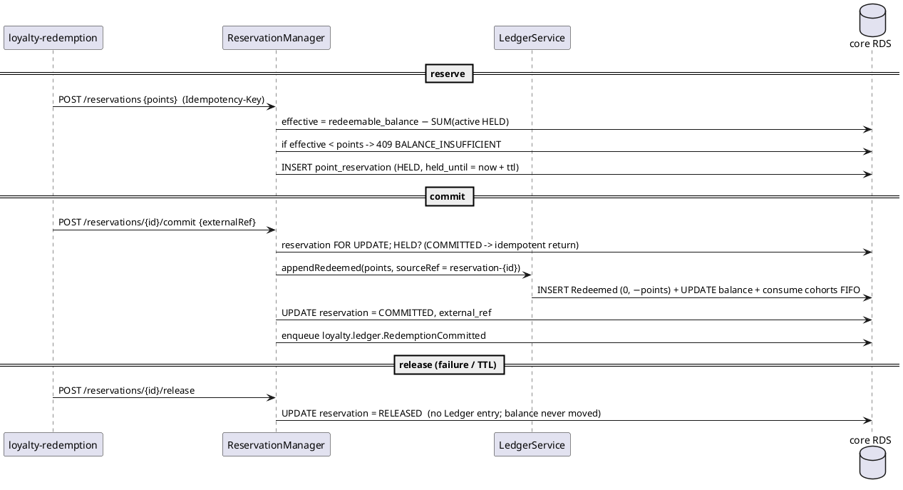

### 5.3 Member lifecycle — `loyalty.member.lifecycle.v1` → close

The bridge republishes `customer.closed.v1` as this canonical event (keyed on `customerId`). v1 carries
one `lifecycleType`: `CUSTOMER_CLOSED`. The consumer closes **every** Member the Customer holds.

<p align="center">
  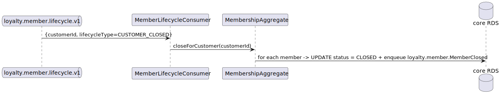
</p>

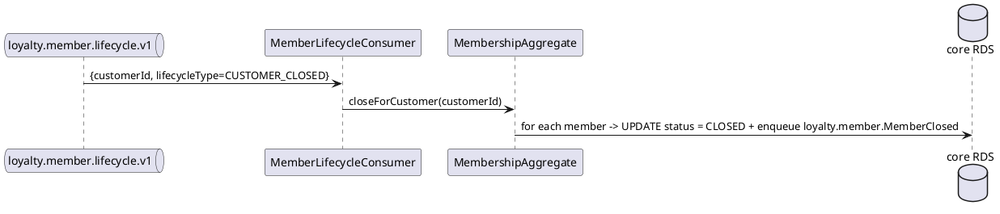

### 5.4 Expiry (scheduled) — unconsumed cohorts → `Expired` entries

Nightly, ShedLock so one pod runs; each Program processed under a `pg_try_advisory_xact_lock(programId)`.
Each expired-but-unconsumed cohort yields one `Expired(−N,−N)` entry, idempotency-keyed by cohort id.

<p align="center">
  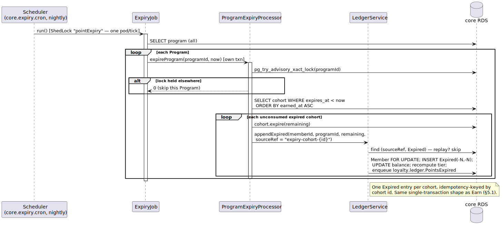
</p>

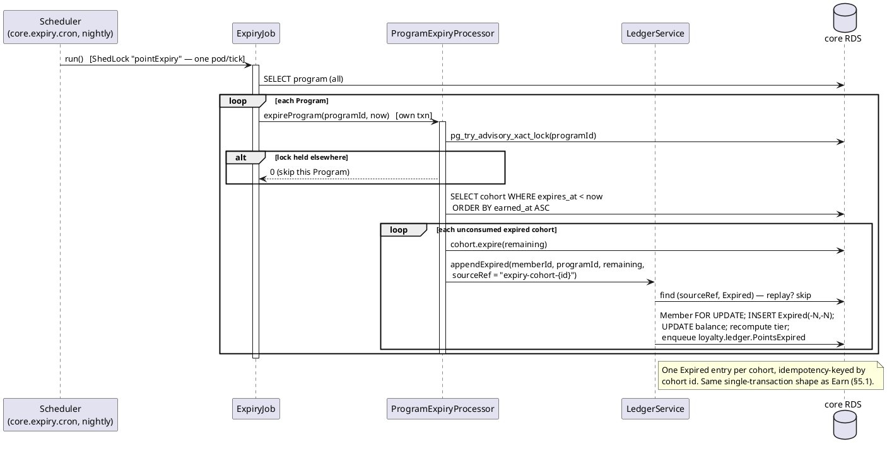

### 5.5 Reservation TTL sweep (scheduled) — stale HELD → RELEASED

Every 60s, ShedLock-guarded, batched (LIMIT 500). Reuses `ReservationManager.release`; a hold that
was committed/released in the race is skipped.

<p align="center">
  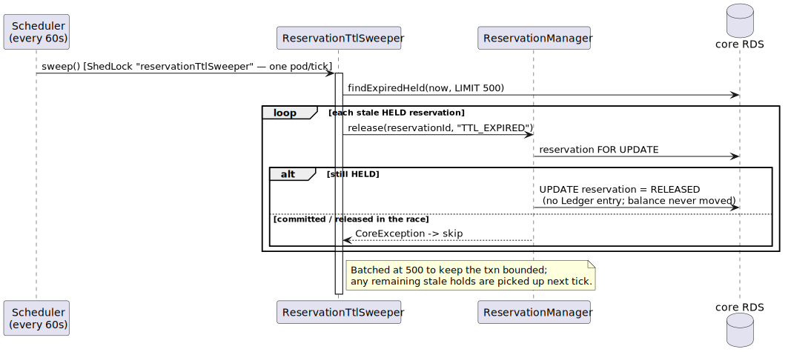
</p>

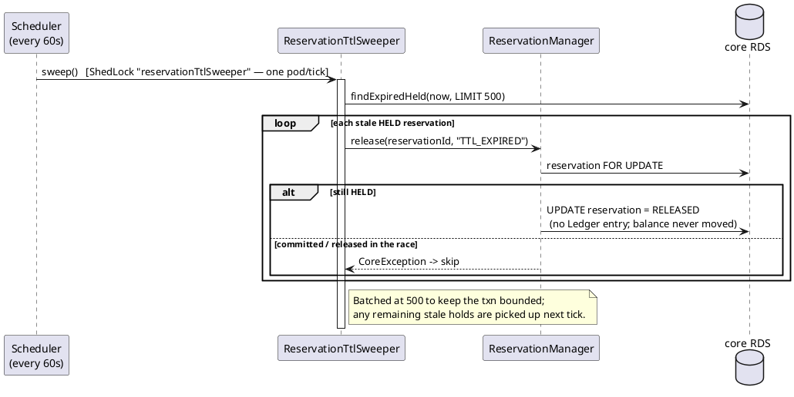

### 5.6 Manual adjustment — approval → `Adjusted` entry

Maker creates an `approval_request` (PENDING). The 4-eyes runs in **BEP's Approval Workflow**; core's
`confirm` requires a `bepApprovalRef` and is the only path that writes an `Adjusted` entry (linked back
via `point_ledger.approval_request_id`). Every step is recorded in the hash-chained `core_audit_log`.

<p align="center">
  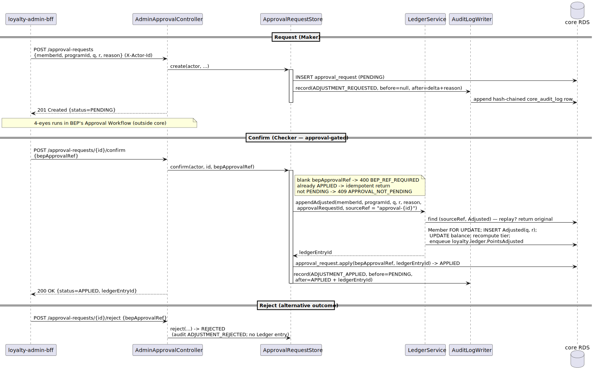
</p>

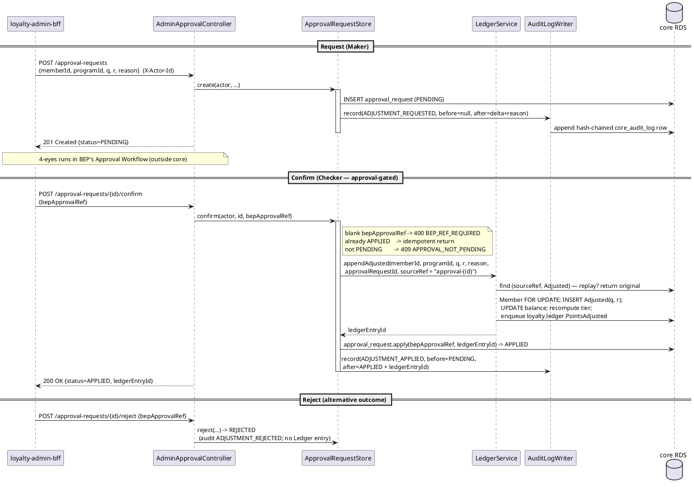

## 6. Data reference

The 8 owned tables ([L3 §5](../../docs/c4/level-3-loyalty-core.md#5-loyalty-owned-tables-in-loyalty-core-rds)),
created by Flyway [`V1`](src/main/resources/db/migration/V1__baseline.sql): `member`, `point_ledger`
(append-only trigger + `UNIQUE(source_ref, entry_type)`), `point_reservation`, `point_cohort`,
`approval_request`, `core_audit_log` (insert-only trigger + hash chain), `outbox`, `shedlock`. Plus the
scaffolding `program` / `tier` config tables seeded by [`V2`](src/main/resources/db/migration/V2__seed_program.sql).

Outbound event envelopes (`event` package): `LedgerEvent` (`loyalty.ledger.*`), `MemberEvent`
(`loyalty.member.*`) — self-describing, keyed by `memberId`, `Instant` as ISO-8601, byte-compatible
with the bridge's Jackson-2 serialization.

## 7. Error handling, idempotency, tracing

- **Idempotency** — primary key is `(sourceRef, entryType)`; reservation reserve is idempotent on
  `Idempotency-Key`; commit/release/confirm are idempotent on the entity's terminal state.
- **Errors** — domain failures throw `CoreException(status, code, detail)` rendered as RFC-7807
  Problem (`code` ∈ `BALANCE_INSUFFICIENT`, `RESERVATION_NOT_HELD`, `MEMBER_NOT_FOUND`, …).
- **Negative balance** — explicitly allowed; the reserve gate is the only balance guard.

## 8. Configuration reference (`application.yml`)

| Key | Default | Meaning |
|---|---|---|
| `spring.datasource.url` | `jdbc:postgresql://localhost:5432/loyalty_core` | core RDS |
| `spring.kafka.bootstrap-servers` | `localhost:9092` | Shared MSK |
| `core.topics.member-lifecycle` | `loyalty.member.lifecycle.v1` | consumed (from bridge) |
| `core.topics.ledger-events` | `loyalty.ledger.v1` | produced |
| `core.topics.member-events` | `loyalty.member.v1` | produced |
| `core.reservation.default-ttl-seconds` | `900` | hold TTL (15 min) |
| `core.expiry.cron` | `0 30 2 * * *` | nightly expiry sweep |
| `core.outbox.relay-batch-size` | `100` | rows per relay tick |

## 9. Build & run

See [`README.md`](README.md). `./gradlew test` runs the end-to-end IT against Testcontainers Postgres
+ Kafka (Docker required; skipped otherwise). Requires a JDK 25 toolchain.

## 10. Operating it

- **Multi-pod scheduling** — Expiry and TTL Sweeper are ShedLock-guarded via the `shedlock` table; one
  pod runs each tick. Expiry additionally takes a per-Program advisory lock.
- **Outbox** — relayed every 1s; `SENT` rows accumulate (a TTL purge job is out of scope for v1).
- **Audit** — `core_audit_log` is hash-chained and DB-immutable; nightly WORM sealing to S3 Object
  Lock is the documented next step (not in this scaffold).

## 11. FAQ — the day-one questions

- **Why doesn't reserve decrement the balance?** A HELD reservation is a hold, not a spend — the
  glossary defines Effective balance as `balance − active holds`. Only `commit` spends. (The internal
  OpenAPI prose that says reserve "decrements the projection" is superseded by the glossary + L3 sequence.)
- **Where does Program/Tier config come from?** Authoritative owner is `loyalty-earning`; this scaffold
  seeds a local copy so core runs standalone. Sync mechanism is deferred.
- **Can balance go negative?** Yes — a clawback can drive it below zero; the Member can't redeem until
  it recovers, but the invariant `balance = Σ deltas` always holds.

## 12. Cross-references

- Component view: [C4 L3 `loyalty-core`](../../docs/c4/level-3-loyalty-core.md)
- Container view: [C4 L2](../../docs/c4/level-2-containers.md)
- Internal API: [`docs/openapi/internal/loyalty-core.yaml`](../../docs/openapi/internal/loyalty-core.yaml)
- Glossary & invariants: [`CONTEXT.md`](../../CONTEXT.md)
- Upstream producer of `loyalty.member.lifecycle.v1`: [`loyalty-integration-bridge`](../loyalty-integration-bridge/README.md)
