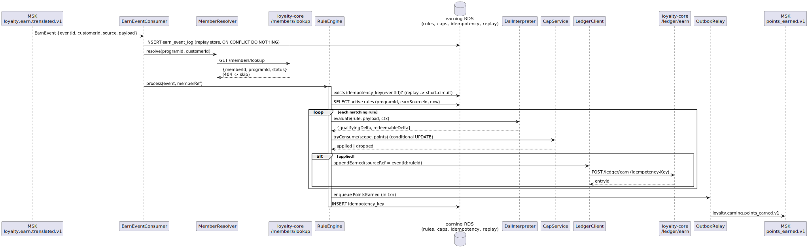
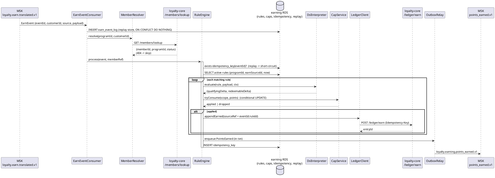
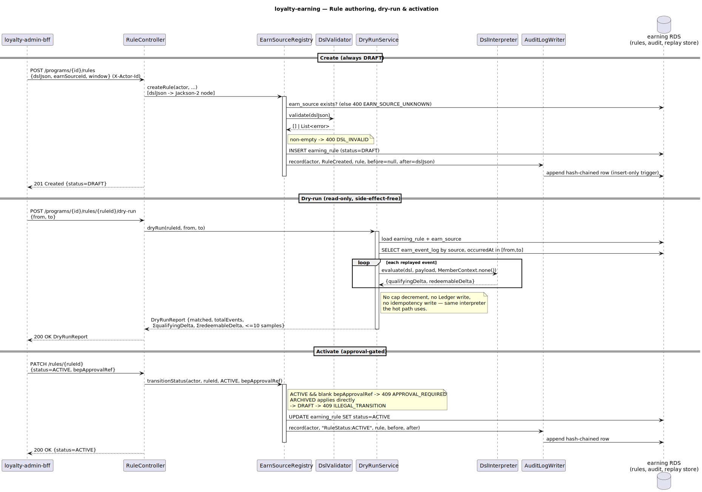
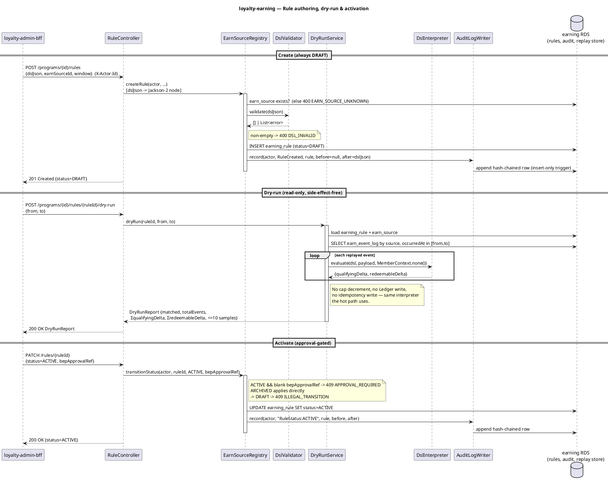

# loyalty-earning — Detailed Design & User Guide

Self-contained companion to the [C4 L3 view](../../docs/c4/level-3-loyalty-earning.md). You should not
need to read the code to understand how earning evaluates rules and awards points.

---

## 0. What this service is

`loyalty-earning` is the **Rule Engine**. One job: given a translated, customer-scoped `EarnEvent`,
decide how many points to award and write the resulting `Earned` entries to the Ledger. It is
event-driven and stateless on the hot path — it owns rule configuration and counters, but the points
themselves live in `loyalty-core`. It is the only component permitted to interpret the rule DSL.

Two execution modes:
- **Event-driven (hot path):** consume `loyalty.earn.translated.v1` → resolve member → evaluate rules →
  award. §3.
- **Request-driven (authoring):** BEP operators CRUD rules and dry-run them via `loyalty-admin-bff`. §4.

---

## 1. Bounded context & neighbours

| Edge | Counterparty | Mechanism |
|---|---|---|
| Async in | `loyalty-integration-bridge` | Kafka `loyalty.earn.translated.v1` |
| Sync out | `loyalty-core` | REST `POST /ledger/earn` (award) + `GET /members/lookup` (resolve) |
| Async out | downstream (notification, …) | Kafka `loyalty.earning.points_earned.v1` (via outbox) |
| Sync in | `loyalty-admin-bff` | REST rule CRUD / dry-run / status |
| JDBC | `loyalty-earning RDS` | the 6 owned tables + replay store |

---

## 2. The DSL (the heart of the service)

An Earning Rule is a **constrained decision table** (`docs/dsl/schema/earning-rule.schema.json`,
ADR-0002). Non-Turing-complete by design: a fixed operator vocabulary, two earn formulas, a closed set
of caps. Validated at save (`DslValidator`, networknt) and evaluated by a **pure function**
(`DslInterpreter`) shared by the hot path and dry-run.

```jsonc
{
  "dslVersion": 1,
  "earnSource": "CARD_SPEND",
  "hitPolicy": "FIRST",          // FIRST = first matching row wins; COLLECT = sum every match
  "tierMultiplier": false,        // × member tier multiplier before rounding (deferred in v1)
  "rounding": "FLOOR",            // FLOOR | ROUND | CEIL, applied per row
  "rows": [
    { "when": { "amount": { "gte": 1 } },
      "earn": { "type": "RATE", "perAmount": 10000, "points": 1,
                "balances": ["qualifying", "redeemable"] } }
  ],
  "caps": { "perEventMax": 500, "perMemberPerDay": 1000, "perMemberPerMonth": null, "perMemberPerRule": null }
}
```

**Predicate operators** (per field, implicit AND; non-wildcard on an absent field never matches):
`eq` (shorthand: a bare value), `ne`, `in`, `nin`, `gt`, `gte`, `lt`, `lte`, `between [low,high]`, and
`"*"` wildcard (the catch-all / else row). Numbers coerce to `double` for comparison.

**Earn formulas:** `RATE` = `round(amount / perAmount) × points` (amount from the payload `amount`
field); `FIXED` = flat `points`. `balances` routes the delta to `qualifying` / `redeemable` / both
(default both).

**Evaluation order** (`DslInterpreter.evaluate`):
1. walk rows; a row fires when all its field conditions match;
2. per matching row: compute points → × tier multiplier (if `tierMultiplier`) → round (`FLOOR/ROUND/CEIL`);
3. route the points to the row's balance(s);
4. `hitPolicy`: FIRST stops at the first match, COLLECT sums all matches;
5. clamp each balance to `caps.perEventMax`.

> **perEventMax simplification (v1):** the schema calls it "max points from a single event". With the
> common `balances:[qualifying,redeemable]` this equals clamping the award; when a rule splits balances
> across rows we clamp each balance independently — documented divergence.

---

## 3. The hot path — `EarnEvent` → `Earned` entries

<p align="center">
  
</p>



**Transaction boundary.** The idempotency check, cap decrements, outbox enqueue, and idempotency-key
write all commit in **one** transaction. The Ledger REST call is the only step outside it; it is
idempotent on core's side, so a rollback-then-redeliver never double-awards. Caps decremented in a
fire that is then abandoned are re-credited (compensation) within the same transaction.

---

## 4. Authoring & dry-run

<p align="center">
  
</p>



- **Create** (`POST /programs/{id}/rules`): `dslJson` is schema-validated; a valid rule is stored
  `DRAFT`. Every write is hash-chain audited (`earning_audit_log`, insert-only + DB trigger).
- **Activate** (`PATCH /rules/{id}` `status=ACTIVE`): approval-gated — requires a `bepApprovalRef`
  (proof BEP approved the economic change). `ARCHIVED` applies directly. `→ DRAFT` is illegal.
- **Dry-run** (`POST /programs/{id}/rules/{ruleId}/dry-run`): replays a `[from,to]` window of events
  from the **replay store** (`earn_event_log`, populated by the consumer) through the same
  `DslInterpreter` — **no** cap decrement, **no** Ledger write, **no** idempotency write. The operator
  sees exactly what the live engine would do.

---

## 5. Data & config reference

| Table | Purpose |
|---|---|
| `earn_source` | Catalogue of accepted Earn Source codes (seeded V2). |
| `earning_rule` | Per-Program rules; `dsl_json` (jsonb), `status`, validity window. Never deleted. |
| `cap_counter` | `(programId, ruleId, memberId, window_key)` remaining-points counters. |
| `idempotency_key` | One row per processed `eventId` — the replay gate. |
| `earning_audit_log` | Hash-chained, insert-only admin-write trail. |
| `outbox` | Transactional-outbox staging for `points_earned.v1`. |
| `earn_event_log` | Replay store: every consumed event, for dry-run. |
| `shedlock` | ShedLock distributed-lock table. |

**Cap windows** (`CapWindow`): `perMemberPerDay → DAY:yyyy-MM-dd`, `perMemberPerMonth → MONTH:yyyy-MM`,
`perMemberPerRule → LIFE`, all UTC; `perEventMax` is stateless (interpreter). DAY/MONTH counters carry
an `expires_at` and are purged nightly (`CapPurgeJob`, ShedLock); LIFE counters are kept.

**Config** (`earning.*`): `topics.earn-translated` / `topics.points-earned`, `default-program-id` (v1
1:1), `core.base-url`, `outbox.relay-batch-size`, `cap-purge.cron`.

---

## 6. Implementation notes

- **Jackson 2 vs 3.** Spring Boot 4's web layer uses Jackson 3 (`tools.jackson`); the platform pins
  Jackson 2 (`com.fasterxml`, used by networknt + the outbox, byte-compatible with bridge/core events).
  API DTOs carry `dslJson` as a plain `Object` (Map tree) to bridge the split; the service converts to
  a Jackson-2 node for validation/storage. The Ledger/lookup `RestClient` is pinned to **HTTP/1.1**.
- **Member resolution.** Customer→member is resolved synchronously via core's `GET /members/lookup`
  (chosen over a local projection); a 404 means "not enrolled" → the event is skipped.
- **`MemberContext` is neutral in v1** (multiplier 1.0) — see README "Deferred".

---

## 7. Run & operate

```bash
./gradlew test     # unit (DSL/caps/engine) + Testcontainers IT (Postgres + Kafka + WireMock core)
./gradlew bootRun  # env: DB_URL, KAFKA_BOOTSTRAP_SERVERS, CORE_BASE_URL
```

Flyway owns the schema (`ddl-auto: validate`). Scheduled jobs (Outbox Relay every 1s; Cap Purge
nightly) run in-pod under ShedLock — exactly one pod per tick. Replays are safe (idempotency gate);
at-least-once delivery downstream, dedup by `eventId`.
