# `loyalty-integration-bridge` — Detailed Design & User Guide

| Field | Value |
|---|---|
| Audience | New engineers / integrators. **Read this and you should not need to read the code** to understand every concept, the context, and the technical detail. |
| Scope | The `loyalty-integration-bridge` service only. |
| Status | v1 — the ingress-gateway model. |
| Companion docs | [`README.md`](README.md) (TL;DR) · [C4 L3 component view](../../docs/c4/level-3-loyalty-integration-bridge.md) · [Ingress contract](../../docs/asyncapi/INGRESS-CONTRACT.md) · [Glossary `CONTEXT.md`](../../CONTEXT.md) |
| Diagrams | PlantUML source is embedded below each figure; rendered SVGs live in [`images/`](images/). Regenerate with `plantuml -tsvg`. |

---

## 0. How to read this document

If you are brand new, read top to bottom: §1–§3 give you the *mental model* and vocabulary, §4 the *runtime shape*, §5 walks every *flow* with a sequence diagram, §6–§8 are the *reference* (data, code map, config), and §9–§12 are the *operator/developer guide* (security, build, run, operate). The FAQ in §13 answers the questions people actually ask on day one.

You do **not** need Kafka or Spring expertise to follow §1–§5; the terms are defined as they appear.

---

## 1. What this service is, in one paragraph

The **integration bridge** is the **front door** through which everything that happens in a Host Bank ("a card was swiped", "a transfer completed", "a payment was reversed", "a customer closed their account") enters the Loyalty platform. It does exactly four things, over and over, for every message: **consume → validate → stamp → produce**. It consumes a bank-produced *ingress event*, validates it against a schema Loyalty owns, stamps a canonical *earn source* on it, and re-publishes it as an internal *canonical event* that the rest of the platform understands. It also hosts two cross-cutting jobs that don't belong to any one domain: a **velocity-anomaly** fraud detector and an **HTTPS webhook** for 3rd-party voucher partners. It holds **no database** and almost **no state** — which is the single most important fact about it.

---

## 2. Why it exists — the context

### 2.1 The problem it solves

The Loyalty platform must run on top of *different* Host Banks (the v1 reference deployment is HBP, on Temenos T24 + a Payment Hub). Each bank speaks its own native event language: different topic names, different field names, different transaction-type codes. If every Loyalty service had to understand every bank's dialect, the platform could never be a reusable product.

### 2.2 The decision that shaped it

Rather than have Loyalty *translate each bank's native events* (the old "anti-corruption translator" idea), the platform **publishes its own inbound contract** — the `loyalty.ingress.*` events — and **requires each bank to produce to it**. This inverts the integration seam:

> **The bank conforms to Loyalty, not the other way around.**

This is what lets Loyalty be an independent, multi-bank platform. The native-to-contract mapping (e.g. "HBP's `transactionType=TFR` means `paymentType=FUND_TRANSFER`") is done by a **bank-side adapter** that the bank's integration team builds and runs **outside this repo**. The Bridge never sees a native bank schema.

### 2.3 The two layers

There are two layers of message, and keeping them straight is essential:

```
            ┌─────────────────────┐         ┌──────────────────────────┐
  bank      │  Layer 1: INGRESS   │ Bridge  │  Layer 2: CANONICAL       │  rest of
  native ──▶│  loyalty.ingress.*  │ ───────▶│  loyalty.earn.translated  │─▶ Loyalty
  (adapter) │  (Loyalty-authored, │ validate│  loyalty.payment.reversed │  (earning,
            │   bank produces it) │ + stamp │  loyalty.member.lifecycle │   core, …)
            └─────────────────────┘         └──────────────────────────┘
```

- **Layer 1 — Ingress events** (`loyalty.ingress.*`): the contract the bank's adapter produces. Customer-scoped, PII-free, canonical vocabulary. Owned by Loyalty, defined in [`loyalty-ingress.yaml`](../../docs/asyncapi/loyalty-ingress.yaml).
- **Layer 2 — Canonical events** (`loyalty.*`): the internal events the Bridge emits after validating Layer 1. Consumed by `loyalty-earning`, `loyalty-core`, etc.

The Bridge is the **only** thing that sits between these two layers.

### 2.4 Where it sits

<p align="center">
  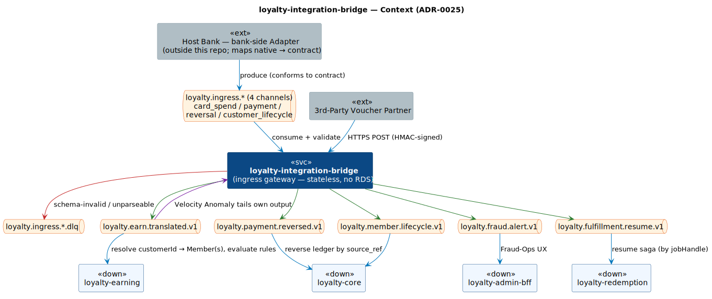
</p>

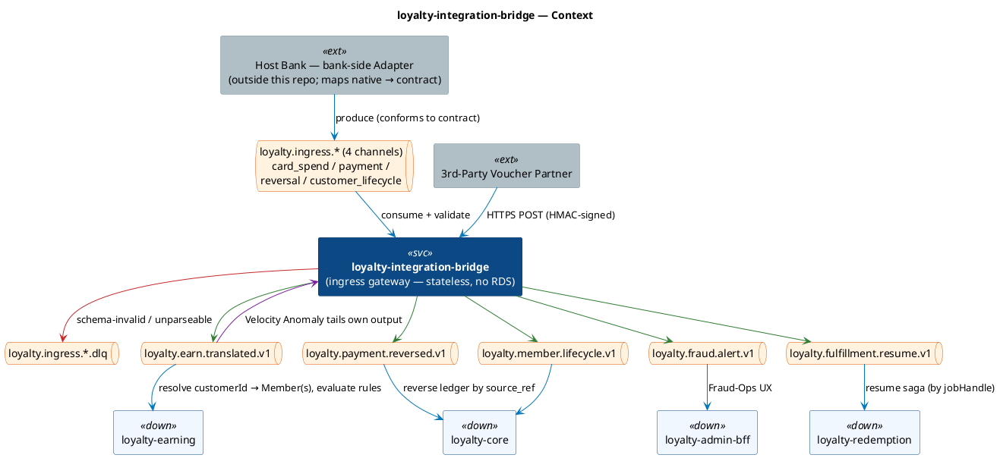

---

## 3. Vocabulary you need first

| Term | Meaning in this service |
|---|---|
| **Ingress event** | A Layer-1 message the bank's adapter produces on a `loyalty.ingress.*` topic. The Bridge's *input*. |
| **Canonical event** | A Layer-2 `loyalty.*` message the Bridge *outputs*. The platform's internal language. |
| **`customerId`** | The bank's customer identifier (CIF). **Every ingress event is "customer-scoped" — it carries `customerId` and nothing about Loyalty Members or Programs.** |
| **Customer-scoped** | An event that identifies *who* (`customerId`) but not *which Loyalty Member / Program*. The Bridge deliberately does **no** member/program resolution — that is `loyalty-earning`'s job. |
| **`source` / `earn_source_code`** | A canonical code telling `loyalty-earning` what *kind* of activity earned points — e.g. `CARD_SPEND`, `FUND_TRANSFER`, `BILL_PAYMENT`. "Stamping the source" is the one domain-aware thing the Bridge does. |
| **`eventId`** | A globally-unique, bank-stable idempotency key. Carried through unchanged so downstream consumers can dedupe. |
| **Stamp** | To set the canonical `source` on an event. A pure function — no I/O. |
| **DLQ** | Dead-Letter Queue. A per-channel topic where messages that fail validation are parked so they don't poison the canonical stream. |
| **Tolerant reader** | A consumer that ignores unknown fields (JSON Schema `additionalProperties: true`), so adding fields to the contract is backward-compatible. |
| **Idempotent producer** | A Kafka producer configured so a retried publish does not create a broker-side duplicate. Combined with downstream `eventId` dedupe, this gives "effectively exactly-once". |

> If a term here conflicts with your mental model, the authoritative glossary is the repo-root [`CONTEXT.md`](../../CONTEXT.md).

---

## 4. The runtime shape

### 4.1 The one loop, repeated

Every Kafka-driven part of the Bridge is the **same four-step loop**. Learn it once and you know all four ingress consumers:

```
  consume  ──▶  validate  ──▶  stamp / translate  ──▶  produce
 (Kafka)       (JSON Schema)   (pure function)         (idempotent, keyed by customerId)
                   │
                   └─ on failure ─▶ per-channel DLQ  (never forwarded downstream)
```

### 4.2 Statelessness — the defining property

The Bridge has **no RDS / no database**. Its only "state" is:

1. **Kafka consumer offsets** — owned by the broker (MSK), not by the service.
2. **In-memory sliding-window counters** in the velocity detector — *ephemeral and rebuildable* by replaying the earn topic on restart.
3. **Startup-loaded immutable config** — the JSON Schemas and the `paymentType → earn_source` map, read once at boot and frozen.

Because there is no mutable shared state, you can run as many Bridge Pods as you like and scale horizontally without coordination.

### 4.3 What runs inside

| Area | Components |
|---|---|
| **Ingress consumers** (one per channel) | `CardSpendConsumer`, `PaymentConsumer`, `ReversalConsumer`, `LifecycleConsumer` |
| **Validation** | `IngressSchemaValidator` (+ 4 bundled JSON Schemas) |
| **Translators** (pure) | `CardSpendTranslator`, `PaymentTranslator`, `ReversalTranslator`, `LifecycleTranslator`, `VoucherWebhookTranslator` |
| **Cross-cutting** | `VelocityAnomalyConsumer` + `SlidingWindowCounterStore`; `VoucherWebhookController` + `HmacVerifier` |
| **Wiring / config** | `KafkaConfig`, `JacksonConfig`, `BridgeTopics`, `PaymentMapping`, `VelocityProperties`, `VoucherWebhookProperties` |

---

## 5. The flows (each with a sequence diagram)

There are **six** flows. Four are ingress consumers (all the same loop, differing only in *what `source` they stamp*); two are cross-cutting.

### 5.1 Card spend → `loyalty.earn.translated.v1`

The simplest flow. A settled card purchase. Because card spend has no sub-type, the source is the **constant `CARD_SPEND`**.

<p align="center">
  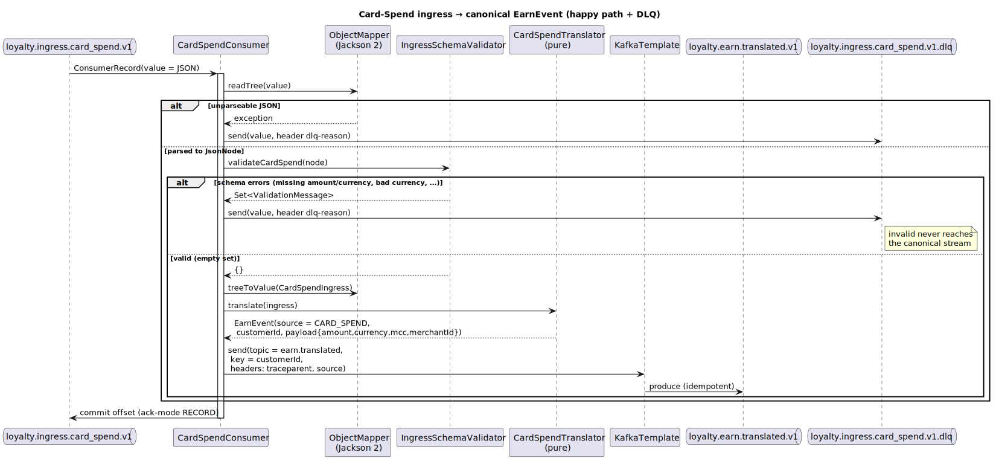
</p>

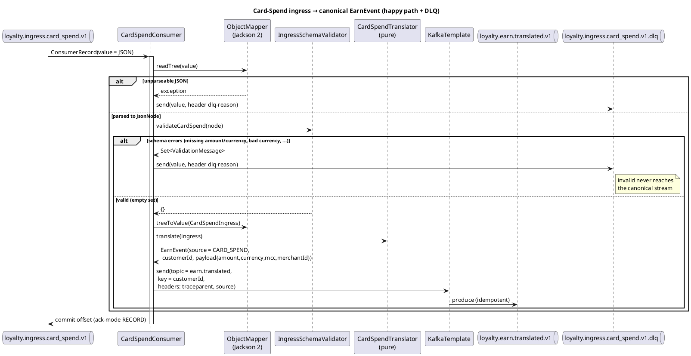

**Step-by-step:**
1. `CardSpendConsumer` receives a Kafka record (raw JSON string).
2. It parses the JSON with the Jackson-2 `ObjectMapper`. Unparseable → DLQ, done.
3. `IngressSchemaValidator.validateCardSpend(node)` checks it against `loyalty.ingress.card_spend.v1.json`. Any error → DLQ, done.
4. The valid JSON is bound to a `CardSpendIngress` record, then `CardSpendTranslator.translate` produces an `EarnEvent` with `source = "CARD_SPEND"` and `payload = {amount, currency, mcc?, merchantId?}`. `eventId`, `customerId`, `occurredAt` carry through.
5. The `EarnEvent` is published to `loyalty.earn.translated.v1`, **keyed by `customerId`**, with the `traceparent` and `source` headers propagated.
6. The offset is committed (ack-mode `RECORD` → after each record).

### 5.2 Payment → `loyalty.earn.translated.v1`

All non-card payments share **one channel**, discriminated by a canonical `paymentType`. The source is resolved from `paymentType` via the bank-uniform `PaymentMapping`, and **`paymentType` is preserved on the payload** so DSL earning rules can discriminate further (e.g. exclude self-transfers).

<p align="center">
  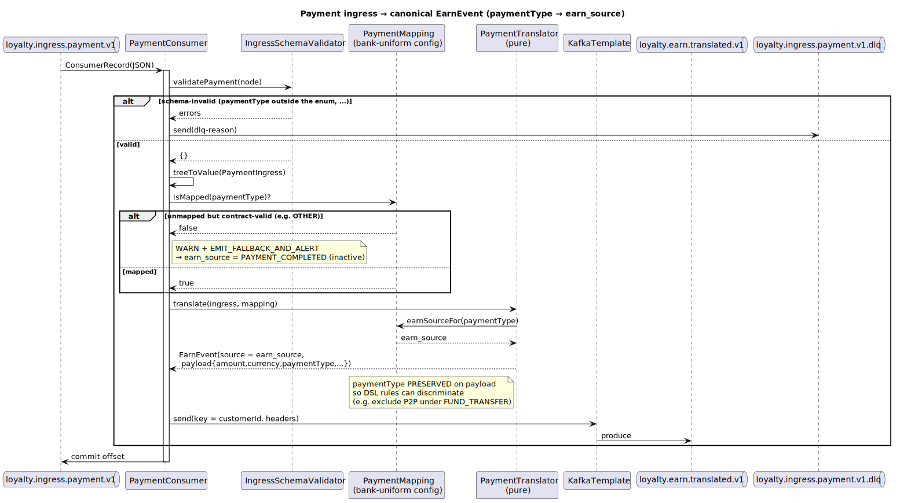
</p>

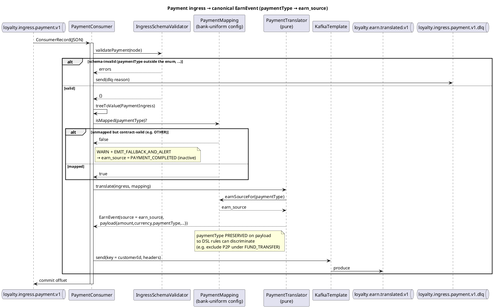

**The mapping** (`bridge.payment.payment-type-to-earn-source` in `application.yml`):

| Canonical `paymentType` (contract enum) | → `earn_source` | Note |
|---|---|---|
| `BILL_PAYMENT` | `BILL_PAYMENT` | |
| `FUND_TRANSFER` | `FUND_TRANSFER` | |
| `P2P_TRANSFER` | `FUND_TRANSFER` | routed to the same source; DSL excludes via the preserved `paymentType` |
| `QR_PAYMENT` | `FUND_TRANSFER` | |
| `TOPUP` | `TOPUP` | |
| `OTHER` | `PAYMENT_COMPLETED` *(fallback)* | not in the map → **EMIT_FALLBACK_AND_ALERT** |
| *(any value outside the enum)* | — | **schema-invalid → DLQ** |

> **Two distinct failure modes, handled differently:**
> - A `paymentType` *outside the contract enum* is a **schema violation → DLQ** (the stream is blocked for that message).
> - A `paymentType` *inside the enum but absent from the map* (today only `OTHER`) is **not** an error: emit the inactive `PAYMENT_COMPLETED` fallback, log a WARN, and continue (the `EMIT_FALLBACK_AND_ALERT` policy). Drift doesn't block the stream; breakage does.

### 5.3 Reversal → `loyalty.payment.reversed.v1`

A refund/reversal. The Bridge does **not** touch the ledger — it only re-emits the reversal carrying the **`originalEventId`**, and `loyalty-core` reverses its own ledger entries matched on `source_ref`. This keeps the single-writer invariant on the ledger.

<p align="center">
  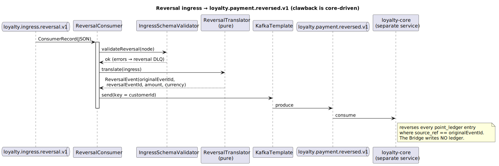
</p>

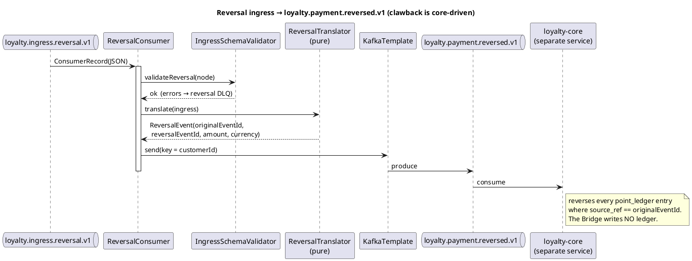

### 5.4 Customer lifecycle → `loyalty.member.lifecycle.v1`

A customer-lifecycle change (v1: customer closed). `lifecycleType` is already canonical, so it passes straight through. Customer-scoped because a Member may not even exist yet; `loyalty-core` consumes it.

<p align="center">
  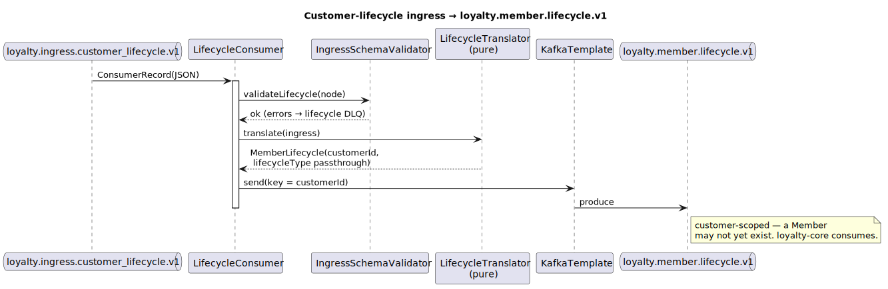
</p>

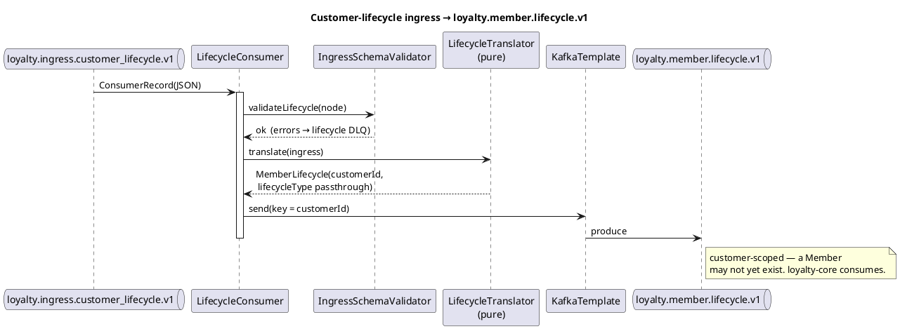

### 5.5 Velocity anomaly → `loyalty.fraud.alert.v1`

A cross-cutting fraud detector. It **tails the Bridge's own output** (`loyalty.earn.translated.v1`, under its own consumer group `…-velocity`) and counts earns per `customerId` in a sliding window. Crossing the threshold raises **one** `EARN_VELOCITY_SPIKE` alert (hysteresis: it re-arms only after the count falls back below the threshold). The window store is in-memory and rebuilds on restart — a deliberately **degraded-availability** feature: alerts may lag during rebuild, but the hot earn/ledger path is never affected.

<p align="center">
  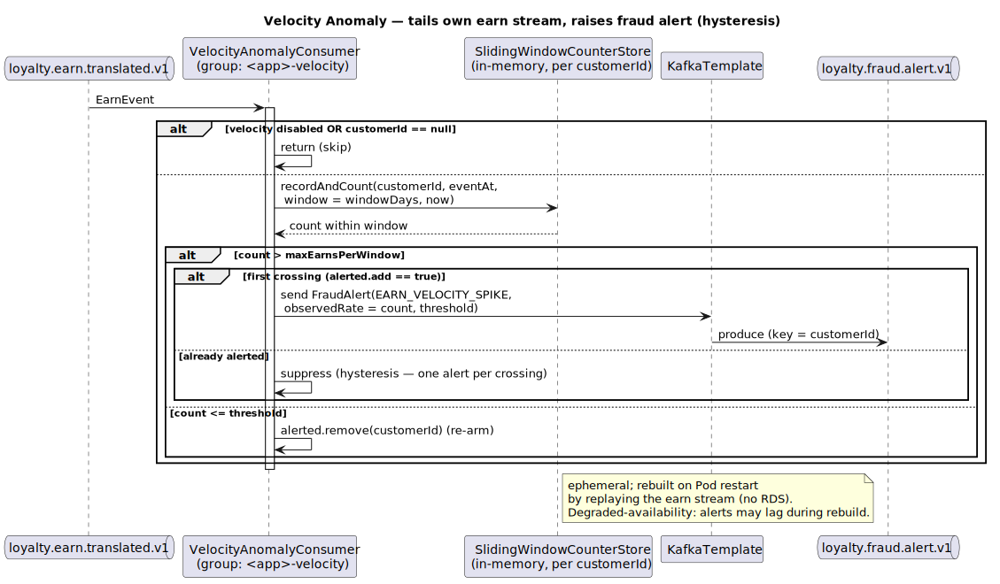
</p>

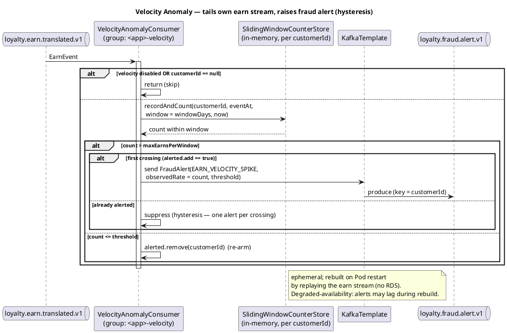

> **Why is fraud detection *here* and not in `loyalty-earning`?** It sits *across* `loyalty-earning`'s output. If it lived inside the producer it would be circular. It is simply another *consumer* of `loyalty.earn.translated.v1` — same topic, different purpose — and detects per `customerId`.

### 5.6 Voucher webhook → `loyalty.fulfillment.resume.v1`

The only **synchronous HTTPS** entry point. A 3rd-party voucher partner POSTs a callback when a voucher job is `READY`/`FAILED`. The request is HMAC-authenticated (threat **DD-2**); a valid one becomes a `loyalty.fulfillment.resume.v1` event, **keyed by `jobHandle`**, that `loyalty-redemption` uses to resume its saga. The `eventId` is deterministic (`voucher-resume:<jobHandle>:<status>`), so a partner retry is idempotent.

<p align="center">
  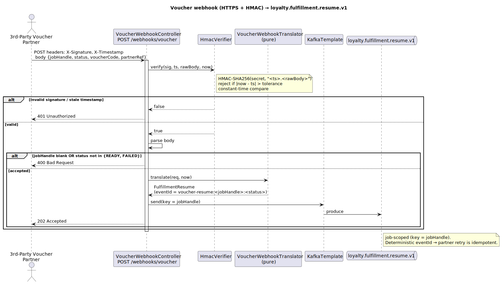
</p>

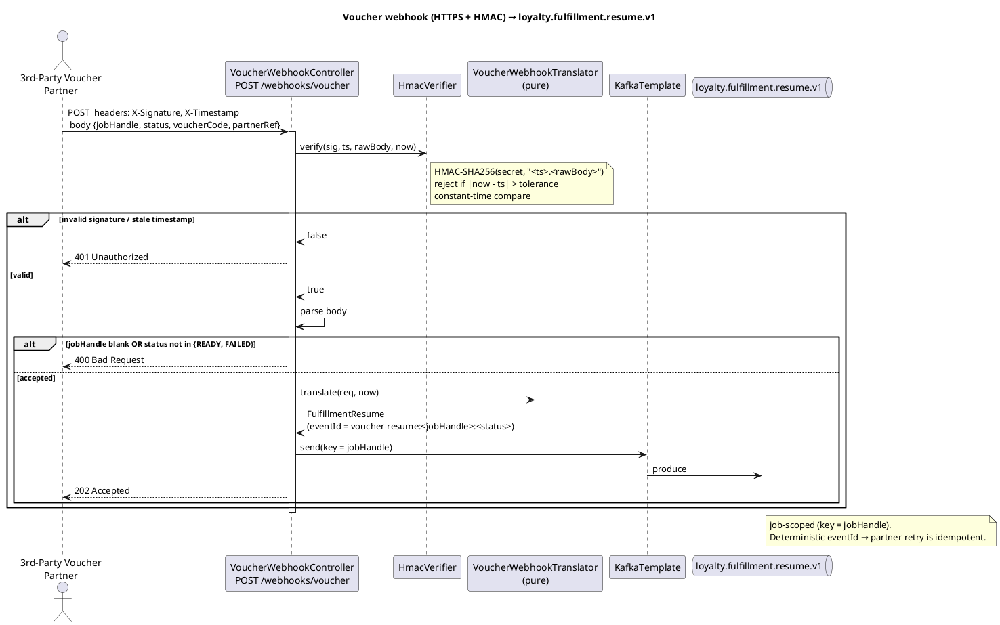

The partner-facing HTTP contract is specified in [`docs/openapi/loyalty-integration-bridge-webhooks.yaml`](../../docs/openapi/loyalty-integration-bridge-webhooks.yaml).

---

## 6. Data reference

### 6.1 Ingress (Layer 1) — what the bank's adapter sends

All ingress events are **customer-scoped** (carry `customerId`, never `memberId`/`programId`) and **PII-free** (no PAN, no name). `eventId` is the bank-stable idempotency key. Schemas are JSON Schema **Draft 2020-12**, `additionalProperties: true` (tolerant reader), and live in [`src/main/resources/schema/`](src/main/resources/schema).

**`loyalty.ingress.card_spend.v1`** — required: `eventId, customerId, occurredAt, amount, currency, schemaVersion`

| Field | Type | Notes |
|---|---|---|
| `eventId` | string (≥1) | idempotency key |
| `customerId` | integer | bank CIF |
| `occurredAt` | string (date-time) | settlement time |
| `amount` | number (> 0) | debited perspective, in `currency` |
| `currency` | enum `USD`/`VND` | |
| `mcc` | string \| null | merchant category code |
| `merchantId` | string \| null | |
| `schemaVersion` | integer `const 1` | |

**`loyalty.ingress.payment.v1`** — required: above (minus `mcc`) **plus** `paymentType`

| Extra field | Type | Notes |
|---|---|---|
| `paymentType` | enum `BILL_PAYMENT, FUND_TRANSFER, P2P_TRANSFER, QR_PAYMENT, TOPUP, OTHER` | discriminator; **outside enum → DLQ** |
| `billerCategory` | string \| null | for `BILL_PAYMENT` |
| `recipientRelationship` | enum `OWN_ACCOUNT, OWN_CUSTOMER, OTHER_CUSTOMER, EXTERNAL_BANK` \| null | for anti-self-transfer DSL |
| `topupTarget` | enum `MOBILE_AIRTIME, E_WALLET, PREPAID_CARD` \| null | for `TOPUP` |
| `merchantId` | string \| null | |

**`loyalty.ingress.reversal.v1`** — carries `originalEventId` (the earn being reversed), `reversalEventId`, `amount`, `currency`.

**`loyalty.ingress.customer_lifecycle.v1`** — carries `lifecycleType`, `reason`.

### 6.2 Canonical (Layer 2) — what the Bridge emits

| Output topic | Java type | Key | Scope | Consumed by |
|---|---|---|---|---|
| `loyalty.earn.translated.v1` | `EarnEvent` | `customerId` | customer-scoped (no `programId`) | `loyalty-earning`, `VelocityAnomalyConsumer` |
| `loyalty.payment.reversed.v1` | `ReversalEvent` | `customerId` | customer-scoped | `loyalty-core` |
| `loyalty.member.lifecycle.v1` | `MemberLifecycle` | `customerId` | customer-scoped | `loyalty-core` |
| `loyalty.fraud.alert.v1` | `FraudAlert` | `customerId` | customer-scoped | `loyalty-admin-bff` |
| `loyalty.fulfillment.resume.v1` | `FulfillmentResume` | `jobHandle` | job-scoped | `loyalty-redemption` |

`EarnEvent` shape: `{eventId, eventType, occurredAt, schemaVersion, customerId, source, payload}`. The full AsyncAPI is [`docs/asyncapi/loyalty-integration-bridge.yaml`](../../docs/asyncapi/loyalty-integration-bridge.yaml).

### 6.3 Partition key — why `customerId`

Keying by `customerId` guarantees **per-customer ordering** on the partition: a customer's spend, then its reversal, land on the same partition in order. The voucher flow keys by `jobHandle` because ordering there is per-redemption-job, not per-customer.

---

## 7. Code map — concept → package → class

Package root: `com.loyalty.bridge`.

| Package | What lives there | Key classes |
|---|---|---|
| *(root)* | Spring Boot entry point | `IntegrationBridgeApplication` |
| `ingress` | Layer-1 input records (one per channel) | `CardSpendIngress`, `PaymentIngress`, `ReversalIngress`, `CustomerLifecycleIngress` |
| `canonical` | Layer-2 output records | `EarnEvent`, `ReversalEvent`, `MemberLifecycle`, `FraudAlert`, `FulfillmentResume` |
| `validate` | JSON-Schema validation | `IngressSchemaValidator` |
| `translate` | **Pure** ingress→canonical functions (no I/O, no Spring) | `CardSpendTranslator`, `PaymentTranslator`, `ReversalTranslator`, `LifecycleTranslator`, `VoucherWebhookTranslator` |
| `consume` | The four `@KafkaListener` loops | `CardSpendConsumer`, `PaymentConsumer`, `ReversalConsumer`, `LifecycleConsumer` |
| `velocity` | Fraud detector + window store | `VelocityAnomalyConsumer`, `SlidingWindowCounterStore` |
| `webhook` | HTTPS voucher endpoint + HMAC | `VoucherWebhookController`, `HmacVerifier`, `VoucherWebhookRequest` |
| `config` | Spring wiring + typed config | `KafkaConfig`, `JacksonConfig`, `BridgeTopics`, `PaymentMapping`, `VelocityProperties`, `VoucherWebhookProperties` |

**Design rule you'll see everywhere:** the **translators are pure static functions** with no Spring, no Kafka, no clock — which is why they're unit-tested in isolation (`*TranslatorTest`). All the I/O (consume, validate, produce, DLQ) lives in the consumers. Keep new logic on the right side of that line.

---

## 8. Configuration reference (`application.yml`)

Everything is overridable per deployment via env vars / config.

| Key | Default | Meaning |
|---|---|---|
| `spring.kafka.bootstrap-servers` | `${KAFKA_BOOTSTRAP_SERVERS:localhost:9092}` | broker address |
| `bridge.topics.*` | the canonical names | every input/output/DLQ topic name (overridable) |
| `bridge.payment.payment-type-to-earn-source` | the §5.2 map | bank-uniform `paymentType → earn_source` routing |
| `bridge.payment.fallback-earn-source` | `PAYMENT_COMPLETED` | inactive source for unmapped-but-valid `paymentType` |
| `bridge.velocity.enabled` | `true` | master switch for the fraud detector |
| `bridge.velocity.window-days` | `30` | sliding-window size |
| `bridge.velocity.max-earns-per-window` | `500` | earns above this in the window → `EARN_VELOCITY_SPIKE` |
| `bridge.voucher.hmac-secret` | `${VOUCHER_WEBHOOK_HMAC_SECRET:change-me-in-deployment}` | **inject from the secret store — never commit** |
| `bridge.voucher.timestamp-tolerance-seconds` | `300` | webhook replay window |

**Kafka semantics set in code/`KafkaConfig`:** producer `acks=all` + `enable.idempotence=true`; consumer `enable.auto.commit=false`, `auto.offset.reset=earliest`; listener ack-mode `RECORD` (commit after each record). String key/value throughout — the Bridge serialises canonical events to JSON itself.

**A note on Jackson (a real gotcha):** Spring Boot 4 defaults to **Jackson 3** (`tools.jackson`), but the networknt validator and the Bridge code use **Jackson 2** (`com.fasterxml`). `JacksonConfig` therefore provides an explicit Jackson-2 `ObjectMapper` (with `JavaTimeModule`, ISO-8601 instants). If you inject `ObjectMapper`, you get this Jackson-2 bean.

---

## 9. Error handling, idempotency, tracing

- **Validation failures and unparseable JSON → per-channel DLQ**, with a `dlq-reason` header, and are **never** forwarded downstream. One bad message from a bank adapter surfaces loudly and locally without corrupting the canonical stream.
- **Idempotency:** the producer is idempotent (no broker-side dup on retry); the `eventId` is carried through unchanged so downstream consumers (e.g. `loyalty-earning`) dedupe. Together → "effectively exactly-once" without 2PC. There is **no outbox table** — there is no business DB write to keep transactional with the publish.
- **Tracing:** every consumer copies the `traceparent` (and `source`) header from the inbound record onto the outbound one, so a single distributed trace spans *bank adapter → Bridge → earning → core*. This is the first thing to check when debugging "why didn't this customer earn?".
- **Velocity is degraded-availability:** during a Pod's cold-start window rebuild, alerts may lag. This is by design and never blocks earning.

---

## 10. Security — the voucher webhook (DD-2)

The webhook is the only inbound HTTP surface, so it is authenticated:

- The partner sends `X-Signature` = `hex(HMAC-SHA256(secret, "<X-Timestamp>.<rawBody>"))` and `X-Timestamp` (epoch seconds).
- `HmacVerifier` recomputes the HMAC over the **raw body** (no re-serialisation), rejects a timestamp outside `timestamp-tolerance-seconds` (replay window), and compares signatures in **constant time** (`MessageDigest.isEqual`).
- Invalid signature or stale timestamp → **401**; malformed body or bad `status` → **400**; accepted → **202**.
- **Nonce-level dedupe is deliberately deferred** — it needs state, which the Bridge avoids. The timestamp window + the deterministic `eventId` are the stateless defences.

---

## 11. Build & run (developer guide)

**Stack:** Java 25 · Spring Boot 4.0.0 · Spring Kafka · networknt json-schema-validator 1.5.6 · Gradle (Kotlin DSL).

```bash
# Requires a JDK 25 toolchain (the build pins languageVersion = 25).
./gradlew test            # unit + integration tests
./gradlew bootRun         # needs a Kafka broker at $KAFKA_BOOTSTRAP_SERVERS (default localhost:9092)
```

**Tests:**
- **Unit** — the pure translators and the window store / HMAC verifier (`*TranslatorTest`, `SlidingWindowCounterStoreTest`, `HmacVerifierTest`). Fast, no broker.
- **Integration** — `BridgeIntegrationTest` spins up a **real Kafka broker via Testcontainers** (`confluentinc/cp-kafka:7.6.1`), produces a `loyalty.ingress.*` event, and asserts the canonical output (or the DLQ for an invalid one). It is **skipped automatically when Docker is absent** (`assumeTrue(...isDockerAvailable())`).

> These IT caught three real fail-to-boot bugs that unit tests missed (invalid schema `$id`, missing Jackson-2 bean, missing typed `KafkaTemplate`). Keep them green.

Try one message by hand against a local broker:
```bash
kafka-console-producer --topic loyalty.ingress.card_spend.v1 --bootstrap-server localhost:9092 <<'EOF'
{"eventId":"demo:1","customerId":100990001,"occurredAt":"2026-05-29T10:30:00Z","amount":42.50,"currency":"USD","mcc":"5411","schemaVersion":1}
EOF
kafka-console-consumer --topic loyalty.earn.translated.v1 --bootstrap-server localhost:9092 --from-beginning
# → an EarnEvent with "source":"CARD_SPEND", keyed by customerId
```

---

## 12. Operating it

- **Scaling:** stateless → add Pods freely. Per-partition ordering is preserved because of the `customerId` key.
- **DLQ triage:** consume a `loyalty.ingress.*.dlq` topic and read the `dlq-reason` header to see why a message failed. A spike usually means a **bank adapter shipped a non-conforming change** — fix the adapter, then replay the DLQ.
- **Restart:** offsets are in Kafka, so consumers resume where they left off. The velocity window rebuilds from the earn topic (alerts lag briefly).
- **Config changes** (schemas, mapping, thresholds) take effect on **Pod restart** — there is no live config-watcher, by deliberate choice.
- **Secrets:** `VOUCHER_WEBHOOK_HMAC_SECRET` must come from the deployment secret store; the default `change-me-in-deployment` is intentionally non-functional.

---

## 13. FAQ — the day-one questions

**Q: Why doesn't the Bridge figure out which Member/Program earned?**
Because that is `loyalty-earning`'s job. The Bridge is customer-scoped on purpose — it resolves `customerId` to nothing. This keeps it pure, stateless, and bank-agnostic.

**Q: Where does the bank's native `transactionType → paymentType` mapping happen?**
In the **bank-side adapter**, outside this repo. The Bridge only knows the canonical `paymentType` enum and the Loyalty-owned `paymentType → earn_source` map.

**Q: A new `paymentType` appeared — do I write a new consumer?**
No. Add an enum value to the payment schema + a row to the `paymentType → earn_source` map. Same consumer.

**Q: Why no database?**
Everything the Bridge does is a pure function of *(ingress event + frozen config)*. The only state worth keeping is "which offset have I consumed?", which Kafka owns.

**Q: What's the difference between a DLQ'd message and a fallback-source message?**
A DLQ message **broke the contract** (schema-invalid) and is parked. A fallback-source message **is valid** but its `paymentType` isn't mapped yet — it flows through with the inactive `PAYMENT_COMPLETED` source and a WARN.

**Q: Why is the clawback not done here?**
The Bridge writes no ledger. It emits `loyalty.payment.reversed.v1` and `loyalty-core` reverses entries by `source_ref`, preserving the single-writer ledger invariant.

---

## 14. Cross-references

- [C4 Level 3 — component view](../../docs/c4/level-3-loyalty-integration-bridge.md)
- [Ingress contract — producer obligations](../../docs/asyncapi/INGRESS-CONTRACT.md) · [`loyalty-ingress.yaml`](../../docs/asyncapi/loyalty-ingress.yaml) · [bridge AsyncAPI](../../docs/asyncapi/loyalty-integration-bridge.yaml) · [webhook OpenAPI](../../docs/openapi/loyalty-integration-bridge-webhooks.yaml)
- [Glossary `CONTEXT.md`](../../CONTEXT.md)

---

*End of document.*
