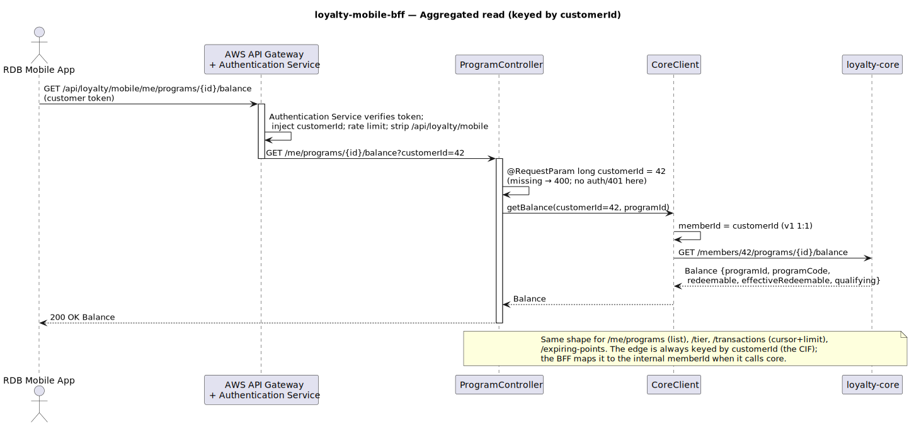
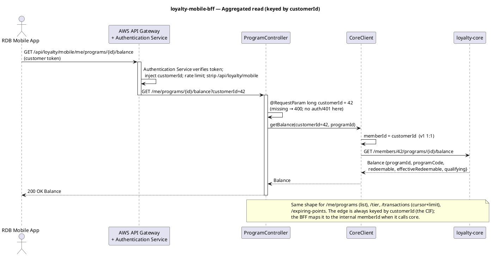
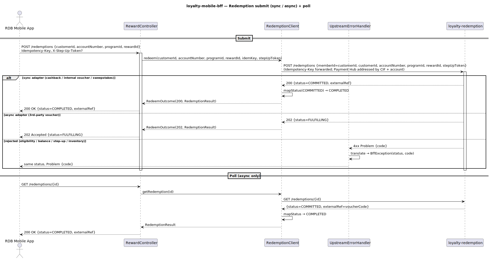
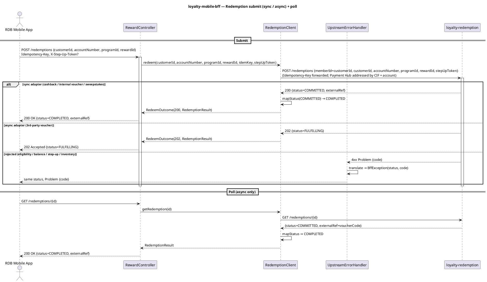
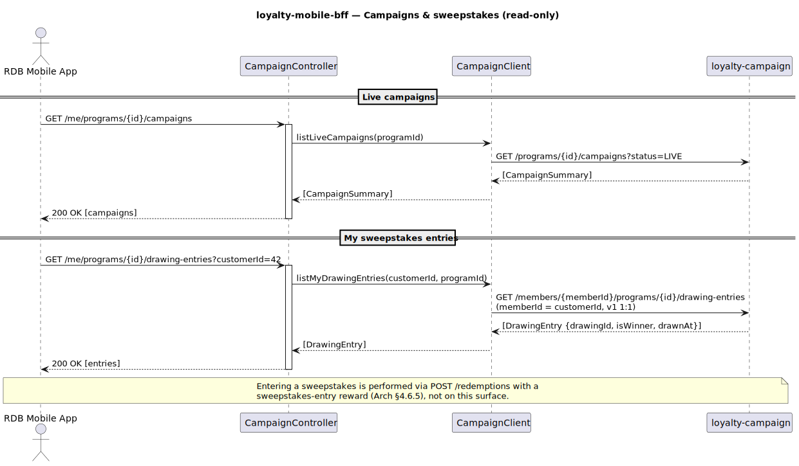
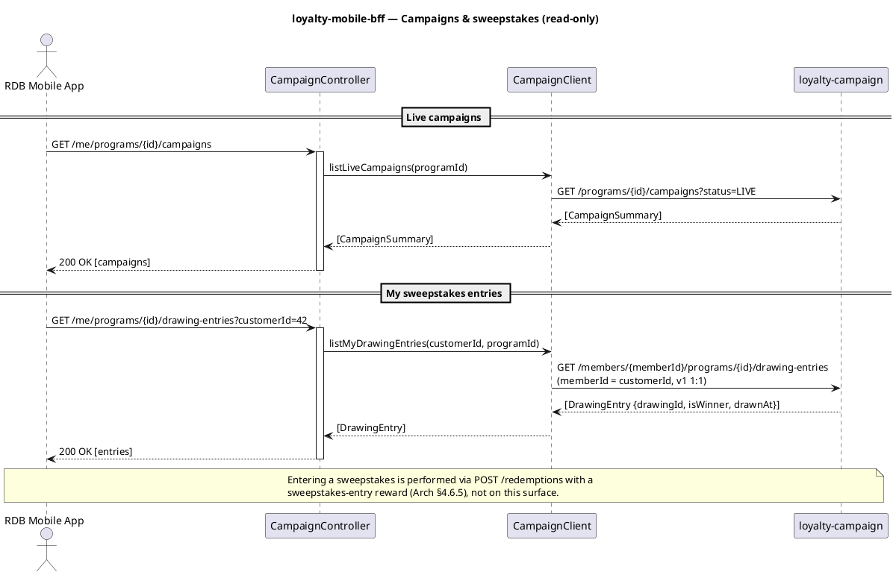

# loyalty-mobile-bff — Detailed Design & User Guide

A self-contained companion to [C4 L2 BFFs](../../docs/c4/level-2-containers.md) and the customer edge
contract ([`loyalty-mobile-bff.yaml`](../../docs/openapi/loyalty-mobile-bff.yaml)).

---

## 0. What this service is

The **customer-facing edge API** for the RDB Mobile App. Behind AWS API Gateway (route
`/api/loyalty/mobile/*`) it is an **aggregation-only** service — it owns **no datastore** and
produces/consumes **no Kafka**. Every request is a thin fan-out to one (occasionally more) of three
backend services, composed into the shape the app renders:

| Upstream | Surface |
|---|---|
| `loyalty-core` | enrolled programs, opt-in/out + T&Cs, balance, transaction history, tier progress, expiring cohorts |
| `loyalty-redemption` | eligible reward catalogue, reward detail, two-phase redemption (submit + poll) |
| `loyalty-campaign` | live campaigns, the member's sweepstakes entries + winner status |

Its whole job is **aggregation + translation**: take the `customerId` the request carries, call the
right upstream(s), and map upstream shapes/errors to the customer contract. It does **no token handling
at all** — the gateway Authentication Service has already verified the customer token and injected the
identity (see §2).

---

## 1. Bounded context & neighbours

- **Inbound:** the RDB Mobile App, via AWS API Gateway and a gateway **Authentication Service** (a
  Lambda) that verifies the customer token and injects the `customerId` into the request; rate limiting,
  prefix strip.
- **Outbound:** `loyalty-core`, `loyalty-redemption`, `loyalty-campaign` — REST only, each behind an
  Anti-Corruption `RestClient` pinned to HTTP/1.1. mTLS is provided by cluster infra.
- **Owns:** nothing durable. No tables, no topics. State lives entirely in the upstreams.

This is a deliberate constraint: the BFF can be redeployed, scaled, or rebuilt with zero data migration,
because it *has* no data.

---

## 2. Identity — `customerId` arrives on the request; the BFF does no token handling

The BFF **never sees or decodes a JWT**. At the edge, the gateway **Authentication Service** (a Lambda)
verifies the customer token and **injects the customer identity into the request** before it reaches the
BFF. The edge identity is **`customerId`** — the Host Bank CIF. The mobile-bff edge **never** uses
Loyalty's internal `memberId` (that term is internal-only).

`customerId` reaches the BFF as part of the request itself:

| Endpoint group | How `customerId` arrives |
|---|---|
| GET reads (`/me/programs`, …/`balance`, …/`transactions`, …/`tier`, …/`expiring-points`, …/`rewards`, …/`drawing-entries`) | query param `?customerId=` |
| `opt-in`, `tcs-acceptance` (writes) | `customerId` field in the request body (`TcsRequest{customerId, tcsVersion}`) |
| `opt-out` | query param `?customerId=` |
| `POST /redemptions` (redeem) | request body `RedeemRequest{customerId, accountNumber, programId, rewardId}` |

There is **no `HandlerMethodArgumentResolver` and no `CallerIdentity`**. Read controllers (and `opt-out`)
take `@RequestParam long customerId`; `opt-in`, `tcs-acceptance`, and `redeem` read `customerId` from
their body DTO. (`config/WebConfig.java`, which registered the old resolver, was deleted.) A missing
required `customerId` is a normal Spring missing-parameter **`400`** — the BFF does no auth and never
issues a `401` of its own; auth is the Authentication Service's job upstream.

Internally, when the BFF calls `loyalty-core` / `loyalty-redemption` it maps `customerId → memberId`
(v1 is 1:1). Those **internal** service APIs still speak `memberId` (and `customerId`) — they are not
Host-Bank touch points, so they keep their names. The point is only that the **edge** speaks `customerId`.

```
request  customerId=42  (query param or body — injected by the gateway Auth Service)
              │
   controller ▼  @RequestParam long customerId  /  req.customerId()
              │
   internal call to core/redemption: memberId = customerId   (v1 1:1)
```

---

## 3. Aggregated reads — fan-out keyed by `customerId`

The read endpoints (`/me/programs`, …/`balance`, …/`tier`, …/`transactions`, …/`expiring-points`) share
one shape: take the `?customerId=` the request carries, call `loyalty-core` (mapping `customerId → memberId`,
v1 1:1), return the upstream body. The cursor/limit pagination is forwarded verbatim.

<p align="center">
  
</p>



```
GET /me/programs/{id}/balance?customerId=42   (token already verified by the Auth Service)
  ├─ gateway / Auth Service: verify token, inject customerId, strip prefix
  ├─ ProgramController: @RequestParam long customerId   (400 if absent — no 401 here)
  ├─ CoreClient: memberId = customerId (v1 1:1) → core GET /members/{memberId}/programs/{id}/balance
  └─ 200 Balance (pass-through)
```

---

## 4. The redemption flow — submit (sync **or** async) + poll

`POST /redemptions` is the only write the customer makes. Its body is
`RedeemRequest{customerId, accountNumber, programId, rewardId}`. The BFF forwards the `customerId` (CIF)
plus the `accountNumber` (the CASA the customer picked, for a cashback credit), the `Idempotency-Key`,
and the optional `X-Step-Up-Token` **verbatim** (redemption owns their semantics — the token is forwarded,
not minted or validated here) to `loyalty-redemption`, and **mirrors redemption's status code**: `200` for
a synchronous commit, `202` for an async partner hand-off the app then polls. The internal redemption
request body is `{memberId, customerId, accountNumber, programId, rewardId, stepUpToken}`, where the BFF
sets `memberId = customerId` (v1 1:1); the Host Bank Payment Hub is addressed by CIF + account, **never**
by `memberId`. The internal Saga status is mapped to the narrower customer enum
(`COMMITTED → COMPLETED`, `RELEASED → FAILED`).

<p align="center">
  
</p>



```
POST /redemptions {customerId, accountNumber, programId, rewardId}  (Idempotency-Key, X-Step-Up-Token?)
  ├─ RewardController: customerId from body
  ├─ RedemptionClient → redemption POST /redemptions {memberId=customerId, customerId, accountNumber, ...}  (Idempotency-Key forwarded)
  │     ├─ 200 COMMITTED → mapStatus → COMPLETED → 200
  │     ├─ 202 FULFILLING → 202  (app polls GET /redemptions/{id})
  │     └─ 4xx {code}  → UpstreamErrorHandler → same status + code
  └─ (poll) GET /redemptions/{id} → mapStatus → 200 {status, externalRef}
```

The **status mapping** is the only domain logic the BFF carries; it is unit-tested independent of HTTP
(`RedemptionStatusMappingTest`).

---

## 5. Campaigns & sweepstakes

Two reads from `loyalty-campaign`: the **live** campaigns a member is eligible for (the BFF fixes
`status=LIVE` upstream), and the member's own sweepstakes **entries** + winner status. Entering a
sweepstakes is *not* here — it is a `POST /redemptions` with a sweepstakes-entry reward (§4), so the
campaign surface is read-only.

<p align="center">
  
</p>



---

## 6. Error translation

Every outbound `RestClient` registers
[`UpstreamErrorHandler`](src/main/java/com/loyalty/mobilebff/client/UpstreamErrorHandler.java) via
`defaultStatusHandler(HttpStatusCode::isError, …)`. On an upstream `4xx/5xx` it reads the RFC-7807 body,
lifts the `code` + `detail`, and throws a `BffException` carrying the **same status** — so a redemption
`409 INSUFFICIENT_BALANCE` surfaces at the edge as `409 {code: INSUFFICIENT_BALANCE}`, never a blanket
`500`. A non-JSON upstream body degrades to `UPSTREAM_ERROR` with the original status. `ProblemAdvice`
renders the final Problem.

---

## 7. Implementation notes

- **Jackson 2/3 split:** Spring Boot 4's web layer is Jackson 3; the platform pins Jackson 2. Open-JSON
  DTO fields (`fulfillmentParams`) are typed `Object` (Map/List trees), not Jackson tree nodes — the
  same approach the backend services use. (See [[spring-boot4-jackson2-3-split]].)
- **RestClients pinned to HTTP/1.1** — the JDK client otherwise negotiates HTTP/2, flaky against the
  WireMock stubs.
- **No datastore, no Kafka** — the build omits JPA / Flyway / Kafka / ShedLock / Postgres entirely; the
  only test dependency beyond `spring-boot-starter-test` is WireMock.

---

## 8. Upstream dependency note

Several customer reads (`/members/{id}/programs`, …/`balance`, …/`transactions`, …/`tier`,
…/`expiring-points`, …/`opt-in|opt-out|tcs-acceptance`) are the member-scoped projections this BFF needs
from `loyalty-core`; they **extend core's v1 internal API** (which today publishes the Reservation API +
a slim projection). They are stubbed in the IT and called by
[`CoreClient`](src/main/java/com/loyalty/mobilebff/client/CoreClient.java) — the BFF defines what it
needs from its upstreams.

---

## 9. Run & operate

```bash
./gradlew test     # 10 tests: 6 WireMock IT (all upstreams stubbed) + 4 unit (status mapping)
./gradlew bootRun  # needs core ($CORE_BASE_URL), redemption ($REDEMPTION_BASE_URL), campaign ($CAMPAIGN_BASE_URL)
```

Requires a **JDK 25** toolchain. The IT stubs core + redemption + campaign with one WireMock server, so
the suite runs with no sibling service and **no Docker**.
