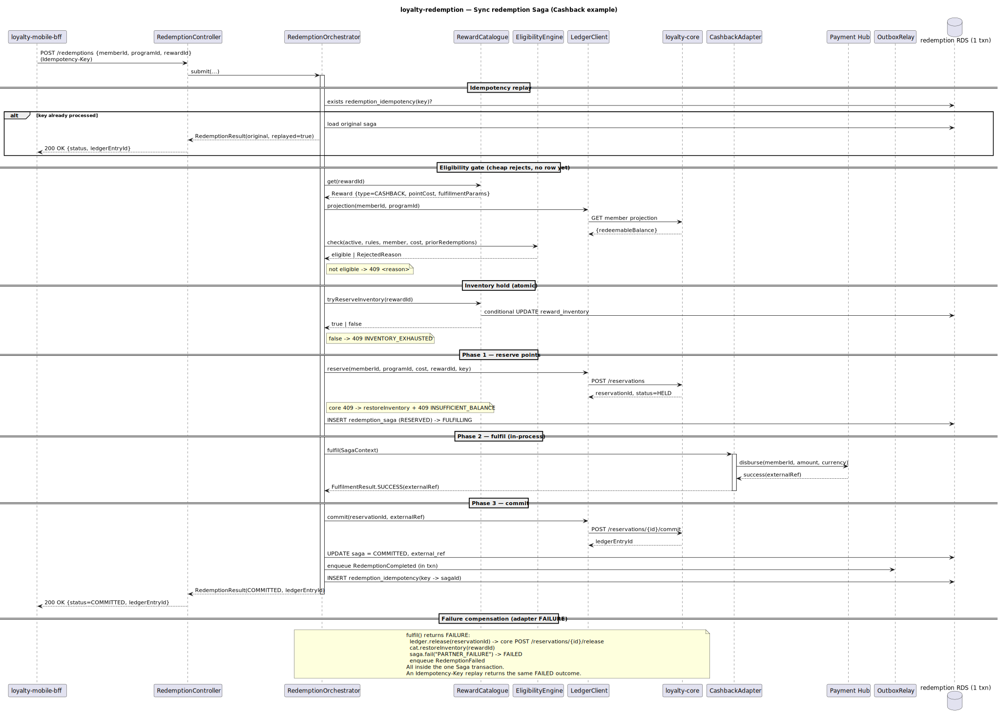
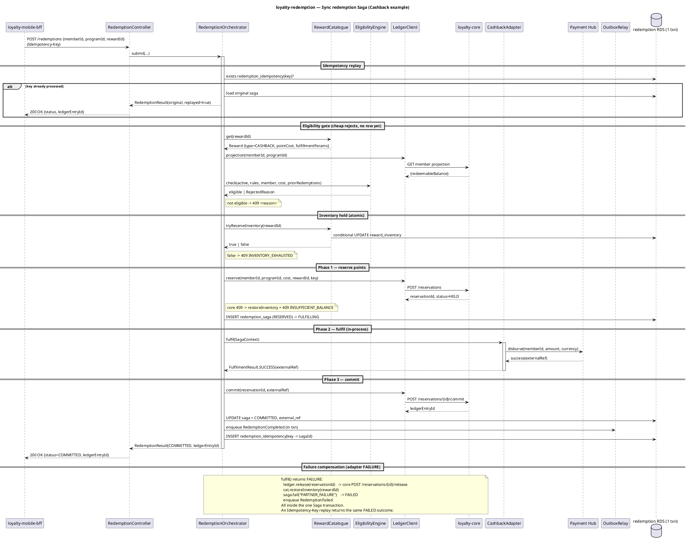
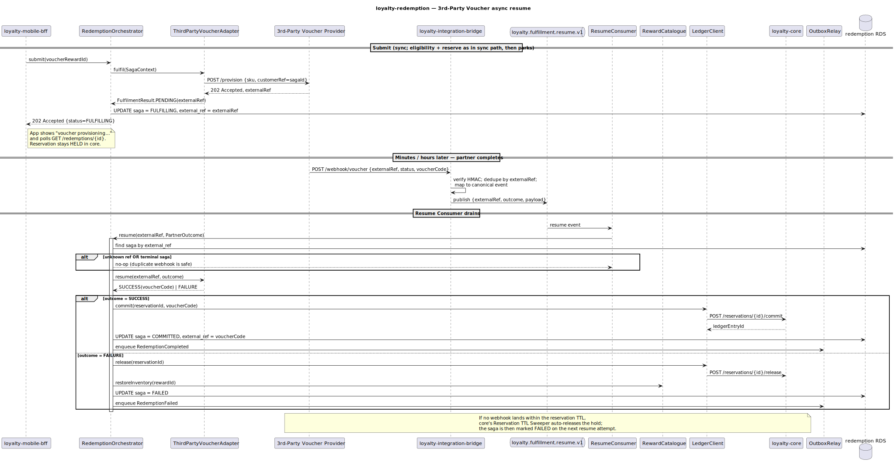
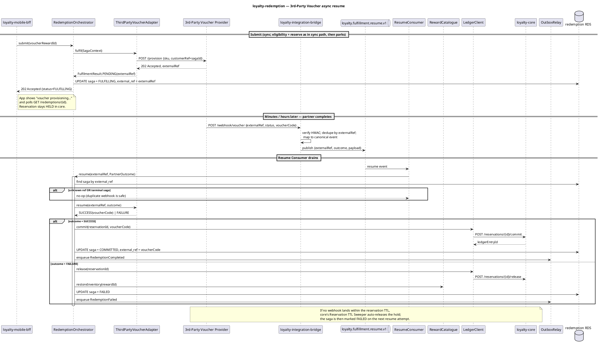
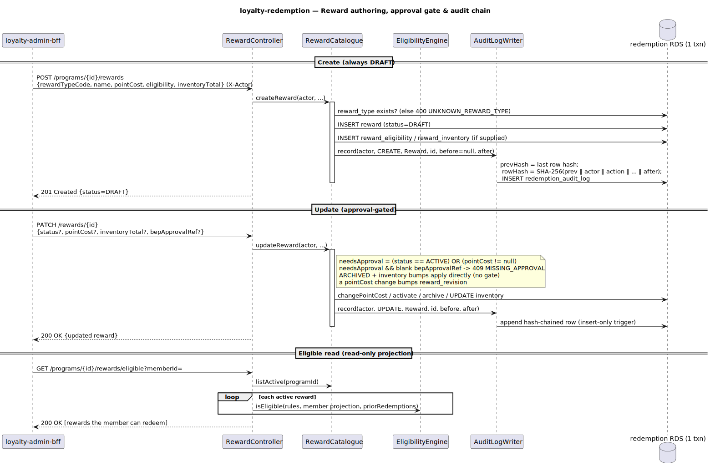
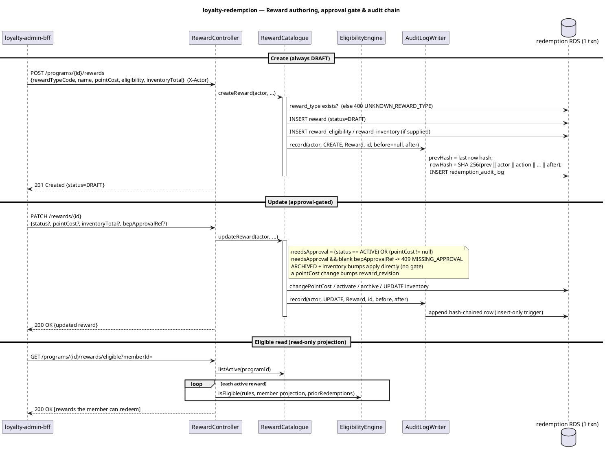

# loyalty-redemption — Detailed Design & User Guide

A self-contained companion to [C4 L3 `loyalty-redemption`](../../docs/c4/level-3-loyalty-redemption.md),
the internal API ([`loyalty-redemption.yaml`](../../docs/openapi/internal/loyalty-redemption.yaml)) and
the domain events ([`asyncapi/loyalty-redemption.yaml`](../../docs/asyncapi/loyalty-redemption.yaml)).

---

## 0. What this service is

The two-phase **redemption Saga**. A Member taps "Redeem" in the app → Mobile BFF calls
`POST /redemptions` → the Saga:

1. **Eligibility** — gate cheaply (tier / segment / currency / tenure / per-Member cap / balance).
2. **Reserve** (Phase 1) — hold points in `loyalty-core` (`POST /reservations`, status `HELD`).
3. **Fulfil** — dispatch the `FulfillmentAdapter` for the Reward Type.
4. **Commit** (Phase 2) on adapter SUCCESS (`POST /reservations/{id}/commit` → immutable `Redeemed`
   entry), or **Release** on FAILURE (balance restored, no Ledger entry).

Three adapters are synchronous (sub-second, in one request thread); the 3rd-Party Voucher adapter is
**asynchronous** — it returns `PENDING`, the Saga parks at `FULFILLING`, and the partner webhook resumes
it later. Outcomes are published via the transactional outbox.

---

## 1. Bounded context & neighbours

- **Inbound:** `loyalty-mobile-bff` (submit / poll), `loyalty-admin-bff` (Reward CRUD), and
  `loyalty.fulfillment.resume.v1` (partner webhook, via the bridge).
- **Outbound:** `loyalty-core` (Reservation API + Member projection), **Payment Hub** (Cashback),
  **3rd-Party Voucher provider** (voucher provisioning), **`loyalty-campaign`** (Sweepstakes entry —
  the T-13 surface, now wired to campaign's shipped `POST /drawings/{id}/entries` contract),
  **S3** (voucher PDFs — deferred).
- **Owns:** `loyalty-redemption RDS` (Reward catalogue + Saga state) and the `loyalty.redemption.*`
  topics.

It is a **client** of core's Ledger — it never touches `point_ledger`. Two bounded contexts (Reward,
Fulfillment) are co-deployed so adapter dispatch is an in-process call.

---

## 2. The Saga state machine (the heart of the service)

```
RESERVED ──▶ FULFILLING ──▶ COMMITTED   (reserve → fulfil → commit)
   │             │      └──▶ RELEASED    (TTL expiry during async wait)
   │             └─────────▶ FAILED      (adapter / partner failure → release)
   ├──▶ RELEASED                         (released before fulfilment)
   └──▶ FAILED
```

`COMMITTED`, `RELEASED`, `FAILED` are **terminal** — they reject every further transition. The
Orchestrator is the only writer; `SagaStatus.canTransitionTo` enforces legality, so an out-of-order
move (e.g. committing a released saga) throws rather than corrupting the machine. This is also what
makes a **duplicate resume** on an already-finished saga a safe no-op (L3 §3.3 webhook idempotency).

---

## 3. The Fulfillment SPI

```java
interface FulfillmentAdapter {
  RewardType supportedType();
  FulfilmentResult fulfil(SagaContext ctx);                              // SUCCESS | FAILURE | PENDING
  Optional<FulfilmentResult> resume(String externalRef, PartnerOutcome); // async only; default empty
}
```

- `AdapterRegistry` resolves exactly one adapter per `RewardType` at wiring time; a duplicate
  registration fails fast, an unknown type is a hard error (never a silent skip).
- **Sync** adapters (Cashback → Payment Hub, Bill-Payment → synthetic voucher, Sweepstakes → campaign)
  return `SUCCESS`/`FAILURE` and never implement `resume`.
- **Async** adapter (3rd-Party Voucher → partner) returns `PENDING(externalRef)` and implements
  `resume` — turning the partner's verdict into SUCCESS (commit, keying off the issued voucher code) or
  FAILURE (release).

Adding a fifth Reward Type: implement the interface, register the bean, add the enum value. No Saga code
changes.

---

## 4. The sync path — `submit()` → Cashback example

<p align="center">
  
</p>



```
POST /redemptions {memberId, programId, rewardId}  (Idempotency-Key header)
  ├─ idempotency replay?  → return original saga
  ├─ Eligibility.check(reward, member projection, priorRedemptions)  → 409 on reject
  ├─ reward_inventory: atomic conditional decrement                  → 409 INVENTORY_EXHAUSTED
  ├─ core POST /reservations                                          → 409 INSUFFICIENT_BALANCE (restore inv)
  ├─ saga = RESERVED → FULFILLING
  ├─ CashbackAdapter.fulfil → Payment Hub disburse → SUCCESS(ref)
  ├─ core POST /reservations/{id}/commit → ledgerEntryId
  ├─ saga.commit(entryId, ref) → COMMITTED ; outbox RedemptionCompleted
  └─ 200 {status: COMMITTED, ledgerEntryId}
```

On adapter FAILURE: `release` the reservation, restore inventory, `saga.fail` → `FAILED`, outbox
`RedemptionFailed`. The in-process commit/release HTTP calls run inside the Saga transaction — the
design choice that keeps the sub-second paths consistent.

---

## 5. The async path — 3rd-Party Voucher

<p align="center">
  
</p>



```
submit() → ThirdPartyVoucherAdapter.fulfil → partner /provision (202) → PENDING(externalRef)
         → saga FULFILLING, external_ref = correlation ref → 202 {status: FULFILLING}    (client polls)

(minutes later) partner webhook → bridge → loyalty.fulfillment.resume.v1 {externalRef, outcome, payload}
         → ResumeConsumer → Orchestrator.resume(externalRef, outcome)
            ├─ find saga by external_ref; terminal → no-op
            ├─ adapter.resume → SUCCESS(voucherCode) | FAILURE
            ├─ SUCCESS: core commit → COMMITTED (external_ref ← voucherCode) ; outbox RedemptionCompleted
            └─ FAILURE: core release + restore inventory → FAILED ; outbox RedemptionFailed
```

If no webhook lands within the reservation TTL, core's Reservation TTL Sweeper auto-releases; the
saga is then `RELEASED`/`FAILED` on the next attempt.

---

## 6. Authoring & the approval gate

<p align="center">
  
</p>



- `POST /programs/{id}/rewards` creates a Reward as **DRAFT**.
- `PATCH /rewards/{id}` — `status=ACTIVE` or any `pointCost` change is **approval-gated**: it requires a
  `bepApprovalRef` (else `409 MISSING_APPROVAL`), mirroring core/earning's confirm seam. `ARCHIVED` and
  inventory bumps apply directly. A `pointCost` change bumps `reward_revision`.
- `GET /programs/{id}/rewards/eligible?memberId=` runs the active catalogue through the Eligibility
  Engine for one member (read-only).
- Every admin write is recorded in `redemption_audit_log` — SHA-256 hash-chained + DB-immutable
  (insert-only trigger).

---

## 7. Data & config reference

**Tables** (`loyalty-redemption RDS`): `reward_type` (seeded), `reward`, `reward_inventory`,
`reward_eligibility`, `redemption_saga`, `redemption_idempotency`, `redemption_audit_log`, `outbox`,
`shedlock`. Flyway `V1__baseline.sql` + `V2__seed_reward_types.sql`.

**Config** (`redemption.*`): `topics.{fulfillment-resume,redemption-completed,redemption-failed}`,
`core.base-url`, `payment-hub.base-url`, `voucher-partner.base-url`, `campaign.base-url`,
`reservation-ttl-seconds`, `outbox.relay-batch-size`, `default-program-id`.

---

## 8. Implementation notes

- **Jackson 2/3 split:** Spring Boot 4's web layer is Jackson 3; the platform pins Jackson 2. DTO fields
  carrying open JSON (`fulfillmentParams`, `eligibility`, `parameterSchema`) are typed `Object`
  (Map/List trees), not Jackson tree nodes — the same approach earning uses for its DSL.
- **RestClients pinned to HTTP/1.1** — the JDK client otherwise negotiates HTTP/2, flaky against some
  servers and the WireMock stubs.
- **Eligibility is pure** — it takes a `MemberSnapshot` + `EligibilityRules` value object, so it is
  fully unit-testable independent of what core's projection exposes.

---

## 9. Run & operate

```bash
./gradlew test          # 41 unit + 7 Testcontainers IT (Postgres + Kafka + WireMock-stubbed externals)
./gradlew bootRun       # needs Postgres, Kafka, and loyalty-core
```

Requires a **JDK 25** toolchain. Flyway owns the schema (`ddl-auto: validate`). The Outbox Relay drains
on a 1s ShedLock-guarded tick. The IT stubs core + Payment Hub + the voucher partner with one WireMock
server, so the suite runs with no sibling service.
